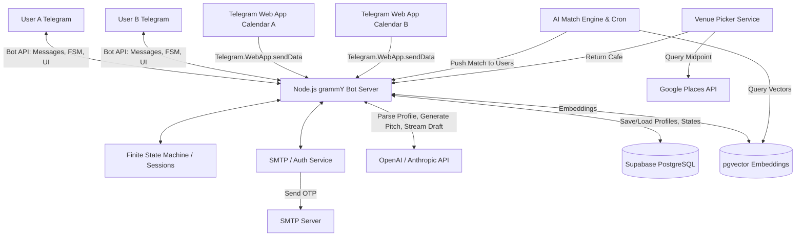

# Gennety Dating — Architecture

> Product logic and user flow are in [PRODUCT_SPEC.md](PRODUCT_SPEC.md).  
> Tech stack and coding rules are in [AGENTS.md](AGENTS.md).

## Production Endpoints

The DigitalOcean droplet (`167.172.178.229`) terminates TLS via **Caddy**
(auto-renewed Let's Encrypt). DNS for the `gennety.com` zone lives at Hostinger.

| Subdomain | Reverse-proxies to | Purpose |
|---|---|---|
| `api-admin.gennety.com` | `localhost:3100` | Admin analytics dashboard API (`ADMIN_API_KEY` auth) |
| `dating-api.gennety.com` | `localhost:3101` | Public `/v1/*` API for the Expo mobile app **and** the Persona liveness webhook (`/v1/webhooks/persona`). |

**Domain isolation:** `api.gennety.com` is owned by a sibling project — never
use it for Gennety Dating. Always pick names prefixed with `dating-` here.

Persona production webhook target: `https://dating-api.gennety.com/v1/webhooks/persona`.

## End-to-End Architecture Schema

## Data Models (PostgreSQL + Prisma Schema)

### `users`

| Column              | Type          | Notes                              |
|---------------------|---------------|------------------------------------|
| id                  | UUID (PK)     |                                    |
| telegram_id         | BigInt        | Unique                             |
| email               | String        | e.g., user@stanford.edu            |
| university_domain   | String        |                                    |
| first_name          | String        |                                    |
| age                 | Int           |                                    |
| language            | String        | `en`, `ru`, `uk`                   |
| status              | Enum          | `onboarding`, `active`, `paused`   |

### `profiles` (One-to-One with `users`)

| Column                | Type          | Notes                              |
|-----------------------|---------------|------------------------------------|
| user_id               | UUID (FK)     |                                    |
| visual_preferences    | JSONB         | likes/dislikes from screening      |
| psychological_summary | Text          | AI-generated                       |
| negative_constraints  | Text          | Updated from rejections            |
| embedding             | Vector        | For semantic similarity search     |
| photos                | String[]      | Telegram file_ids                  |

### `matches`

| Column        | Type          | Notes                                                        |
|---------------|---------------|--------------------------------------------------------------|
| id            | UUID (PK)     |                                                              |
| user_a_id     | UUID (FK)     |                                                              |
| user_b_id     | UUID (FK)     |                                                              |
| status        | Enum          | `proposed`, `negotiating`, `scheduled`, `cancelled`, `completed` |
| pitch_for_a   | Text          |                                                              |
| pitch_for_b   | Text          |                                                              |
| agreed_time   | Timestamp     |                                                              |
| venue_name    | String        |                                                              |
| venue_address | String        |                                                              |
