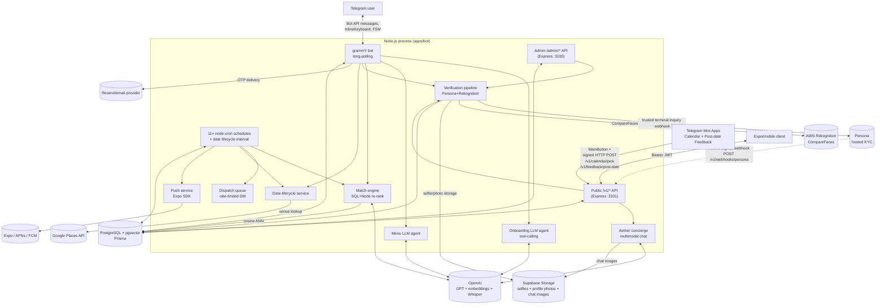

# Gennety Dating — Architecture

> Product logic and user flow are in [PRODUCT_SPEC.md](PRODUCT_SPEC.md).
> Tech stack and coding rules are in [AGENTS.md](AGENTS.md).
> Production deploy instructions are in [deploy.md](deploy.md).
> This file documents durable architecture boundaries. Code, Prisma schema,
> route files, and env loading remain the source of truth for implementation
> details.

## Production Endpoints

The DigitalOcean droplet (`167.172.178.229`) terminates TLS via **Caddy**
(auto-renewed Let's Encrypt). DNS for the `gennety.com` zone lives at Hostinger.

| Subdomain | Reverse-proxies to | Purpose |
|---|---|---|
| `api-admin.gennety.com` | `localhost:3100` | Admin analytics dashboard API (`ADMIN_API_KEY` Bearer auth, `helmet` + IP rate-limit + timing-safe key compare). |
| `dating-api.gennety.com` | `localhost:3101` | Public `/v1/*` API for the Expo/mobile client **and** the Persona liveness webhook (`/v1/webhooks/persona`). |

**Domain isolation:** `api.gennety.com` is owned by a sibling project — never
use it for Gennety Dating. Always pick names prefixed with `dating-` here.

The bot itself runs **long-polling** (grammY `bot.start`) on the same host;
it does not need an inbound subdomain. Telegram delivers updates to whichever
process is currently polling — so prod (`@gennetybot`) and local dev
(`@gennetytestbot`) MUST use different bot tokens.

Persona production webhook target: `https://dating-api.gennety.com/v1/webhooks/persona`.

## Top-Level Topology

```
┌──────────────────┐   ┌──────────────────┐
│ Telegram client  │   │ Expo/mobile API  │
│ (bot + Mini App) │   │  (iOS / Android) │
└────────┬─────────┘   └────────┬─────────┘
         │ Bot API + WebApp     │ HTTPS  (Bearer JWT)
         │ + signed HTTP POST   │
         ▼                      ▼
┌─────────────────────────────────────────┐
│  Node.js process (apps/bot)             │
│  ─────────────────────────────────────  │
│  • grammY bot (long-polling)            │
│  • Express public  API  (:3101)         │
│  • Express admin   API  (:3100)         │
│  • cron workers + date lifecycle tick   │
└─────────────────────────────────────────┘
       │           │            │
       │ pgvector  │ OpenAI     │ External APIs
       ▼           ▼            ▼
┌───────────┐ ┌──────────┐ ┌──────────────────────────┐
│ Postgres  │ │ OpenAI / │ │ Persona (liveness)       │
│ + pgvector│ │ Whisper  │ │ AWS Rekognition (face)   │
│ (Supabase)│ │          │ │ Google Places (venue)    │
└───────────┘ └──────────┘ │ Supabase Storage (media) │
                           │ Resend/email provider    │
                           │ Expo / APNs / FCM (push) │
                           └──────────────────────────┘
```

## End-to-End Architecture Schema



## Process Layout

A **single** Node.js process (`apps/bot`) hosts everything:

- **grammY bot** — long-polling Telegram updates; routes via Composer-based
  handlers (`handlers/router.ts`).
- **Public Express server** on `PUBLIC_PORT` (default `3101`). Mobile client
  consumer; also receives the Persona webhook and the signed Calendar
  Mini App POST. Refuses to start if `JWT_SECRET` is shorter than 16 chars.
- **Admin Express server** on `ADMIN_PORT` (default `3100`). Started only
  when `ADMIN_API_KEY` is set. Bearer-auth + helmet + per-IP rate limit.
- **Background jobs** — 11 `node-cron` schedules plus the date-lifecycle
  interval (see *Cron & Workers* below).

Importing `./config.js` is the very first thing `index.ts` does — this
ensures `.env.local` overrides `.env` *before* `@gennety/db` evaluates
`new PrismaClient()` and locks in `DATABASE_URL`.

## Data Models (PostgreSQL + Prisma)

Source of truth: [`packages/db/prisma/schema.prisma`](packages/db/prisma/schema.prisma).
This section is an architectural map, not a manually authoritative schema dump;
when columns diverge, Prisma wins.

### Enums

| Enum | Values |
|---|---|
| `UserStatus` | `onboarding`, `active`, `paused`, `suspended`, `pending_investigation`, `banned` |
| `Language` | `en`, `ru`, `uk` |
| `OnboardingStep` | `consent`, `language`, `conversational`, `completed` |
| `Gender` | `male`, `female` |
| `GenderPreference` | `men`, `women`, `both` |
| `Platform` | `telegram`, `mobile`, `both` |
| `VerificationStatus` | `unverified`, `pending`, `pending_review`, `verified`, `rejected` |
| `MatchRadius` | `campus_only`, `citywide` |
| `MatchStatus` | `proposed`, `negotiating`, `negotiating_venue`, `scheduled`, `cancelled`, `completed`, `expired` |
| `MatchEventActionType` | `PROPOSAL_SHOWN`, `ACCEPTED`, `DECLINED`, `DATE_COMPLETED`, `CHEMISTRY_POSITIVE`, `CHEMISTRY_NEGATIVE`, `EXPIRED_SILENT`, `EXPIRED_PEER_IGNORED` |
| `MessageRole` | `user`, `assistant`, `system` |

### `users`

Columns (≈ 35; grouped by purpose):

| Group | Columns |
|---|---|
| Identity | `id`, `telegramId` (unique BigInt — synthetic **negative** id for mobile-only users), `email`, `universityDomain`, `firstName`, `surname`, `age`, `gender`, `preference`, `major`, `language`, `platform` |
| Lifecycle | `status` (`UserStatus`), `onboardingStep`, `hasConsented`, `consentedAt`, `termsAccepted`, `termsAcceptedAt`, `researchOptIn`, `createdAt`, `updatedAt` |
| Email OTP | `emailOtp`, `emailOtpExpiresAt`, `isEmailVerified` |
| Conversational state | `messageHistory` (`Json[]`), `lastMessageAt`, `lastPreMatchAnnounceAt` |
| Re-engagement | `reEngagementStep` (0–5), `reEngagementNextAt` |
| Trust & safety | `strikes`, `suspendedUntil` |
| Telegram UI | `statusMessageId` (pinned banner) |
| Push (mobile) | `pushToken`, `pushPlatform` |
| Verification | `verificationStatus`, `personaInquiryId` (unique), `verifiedAt`, `verificationSkippedAt`, `verifiedSelfiePath`, `faceMatchScore`, `faceMatchedAt`, `selfiePath` (legacy) |
| Attribution | `referralSource` (`tg:start_param` / `mobile:utm=…` / `referral:USER_ID`) |

Indexes: `(status, reEngagementNextAt)`, `(status, suspendedUntil)`.

### `profiles` (1:1 with `users`)

Columns (≈ 25):

| Group | Columns |
|---|---|
| Demographics | `userId` (unique), `ethnicity`, `height`, `hobbies` (`String[]`), `partnerPreferences`, `psychologicalSummary`, `negativeConstraints`, `ageRangeMin`, `ageRangeMax` |
| Vector | `embedding` (`vector(1536)`), `embeddingDirty`, `embeddingDirtyAt` |
| Elo | `eloScore` (default 500), `eloMatchesPlayed`, `eloSeededAt` |
| Photos | `photos` (`String[]` of static Telegram `file_id` or Supabase path), `profileMedia` (`Json[]` structured display media; empty legacy rows normalize from `photos[]`), `photoFaceScores` (`Float[]`, 1:1 with `photos`) |
| Geo / radius | `matchRadius` (`campus_only` / `citywide`), `latitude`, `longitude`, `locationUpdatedAt` |
| Match priority | `lastMatchedAt`, `missedWeeks`, `standbyCount`, `lastMissedAt`, `silentIgnoreCount` |
| Audit | `createdAt`, `updatedAt` |

### `matches`

Columns (≈ 40). Drives the entire matching → scheduling → date lifecycle. See
[PRODUCT_SPEC.md](PRODUCT_SPEC.md) §3–4 for the state machine.

| Group | Columns |
|---|---|
| Identity | `id`, `userAId`, `userBId`, `status` (`MatchStatus`), `createdAt`, `updatedAt` |
| Pitch & synergy | `pitchForA`, `pitchForB`, `synergyScore` (clamped 70–99), `synergyReason` |
| Decision (blind invariant) | `acceptedByA`, `acceptedByB` (tri-state `null`/`true`/`false`), `rejectionReasonA`, `rejectionReasonB`, `dispatchedAt`, `pitchMessageIdA`, `pitchMessageIdB` |
| Calendar scheduling | `proposedTimes` (`DateTime[]`, server-side allowlist of valid slots: 6 dates × 17:30/18:00/18:30/19:00/19:30), `availableTimesA`/`availableTimesB` (`DateTime[]`, each side's marked availability), `agreedTime` (set after a single exact overlap is agreed; multi-overlap is confirmed in the Mini App). `schedulingIteration` and `pickedTimeA/B` are deprecated — retained for backwards-compat with in-flight rows mid-deploy and will be dropped in a follow-up cleanup migration. |
| Concierge venue | `vibeTextA`, `vibeTextB`, `vibeLatA/LngA`, `vibeLatB/LngB`, `vibeAddressA/B` (Mini App map-picker label), `parsedCategoryA`, `parsedCategoryB`, `venueName`, `venueAddress`, `venueLat`, `venueLng`, `venueGoogleMapsUri`, `venuePromptAskedAt` |
| Date lifecycle | `icebreakersSentAt`, `iceBreakersA`/`B` (`String[]`), `safetyNoteSentAt`, `safetyAckA`/`B`, `wingmanHintA`/`B`, `wingmanSentAt`, `emergencyCancelledBy`, `emergencyReason`, `feedbackByA`/`B`, `feedbackPromptedAt` |
| Nudges | `nudge1SentAt`, `nudge2SentAt` (legacy), `proposalNudge1SentAt`, `proposalNudge2SentAt`, `schedNudge1SentAt`, `schedNudge2SentAt` |

Indexes: `(status, createdAt)`, `(userAId, userBId)`, plus the functional
`matches_pair_canonical_idx` on `LEAST/GREATEST(user_a_id, user_b_id)` —
created out-of-band by `ensureMatchPairIndex()` at boot — that backs the
**lifetime ban** anti-join (a user never sees the same partner twice).

### `match_score_logs` (1:1 with `matches`)

Frozen score breakdown captured at match creation — `scoreExplicit`,
`scoreResearch`, `scoreLeague`, `scorePenalty`, `scoreTotal`,
`embeddingDistance`, `starvationBonus`. Powers
`/admin/analytics/algorithm` so component weights can be A/B-tuned without
scanning the hot `matches` table.

### `match_events`

Append-only audit trail (`actionType` ∈ `MatchEventActionType`). Drives regular
Elo updates, expiry telemetry, and the dashboard's "ignored you" counter.
Emergency cancellation's small peer boost is applied directly by
`handlers/date/emergency.ts`, not through `match_events`. Indexed by
`(matchId, createdAt)`, `(actorId, createdAt)`, `(targetId, createdAt)`,
`(actionType, createdAt)`.

### `reports`

Post-match user-vs-user reports. LLM-triaged into `tier` 1/2/3
(`reasonSummary` is the distilled rationale). `adminReviewed` flips on the
manual-queue clear. Unique `(reporterId, matchId)` blocks duplicates. See
[PRODUCT_SPEC.md](PRODUCT_SPEC.md) §5 for tier policy.

### `email_otps`

Mobile-side OTP store. **Distinct from `users.emailOtp`**: keyed by `email`
(not `userId`) because mobile users start the funnel before a `User` row
exists. `code` is bcrypt-hashed; raw is only delivered via the email provider. Tracks
`attempts` and `consumedAt` for replay protection.

### `user_sessions`

Active mobile refresh tokens. Access JWTs are stateless; refresh tokens are
hashed here for server-controlled rotation/revocation.

### `bot_sessions`

grammY session adapter persistence (Prisma-backed). Keyed by Telegram chat id.

### `system_knowledge`

Curated knowledge entries surfaced to the menu/onboarding agents. Each row:
`key` (unique), `title`, `content`, `category`, `priority`, `active`.

### `messages`

Aether concierge multimodal chat history (one row per turn, with optional
`imageUrl` pointing at an opaque Supabase Storage path — renderers mint
short-lived signed URLs). Distinct from `users.messageHistory` which the
legacy onboarding/menu agents still use.

### `no_match_notices`

Audit row for the empathetic "no match this week" DM. `tier` is the
consecutive-famine count; `dropDate` is truncated to the UTC day of the cron
firing, and `(userId, dropDate)` is unique — both an idempotency guard and
the data source for the dashboard's churn-warning trend.

## Cron & Workers (`apps/bot/src/index.ts`)

All schedules are env-overridable (the canonical names are listed below).

| Schedule (default) | TZ | Purpose | Module |
|---|---|---|---|
| `0 18 * * 4` (Thu 18:00) | Europe/Kyiv | **Weekly matching batch** — global greedy + dispatch | `services/match-engine.ts` → `services/dispatch-queue.ts` |
| `15 18 * * 4` (Thu 18:15) | Europe/Kyiv | "No match this week" empathetic DM | `services/no-match-notifier.ts` |
| `0 18 * * 3` (Wed 18:00) | Europe/Kyiv | Pre-match teaser (24 h ahead of batch) | `workers/pre-match-announce.ts` |
| `*/15 * * * *` | UTC | 24 h TTL match expiry | `services/match-expiry.ts` + `services/expiry-notify.ts` |
| `*/5 * * * *` | UTC | Live "⏳ Xh left" countdown plate edits on the pitch DM | `workers/proposal-countdown.ts` |
| `0 * * * *` | UTC | Match nudges — proposal (3 h / 10 h), scheduling (6 h / 12 h) | `workers/match-nudge.ts` |
| `*/5 * * * *` | UTC | Onboarding re-engagement (5-step decay) | `workers/re-engagement.ts` |
| `* * * * *` | UTC | Pinned status banner (live discrete countdown) | `workers/status-timer.ts` |
| `*/5 * * * *` | UTC | Embedding refresh (dirty-flag scan, ≤20 rows/tick) | `workers/embedding-refresh.ts` |
| `0 * * * *` | UTC | Auto-unsuspend elapsed Tier-2 suspensions | `services/match-engine.ts` (`autoUnsuspendElapsed`) |
| `30 3 * * *` | Europe/Kyiv | GDPR Article 9 selfie scrub (90 d post-`verifiedAt`) | `services/selfie-retention.ts` |
| `setInterval(2 min)` | — | Date lifecycle: ice-breakers (T-3 h), emergency window, T-1 h pre-date safety, T+24 h feedback, wingman | `services/date-lifecycle.ts` + `services/pre-date-safety.ts` |

Quiet hours **23:00–09:00 Europe/Kyiv** are enforced inside `re-engagement`
and `match-nudge` (not at the cron level — it would let scheduling drift),
so a touch landing in quiet hours is deferred to the next allowed window.

## Public `/v1/*` API Surface

Mounted by `apps/bot/src/public/server.ts`. JWT bearer auth on all routes
except `auth/*`, `webhooks/persona`, `calendar/*`, and `ping`.

| Method | Path | Purpose |
|---|---|---|
| GET  | `/v1/ping` | Liveness probe |
| GET/POST | `/v1/telegram-onboarding/*` | Telegram full-screen Onboarding Mini App state/consent/language/email OTP/completion handoff. Authenticates with `Authorization: tma <initData>`; `/state` issues the short-lived visual-flow token required by `/complete`, which can dispatch the post-handoff bot DM. |
| POST | `/v1/auth/otp/request` | Send corp-email OTP (rate-limited) |
| POST | `/v1/auth/otp/verify` | Verify OTP → mint access + refresh JWT |
| POST | `/v1/auth/refresh` | Rotate refresh token |
| GET / PATCH / DELETE | `/v1/me` | Read / patch / delete current user |
| POST | `/v1/me/location` | Persist home-base lat/lng for Meet-Halfway |
| PATCH | `/v1/me/preferences` | `matchRadius`, gender preference |
| POST | `/v1/me/push-token` | Register Expo / APNs / FCM token |
| GET  | `/v1/me/photos` / POST / DELETE | Photo CRUD with face-match gate |
| GET  | `/v1/me/verification` | Read current verification state |
| GET  | `/v1/me/verification/url` | Mint Persona hosted-flow URL |
| GET  | `/v1/onboarding/interview` | Resume conversational onboarding |
| POST | `/v1/onboarding/interview/answer` | Send next user turn to the onboarding agent |
| POST | `/v1/onboarding/interview/voice` | Transcribe voice and send the turn to onboarding |
| POST | `/v1/onboarding/consent` | Record ToS + research-opt-in |
| POST | `/v1/assistant/ask` | Lightweight one-shot helper |
| POST | `/v1/assistant/voice` | Transcribe voice and send the turn to the post-onboarding assistant |
| POST | `/v1/chat/upload` | Upload Aether chat image to private storage |
| POST | `/v1/chat/message` | Aether concierge turn (text + image) |
| GET  | `/v1/chat/history` | Aether chat history |
| GET  | `/v1/matches/current` | Current active match (with serializer gates) |
| POST | `/v1/matches/:id/decision` | Accept / decline (mirrors bot decision handler) |
| POST | `/v1/matches/:id/vibe-location` | Submit concierge vibe + location pin |
| POST | `/v1/matches/:id/safety-ack` | Acknowledge T-1 h safety brief |
| POST | `/v1/matches/:id/report` | File post-match report (LLM-triaged) |
| GET  | `/v1/countdown` | Status banner / next-batch countdown |
| GET  | `/v1/calendar/state` | Calendar Mini App snapshot — slot allowlist, both sides' picks, agreed time (Telegram `initData` HMAC auth; polled by the Mini App for live peer visibility) |
| POST | `/v1/calendar/pick` | Calendar Mini App availability submission — accepts `pickedIsos: string[]` (legacy single `pickedIso` still tolerated). Response carries `agreedTime` (set on single-overlap auto-lock), `overlapCandidates: string[]` (set when intersection > 1, Mini App shows confirm card), `mySlots`, `peerSlots`, `bothPicked`. Telegram `initData` HMAC auth. |
| GET  | `/v1/location/search` | Location Mini App autocomplete — proxies to Google Places (New) `searchText` so the API key stays server-side. `q` query is debounced client-side at 350ms; min length 2 chars. Optional `lat`/`lng` for location-bias. Telegram `initData` HMAC auth. |
| POST | `/v1/location/select` | Location Mini App submission — body `{matchId, lat, lng, address?}`. Validates side + `negotiating_venue` state, writes `vibeLat/Lng/Address{A,B}`, then fires `tryFinalize` (fire-and-forget). Telegram `initData` HMAC auth. |
| POST | `/v1/feedback/post-date` | Post-date Feedback Mini App submission (Telegram `initData` HMAC auth) |
| POST | `/v1/webhooks/persona` | Persona inquiry webhook (HMAC of raw body, mounted **before** `express.json`) |

## Admin `/admin/*` API Surface

Mounted by `apps/bot/src/admin/server.ts`. Bearer-auth via `ADMIN_API_KEY`
(timing-safe compare); IP rate-limited; `helmet` on. Used by the
internal analytics dashboard.

Top-level routers: `audience`, `algorithm`, `gender`, `retention`, `dates`,
`verification` (incl. a "rerun face-match pipeline" admin button).

## Storage Buckets (Supabase)

- `SUPABASE_SELFIE_BUCKET` — Persona-captured selfie used as the face-match
  reference. Auto-deleted by `selfie-retention` 90 d after `verifiedAt`.
- `SUPABASE_PHOTO_BUCKET` — mobile-uploaded profile photos. Telegram-uploaded
  profile photos remain Telegram `file_id`s.
- `SUPABASE_CHAT_BUCKET` — Aether chat images, stored as opaque object paths
  (`{userId}/{ts}.jpg`); rendered via short-lived signed URLs from
  `services/storage.ts`.

Telegram-uploaded profile photos are **not** stored in Supabase by the bot
— their static frames live as Telegram `file_id`s in `Profile.photos`.
Richer Telegram display media lives additively in `Profile.profileMedia[]`:
`{ type: "photo", photo }` or
`{ type: "live_photo", photo, livePhoto, ...metadata }`. When
`profileMedia[]` is empty, renderers normalize legacy `photos[]` into photo
items. Verification and face-match still read `photos[]` only, preserving the
`photos[i] ↔ photoFaceScores[i]` invariant. The mobile app mirrors static
photos through `/v1/me/photos`, which downloads from Telegram (or accepts
direct upload) and runs the face-match gate; Telegram Live Photo upload is
currently bot-side only.

## External Dependencies

| Service | Role |
|---|---|
| OpenAI | Onboarding / menu / Aether agents (tool-calling), embeddings (1536-dim), Whisper voice transcription, vision (Elo seed pass) |
| Persona | Hosted KYC / liveness flow; HMAC-signed terminal inquiry webhooks |
| AWS Rekognition | `CompareFaces` between Persona selfie and each profile photo |
| Google Places (New) v1 | Concierge venue search at the great-circle midpoint via `places.googleapis.com/v1/places:searchNearby` (+ text fallback). Strict quality gate (operational + rating ≥ 4.0 + ≥ 30 reviews + student-friendly price tier for food) and weighted scoring on top of the raw API. |
| Supabase | Postgres + pgvector primary store, Storage for selfies, mobile profile photos, and chat images |
| Resend/email provider | Corporate-email OTP delivery |
| Expo / APNs / FCM | Mobile push notifications |
