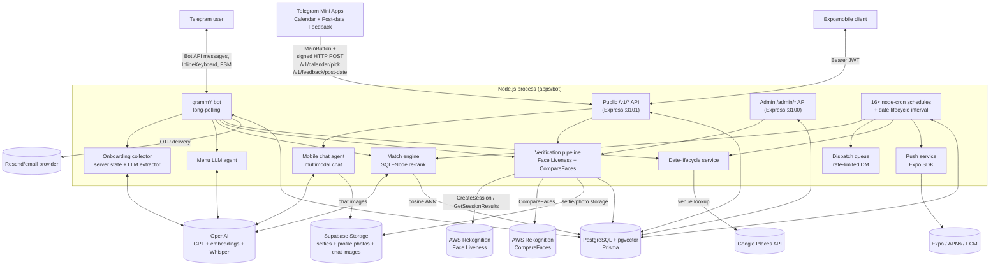

# Gennety Dating — Architecture

> Product logic and user flow are in [PRODUCT_SPEC.md](PRODUCT_SPEC.md).
> Tech stack and coding rules are in [AGENTS.md](AGENTS.md).
> Production deploy instructions are in [deploy.md](deploy.md).
> This file documents durable architecture boundaries. Code, Prisma schema,
> route files, and env loading remain the source of truth for implementation
> details.

## Production Endpoints

The DigitalOcean droplet (`167.172.178.229`) terminates TLS via **Caddy**
(auto-renewed Let's Encrypt). DNS for the `gennety.com` zone lives at Hostinger.

| Subdomain | Reverse-proxies to | Purpose |
|---|---|---|
| `api-admin.gennety.com` | `localhost:3100` | Admin analytics dashboard API (`ADMIN_API_KEY` Bearer auth, `helmet` + IP rate-limit + timing-safe key compare). |
| `dating-api.gennety.com` | `localhost:3101` | Public `/v1/*` API for the native iOS client and the Telegram Mini Apps. |

**Domain isolation:** `api.gennety.com` is owned by a sibling project — never
use it for Gennety Dating. Always pick names prefixed with `dating-` here.

The bot itself runs **long-polling** (grammY `bot.start`) on the same host;
it does not need an inbound subdomain. Telegram delivers updates to whichever
process is currently polling — so prod (`@gennetybot`) and local dev
(`@gennetytestbot`) MUST use different bot tokens.

**No identity-provider webhook.** The Persona era exposed
`/v1/webhooks/persona` here; AWS Face Liveness has no webhook at all — a
session's verdict is read server-to-server inside the client's own `/event`
request, within the session's 3-minute lifetime (PRODUCT_SPEC §1.4).

## Top-Level Topology

```
┌──────────────────┐   ┌──────────────────┐
│ Telegram client  │   │ Expo/mobile API  │
│ (bot + Mini App) │   │  (iOS / Android) │
└────────┬─────────┘   └────────┬─────────┘
         │ Bot API + WebApp     │ HTTPS  (Bearer JWT)
         │ + signed HTTP POST   │
         ▼                      ▼
┌─────────────────────────────────────────┐
│  Node.js process (apps/bot)             │
│  ─────────────────────────────────────  │
│  • grammY bot (long-polling)            │
│  • Express public  API  (:3101)         │
│  • Express admin   API  (:3100)         │
│  • cron workers + date lifecycle tick   │
└─────────────────────────────────────────┘
       │           │            │
       │ pgvector  │ OpenAI     │ External APIs
       ▼           ▼            ▼
┌───────────┐ ┌──────────┐ ┌──────────────────────────┐
│ Postgres  │ │ OpenAI / │ │ AWS Rekognition          │
│ + pgvector│ │ Whisper  │ │ AWS Rekognition (face)   │
│ (Supabase)│ │          │ │ Google Places (venue)    │
└───────────┘ └──────────┘ │ Supabase Storage (media) │
                           │ Resend/email provider    │
                           │ Expo / APNs / FCM (push) │
                           └──────────────────────────┘
```

## End-to-End Architecture Schema


```mermaid
graph TD
    %% ── Clients ────────────────────────────────────
    TG_User[Telegram user]
    Mini[Telegram Mini Apps<br/>Calendar + Post-date Feedback]
    Mobile[Expo/mobile client]

    %% ── Single Node.js process (apps/bot) ──────────
    subgraph Process["Node.js process (apps/bot)"]
      Bot[grammY bot<br/>long-polling]
      PublicAPI["Public /v1/* API<br/>(Express :3101)"]
      AdminAPI["Admin /admin/* API<br/>(Express :3100)"]
      Crons["16× node-cron schedules<br/>+ date lifecycle interval"]
      OnboAgent[Onboarding collector<br/>server state + LLM extractor]
      MenuAgent[Menu LLM agent]
      MobileChat[Mobile chat agent<br/>multimodal chat]
      Match[Match engine<br/>SQL+Node re-rank]
      DispatchQ[Dispatch queue<br/>rate-limited DM]
      Verify[Verification pipeline<br/>Face Liveness + CompareFaces]
      DateLC[Date-lifecycle service]
      Push[Push service<br/>Expo SDK]
    end

    %% ── External services ──────────────────────────
    OpenAI[(OpenAI<br/>GPT + embeddings + Whisper)]
    Liveness[(AWS Rekognition<br/>Face Liveness)]
    Rekog[(AWS Rekognition<br/>CompareFaces)]
    Places[(Google Places API)]
    Email[(Resend/email provider)]
    Supabase[(Supabase Storage<br/>selfies + profile photos + chat images)]
    PushSvc[(Expo / APNs / FCM)]

    %% ── Data layer ─────────────────────────────────
    PG[(PostgreSQL + pgvector<br/>Prisma)]

    %% ── Edges: clients ↔ process ───────────────────
    TG_User <-->|Bot API messages,<br/>InlineKeyboard, FSM| Bot
    Mini -->|MainButton +<br/>signed HTTP POST<br/>/v1/calendar/pick<br/>/v1/feedback/post-date| PublicAPI
    Mobile <-->|Bearer JWT| PublicAPI

    %% ── Edges inside process ───────────────────────
    Bot --> OnboAgent
    Bot --> MenuAgent
    Bot --> Match
    Bot --> Verify
    Bot --> DateLC
    Crons --> Match
    Crons --> DispatchQ
    Crons --> DateLC
    Crons --> Push
    PublicAPI --> MobileChat
    PublicAPI --> Verify
    AdminAPI --> Verify

    %% ── Edges: process → external ──────────────────
    OnboAgent <--> OpenAI
    MenuAgent <--> OpenAI
    MobileChat <--> OpenAI
    Match <--> OpenAI
    Verify -->|CreateSession / GetSessionResults| Liveness
    Verify -->|CompareFaces| Rekog
    Verify -->|selfie/photo storage| Supabase
    MobileChat -->|chat images| Supabase
    DateLC -->|venue lookup| Places
    Bot -->|OTP delivery| Email
    Push --> PushSvc

    %% ── Edges: process → DB ────────────────────────
    Bot <--> PG
    PublicAPI <--> PG
    AdminAPI <--> PG
    Crons <--> PG
    Match -->|cosine ANN| PG
    Verify --> PG

    %% ── Webhooks back into process ─────────────────
```

## Process Layout

A **single** Node.js process (`apps/bot`) hosts everything:

- **grammY bot** — long-polling Telegram updates; routes via Composer-based
  handlers (`handlers/router.ts`).
- **Public Express server** on `PUBLIC_PORT` (default `3101`). Mobile client
  consumer; also receives the signed Calendar
  Mini App POST. Refuses to start if `JWT_SECRET` is shorter than 32 bytes.
  Access JWTs are pinned to HS256, issuer `gennety-public-api`, audience
  `gennety-mobile`, and a UUID subject.
- **Admin Express server** on `ADMIN_PORT` (default `3100`). Started only
  when `ADMIN_API_KEY` is set. Bearer-auth + helmet + per-IP rate limit.
- **Background jobs** — 16 `node-cron` schedules (three — ticket-expiry,
  rematch-refund, venue-change-refund — are registered only when their feature
  flag is on) plus the date-lifecycle interval (see *Cron & Workers* below).

Importing `./config.js` is the very first thing `index.ts` does — this
ensures `.env.local` overrides `.env` *before* `@gennety/db` evaluates
`new PrismaClient()` and locks in `DATABASE_URL`.

## Data Models (PostgreSQL + Prisma)

Source of truth: [`packages/db/prisma/schema.prisma`](packages/db/prisma/schema.prisma).
This section is an architectural map, not a manually authoritative schema dump;
when columns diverge, Prisma wins.

### Enums

| Enum | Values |
|---|---|
| `UserStatus` | `onboarding`, `active`, `paused`, `frozen`, `suspended`, `pending_investigation`, `banned`. User-owned changes go only through `services/account-status-transitions.ts`: CAS `active ↔ paused`, transactional `active|paused → frozen`, and CAS `frozen → active`; moderation-owned states cannot be overwritten. Freeze commits match cancellations atomically before external partner effects. |
| `Language` | `en`, `ru`, `uk`, `de`, `pl` |
| `OnboardingStep` | `consent`, `language`, `conversational`, `completed` |
| `Theme` | `light`, `dark` (app-wide UI theme; `dark` is the brand default) |
| `Gender` | `male`, `female` |
| `GenderPreference` | `men`, `women`, `both` |
| `Platform` | `telegram`, `mobile`, `both` |
| `VerificationStatus` | `unverified`, `pending`, `pending_review`, `verified`, `rejected` |
| `MatchRadius` | `campus_only`, `citywide` |
| `MatchStatus` | `proposed`, `negotiating`, `negotiating_venue`, `scheduled`, `cancelled`, `completed`, `expired` |
| `MatchEventActionType` | `PROPOSAL_SHOWN`, `ACCEPTED`, `DECLINED`, `DATE_COMPLETED`, `CHEMISTRY_POSITIVE`, `CHEMISTRY_NEGATIVE`, `EXPIRED_SILENT`, `EXPIRED_PEER_IGNORED` |
| `MessageRole` | `user`, `assistant`, `system` |
| `AiMemoryExportPreference` | `undecided`, `accepted`, `declined` |
| `ProfilerPriority` | `high`, `medium`, `low` |

### `users`

Columns (≈ 35; grouped by purpose):

| Group | Columns |
|---|---|
| Identity | `id`, `telegramId` (unique BigInt — synthetic **negative** id for mobile-only users), `telegramUsername` (public `@handle`, captured opportunistically for `t.me/` coordination links), `email`, `universityDomain`, `firstName`, `surname`, `age`, `gender`, `preference`, `major`, `language`, `platform`. `id` is the only immutable identity: `telegramId` is **re-pointable** by the phone-based login (`services/account-linking.ts`) — a `User.phone` unique collision transfers the sharing Telegram account's id/username onto the row that owns the number, deletes the empty registration row it came from, promotes `platform` `mobile` → `both`, and clears the now-stale `statusMessageId`. Anything caching a `telegramId` must resolve through the DB rather than assume permanence. **A positive `telegramId` no longer implies the bot can message that user (2026-08-02).** `POST /v1/auth/telegram` stores the REAL Telegram id on an app-only account, and a bot cannot initiate a chat with someone who never pressed Start — so `platform` is the only canonical reachability check, and a `telegramId: { gt: 0 }` filter must be paired with `platform in (telegram, both)`. `workers/profiler.ts` and `workers/re-engagement.ts` were filtering on the id alone and are fixed; such a row is promoted to `both` when it actually starts the bot. |
| Lifecycle | `status` (`UserStatus`), `onboardingStep`, `aiMemoryExportPreference`, `aiMemoryExportPreferenceAt`, `hasConsented`, `consentedAt`, `termsAccepted`, `termsAcceptedAt`, `policyVersion`, `researchOptIn`, `createdAt`, `updatedAt`. `policyVersion` records WHICH version of the Terms + Privacy Policy was accepted (`LEGAL_DOCS_VERSION` from `packages/shared`), because GDPR Art. 7(1) puts the burden on us to demonstrate what was agreed to and a timestamp alone cannot once the documents change. Null for consents recorded before 2026-08-01. |
| UI theme | `theme` (`Theme`, default `dark`) — the recipient's chosen app-wide light/dark theme, honored by every Mini App (via the shared `theme.css` tokens) and both server-rendered PNG cards; `themeChosenAt` marks the explicit pick so the onboarding theme step shows once. |
| Email OTP | `emailOtp`, `emailOtpExpiresAt`, `isEmailVerified` |
| Registration v2 | `phone` (unique E.164, written from a trusted Telegram `message.contact` or a verified native-app code), `phoneVerifiedAt` (the general-track contact gate), `registrationTrack` (`student`/`general`, null = pre-fork legacy). Matching admits the union of track-valid cohorts: `general + phoneVerifiedAt`, or `student`/legacy + `isEmailVerified` and a stored email. `phone` is also the **cross-rail login key**: both rails resolve an existing account through it — the mobile side in `findOrCreateMobileUserByPhone` (`public/mobile-user.ts`, which also promotes `telegram` → `both`), the Telegram side in `services/account-linking.ts` (PRODUCT_SPEC §1.1). A collision where both the sharing row and the owning row carry real data is the one case neither rail resolves automatically. |
| Conversational state | `messageHistory` (`Json[]`), `lastMessageAt`, `lastPreMatchAnnounceAt`. AI-memory response bodies are deliberately not retained here: a typed `context_dump` is replaced by a non-sensitive receipt marker after parsing, and on the legacy tool-loop path the advisory `raw_dump` tool argument is stripped from the persisted assistant turn for the same reason. |
| Re-engagement | `reEngagementStep` (0–5), `reEngagementNextAt` |
| Trust & safety | `strikes`, `suspendedUntil` |
| Telegram UI | `statusMessageId` (pinned banner) |
| Push (mobile) | `pushToken`, `pushPlatform` |
| Verification | `biometricConsentAt` / `biometricConsentVersion` (explicit Art. 9(2)(a) consent, captured on its own screen; `beginLivenessCheck` refuses to mint a session without it, so the gate is server-side and both clients are bound by it), `verificationStatus`, `personaInquiryId` (unique), `verifiedAt`, `verificationSkippedAt`, `verifiedSelfiePath`, `faceMatchScore`, `faceMatchedAt`, `selfiePath` (legacy). Matching admits only `verified` plus the persisted pre-flip cohort (`unverified` with non-null `verificationSkippedAt`). `personaInquiryId` keeps its historical name but now holds the AWS Face Liveness session id (the provider swap was deliberately schema-free); it stays the `(session, faceMatchedAt)` idempotency marker. `pendingLivenessSessionId` is deliberately a SEPARATE column: it holds the session currently in flight (written at `/init`, cleared at a terminal outcome) purely so `completeLivenessCheck` can refuse a client-supplied session id the user did not mint. It cannot be folded into `personaInquiryId`, which means "the session that produced the stored reference selfie" and is what `triggerVerificationRerun` reruns against — a not-yet-completed session must never land there. Production-like startup fails closed unless liveness is enabled and configured (AWS credentials + `LIVENESS_STS_ROLE_ARN`), verification is mandatory, and Rekognition/profile-media validation are enabled — there is no sandbox escape hatch any more. |
| Attribution | `referralSource` (`tg:start_param` / `mobile:utm=…` / `referral:USER_ID`) |
| Tickets (feature-flagged) | `ticketBalance` — materialized ticket-wallet balance; running sum of `TicketLedger.delta` (see `ticket_ledger`). `ticketDiscountPct` / `ticketDiscountGrantedAt` / `ticketDiscountExpiresAt` / `ticketDiscountConsumedAt` — one-time famine single-ticket discount (PRODUCT_SPEC §3.5b; active ⇔ `pct > 0 AND consumedAt IS NULL AND expiresAt > now`), owned by `services/ticket-discount.ts`. `ticketDiscountSource` (`famine` | `event_feedback`) names WHICH mechanism filled that one slot — analytics only, never read by pricing; see `event_feedback`. |
| Premium (feature-flagged) | `premiumUntil` / `premiumSince` / `premiumProvider` (`telegram_stars`\|`app_store`\|`referral`) / `premiumAutoRenew` / `premiumExternalId` — Gennety Premium subscription head (PRODUCT_SPEC §3.8 / §Premium). Materialized from the append-only `subscription_ledger`; active ⇔ `premiumUntil > now`. `premiumExternalId` is the recurring anchor (Stars charge id / App Store `originalTransactionId`) used to reconcile renewals + find the owner from a webhook. Owned by `services/premium.ts`; inert-to-write unless `PREMIUM_FEATURE_ENABLED`, but an existing entitlement is honored regardless of the flag. `provider: "referral"` marks a complimentary comp grant (`grantComplimentaryPremiumMonths`) that never sets an auto-renew anchor. | `premiumReminder3dAt` / `premiumReminder1dAt` are the expiry-reminder once-markers (PRODUCT_SPEC §3.8): the 3-day and 24-hour DMs are sent at most once per PAID PERIOD, so every path that advances `premiumUntil` clears both — otherwise a renewing user is warned once in their life and every later period lapses in silence. Set for BOTH reminder cohorts (PRODUCT_SPEC §3.8): a non-auto-renewing entitlement whose access really is ending, AND a live recurring Telegram Stars subscription, which is warned that the coming charge is taken from the Star balance with no card fallback. (Until 2026-08-24 this was non-renewing only, which left the recurring cohort — the one that can actually lose a subscription to an empty balance — with no warning at all.) A recurring **App Store** subscription is still never marked: Apple runs its own billing retry and there is no Star balance to top up, so neither message is true for that rail. One pair of markers serves both cohorts because they are mutually exclusive at any instant (`premiumAutoRenew` true vs false). Swept by `workers/premium-expiry-reminder.ts` off `@@index([premiumUntil])`, which exists because that hourly sweep asks one question of the whole table and the column is null on most rows. **`activateOrExtendPremium` may only ever EXTEND `premiumUntil`** (a `max()` against the stored value): a monthly subscriber who buys a 3/6-month package holds an expiry months out, and their next 30-day renewal carries an earlier one — writing it through would delete the package they just paid for. `revokePremium` stays the one path allowed to shorten it.
| Referral (feature-flagged) | `referralVerifiedCount` (referrer's materialized tally of invited friends who cleared verification — the milestone-ladder progress), `referralCountedAt` (invitee-side once-marker: this user was already counted toward their referrer, CAS null→now), `referralInviteePremiumAt` (invitee-side once-marker for the welcome Premium month). Referral program (PRODUCT_SPEC §3.9 / `REFERRAL_PRODUCT_SPEC.md`), owned by `services/referral.ts`; rewards themselves live in `ticket_ledger` (`referral_milestone`) + `subscription_ledger` (`referral`). Inert unless `REFERRAL_FEATURE_ENABLED`. |
| Promo (feature-flagged) | `promoRedeemedAt` — once-marker for the promo welcome gift's wow screen + grant guard. Independent promo-code program (PRODUCT_SPEC §3.10 / `PROMO_CODES_PRODUCT_SPEC.md`), owned by `services/promo.ts`; attribution reuses `referralSource` as `promo:<CODE>` (mutually exclusive with `referral:*`); the reward lands exactly-once in `PromoRedemption` + `ticket_ledger` (`promo`) + `subscription_ledger` (`promo`). Inert unless `PROMO_FEATURE_ENABLED`. |
| Synthetic test profile (temporary) | `syntheticAt` — non-null on a seeded stand-in used to balance the gender skew during the friends-and-family production test (PRODUCT_SPEC §3.1c). One marker, three consequences, and each is enforced at exactly one place so a new caller inherits it: `buildCandidateSql` excludes it (keeping every single-seeker path — the paid Rematch, the §3.1b auto-resume probe — from ever surfacing one); `updateEloScores` no-ops on a pair carrying it; the admin classifier files the account as `test`. Written only by `scripts/seed-synthetic-profiles.mjs` via `services/synthetic-profiles.ts`, never by the running product, and null on every real account — so with no seeded rows the whole mechanism is unreachable regardless of `SYNTHETIC_FILL_ENABLED`. Such a row is `platform: "mobile"` with a negative `telegramId` in the `-778_000_00x` band and **no phone or email**: `registrationTrack: "general"` + `phoneVerifiedAt` satisfies the contact rail on its own, and a fake number would squat on `User.phone`'s unique index forever. |

Indexes: `(status, reEngagementNextAt)`, `(status, suspendedUntil)`.

### `onboarding_progress` (1:1 with `users`)

Server-owned traversal metadata for incomplete onboarding:

| Column | Ownership |
|---|---|
| `completedFields`, `skippedFields`, `askedFields` | Collector state only; never copies personal answers |
| `currentQuestion` | Deterministic next-question key used by Telegram and public/mobile API |
| `collectorVersion`, `backfilledAt` | Rollout and lazy-backfill audit |
| `revision` | Optimistic concurrency guard so simultaneous answers do not lose facts |

Canonical answers remain in `users` and `profiles`. `messageHistory` is an
interface/audit log, not a profile database. Only `user_text` may enter fact
extraction; `resume`, `context_dump`, and `photos_updated` are typed synthetic
events. Backfill reads canonical columns and raw user-authored messages, never
AI summaries, assistant messages, or historical tool arguments.

### `onboarding_step_events`

Append-only onboarding funnel telemetry (one row per step transition), written
best-effort from the collector's post-commit path in
`services/onboarding-analytics.ts` — never inside the save transaction, so a
telemetry failure can't abort a user's onboarding. Columns: `userId`, `step`
(an `ONBOARDING_QUESTIONS` key or `verification`), `kind`
(`asked`/`answered`/`skipped`), `dwellMs` (hesitation on the step = the gap
since its latest `asked`; null on `asked` rows), `language`, `platform`,
`createdAt`. Stores **only** the step key, its outcome, and timing — never the
user's answer text. Drop-off is derived, not stored (a still-`onboarding` user
whose latest `asked` step has no matching resolution is stuck there). Indexed
`(userId, createdAt)` and `(step, kind, createdAt)`; `onDelete: Cascade` from
`users`. Powers `GET /admin/analytics/onboarding-funnel`.

### `profiles` (1:1 with `users`)

Columns (≈ 25):

| Group | Columns |
|---|---|
| Demographics | `userId` (unique), `height`, `hobbies` (`String[]`), `partnerPreferences`, `psychologicalSummary` (redacted signal-only AI-memory summary or onboarding fallback; never the raw pasted export), `negativeConstraints`, `ageRangeMin`, `ageRangeMax` (stated preferred-**partner** age band, user-editable post-onboarding; read by the match engine as the soft `V_agePref` multiplier — see [PRODUCT_SPEC.md](PRODUCT_SPEC.md) §3.2) |
| Vector | `embedding` (`vector(1536)`), `embeddingDirty`, `embeddingDirtyAt` |
| Elo | `eloScore` (default 500), seeded from the server-side mean of all per-photo vision scores; `eloMatchesPlayed`; `eloSeededAt`; auditable aggregate/per-photo output in `eloSeedDetails` |
| Photos | `photos` (`String[]` of static Telegram `file_id` or Supabase path), `profileMedia` (`Json[]` structured display media; empty legacy rows normalize from `photos[]`), `referenceFaceEmbedding` (`Json?` legacy self-photo identity-anchor metadata — retained, no longer written by the upload flow since identity moved to liveness-only, 2026-06-23), `uploadedPhotoHashes` (`String[]`, strictly 1:1 with `photos`; perceptual hash or `""` sentinel at every index), `pendingPhotoCandidates` (`Json[]` legacy consensus pool — retained, no longer written), `acceptedPhotoCount` (`Int`), `photoFaceScores` (`Float[]`, 1:1 with `photos`) |
| Geo / radius | `matchRadius` (`campus_only` / `citywide`), `homeCity`, `homeCountryCode`, `homeCityKey`, `homePlaceId`, `latitude`, `longitude`, `locationUpdatedAt`, `timeZone` (IANA, derived from the dating city; drives the Profiler's local-time batch windows). `homeCityKey` must be a **launched market** (`packages/shared/src/markets.ts`; PRODUCT_SPEC §1.3) — `validateHomeLocationPayload` (`public/home-location.ts`) is the single writer and canonicalizes name + coordinates from the market, so Telegram and the `/v1/*` API are gated by one check. Rows created before that gate keep their city and are offered a one-tap move (`handlers/menu/city-switch.ts`). |
| Match priority | `lastMatchedAt`, `missedWeeks`, `standbyCount`, `lastMissedAt`, `silentIgnoreCount`, `starvationPausedAt` (nullable; stamped only by the D10 pool-exhaustion auto-pause — `services/pool-exhaustion.ts` — never by an ordinary user-chosen menu pause, so `autoResumeStarvedUsers` only ever probes accounts it paused itself; see PRODUCT_SPEC.md §3.1b) |
| Profiler (Phase 1b) | `profilerStartedAt`, `profilerNextAt`, `profilerActiveQuestionId`, `profilerBatchRemaining`, `profilerAnswerWindowUntil`, `profilerQuestionMessageId` — scheduler + capture state for the post-onboarding Q&A batches that fuel icebreakers/hints (see [PRODUCT_SPEC.md](PRODUCT_SPEC.md) §Phase 1b). `profilerActiveQuestionId` is the concurrency token: every answer/skip claims it with a compare-and-set, so exactly one reply resolves a question. `profilerNextAt` is dual-purpose — the next batch window while idle, and the **stall deadline** of the question currently in flight (6 h), which is what lets the worker reclaim a question the user never answered. `profilerAnswerWindowUntil` is the much shorter (90 min) deadline for *implicitly* treating plain text as that question's answer; it is cleared the moment the user does anything else, so an active question can never swallow an unrelated message meant for the menu agent. `profilerQuestionMessageId` anchors the question message, so an explicit Telegram reply is still recognised after the window closed, a resolved question can have its Skip keyboard stripped, and a question reclaimed as an implicit skip can be **deleted** — otherwise a dead question keeps sitting in the chat inviting an answer nothing can route (PRODUCT_SPEC §Phase 1b). Indexed `@@index([profilerNextAt])` for the worker sweep. |
| Relationship intent | `relationshipIntents` (`String[] @default([])`, whitelist-validated in app code — NOT a Prisma enum, mirroring `socialRole`, so a fifth point on the axis costs no migration). Zero or more ordered values out of `spark` \| `open` \| `falling` \| `longterm` (`@gennety/shared` `relationship-intent.ts`), picked on the last of the Mini App's own profile screens. **An ARRAY rather than a single value** (founder decision 2026-08-26): people who want a bright story and would also go somewhere serious were being made to guess which half to declare. `normalizeIntents` is the only writer's gate — it dedupes, sorts into axis order, and accepts a bare string, so the chat and the `/v1/*` rail (which answer with exactly one value) need no change and a row is never stored in two orders. Read by the soft `V_intent` multiplier and by nothing else, which is what two rules ride on: it deliberately does **not** feed the embedding (through `psychologicalSummary` it would arrive at `V_explicit`'s weight 0.65 — the strongest term, the opposite of its purpose — and be wiped by the next About-me edit), and it is **never shown to the partner** (owner-only in My Profile with a "only you can see this" line; absent from the pitch and from `SerializedMatch`). Empty on legacy rows and on any client without the screen; `intentMultiplier` returns exactly 1.0 when EITHER side is empty, and scores two sets by the SMALLEST gap between them, so any overlap is neutral. See [PRODUCT_SPEC.md](PRODUCT_SPEC.md) §1.3 / §3.2. |
| Vibe (matching) | `fridayVibeText`, `vibeFocusText` (raw onboarding §1.3 answers), `energyAxis` / `orientationAxis` (`Float?` `[-1,1]`, scored by `V_research` quadrant proximity), `socialRole` (`String?` initiator/participant/observer — whitelist-validated in app code, **stored but not scored** in v1), `anchorTags` (`String[]`), `vibeExtractedAt`. Written at finalize by `services/vibe-axes.ts`; the raw Friday text is also folded into `psychologicalSummary`. See [PRODUCT_SPEC.md](PRODUCT_SPEC.md) §1.3 / §3.2. |
| Audit | `createdAt`, `updatedAt` |

### `matches`

Columns (≈ 40). Drives the entire matching → scheduling → date lifecycle. See
[PRODUCT_SPEC.md](PRODUCT_SPEC.md) §3–4 for the state machine.

Application invariant: a user occupies at most one live row across `proposed`,
`negotiating`, `negotiating_venue`, and `scheduled`. (One exception, and it is
not reachable in production: the demo puppet is excused from it, because it is a
prop shared by every visitor rather than a person who can be double-booked —
DEMO_MODE.md → "The guarded branches in production code".) Eligibility queries exclude
both match relations, and `createProposedMatch` locks both user rows in sorted
order before re-checking and inserting. If legacy/corrupt data contains several
live rows, all current-match surfaces choose explicitly by product progression:
`scheduled` → `negotiating_venue` → `negotiating` → `proposed` (newest wins ties),
never by PostgreSQL enum declaration order.

| Group | Columns |
|---|---|
| Identity | `id`, `userAId`, `userBId`, `status` (`MatchStatus`), `createdAt`, `updatedAt` |
| Pitch & synergy | `pitchForA`, `pitchForB`, `synergyScore` (pair-level, clamped 70–99), `synergyReason` / `synergyReasonB` (the 1–2 sentence rationale, stored **per side in that side's own language** like the pitches — `synergyReason` is A's, kept under the original name for legacy rows + the founder report; a null `synergyReasonB` falls back to A's at render. See [PRODUCT_SPEC.md](PRODUCT_SPEC.md) §3.3) |
| Decision (blind invariant) | `acceptedByA`, `acceptedByB` (tri-state `null`/`true`/`false`), `rejectionReasonA`, `rejectionReasonB`, `dispatchedAt`, `pitchMessageIdA`, `pitchMessageIdB`. **`dispatchedAt` is load-bearing far beyond the TTL it names:** the expiry sweep, the countdown worker and both nudge cadences all filter `dispatchedAt: { not: null }`, so a `proposed` row that keeps it null is invisible to every one of them at once while still occupying both participants' single live-match slot — i.e. both users silently leave the matching pool for good (production held one such row for 123 hours). `services/dispatch-queue.ts` → `disposeUndeliveredMatch` is what guarantees a dispatch attempt never leaves that state: a pitch on record for either side starts the TTL, a pitch that reached nobody retires the row. Anything that creates a `proposed` match must go through that queue (all three creation paths — drop batch, demo driver, paid Rematch — do). |
| Peer-wait shimmer (§3.6b) | `peerWaitMessageIdA/B` + `peerWaitEditedAtA/B` — the FALLBACK line only, for clients that cannot render a `<tg-thinking>` draft. The rich path needs no column: the draft is ephemeral and simply stops being re-issued when the wait ends. The fallback is a real message that must be edited as the wording climbs and deleted when the wait ends, so its id has to survive a PM2 restart — an in-memory map would strand a permanent "waiting for them…" line in the chat after any deploy. `peerWaitStartedAtA/B` is the **per-side wait anchor** the five-tier wording ladder is measured from; nothing else in the row answers "how long has this side been waiting" (`acceptedByA/B` are booleans, `availableTimesA/B` carry no submission time, `updatedAt` moves for unrelated reasons). All four are written only by `workers/peer-wait-shimmer.ts` — single-writer on purpose, so the action handlers that kick off a shimmer cannot race it; they render tier 1 unconditionally, which is true by construction since they fire the instant the user commits. The anchor is RELEASED when a wait ends, so a later wait on the same match restarts at tier 1 instead of opening on the 24h deadline copy. |
| Prime Time (feature-flagged) | `primeTimeUnlockedAt`, `primeTimePaidById` — the paid evening band (§3.6). Scoped to the MATCH rather than to a user, and that is forced rather than chosen: a date locks when the two availability sets intersect, so a pass that opened the band for one side would buy nothing. Written by the `successful_payment` settle, and ALSO — without money moving — the first time a premium user marks a prime slot (`shouldPersistUnlock`), so a subscription lapsing before the date cannot re-lock a slot the pair already agreed on. `primeTimePaidById` is null for a band opened by a subscription, which is what tells the §9.1 refund there is nothing to return. |
| Calendar scheduling | `proposedTimes` (`DateTime[]`, server-side allowlist of valid slots: 6 dates × 14 slots/date, every 30 min from 13:00 to 19:30 — also the "is the calendar actually open?" signal the peer-wait predicate reads, since `ticketStatus` defaults to `pending` even with tickets off), `availableTimesA`/`availableTimesB` (`DateTime[]`, each side's marked availability), `agreedTime` (set after a single exact overlap is agreed; multi-overlap is confirmed in the Mini App), `calendarMessageIdA/B` (current Telegram post-accept CTA per side: accepted/waiting, then Calendar — **never** the Date Ticket card, which is a separate untracked message; edited on status changes and cleared after agreement. An in-place edit is only correct while the tracked card is still the newest message in the chat: a counter-proposal and the post-ticket-gate Calendar both delete and resend instead, because Telegram edits raise no notification and both land under newer messages — PRODUCT_SPEC §3.6 / §3.5b). `schedulingIteration` and `pickedTimeA/B` are deprecated — retained for backwards-compat with in-flight rows mid-deploy and will be dropped in a follow-up cleanup migration. |
| Concierge venue | `vibeTextA`, `vibeTextB`, `vibeLatA/LngA`, `vibeLatB/LngB`, `vibeAddressA/B` (Mini App map-picker label), `parsedCategoryA`, `parsedCategoryB`, `venueName`, `venueAddress`, `venueLat`, `venueLng`, `venueGoogleMapsUri`, `venuePhotoName` (the single venue-imagery source: a Google Places photo resource name, rebuilt to a media URL at date-card render with the server-side key, never persisting Google's bytes; curated venues get theirs resolved from their stored `placeId` at assignment via `fetchPlacePhotoName`), `venuePhotoUrl` (**retired 2026-07-25**, no longer read/written), `venuePromptAskedAt` |
| Date lifecycle | `icebreakersSentAt`, `iceBreakersA`/`B` (`String[]`), `safetyNoteSentAt`, `safetyAckA`/`B`, `wingmanHintA`/`B`, `wingmanSentAt`, `emergencyCancelledBy`, `emergencyReason`, `feedbackByA`/`B`, `feedbackPromptedAt`, **`dateAttendedA`/`B`** + **`attendanceOutcomeA`/`B`** (did the date actually happen, answered at T+24h — PRODUCT_SPEC §Phase 4. Written ONLY by a human answer, never by the evidence classifier, which picks the question's wording and nothing else. `null` means "not answered" and is NOT `false`: `Match.status = 'completed'` is stamped by the feedback prompt whether or not anyone showed up, so it cannot answer this. Attendance is a property of the PAIR — one credible `true` settles the match — and the two columns exist because the sides can disagree, which is a real `disputed` state rather than something to collapse. The outcome is a plain string like every other match sub-state here; whitelist in `services/attendance.ts`, deliberately separate from `feedbackBy*` because that blob is LLM-distilled into the answerer's `negativeConstraints` and "she never turned up" is not a trait to penalise future candidates on), `dateCardFileIdA`/`B` (Telegram `file_id` cached per side for My Date; that side is cleared transactionally on language/theme change, and cache writes compare the rendering language/theme against the current participant so a concurrent stale render cannot repopulate it) |
| Nudges | `nudge1SentAt`, `nudge2SentAt` (legacy), `proposalNudge1SentAt`, `proposalNudge2SentAt`, `schedNudge1SentAt`, `schedNudge2SentAt`, `proposalDeadlineNudgeSentAt` (idempotency for the single deadline-anchored "window closing" DM ~2h before the 24h TTL — see [PRODUCT_SPEC.md](PRODUCT_SPEC.md) §3.5), `venueNudge1SentAt`/`venueNudge2SentAt` (the same 6h/12h pair for the venue step, which had no reminder at all) |
| Planning stall (§3.5c) | `schedulingOpenedAt` — when `startScheduling` actually opened the Calendar, and the anchor every scheduling-phase reminder counts from (it replaced `dispatchedAt`, which also covers the up-to-24h decision window, so a late-accepting pair could get "pick a time" seconds after the Calendar card; null rows fall back to `dispatchedAt`). `stallCheckInSentAtA/B` + `stallConfirmedAtA/B` — the "still in?" question and its 🟢 answer, **per side** unlike every nudge column above, because both participants can independently go quiet and each needs their own question and answer. A confirmation is only eligible when it predates the question it answers, which is what makes each sent question confirmable exactly once (a stale green tap can't keep pushing the 48h deadline). Owned by `services/match-stall.ts`; driven by the existing hourly `match-nudge` cron. |
| Date Ticket (feature-flagged) | `ticketPriceCents`, `ticketPaidA/B`, `paidForPartnerByA/B`, `partnerPaidSeenAt` / `partnerPaidNudgedAt` (goodwill-cover read-receipt: first-seen stamp gating the payer's "she saw it ❤️" DM, and the completion-nudge guard — §3.5b), `ticketStatus` (`pending`/`partial`/`completed`/`refund_pending`/`refunded`/`expired` — string, not a Prisma enum), `ticketExpiresAt`. `refund_pending` is the durable retry boundary: scheduling opens only after the provider/wallet reversal succeeds. Monetization sub-state machine that runs while `status = negotiating`; inert when `TICKET_FEATURE_ENABLED` is off. See [PRODUCT_SPEC.md](PRODUCT_SPEC.md) §3.5b. |
| Pre-date coordination (feature-flagged) | `coordOfferSentAt`, `coordInitiatorId`, `coordMethod` (`share_self`/`request_partner`/`proxy` — string, not a Prisma enum), `coordChosenAt`, `coordPartnerConsent` (Variant B only), `coordResolvedAt`, `proxyOpenedAt`, `proxyClosesAt`, `proxyClosedAt`. Sub-state machine running on a `scheduled` match; inert when `COORDINATION_FEATURE_ENABLED` is off. See [PRODUCT_SPEC.md](PRODUCT_SPEC.md) §Phase 4. |
| Allocation source (feature-flagged) | `source` (`weekly`/`rematch`/`synthetic`/`campus`/`event` — string, not a Prisma enum, so a new value costs no migration; default `weekly`, stamped INSIDE the creating transaction by `createProposedMatch`), `rematchPaidById` (the buyer of a paid on-demand run; null for weekly pairs). Weekly-optimizer analytics filter to `source = 'weekly'` so neither on-demand runs nor test fill bias the scoring A/B — and a `synthetic` pair additionally writes NO `MatchScoreLog` at all, because a partner who declines by construction says nothing about scoring quality. An `event` pair (LAUNCH_EVENTS §11) is the one source born **pre-accepted**: `createProposedMatch` takes `preAccepted` and writes `status: "negotiating"` with both `acceptedBy*` true, because two people who both said yes at the party have already answered the question a `proposed` row exists to ask — and it arms `ticketExpiresAt` in the same CAS, so the row can never reach `negotiating` invisible to both the ticket sweep and the stall chain (§3.5b's own rule, one stage earlier). See [PRODUCT_SPEC.md](PRODUCT_SPEC.md) §3.11 / §3.1c / `REMATCH_PRODUCT_SPEC.md` / `LAUNCH_EVENTS_PRODUCT_SPEC.md` §11. |
| Venue change v2 (feature-flagged) | `venueChangeStatus` (null/`liking`/`agreed`/`settled`/`lapsed` — string, not a Prisma enum), `venueChangeProposerId`/`ProposedAt` (session initiator — first like / express mint), `venueLikesA/B` (`Json[]` server-resolved like snapshots), `venueChangeName`/`Address`/`Lat`/`Lng`/`MapsUri`/`PlaceId`/`PhotoUrl`/`PhotoName` (agreed venue snapshot), `venueChangeExpiresAt` (payment deadline)/`ResolvedAt`, `venueChangePaidById`/`PaidAt` (settle stamp), `venueChangePayDeclinedAt` (vestigial v2 — his decline now ENDS the change/closes the session rather than stamping a lingering `agreed` state, so this is no longer written or read for a decision), `venueChangeOfferPaySentAt` (wish-card guard), `venueChangePingSentToA/BAt` (board-invite guards), `venueChangeExpressAt` (her hidden unilateral mint), `venueChangeTier` (`base`/`premium` of the agreed venue, stamped at agreement — drives the §Premium fee waiver: a premium venue, or a base venue settled by a premium user, is free), `venueChangeCount` (`Int @default(0)` — settled changes so far, capped by `VENUE_CHANGE_MAX_PER_DATE` (2); incremented inside BOTH settle CASes, the paid one and the Premium free one, which is why the cap cannot be derived from `venue_change_purchases`: a free settle writes no purchase row, so a subscribing pair and every demo visitor would be uncapped), `venueChangeComment` (legacy v1, no longer written). Paid multiplayer venue-board sub-state on a `scheduled` match — a lapse never cancels the match; inert when `VENUE_CHANGE_FEATURE_ENABLED` is off. **`settled` and `lapsed` end the SESSION, not the date**: either can be restarted into a fresh `liking` round while `venueChangeCount` is under the cap, and the restart wipes every `venueChange*` field above (both `venueLikes*` included) in the same compare-and-set that writes the new round's first like — these columns are one slot, not a history, so a partial reset would let round one's hearts agree round two and would keep the peer-wait shimmer dead via a stale `venueChangePaidAt`. Only the four entry points that perform that reset (board state, catalog, like submission, express mint) consult `evaluateVenueChangeRestart`; every other action keeps reading `evaluateVenueBoardEligibility`, which still refuses a finished session outright. See [PRODUCT_SPEC.md](PRODUCT_SPEC.md) §3.7b / §3.8. |

Indexes: `(status, createdAt)`, `(userAId, userBId)`, `(ticketStatus, ticketExpiresAt)` (ticket-expiry cron sweep), `(status, coordOfferSentAt)` (coordination offer sweep), `(coordMethod, proxyClosedAt)` (proxy open/close sweeps), `(venueChangeStatus, venueChangeExpiresAt)` (venue-change expiry sweep), plus the functional
`matches_pair_canonical_idx` on `LEAST/GREATEST(user_a_id, user_b_id)` —
created out-of-band by `ensureMatchPairIndex()` at boot — that backs the
**lifetime ban** anti-join (a user never sees the same partner twice).

### `match_score_logs` (1:1 with `matches`)

Frozen score breakdown captured at match creation — `scoreExplicit`,
`scoreResearch`, `scoreLeague`, `scorePenalty`, **`scoreAgePref`** (stated
preferred-partner age-band multiplier; defaults to `1` so rows logged before the
factor existed read as neutral), **`scoreIntent`** (relationship-intent
agreement, also defaulting to `1` — and neutral on every row while
`INTENT_FLOOR` is 1.0), `scoreTotal`,
`embeddingDistance`, `starvationBonus`. Powers
`/admin/analytics/algorithm` so component weights can be A/B-tuned without
scanning the hot `matches` table.

**`scoreTotal` is recomposed from the averaged breakdown, and the expression
that does it is shared with the ranker** (`composeScore`, `match-engine.ts`).
It used to exist twice — once where `scoreCandidate` ranks and once where
`createProposedMatch` persists — so every new multiplier had to be added to
both or the audit row would describe a formula the engine never ranked on. One
function now serves both, and a test asserts the two agree to 12 decimals.

Embedding freshness is fail-closed. Embedding-feeding edits mark the profile
dirty and attempt a 30-second user-scoped refresh. `runWeeklyBatch()` first
processes a snapshot of the entire dirty backlog (independent of the periodic
worker's 20-row cap) through a bounded parallel pool, then eligibility requires
`embeddingDirty = false` in both Prisma and raw-vector paths. The vector update
compares `embeddingDirtyAt` *and* the captured embedding-source fields, so an
edit that lands in the same timestamp millisecond cannot be cleared by an older
generation. Preflight logging is aggregate-only (`scanned/refreshed/failed/
stillDirty`), and excluded dirty users never enter standby accounting.

### `match_events`

Append-only audit trail (`actionType` ∈ `MatchEventActionType`). Drives regular
Elo updates, expiry telemetry, and the dashboard's "ignored you" counter.
Emergency cancellation's small peer boost is applied directly by
`handlers/date/emergency.ts`, not through `match_events`. Indexed by
`(matchId, createdAt)`, `(actorId, createdAt)`, `(targetId, createdAt)`,
`(actionType, createdAt)`.

**Two of the eight enum values are never written** (measured 2026-08-08, after a
demo run that reached the post-date feedback produced no row for either):
`PROPOSAL_SHOWN` and `DATE_COMPLETED` exist in `MatchEventActionType` and have
**no write site anywhere** in `apps/bot/src` or `packages`. The six that are
emitted are `ACCEPTED`, `DECLINED`, `EXPIRED_SILENT`, `EXPIRED_PEER_IGNORED`,
`CHEMISTRY_POSITIVE`, `CHEMISTRY_NEGATIVE`. This matters to anyone reading the
table as a funnel: a date that actually happened leaves **no** `DATE_COMPLETED`
row, so completion must be read from `Match.status = 'completed'` (set by
`date-lifecycle.ts` at the T+24h feedback prompt), and dispatch from
`Match.dispatchedAt` rather than from `PROPOSAL_SHOWN`. The values are kept in
the enum because dropping one is a migration on a shared production enum for no
behavioural gain; treat them as reserved, not as data.

### `reports`

Post-match user-vs-user reports. LLM-triaged into `tier` 1/2/3
(`reasonSummary` is the distilled rationale). `adminReviewed` flips on the
manual-queue clear. Unique `(reporterId, matchId)` blocks duplicates. See
[PRODUCT_SPEC.md](PRODUCT_SPEC.md) §5 for tier policy. Tier 2/3 status changes
and cancellation of every in-flight match are committed in the same database
transaction; partner compensation and Telegram/Expo notifications run only
after commit and never weaken the cancellation safety gate.

### `user_blocks`

One user's block of another (App Store guideline 1.2). Sibling of `reports` and
deliberately unlike it: no text, no tier, no moderation queue, no consequence
for the blocked account. Unique `(blockerId, blockedId)` makes a retry the same
row rather than a second one or an error. `matchId` is the surface the block was
filed from, kept for moderation context, nullable with `SetNull` — a block must
outlive the match that produced it. `onDelete: Cascade` from `users` on both
sides.

**Directional in storage, symmetric in every consumer.** The row records who
blocked whom because the blocker's own list has to show and undo it; the
candidate SQL (`buildCandidateSql`) and the drop batch (`loadExcludedPairs`)
both read it in both directions. That symmetry is what stops the block from
leaking its own existence by being one-sided.

Writing it and cancelling a live match between the two happen in one
transaction (`services/user-block.ts` → `claimMatchCancellation`); ticket
refunds and the partner's cancellation notice run only after commit, on the same
rail freeze and moderation use. See [PRODUCT_SPEC.md](PRODUCT_SPEC.md)
§Blocking.

### `email_otps`

Mobile-side OTP store. **Distinct from `users.emailOtp`**: keyed by `email`
(not `userId`) because mobile users start the funnel before a `User` row
exists. `code` is bcrypt-hashed; raw is only delivered via the email provider. Tracks
`attempts` and `consumedAt` for replay protection. Request creation takes a
transaction-scoped PostgreSQL advisory lock keyed by normalized email, so
concurrent requests across processes cannot bypass the resend cooldown or send
multiple competing codes.

### `live_activity_tokens`

APNs push tokens for the native app's Live Activities (ActivityKit). One row
per (user, `activityType` ∈ `match_decision`/`date_day`, `kind` ∈
`start`/`update`), unique composite — the single-live-match invariant means a
user never runs two activities of one type, so re-registration upserts in
place. A token APNs reports dead is deleted so the next activity re-registers
cleanly. `onDelete: Cascade` from `users`. Written by
`public/routes/live-activity.ts`; consumed by
`services/push.ts → sendLiveActivityUpdateToUser` (the per-activity `update`
token) and `→ sendLiveActivityStartToUser` (the per-TYPE `start` token).

**The two kinds are not interchangeable, and that is the whole point of the
composite key.** An `update` token exists only while an activity is running, so
it cannot be the thing that starts one; the `start` token is minted once per
attributes type and survives the app being killed. `date_day` uses both — the
lifecycle push-starts the card at T-5h on a phone whose owner has not opened
the app, then updates it — while `match_decision` deliberately registers
neither: the only thing that changes over its 24 hours is the clock, and the
system runs that itself (PRODUCT_SPEC §Phase 4, iOS ARCHITECTURE §Live
Activities).

### `phone_otps`

Native-app phone-code challenges (Registration v2 general track on iOS —
the Telegram one-tap `message.contact` rail doesn't exist there). Twin of
`email_otps`, keyed by E.164 `phone` (the funnel starts before a `User` row
exists). `provider` records the delivery rail: `telegram_gateway` stores our
own bcrypt `codeHash` (verified locally), `twilio_verify` delegates code
generation/checking to Twilio (`codeHash` null, `providerRequestId` = the
Verification SID). `attempts`/`consumedAt` mirror the email OTP state
machine; per-phone creation is serialized with a transaction-scoped advisory
lock, and a durable per-phone daily cap backs the in-memory rate limiter.
Indexed `(phone, createdAt)`. Written by
`services/phone-verification.ts`; consumed by `public/routes/phone-auth.ts`.

A third `provider` value, **`console`**, is written only when
`OTP_LOG_TO_CONSOLE` is set — dev and the demo deployment, which
`identityTrustConfigurationErrors` are the only runtimes allowed to set it. It
prints the code and calls no provider at all. This exists because both of those
deployments run on PRODUCTION's `TWILIO_*` credentials and `/v1/auth/phone` is
mounted unconditionally, so before 2026-08-08 a code requested against
`demo-api.gennety.com` sent a real SMS billed to the production account.
Verification branches on `provider === "twilio_verify"` (remote check) and
treats **everything else** as locally hash-verified — deliberately that way
round, so a rail added without a matching branch is refused for want of a
`codeHash` rather than handed to a provider that never issued it.

### `user_sessions`

Active mobile refresh tokens. Access JWTs are stateless; refresh tokens are
hashed here for server-controlled rotation/revocation.

### `bot_sessions`

grammY session adapter persistence (Prisma-backed). Keyed by Telegram chat id.

**It is the one store an account cannot cascade into, so account deletion
erases it explicitly** (`services/account-deletion.ts`, added 2026-08-08). The
key is the CHAT id and there is no relation to `users`, so nothing in the
Prisma cascade reaches it. Two consequences, and the second is what actually
broke a flow:

- **GDPR.** `SessionData` holds `pendingPhotos` (Telegram `file_id`s of the
  erased profile), `contextDumpBuffer` (a pasted AI-memory export) and
  `activeMatchId`. A hard delete that left them behind was not erasure.
- **The next account in that chat inherited the state.** A session left with
  `expectingPhoto: true` put a brand-new account into the photo stage while the
  onboarding collector was still several questions away, so three uploads
  produced a Continue button that finalized onboarding early — and the finalize
  guard then refused, permanently (PRODUCT_SPEC §1.3).

The delete rides the same transaction as `user.delete`, so a storage-cleanup
failure leaves the session intact along with the account it belongs to.
**A Telegram caller must ALSO reset `ctx.session` in place**: grammY writes the
live session back after the handler returns and would otherwise resurrect the
row it just deleted. `handlers/menu/settings.ts` has always done this; the demo
`/restart` (`demo/commands.ts`) did not, which is where the defect surfaced.

### `system_knowledge`

Curated knowledge entries surfaced to the menu/onboarding agents. Each row:
`key` (unique), `title`, `content`, `category`, `priority`, `active`.

**Two namespaces share this table, and only one of them may reach a prompt.**
`admin/utils/cache.ts` uses it as the JSON cache for the heavy analytics
queries (`category = 'admin_cache'`, keys prefixed `admin_cache:`).
`fetchKnowledgeBase` (`services/prompt-builder.ts`) is the single place that
enforces the split, filtering on **both** markers plus a post-query guard — a
row carrying only one of them is exactly the shape of the bug this prevents.
Until 2026-08-01 that query had no filter at all, so every analytics blob
(user counts, gender funnel, city centroids, growth) was injected into the menu
agent's system prompt at `priority: 0`, i.e. above the code-owned playbook:
~23k characters on every turn, for every user. The block is additionally capped
at 4k characters with a warning, because the failure mode is silent.

**Product rules do NOT live here.** They live in `services/product-playbook.ts`
— code-owned, flag-aware and unit-tested. The five legacy rule rows
(`profile_rules`, `emergency_protocol`, `university_verification`,
`match_timing_faq`, `zero_chat_philosophy`) drifted badly from the product and
were retired by `packages/db/prisma/seed-knowledge.ts`, which now seeds nothing
and only deactivates them. What remains is an extension point for genuine
operator notes.

### `messages`

Mobile chat agent history — multimodal, one row per turn, with optional
`imageUrl` pointing at an opaque Supabase Storage path — renderers mint
short-lived signed URLs). Distinct from `users.messageHistory` which the
legacy onboarding/menu agents still use.

### `proxy_messages`

Append-only audit log of every text message relayed through a Variant C
pre-date **anonymous proxy chat** (`matchId`, `senderId`, `body`, `createdAt`;
`onDelete: Cascade` from `matches`). Backs the moderation trail that justifies
the time-boxed carve-out to the "NO IN-APP CHAT" invariant — relayed content is
fully logged and each relayed message carries an in-line Report button. Written
by `handlers/date/coordination.ts`; inert unless `COORDINATION_FEATURE_ENABLED`.

### `chat_events`

Append-only timeline of what actually happened in a user's Telegram chat: every
durable message the bot SENT (`direction = out`) and every action the user TOOK
(`direction = in`) — typed text, a voice note's transcript, a button tap, a Mini
App submission, a settled Stars payment. Columns: `userId` (cascade),
`direction`, `kind` (`text`/`photo`/`album`/`video`/`video_note`/`voice`/
`document`/`user_text`/`user_voice`/`user_media`/`user_contact`/`callback_tap`/
`mini_app_action`/`payment`), `surface` (coarse product area derived from
callback prefixes / Mini App page), `summary` (truncated to 300 chars),
`actions` (`Json?` — the buttons offered: `[{label, data?, webApp?}]`),
**`media`** (`Json?` — the attachments: `[{kind, ref}]`, where `ref` is a
Telegram `file_id` the admin media proxy can re-download; never the bytes),
`telegramMessageId`, `matchId` (free-form, no FK — mirrors `rematch_purchases`),
`createdAt`. Indexed `(userId, createdAt)` and `(telegramMessageId)`.

**`media` is read from the API RESULT, not the request payload** (added
2026-07-31). Much of the product's media goes out as raw bytes — a
satori-rendered date card, a bundled кружок, a generated voice note — so the
outgoing payload carries no `file_id` at all; Telegram assigns one on the way
back. Reading the result is therefore the only capture point that works for
every send, and it is what makes `GET /admin/media?type=telegram&ref=…` able to
show the image weeks later. Video, video note, animation and sticker store
their POSTER frame rather than the moving file, because that proxy streams
images; a voice note stores `{kind}` with no `ref`, which still tells the admin
transcript one was sent. Before this the table recorded only the sentence
("(photo card, no caption)", "sent a photo"), so the admin dialog reader could
say that something visual happened and never show it — every image in every
conversation was invisible.

It exists because the menu agent could not see its own product. Outbound
messages are written from ~276 scattered call sites while `User.messageHistory`
only ever held the agent's own turns, so a user answering "why?" directly under
a bot message was answered against conversation from days earlier (PRODUCT_SPEC
§2.1). Read back by `services/prompt-builder.ts` as the agent's "Recent chat
timeline" (last 12 events per turn).

**It is untrusted input to a tool-calling prompt, and treated as such.** The
rows are rendered inside an explicit data fence whose standing rule is that
nothing within it is an instruction; `renderChatTimeline` neutralises the fence
marker and markdown headings in every field it emits (summaries AND button
labels) so a row cannot close the block early and have the remainder read as
prompt. The bodies that a *different* user authored never reach the table at
all: `withRedactedSummary` (`services/outbound-recorder.ts`) makes the verbatim
emergency-cancellation relay and the proxy-chat relay store a neutral marker
instead of the text. Both matter because the reader's own menu agent holds
tools that write to the reader's profile.

**Written at three boundaries, not per call site:**

| Boundary | Module | Covers |
|---|---|---|
| grammY **API transformer** on `bot.api` | `services/outbound-recorder.ts` | Everything the bot sends — handlers, cron workers, the date lifecycle, Mini App routes — because they all share the one `Api` (`setMainBotApi(bot.api)`). |
| Inbound **middleware** (after `botRateLimit`) | `handlers/interaction-recorder.ts` | Typed text, media, contact share, and button taps — stored by the button's own visible label, resolved from the message's `reply_markup`. |
| Explicit calls in `/v1/*` initData routes | `recordMiniAppAction` | Mini App submissions (venue-change board, calendar picks, venue intent, ticket use, post-date feedback), which never touch the chat. |

Only `send*` methods are recorded: every `edit*` is skipped because the pinned
status banner and the pitch's reply-deadline button re-render **every minute per
user**. Ephemeral sends are excluded two ways — `withEphemeralSends` marks the
self-deleting "thinking" status beats (`services/ai-stream.ts`), and a
`deleteMessage` deletes the row it created, so an untagged path self-heals. A
stream that edits one message through several chunks marks its transient send
ephemeral and records the FINAL text once via `recordOutboundMessage`.

**Recording covers every real Telegram chat from `/start` onward** (founder
decision 2026-07-31, PRODUCT_SPEC §2.1). It used to begin only at
`onboardingStep = 'completed'`; the cost was that registration was the one
stretch of the conversation the admin dialog reader could not see. Two
consequences the code depends on:

- The `chatId → user` cache keeps a **hit** for 5 minutes but a **miss** for
  only 10 seconds. The first `/start` reaches the inbound recorder before the
  handler that creates the `User` row, so it resolves to "no such user";
  caching that for the full TTL would silently discard the next five minutes of
  that chat, i.e. most of registration.
- `resolveChatTarget` no longer reads `onboardingStep` at all — a row existing
  is the whole test. `invalidateChatTarget` survives as the seam for a chat
  that changes owner (the phone-based account adoption in
  `services/account-linking.ts` re-points a `telegramId` at a different row).

Every write is fire-and-forget and swallows its errors: the recorder sits in
the path of every outgoing Telegram call and must never fail a send. Swept
after 30 days by `workers/retention.ts`.

**Redaction (`redactSensitiveSummary`, added 2026-08-01).** Widening the scope
to onboarding put the typed OTP reply in range, and `email_otps` / `phone_otps`
deliberately store that code bcrypt-hashed — a cleartext twin here for 30 days
would undo that decision for no product gain. A message that is NOTHING BUT a
4–8 digit code (optionally spaced or dashed) is therefore replaced with
`(entered a code)` before the row is written. The rule is anchored to the whole
message on purpose: an inline `\d{4}` would also swallow a year, a price or a
house number and make the timeline lie about ordinary conversation. Redaction
runs inside `recordChatEvent`, not at the call sites, so no recorder path can
forget it. The phone number is still never stored — the contact share is
recorded as the event, not the digits. The AI-memory export branch is retired
(`AI_MEMORY_EXPORT_ENABLED=false` and the feature is not offered), so no pasted
export reaches this table; if it is ever revived it must be masked here first.

### `client_events`

Клиентская воронка нативного приложения (iOS 6.2). Одна строка на событие;
`props` — `Json` с не более чем одним скаляром. Колонки: `id` (UUID **от
клиента**), `userId` (nullable, cascade), `installId`, `type`, `props`,
`occurredAt`, `receivedAt`, `appVersion`/`appBuild`/`osVersion`/`locale`.
Индексы `(type, occurredAt)`, `(installId, occurredAt)`, `(receivedAt)`.

**Правило, из которого следует всё остальное: сюда попадает только то, чего
сервер не видит в принципе.** Уход с шага онбординга ДО отправки, отказ в
системном разрешении, исход нативной проверки живости, показ пейволла и
тикет-гейта без покупки, фатальная клиентская ошибка. Регистрация,
верификация, матч, решение и свидание — это вызовы API, они уже наблюдаются, и
дублирующее событие создало бы второй источник правды, при расхождении с
которым никто не знает, какому верить. Перечень закрыт с обеих сторон
(`services/client-events.ts` → `CLIENT_EVENT_TYPES`, дословно совпадает с
`AnalyticsEvent.type` в iOS-репо).

**`id` генерирует клиент, и он же ключ идемпотентности.** Батч, записанный до
того, как оборвалась сеть, при повторной доставке не задваивает строки:
первичный ключ ловит это на уровне БД, а `createMany({ skipDuplicates: true })`
не даёт повтору уронить весь запрос. Дубль ВНУТРИ одного батча снимается
отдельно, до вставки: `skipDuplicates` разрешает конфликт со строками в
таблице, а не с соседней строкой того же `createMany`.

**Две отметки времени, и обе несущие.** `occurredAt` — часы устройства, то есть
единственное, что знает клиент: батч уходит и до авторизации, так что
серверного времени в нём взяться неоткуда. `receivedAt` (`@default(now())`) —
наши часы, и по ним же считается ретеншен. Телефон со сбитой датой искажает
воронку ровно до тех пор, пока анализ смотрит только на первую; свип по
`occurredAt` такую строку либо пережил бы, либо стёр в день приёма.

**PII и свободный текст сюда не попадают, и это свойство конструкции, а не
договорённости.** Значения `props` проверяются по ФОРМЕ
(`^[a-z0-9_]{1,32}$`), а не по списку: короткий `snake_case` не вмещает ни
имени, ни телефона, ни координаты, а проверка по списку значений отбрасывала
бы события нового клиента до ближайшего деплоя сервера. Ключ у каждого типа
ровно один (`PROP_KEY`), лишний — повод отбросить событие.

**Неизвестный `type` отбрасывается и считается в `dropped`, но НЕ роняет
батч.** Клиент и сервер выкатываются независимо, сборка из App Store живёт
месяцами; любая другая трактовка означала бы, что одна сторона ломается о
вторую.

Каскад от `users` намеренный — строка с `user_id` удалённого аккаунта не
является стёртыми данными; события, снятые до авторизации, `user_id` не имеют
вовсе и уходят по ретеншену (90 дней, `workers/retention.ts`).

### `user_activity_days`

One row per `(UTC day, user, platform)` on which the person DID something — the
DAU/MAU substrate. Columns: `activityDate` (`@db.Date`), `userId`, `platform`
(`telegram` | `ios`), `firstSeenAt` / `lastSeenAt` (real UTC instants),
`events`. Composite PK `(activityDate, userId, platform)`; `onDelete: Cascade`
from `users`.

**It is an aggregate, not a second event log, and that is the decision.**
`chat_events` already records every inbound action — a typed message, a voice
note, a tapped button, a Mini App submission, a settled payment — so a parallel
`user_activity_events` table would be a second source of truth about the same
fact plus a second write on every update. What `chat_events` cannot be is the
substrate, for one reason: `workers/retention.ts` deletes it after **30 days**
(measured — production's oldest surviving row sits exactly at that boundary),
so a metric computed from it has no history and no trend. This table is what
survives.

**Rolled up per DAY because that is the smallest shape both metrics can be
answered from.** DAU is a `COUNT` over one day; MAU is a `COUNT(DISTINCT
user_id)` over a window. Unique users are not additive, so daily counters alone
could never produce a monthly number — a person active on twelve days is one
monthly active user, and summing DAU overcounts by exactly how loyal the base
is. At ~50–100× fewer rows than the events it summarises it stays cheap: 10k DAU
is 10k rows a day.

**`activityDate` is a UTC calendar day, and the boundary is why.** Not the
reflex "store everything in UTC": UTC midnight falls at 02:00–03:00 Kyiv, deep
inside the product's own quiet hours (23:00–09:00), while Kyiv midnight lands
while people are still awake. The UTC day therefore cuts fewer sessions in half
than the local one. Revisit it the day a market exists whose night is not
Kyiv's. `firstSeenAt` / `lastSeenAt` are ordinary UTC instants — `activityDate`
is a bucket key, those are timestamps.

**`platform` is a plain string, deliberately not the `Platform` enum.** That one
describes an ACCOUNT and has a `both` value; this describes one day on one
surface, where `both` is meaningless — a user active on two surfaces is two
rows, which is what makes a per-platform DAU breakdown possible at all. MAU
still counts them once, because every window number goes through
`uniqueUsers()`.

**Written from ONE choke point** (`services/activity.ts` → `markUserActive`,
called by `recordChatEvent` whenever `direction === "in"`). Every inbound path
in the product already funnels through that function, so a seventh inbound path
is counted the day it is written with nobody having to remember. `direction:
"out"` is deliberately not activity: the bot sends the pinned banner, the drop
pitch and the nudges on its own schedule, so counting those would measure our
delivery rather than the user's engagement.

The write is fire-and-forget and swallows its errors — it sits on the path of
every update and must never cost a user their action — so
`workers/activity-rollup.ts` re-derives the same rows from `chat_events` nightly.
That reconcile is what turns a best-effort write into a reliable metric, and it
is the reason the live path is allowed to be best-effort. It cannot be the only
mechanism: the timeline is retained 30 days, so a reconcile repairs the recent
past and is never a source of history.

Test and synthetic accounts are excluded on **read**, not on write
(`admin/utils/activity-source.ts`, sharing `ADMIN_TEST_TELEGRAM_IDS` with
`user-health-source.ts` so two dashboards cannot disagree about who counts).
Filtering at write time would bake one definition of "test account" into data
collected months earlier.

**It has a second reader with a different shape of question (2026-08-29):**
`GET /admin/analytics/cohort-retention` groups users by the day they registered
and asks whether each was active in a window ending N days later. DAU/MAU ask
"how many distinct people on this day"; cohort retention asks "of the people who
arrived on day X, how many came back". Both read the same rows, so **the two
must agree about who counts** — `loadCohortUsers` deliberately reuses
`loadActivityRows`'s exclusion verbatim (`syntheticAt: null` plus the same
`ADMIN_TEST_TELEGRAM_IDS`), because a numerator and denominator drawn from two
definitions of the population can produce a retention rate above 100%.

One consequence that is easy to misread: because this table is the substrate,
**a cohort older than the table reads as `no-data`, never as 0%**. The
`activityCoverageFrom` field on the response is what says which is which, and it
deliberately does NOT apply the test filter — it answers "what does the table
cover", not "who is in it".

### `media_validation_rejections`

Append-only audit of upload-time profile-media rejections. Stores only
`userId`, coarse `mediaType` (`photo`/`video`), `rejectionReason`, and
`createdAt`; raw media, hashes, provider payloads, face crops, and biometric
material are never persisted here. Written by the photo/video validation
wrappers before a rejected asset can be committed to `profiles`.

### `ticket_ledger` (feature-flagged)

Append-only audit of every ticket-wallet movement or payment/refund transition
(`userId`, `delta`, `reason` ∈ `photo_bonus`/`video_bonus`/`student_bonus`/
`referral_milestone`/`promo`/`welcome_gift`/`store_purchase`/`spend_match`/`refund`/`gate_payment`/
`gate_processing`/`gate_settled`/`gate_surplus_pending`/
`gate_refund_pending`/`gate_refunded`/**`premium_gate`**, plus the retired legacy
`verification_bonus` that survives only on historical rows and is never written
anymore, optional
`matchId`/`amountCents`/**`amountStars`**/`bundleSize`/`externalPaymentId`,
`createdAt`;
`onDelete: Cascade` from `users`). The running sum of `delta` equals
`User.ticketBalance`, which is materialized for fast reads; both are written in
the same transaction by `services/ticket-wallet.ts`. Photo/video onboarding
bonuses are idempotent via `Profile.photoBonusTicketAt` / `videoBonusTicketAt`;
the first-pitch welcome gift and the Registration v2
student bonus (+2 at university-email verification) use a serializable ledger
claim on `welcome_gift` / `student_bonus`.
**`externalPaymentId`** is either the unique provider charge id (Telegram Stars
`telegram_payment_charge_id`) for a paid store/date-gate purchase or a synthetic
id for an exactly-once wallet reversal. The synthetic forms in use are
`wallet-expiry-refund:<matchId>:<payerId>` (the §3.5b expiry rail) and
`refund:match:<matchId>:<userId>:<slot>` — the **dead-match refund**
(`services/ticket-refund.ts`, PRODUCT_SPEC §3.5b): when a live match dies before
the date, every paid slot returns to its payer as a wallet ticket, and the unique
index is what makes that exactly-once across the six paths that can trigger it
(freeze / hard delete / moderation via `cancel-in-flight-matches.ts`, emergency
cancellation, and both §3.5c stall endings). One row per slot, so a payer who
covered both sides gets two rows and a partial failure stays resumable. The
planner deliberately stands down on `ticketStatus ∈ {refunded, refund_pending,
expired}`, which the expiry rail owns. For the date gate, zero-delta
`gate_payment` rows retain the charge needed by `refundStarPayment`; their
settlement reason advances atomically with the match-slot CAS to `gate_settled`
or a durable refund/surplus state. The hourly worker retries pending provider
refunds and wallet credits; a `gate_payment` row still unprocessed after five
minutes is treated as an abandoned pre-transaction charge and safely refunded.
**`premium_gate`** (added 2026-08-22) is a **zero-delta** row marking a date
slot covered by an active Gennety Premium subscription (PRODUCT_SPEC §3.5b).
Zero-delta because Premium spends nothing — not money, and deliberately not a
wallet ticket, which would have a subscriber paying for the very thing the
subscription promises. It exists purely so a reader can tell "Premium covered
this date" from "the gate lapsed and the Calendar opened for free": those two
are otherwise indistinguishable on the row, and the difference is the whole
measure of whether the subscription pays for the dates it hands out. Written
best-effort by `settlePremiumSlots` (`handlers/matching/ticket-gate.ts`) — an
audit write must never cost someone the date their subscription just paid for —
so it is a strong signal rather than a guarantee. `reason` is a plain `String`
column, so the value needed no migration.

**`amountStars`** (added 2026-08-01) freezes the Stars actually charged on a
paid row, exactly as `rematch_purchases` / `venue_change_purchases` already do.
Star prices are env-tunable (`TICKET_BUNDLE_STARS`), so a reader must never
re-derive a historical price from `bundleSize`; before it, a Stars purchase
recorded no money figure at all and the admin revenue view had nothing to show.
Nullable — free grants, spends, and the App Store rail (which carries
`amountCents`) leave it null, and rows predating the column keep reading as
"price unknown" rather than as zero.
Indexed `(userId, createdAt)`.
Inert unless `TICKET_FEATURE_ENABLED`. See [PRODUCT_SPEC.md](PRODUCT_SPEC.md) §3.5b.

### `subscription_ledger` (feature-flagged)

Append-only audit of every Gennety Premium subscription movement (`userId`,
`provider` ∈ `telegram_stars`/`app_store`/`referral`/`promo` (the last two
complimentary comp grants — referral / promo-code rewards, no auto-renew anchor), `event` ∈
`started`/`renewed`/`cancelled`/`expired`/`refunded`, unique `externalPaymentId`,
`periodStart`/`periodEnd`, `amount`/`currency`, optional `note`, `createdAt`;
`onDelete: Cascade`
from `users`). Mirrors `ticket_ledger`: the unique `externalPaymentId` (the
Telegram Stars recurring charge id, or `appstore:<transactionId>`) makes provider
redelivery exactly-once, so a renewal is applied at most once. `User.premiumUntil`
/ `premiumSince` are the materialized head, written in the same transaction by
`services/premium.ts`. `note` is the free-text churn reason captured after an
in-chat cancellation (the menu agent's `offer_cancel_premium` flow →
`recordInChatCancellation` + `attachCancellationReason`, PRODUCT_SPEC §3.8); it
is only ever set on `cancelled` rows. The Stars rail settles through the
`sub:premium`
`successful_payment` path; the iOS rail through `services/appstore-premium.ts`
(`POST /v1/premium/appstore/transaction` + the App Store Server Notifications
webhook, owner found by the `originalTransactionId` anchor on
`User.premiumExternalId`). Indexed `(userId, createdAt)`. Inert unless
`PREMIUM_FEATURE_ENABLED`. See [PRODUCT_SPEC.md](PRODUCT_SPEC.md) §3.8 / §Premium.

### `promo_codes` / `promo_redemptions` (feature-flagged)

Independent promo-code program (PRODUCT_SPEC §3.10 / `PROMO_CODES_PRODUCT_SPEC.md`,
gated by `PROMO_FEATURE_ENABLED`; owned by `services/promo.ts`). `promo_codes` is
ONE reusable campaign code (`code` unique + uppercased, per-code `ticketReward` /
`premiumMonths`, nullable `maxRedemptions` cap, materialized `redeemedCount`,
`expiresAt`, `active`, `note`) shared in ad materials; managed out-of-band by
`scripts/promo-codes.mjs`. `promo_redemptions` is the exactly-once + cap-safe
audit/guard: a unique `userId` (one code per human, first-touch) and
`@@unique([promoCodeId, userId])`, created in the same transaction as the atomic
guarded `redeemedCount++`. Reward deltas live in the ledgers (`ticket_ledger`
`promo`, `subscription_ledger` `promo`) via unique `externalPaymentId`
`promo:<codeId>:<userId>`. Attribution reuses `User.referralSource` as
`promo:<CODE>` (mutually exclusive with `referral:*`); `User.promoRedeemedAt` is
the wow-screen once-marker. iOS deferred-deep-link attribution uses an in-memory
TTL fingerprint→code store (`services/promo-attribution.ts`, coarse IP+UA+lang
hash, one-shot match), matching the single-process `usage-limiter` pattern.
`onDelete: Cascade` from `promo_codes` / `users`. Inert unless
`PROMO_FEATURE_ENABLED`. See [PRODUCT_SPEC.md](PRODUCT_SPEC.md) §3.10.

### `rematch_purchases` (feature-flagged)

Append-only audit of every paid Rematch (PRODUCT_SPEC §3.11 /
`REMATCH_PRODUCT_SPEC.md`, gated by `REMATCH_FEATURE_ENABLED`; owned by
`services/rematch.ts` + `services/rematch-refund.ts`). Mirrors `ticket_ledger`:
the unique `externalPaymentId` (Telegram Stars `telegram_payment_charge_id`)
makes a redelivered `successful_payment` exactly-once **and** preserves the
charge key `refundStarPayment` needs later. Columns: `userId`, `status`
(`processing` → `settled` | `refunded_no_candidate` | `refunded_ineligible` |
`refunded_undelivered` | `refund_failed` — string, not a Prisma enum, which is
why the fourth value cost no migration. `refunded_undelivered` is the pitch that
reached NEITHER side, §3.11 — deliberately distinct from `refunded_no_candidate`
because the two say opposite things about the pool, and it is the only refund
that means the product failed rather than the city being thin), `amountStars`/`amountCents` (price
frozen at purchase), `resultMatchId` (free-form, no FK, so deleting a match never
breaks the payment trail), `framing` (which gift framing the partner's pitch
used), `resolvedAt`/`refundError`, `createdAt`. Rows are written ONLY from the
`successful_payment` trust boundary, and written **before** the engine runs, so a
crash mid-run still leaves a durable record that money moved; the hourly
`rematch-refund` sweep refunds rows stranded in `processing`. There is **no
materialized head on `User`** — the rate limits are derived from these rows, so
there is no counter that can drift out of sync with the money. Indexed
`(userId, createdAt)` (limit lookup) and `(status, createdAt)` (sweep).
`onDelete: Cascade` from `users`. Inert unless `REMATCH_FEATURE_ENABLED`.

### `venue_change_purchases` (feature-flagged)

Append-only audit of every paid venue change (PRODUCT_SPEC §3.7b, gated by
`VENUE_CHANGE_FEATURE_ENABLED`; owned by `handlers/matching/venue-change.ts` +
`services/venue-change-refund.ts`). Deliberately a table of its own rather than
`ticket_ledger` rows: a venue change is a one-off purchase, not a wallet
movement, so it follows `rematch_purchases` rather than the date gate.

Columns: `userId`, `matchId` (free-form, no FK, so deleting a match never breaks
the payment trail), `status` (`processing` → `settled` | `refunded_race` |
`refunded_stale` | `refund_failed` — string, not a Prisma enum), unique
`externalPaymentId` (the Telegram Stars `telegram_payment_charge_id`),
`amountStars` (frozen at purchase — `VENUE_CHANGE_STARS` is env-tunable),
`resolvedAt`/`refundError`, `createdAt`. Indexed `(userId, createdAt)` and
`(status, createdAt)` (sweep). `onDelete: Cascade` from `users`.

The row is written from the `successful_payment` trust boundary **before** the
`agreed → settled` CAS, so a crash mid-settle still leaves a durable record that
money moved, which the hourly `venue-change-refund` sweep refunds. The unique
charge id is also what distinguishes the two "the CAS claimed nothing" cases: a
`P2002` on insert is a redelivered payment (idempotent no-op), while a
successful insert is a genuinely second charge and must be refunded. Before this
table existed both looked identical and a second charge from the same payer was
silently kept, while a failed refund lost the Stars with no row to reconcile
from. Inert unless `VENUE_CHANGE_FEATURE_ENABLED`.

### `prime_time_purchases` (feature-flagged)

Append-only audit of every paid evening-band pass (PRODUCT_SPEC §3.6 /
`PRIME_TIME_PRODUCT_SPEC.md`, gated by `PRIME_TIME_ENABLED`; owned by
`services/prime-time-purchase.ts`). Deliberately its own table rather than
`ticket_ledger` rows, for the reason `rematch_purchases` and
`venue_change_purchases` already give: this is a one-off purchase, not a wallet
movement.

Columns: `userId`, `matchId` (free-form, no FK, so deleting a match never breaks
the payment trail), `status` (`processing` → `settled` | `refunded_race` |
`refunded_stale` | `refunded_match_died` | `refund_failed` — a plain string, not
a Prisma enum), unique `externalPaymentId` (the Telegram Stars
`telegram_payment_charge_id`), `amountStars` (frozen at purchase —
`PRIME_TIME_STARS` is env-tunable), `resolvedAt`/`refundError`, `createdAt`.
Indexed `(userId, createdAt)` and `(status, createdAt)`. `onDelete: Cascade`
from `users`.

The row is written from the `successful_payment` trust boundary **before** the
`primeTimeUnlockedAt` CAS, so a crash mid-settle still leaves durable proof that
money moved, which the hourly sweep refunds. The unique charge id is also what
separates the two ways the CAS can claim nothing: a `P2002` on insert is a
redelivered payment (idempotent no-op), while a successful insert followed by a
zero-count claim is a genuinely new charge that bought nothing — both sides held
an invoice open and the other one landed first — and is always refunded.

**`refunded_match_died` is the §9.1 rail** and has no equivalent in the two
sibling tables: a live match that dies before the date returns the pass in
**Stars**, on the same four call sites that already return a Date Ticket
(`cancel-in-flight-matches.ts`, `emergency-cancel.ts`, and both endings of the
§3.5c stall chain). Keyed on the purchase row rather than on
`Match.primeTimeUnlockedAt`, because a band opened by a SUBSCRIPTION cost
nothing and has nothing to return — the row is the only thing that knows the
difference.

Inert unless `PRIME_TIME_ENABLED`, with one deliberate exception: the dead-match
refund is NOT gated on the flag. Money outlives flags, and a pass already paid
for must come back even if the feature was switched off in between.

### `ad_spend`

The founder's own record of acquisition spend (PRODUCT_SPEC has no section for
this — see `AD_SPEND_TRACKING_DESIGN.md`), entered by hand through the admin
dashboard's `/ad-spend` page and read by `/admin/dashboard`'s
`cacPerPayingUsdCents`/`cacPerActiveUsdCents`/`ltvCac`/`roas`/
`adSpendByChannel`. The other purchase tables above record money coming IN;
this is the one table recording money going OUT, and it is the only source
those four fields have — before it existed they were hard-coded `null`.

Columns: `channel` (must already be the OUTPUT of `normalizeChannel`
(`growth.ts`) — `organic` | `referral` | `mobile` | `web:*` | `tg:<slug>` — or
the literal sentinel `"unattributed"`), `category` (one of
`AD_SPEND_CATEGORIES`, plain string not a Prisma enum — same reasoning as
`Match.source`: a new category costs no migration), `periodStart`/`periodEnd`
(a free date range, not an ISO-week bucket — see below), `amount` + `currency`
(what was actually paid, in whatever currency), `amountUsdCents` (frozen at
entry, never recomputed by a later FX move — the same rule `TicketLedger.
amountStars` already follows), `note`. `@@unique([channel, category,
periodStart, periodEnd])` — re-entering the same combination updates the row
instead of duplicating the spend.

**Category owns the attribution window, not channel** — the two-axis model
this table is built around. `AD_SPEND_ATTRIBUTION_WINDOW_DAYS[category]`
(`admin/utils/ad-spend.ts`) is how many days PAST `periodEnd` a conversion is
still counted before an entry is treated as matured: `performance_ads` 3,
`influencer` 14, `offline_event` 28, `other` 7, and `content_production` /
`agency` **null** — those categories buy nothing trackable at all (a retainer,
a production shoot) and are excluded from every per-channel/CAC computation,
counting only toward the founder's own P&L total
(`totalMarketingSpendUsdCents`). A `null`-window category MUST be logged
against `"unattributed"` — enforced both server-side
(`categoryRequiresUnattributed()`, the route refuses a mismatch) and by the
dashboard form, because the form is not the only client of this API.

**Why a range instead of the ISO-week bucket the original design used**:
performance ads convert in hours, an offline event's word of mouth trickles in
for weeks, and one calendar-week bucket cannot express both. `computeAcquisitionCost`
(`admin/utils/ad-spend.ts`, pure — no Prisma inside, fed by already-fetched
arrays from the route) is what turns rows into CAC/CPL/ROAS/LTV:CAC; `divCents()`
returns `null` — never `0` or `Infinity` — on a non-positive numerator or
denominator, so "no data" and "acquired for free" stay distinguishable
everywhere this feeds a dashboard card.

**`ltvCac`/`roas` deliberately diverge from `monetization.ts`'s own
revenue-in-window rule.** That rule protects a WEEKLY revenue bucket from
repeat-purchase contamination; here the cohort is defined by an ACQUISITION
event (a payer attributed to a spend entry), not a purchase-timing bucket, so
the value is the payer's full lifetime `usdCents` from `loadPayerIndex()`, not
only what they paid inside the attribution window. Once a user is attributed
to a spend entry, everything they have brought in since is exactly the answer
to "was this spend worth it".

Fed to the route by a **second** `users.findMany` selecting `referralSource`
rather than by widening the shared health-classification select — the same
choke-point tradeoff `monetization-source.ts` already makes, because a copy of
`classifyAllUsers`'s rules would cost more than one extra query. Test/synthetic
accounts are excluded via that same classification verdict, no separate check.

`/v1/*` and OpenAPI are untouched — this is admin-only, with no client
surface. No feature flag: the table and routes are always live, and the
weekly Monday-morning founder reminder (`notifyFounderAdSpendReminder`,
`services/founder-notify.ts`) rides `FOUNDER_NOTIFY_ENABLED` alone rather than
a flag of its own — a nudge into a disabled feed has nothing to deliver.

### `events` / `waitlist_applications`

Phase 1 of the offline launch-event subsystem
([LAUNCH_EVENTS_PRODUCT_SPEC.md](LAUNCH_EVENTS_PRODUCT_SPEC.md)): a founder
creates an event in a launched market, people apply, and the applications are
tiered and moderated. Ticketing, the door scanner and the in-event pairing
rounds are later phases and bring their own tables — nothing here reads a
ticket, because no ticket exists yet.

`events` carries the venue as a **frozen snapshot** (`venueName`,
`venueAddress`, `venueLat/Lng`) with `curatedVenueId` only as a link: the
nightly venue re-validation cron deactivates rows when a place closes, and an
event that already happened must not lose its own address two months later.
`timeZone` is on the row for the same reason `SerializedMatch.timeZone` and
`CalendarState.timeZone` exist — `startsAt` is an instant and every surface
draws it on a wall clock, which for a traveller is not the device's.

`waitlist_applications` is `@@unique([eventId, userId])`, so a re-application
is the same row and a retry is idempotent by construction. **This is an EVENT
admission gate and never an account-level one**: the product's own admission
gates are the contact rail and mandatory liveness (PRODUCT_SPEC §1.1/§1.4),
and a `waitlisted` applicant is a full, matchable user who simply is not on
one door list.

**Admission policy is per event** (`admissionPolicy`), and the default is the
conservative one:

| policy | behaviour |
|---|---|
| `manual` (default) | every verified applicant → `pending_review`; the attractiveness score is a hub SORT KEY and gates nothing |
| `open` | every verified applicant is auto-approved, subject only to capacity and the balancer — "the ticket is the condition" |
| `scored` | the `autoApproveScore` / `reviewFloorScore` thresholds tier automatically |

Three properties of `services/event-admission.ts` are load-bearing and silent
when broken, so each is pinned by a test:

- **The score is READ, never computed.** It is the 0..100 figure the vision
  pass already produced once at verification (`eloSeedDetails.score`,
  `services/elo-seed.ts`). This module never calls OpenAI: a second pass would
  cost money per applicant and could disagree with the score `V_league` is
  already using for the same person. `readAttractivenessScore` falls back to
  inverting a **seeded** `eloScore`, and returns null for an unseeded profile
  rather than inverting the schema default of 500 into a fabricated median.
- **Verification is the floor under every policy.** `screening` is the only
  tier an unverified applicant can hold, and the admin decide route refuses to
  hand-approve out of it — an admin button is not an exception to a product
  invariant. Tiering re-runs for free when the verification pipeline activates
  them.
- **The gender balancer downgrades, never rejects**, and it can correct
  itself. Past `ratioTolerance` an auto-approval of the overrepresented gender
  becomes `pending_review` (a human decision, not a waitlist); an admission
  that moves the share TOWARD target is always allowed even from outside the
  band, because the naive "must land inside tolerance" test blocks the very
  admissions that would fix a skewed cohort. Below `RATIO_GATE_MIN_COHORT`
  (10) it does not gate at all — the first applicant is 100%/0% of the
  admitted set by construction, so a floorless balancer deadlocks the event it
  exists to balance.

`scoreAtTiering` / `genderAtTiering` are **frozen at the moment of tiering**,
the same rule `match_score_logs` follows: a photo edit re-runs the
verification pipeline and can re-seed the score, and a decision already taken
must not silently change its own basis.

The only automatic trigger is the verification pipeline's `verified` branch
(`settleEventAdmission`, beside `settleReferralReward` and on the same
contract — optional dep, best-effort, never blocks activation), ordered
**after** the Elo seed so the score exists by the time a `scored` policy reads
it. `POST /admin/events/:id/retier` is the repair path for applications left
in `screening` because the flag was off when their owner verified.

Admin surface: `/admin/events` (CRUD + a lifecycle CAS that refuses an illegal
transition by name), `/admin/events/:id/pipeline` (funnel, admitted ratio,
capacity fill, and a score **decile histogram** rather than a per-user list —
names beside attractiveness scores is a spreadsheet waiting to be exported),
`/admin/events/:id/applications` (the moderation grid), `.../decide`,
`.../bulk-approve` (capacity-bounded, per-row CAS so a founder in another tab
loses one row rather than the batch), and `/admin/events/:id/feedback` — the
post-event read (§11): every `unsafe` row **in full, with the reporter named**,
the rating distribution and mean, safety counts, and a funnel of
`pairings → metConfirmed → mutualThumbs → matchesCreated`. That funnel is the
only place the party's actual yield is visible; `responseRatePct` is `null` on
an empty denominator, never `0`. Pipeline denominators exclude test and
synthetic accounts via the same `classifyAllUsers` verdict monetization uses,
and report `excludedTestUsers`; an empty denominator is `null`, never `0`.

Gated by `EVENTS_FEATURE_ENABLED`, and off is genuinely inert rather than
merely quiet: without the flag the pipeline hook is not even wired as a dep,
so no registration can land in a queue nobody is watching, and every admin
route answers **404** — the subsystem is not part of the API surface at all.

### `event_ticket_tiers` / `event_tickets` / `event_staff_tokens`

Phase 2 of the same subsystem: the free ticket, the door code, and the people
who read it. **There are no money columns anywhere in these three tables, and
their absence is the design** (founder decision 2026-08-29) — the ticket is the
entry *condition*, not a product, so there is no price, no charge id, no refund
state and no claim TTL to expire an unpaid hold. `handlers/payments.ts` is not
touched by this phase.

**`event_ticket_tiers` is where capacity actually lives**, and `claimed` is the
only counter in the product incremented by a **conditional atomic update**
(`SET claimed = claimed + 1 WHERE claimed < capacity`) rather than by a
count-then-insert. Two people racing for the last seat both read "49 of 50"
under any read-first scheme; here one statement updates a row and the other
updates zero. It runs in the INTERACTIVE `$transaction` form — the array form
cannot short-circuit, so a CAS written that way is an after-the-fact report
rather than a guard, which cost this codebase a double reward once
(DECISIONS.md 2026-08-27). `kind` is `free_rsvp | vip_guestlist` and
`requiresAdmission` is derived from it at creation; **readers must filter on
`kind`**, because the two are equivalent only by that derivation and the schema
lets them diverge — at which point `requiresAdmission` silently hides an
ordinary open tier from the one screen that can claim it.

**`event_tickets` is `@@unique([eventId, userId])`**, so a second tap returns
the ticket already held instead of consuming another seat — the idempotency is
the index's, not the handler's. `qrNonce` is the rotatable half of the door
code: rotating it kills every code already in the wild for that ticket, which
is what "my code leaked" actually does. `checkedInAt` carries the **single-use
guarantee, and it is the database's rather than the signature's** — two doors
scanning one screenshot in the same second produce one admission and one
`already_used`, via the same CAS shape. `checkedInByTokenId` records which door
opened, so a disputed entry has an owner rather than only a timestamp.
`perkRedeemedAt` is the same CAS again, for the same reason: a bar with two
staff phones pours one cocktail. Revoking a ticket releases its seat with
`GREATEST(claimed - 1, 0)` — a counter allowed to go negative silently inflates
capacity for everyone after it.

**`event_staff_tokens` is the fourth auth rail in the product**, and it exists
because venue staff are not users: no account, no Telegram, no profile, no place
in the matching pool, so neither rail of `requireCanvasAuth` can describe them.
A token is bcrypt-hashed (so it cannot be looked up by equality — every live
token *for the named event* is compared, bounded by how many doors one party
has), scoped to one event, and revocable, so a phone left behind a bar cannot
admit anyone to the next party. The raw value is shown once at mint and never
again.

The door code itself is stateless and lives in no table: an HMAC-SHA256 payload
(`services/event-qr.ts`) carrying version, ticket, event, nonce and a 90-second
expiry. Short on purpose — the TTL is what makes a forwarded screenshot useless,
and a client that fetched one code and displayed it forever would hand that
property back. The signature is verified BEFORE expiry (so a forged expired code
reads as forged), and the two strings are length-checked before
`timingSafeEqual`, which throws on a length mismatch and would otherwise answer
500 at a door.

Surfaces: `/v1/events/*` (attendee — `requireCanvasAuth`, so one screen serves
the Mini App and the native client identically) and `/gk/:eventId/*` (the door —
staff token, deliberately outside `/v1` because it is not the product's client
API and must not inherit its shape by accident). The attendee surface reports a
tier as `none | pending | admitted | reserve` and **never a score, a threshold
or the cohort ratio**; it reports `spotsLeft` rather than the raw
claimed/capacity pair. Every door refusal is an HTTP **200** with a named
outcome, because staff have to say a different sentence to the person in front
of them and a 4xx with one message makes the portal useless exactly when it
matters.

Both routers answer **404** with the flag off, so Phase 2 is as inert as Phase
1. `/v1/*` is nonetheless a real client contract now, and `openapi/gennety-v1.yaml`
deliberately does **not** describe it: the native client has no event screen
yet, and a spec entry for a surface no client generates from is a contract that
drifts unobserved. It is added with the iOS work, not before.

### `event_rounds` / `event_round_pairings`

Party Mode — the in-event pairing engine (LAUNCH_EVENTS_PRODUCT_SPEC §9). Every
~35 minutes at a `live` event, everyone present who is not sitting out is paired
with someone they have not met yet tonight, given a named spot and two digits to
say out loud, and left alone.

**There is no message column anywhere in either table, and that is the design
rather than an omission.** Party Mode lives INSIDE the NO IN-APP CHAT invariant
instead of carving an exception out of it the way the pre-date proxy chat does:
the conversation it arranges happens in a room, so the product's whole
contribution is deciding who stands where. The interaction surface is exactly
three things — read your pairing, say you found each other, take a break.

**The allocator is the product's own.** `selectRoundPairings`
(`services/event-rounds.ts`) enumerates edges and hands them to the same
`scorePair` + `greedyPair` the Thursday drop runs, which is the §Campus Radar
rule applied again: a second pairing implementation is a second definition of a
good match, and the two diverge silently. Three things differ, each deliberate:

- **The candidate set is the room**, loaded by `loadAttendees` rather than by
  `loadEligibleUsers`. The matching pool's eligibility — the 24-hour candidate
  cooldown, the single-live-match rule, the contact rail — is all wrong here:
  someone with a date already scheduled for Friday is exactly the person who
  should still be meeting people at a mixer on Wednesday, and refusing to pair
  them would be the product enforcing a rule about matching against something
  that is not matching. What IS shared is the field list — the mapping is typed
  as `BatchUser`, so a field added there is a compile error in the loader rather
  than an undefined the scorer silently reads as a zero.
- **Same-city is dropped.** `areMutuallyCompatible` was split so Party Mode can
  call `preferencesAgree` — the half that is about the people — without the half
  that is about where they live. Standing in the venue is stronger proof of
  locality than a profile column, and someone who changed their dating city
  after being admitted must not become unpairable at a party they are at.
- **`V_league` is lifted, not removed** (`EVENT_LEAGUE_FLOOR`, 0.4). The weekly
  engine floors at 0.05, i.e. "effectively never matched" — right when the
  product is choosing ONE person for someone, wrong in a room where the
  alternative to a slightly mismatched pairing is standing alone for twenty
  minutes.

The lifetime pair ban is respected in full (founder decision §14.2):
`loadExcludedPairs` is exported and called here, so the party and the Thursday
drop agree on who is off-limits rather than each deriving it.

**`@@unique([eventId, index])` is the round's double-open guard, and it is
load-bearing rather than tidy.** The round row and ALL of its pairings are
created in one interactive transaction, so a second worker tick racing to open
round N loses on that constraint and writes no pairings at all. That is what
makes "a user is in at most one pairing per round" true without a constraint
Prisma cannot express — a uniqueness spanning two columns in either order, the
same shape `matches` solves with its boot-created canonical-pair index.
`planCurrentRound` is a pure function of the event's start time and the clock,
so two ticks a minute apart inside one window agree on the index; the tick only
decides how LATE a round opens.

**Nothing here is ever penalised.** An unconfirmed pairing simply lapses — no
Elo, no `silentIgnoreCount`, no `standbyCount`. An event is a party, not a
contract, and the §3.1c rule that scripted outcomes must not become data applies
with more force to outcomes nobody agreed to. The sit-out priority bump takes
`composeScore`'s `starvationBonus` slot but lives **in memory, per event**, so it
can never leak into the weekly famine measure; losing it fails in the safe
direction (someone is paired on merit), which is the test the same file's
durable `EventTicket.pausedAt` deliberately fails — an opt-out lost to a deploy
would re-enter somebody who had just asked to be left alone.

`metConfirmedA/B` is **blind until both**, the §3.4 rule again: a single
confirmation is indistinguishable from none on the other side's screen, so the
first tapper cannot learn the answer before giving their own. `thumbsA/B` and
`matchId` are written by Phase 4 and are unused today.

**The live view carries no partner photo, on purpose.** The photo rail
(`public/partner-photos.ts`) is match-scoped end to end, so a face here would
mean widening a live security path for a dark feature — and at a party the thing
that finds someone is the spot plus two digits said out loud. A face turns that
into scanning the room comparing people, which is the behaviour §9.3 exists to
keep out of the venue.

Surfaces: `GET /v1/events/:id/live`, `POST /v1/events/:id/pairings/:pid/met`,
`POST /v1/events/:id/pause`. Delivery is a `event.round` push, deliberately NOT
in `TIME_SENSITIVE_PUSH_TYPES` — the recipient is at a party holding their
phone, and punching through Focus is for something that matters when nobody is
looking at the screen.

### `event_feedback`

Phase 4 of the same subsystem: the post-event loop (LAUNCH_EVENTS §11). One
row per (event, attendee) — `rating Int?` (1..10), `safety String?`
(`everything_fine` | `uncomfortable` | `unsafe`), `text String?` — with
`@@unique([eventId, userId])`, so a second submission is an upsert rather than
a second opinion, and `@@index([eventId, safety])` for the hub's safety cut.

**`unsafe` is acted on at WRITE time, and that is why there is no
`reviewedAt` column.** The row fires `notifyFounderEventSafetyFlag` in the same
call that stores it, so the founder learns of it in seconds rather than when
someone next opens the hub; the hub then lists those rows in full, with the
reporter's identity, because a safety report is not anonymous to the person who
has to act on it. Adding a review marker would invite the opposite reading —
that a report waits in a queue.

**And it is exempt from retention.** `workers/retention.ts` sweeps this table at
90 days like `proxy_messages`, EXCEPT rows carrying `safety: "unsafe"`, which
are kept indefinitely — the same treatment `reports` already gets. The
predicate is written as an explicit `OR: [{ safety: null }, { safety: { not:
"unsafe" } }]` rather than a negation, because in SQL `NOT (safety = 'unsafe')`
is neither true nor false for a NULL and would silently retain every row that
carried no safety answer at all, which is most of them.

`onDelete: Cascade` from both `events` and `users`.

**`EventTicket.recapSentAt` is the fan-out marker, and it is per ATTENDEE
rather than per event.** A recap is a fan-out over everyone who walked through
the door, so a per-event stamp would let one unreachable phone either strand the
rest (stamp last) or make the whole event look delivered (stamp first). It is
written only AFTER a successful send, so a failed one is simply retried by the
next tick — the same reasoning that puts `safetyNoteSentAt` on the side rather
than on the pair.

**`User.ticketDiscountSource`** (`famine` | `event_feedback`) tells the two
mechanisms apart after the fact. There is ONE discount slot per user and they
share it, so without the column a 40% discount is indistinguishable from a
famine perk that happened to be small. **Analytics and audit only** — pricing
reads `ticketDiscountPct`, never this. The collision rule is asymmetric and
deliberately comparison-free: famine REPLACES whatever is in the slot, while
event feedback only ever fills an EMPTY one, because overwriting a live 77%
famine discount with the smaller perk would take something away from a user as
a reward for helping us (PRODUCT_SPEC §3.5b).

Surfaces: `GET /v1/events/:id/recap`, `POST
/v1/events/:id/pairings/:pairingId/thumbs`, `POST /v1/events/:id/feedback`, and
`GET /admin/events/:id/feedback`. A mutual thumbs-up becomes a real `Match`
with `source: "event"` — see `match-engine.ts`'s `preAccepted` allocation, which
is what lets the row be born at `negotiating` rather than asking two people a
question they have already answered.

### `profiler_answers`

One row per (user, Profiler question) — `questionId`, `priority`
(`ProfilerPriority`), `answerText`, `skipped`, `skipReturned`, `cycleId`;
`@@unique([userId, questionId])`, `onDelete: Cascade` from `users`. `cycleId`
carries the drop cycle the row was last written in, which is also what makes a
**situational** question (`refresh: "cycle"` in the bank) eligible to be asked
again next cycle — its new answer overwrites the row, since only the current
snapshot is useful icebreaker fuel. Backs the
Phase 1b Profiler (see [PRODUCT_SPEC.md](PRODUCT_SPEC.md) §Phase 1b): timed
post-onboarding Q&A that is the **primary source** for icebreakers
(`date-lifecycle.ts`) and wingman hints (`wingman-hint.ts`).
Deliberately NOT read by the matching engine. Written by
`handlers/profiler/router.ts` + `services/profiler.ts`; scheduled by
`workers/profiler.ts`. The question bank is first-party data in
`packages/shared/profiler-questions.ts`.

### `voice_prompts`

One optional recording per user (`@@unique([userId])`, `onDelete: Cascade`) —
PRODUCT_SPEC §1.3b, VOICE_PROMPT_PRODUCT_SPEC.md. Columns: `telegramFileId` /
`storagePath` (exactly one is set — Telegram is the store on its rail, our
bucket on the native one), `durationSec`, `mimeType`, `fileSize`, `waveform`
(normalized 0..100 peaks), `transcript`, `validationVersion`/`validatedAt`.

**Not an entry in `Profile.profileMedia`.** A Telegram voice note cannot join a
media group, so it is a separate `sendVoice` regardless; keeping it out leaves
`parseProfileMediaItem`, `sendProfileMediaCard` and the
`photos[i] ↔ photoFaceScores[i]` invariant completely untouched. The unique
constraint enforces "0 or 1" in the database rather than in application code,
and a re-record overwrites the row — there is no history and nothing to
reconcile.

**`transcript` is an embedding input, and its home is the whole design.**
`refreshDirtyEmbeddings` (`workers/embedding-refresh.ts`) reads it straight from
this column and appends it to the composed input, exactly as it already does for
`partnerPreferences` and `negativeConstraints` — neither of which is folded into
`psychologicalSummary` either. Folding was the first draft and was reversed
(DECISIONS 2026-08-21) for two reasons that are properties of the data rather
than of taste: `handlers/menu/edit-profile.ts` replaces `psychologicalSummary`
wholesale, so the About-me editor would silently wipe it; and a transcript
changes on every re-record, so `appendVibeToSummary`'s `includes()` idempotency
would append rather than replace and multiply the voice's weight in the vector.

**`storagePath` must stay covered by `collectOwnedPaths`**
(`services/account-deletion.ts`). A native-uploaded clip leaves BYTES in
`SUPABASE_VOICE_BUCKET`; the row cascades away on deletion and the audio would
not, silently. The path is written as `${userId}/…` precisely so that filter
matches it.

Written by `services/voice-prompt.ts` (the single writer, which also marks the
profile dirty and refreshes in one place) and read by `handlers/matching/pitch.ts`,
`workers/embedding-refresh.ts` and `public/routes/voice-prompt.ts`. Inert unless
`VOICE_PROMPT_ENABLED`.

### `date_bump_sessions`

One row per match, created by the first shake (PRODUCT_SPEC §6.2). Columns:
`matchId` (unique, cascade), `userAShakeAt` / `userBShakeAt` (NULL = that side
has not bumped; the sides follow `Match.userAId`/`userBId`, never arrival
order, or a retry by one person would look like the pair), `isVerified` +
`verifiedAt`, `icebreakerDeck` (`Json?`).

**It is the only thing in the product that OBSERVES attendance rather than
asking about it**, which is why it is permitted to write `Match.dateAttended*`
while the T+24h evidence classifier is forbidden from doing so. The rule that
separation protects is "only a human answer becomes data" (`services/
attendance.ts`), and a Bump is a human answer — two people, deliberately, at
the venue, at the time — while a classifier reading a proxy chat is a guess.

`isVerified` and `verifiedAt` are separate because the rewards are
transactional with the flag flip: reliability, the bonus ticket, the attendance
write and the deck all ride the same compare-and-set, so a repeated shake
cannot re-run any of them.

The deck is deliberately NOT `Match.iceBreakersA/B`. That pair is sent five
hours BEFORE the date to someone still deciding what to wear; this one is
unlocked by the pair actually meeting and is written for a conversation already
under way. The earlier one is untouched.

### `user_scratch_maps`

One row per user, created lazily on their first recorded tile (PRODUCT_SPEC
§6.4). Columns: `userId` (unique, cascade), `exploredTiles` (`String[]`),
`exploredPercent`, `discoveredVenues` (`String[]`).

**Tiles, not coordinates, and that is the privacy design rather than a storage
choice.** `exploredTiles` holds geohash precision 6 — roughly 1.2 km × 0.6 km —
so the column can say "they have been around Podil" and can never say which
building. Every other geo column in this schema is per-purpose and per-match
(`Match.vibeLat*` is a departure pin for ONE date); this is the first that
accumulates, which is why the shape of what is stored has to carry the
guarantee rather than a rule someone has to remember.

Written only when `User.scratchMapOptIn` is true, and only from a foreground
ping (the user has the map open) or a verified Date Bump. Nothing writes from
the background — there is no background-location entitlement in the iOS app and
no such permission requested in the Mini App, so that promise is structural.

`exploredPercent` is materialized rather than derived because the client draws
it on every frame and the denominator is a per-market constant the database
does not know. `discoveredVenues` holds `CuratedVenue.id` values free-form (no
FK), so deleting a venue from the catalog never erases someone's history of
having been there — the same rule `TicketLedger.matchId` already follows.

### Date Radar presence (in memory, no table)

The last forty-five minutes before a date are held in a process-local `Map`
(`services/date-radar.ts`), not in Postgres, and that is the design rather than
a shortcut. Every other geographic column in this schema is per-purpose and
per-match; a table of where two people were, minute by minute, on the evening
they met is the one artefact this feature must not create. The window bounds
the data's usefulness at forty-five minutes, so an in-memory lifetime is the
honest one — a restart loses it and the next ping restores it within seconds.

Same single-process caveat as `services/usage-limiter.ts` and
`services/promo-attribution.ts`: correct while the bot runs as one PM2 process,
and something to revisit the day that stops being true. An entry also expires a
few minutes after its last ping, so a phone that has gone quiet reads as
`unknown` rather than as a stale ETA.

### The Scratch Map and the Campus Radar

`services/scratch-map.ts` owns the tiles; `services/campus-radar.ts` owns the
Bonus Campus Drop. They share a section because they are the two halves of
§Scratch Map / §Campus Radar and nothing else — one is per-person and
per-neighbourhood, the other per-university.

**The scratch map's privacy guarantee is `packages/shared/src/geohash.ts`, not
a rule at the call sites.** A tile is precision 6 (~1.2 km × 0.61 km), so
nothing narrower than a neighbourhood is REPRESENTABLE. The module deliberately
exposes no decode-to-a-point: handing callers a centre invites treating a tile
as a location, which is the exact conversion it exists to prevent. `tileBounds`
returns the box, which is what a map layer and a tile count both actually need.

**The denominator is a constant of the city.** `tilesInMarket` walks the
market's circle once per process and counts the tiles whose centre falls inside
it — 2915 for Kyiv, which is π·21² km² to within a percent. Deriving it from
tiles anyone has visited would make everyone's percentage move whenever a
stranger walked somewhere new, and a person who explored nothing would watch
their own number fall.

**Two writers, and the second is the interesting one.** A foreground ping is
the ordinary path. A verified Date Bump also writes — the venue and its tile,
for both sides — and it is allowed to for the same reason the Bump may write
`dateAttended*` while the T+24h evidence classifier may not: it is not a guess
about where someone was. It rides the bump's success path fire-and-forget, and
swallows its own errors, because a souvenir must never cost someone the date
their reliability and bonus ticket depend on.

**`discoveredVenues` holds Google Place ids, not `CuratedVenue.id`.** The
catalog has no uniqueness constraint and the seeder writes one row per
`universityDomain` — Kyiv holds ~538 rows for ~127 real venues — so a row id
would give two people who sat in the same café different histories. Every other
reader in the product already dedupes by `placeId`.

**The Campus Radar needs no baseline table.** "Verified inside the window" IS
the growth, and it is a `verifiedAt` range on rows we already keep; a stored
baseline would be a second fact about the same cohort, wrong from the first
missed tick with nothing to notice. Its cooldown is read the same way — off the
newest `Match` with `source = "campus"` for that domain, which is the record of
the last drop rather than a counter that can drift from it.

**The Bonus Campus Drop reuses the real allocator.** `previewDropBatch(ids)`
takes a restriction, never an exemption: the ids are handed to
`loadEligibleUsersForIds` as its filter, so a user in the cohort who fails
ordinary eligibility is still excluded. A second pairing implementation would
be a second definition of what a good match is, and the two would diverge
silently. It carries a pre-batch blackout for exactly the reason Rematch does —
a single-cohort run can take a candidate the globally-optimal Thursday batch
needed — and it deliberately leaves starvation counters alone: incrementing
them would punish a lively campus, resetting them would hand one a priority
advantage in the next batch.

Inert without `CAMPUS_DROP_ENABLED`; the worker is not scheduled at all.

### `no_match_notices`

Audit row for the empathetic "no match this week" DM. `tier` is the
consecutive-famine count; `dropDate` is truncated to the UTC day of the cron
firing, and `(userId, dropDate)` is unique — both an idempotency guard and
the data source for the dashboard's churn-warning trend.

### `founder_reports`

Snapshot of a weekly founder matches report (feature-flagged ops feed, gated by
`FOUNDER_NOTIFY_ENABLED`). Built after the Thursday batch by
`notifyFounderWeeklyMatches` (`services/founder-notify.ts`) and read by the
tokenized report page (`GET /v1/founder/report/:token`). Columns: `token`
(unique crypto-random URL token = the page's sole authorization, never logged),
`weekOf` (UTC day of the batch), `dataJson` (the assembled `WeeklyMatchesReport`
snapshot — pairs + user cards + photo refs; **never** `psychologicalSummary` /
AI-memory dumps), `expiresAt`, `createdAt`. Indexed `(createdAt)`.
`expiresAt` (added 2026-07-26) bounds how long a leaked link is worth anything:
the token is the sole authorization AND rides in the URL, so it also lands in
reverse-proxy access logs and browser history. New rows get 90 days; a **null**
means never-expires, so rows predating the column keep working. Both the page
and its media proxy check it. Standalone model (no user
relation); PII lives only in the snapshot. Because no foreign key can cascade
into JSON, the shared account-deletion service explicitly deletes every report
whose snapshot contains the departing `userId` before deleting the User row.

### `curated_venues`

First-party, hand-curated first-date venues currently scoped by
`universityDomain`. This is the **primary** source for the concierge venue picker
when a same-domain venue pool exists; Google Places is the fallback for
cross-domain city matches (see [PRODUCT_SPEC.md](PRODUCT_SPEC.md) §3.7). Standalone model (no user
relation) — the venue pool is now first-party data we own, not a per-request
Places lookup. Columns: `name`, `address`, `lat`, `lng`, `googleMapsUri`,
`category` (validated against the shared whitelist in app code, not a Prisma
enum), `priority` (1 best … 3 acceptable), `tier` (`base`/`premium`/
`alternative`, whitelist-validated in app code — a `premium` venue may exceed
the ≤ MODERATE price cap and is shown-but-locked in the venue-change board
unless a participant has Gennety Premium; an `alternative` venue is the
operator's heavier-cuisine pool (Georgian / Uzbek / Azerbaijani /
Middle-Eastern / Central-Asian), board-only but unlocked and ungated by
Premium — a cuisine classification, not a price tier; the auto-assign picker
reads only quality-qualified `base` rows with positive non-premium price
evidence for commercial/admission venues, so neither non-base tier is held to
the student price cap; PRODUCT_SPEC §3.7 / §3.7b / §3.8), `vibeTags`, `active`,
`lastVerifiedAt`, plus `placeId` (Places resource id for exact re-fetch),
`utcOffsetMinutes` + `openingHours` (Places `regularOpeningHours`, for the
open-at-slot check), and `hoursConfidence`.

**`hoursConfidence` decides whether a row can be auto-assigned at all**, so it
is worth reading as a gate rather than as metadata. `seed-venues.mjs` derives it
at import (`provider` when Places returned hours, `unknown` when it did not),
and the two values that matter are written by an operator in the city manifest:
`always_open` admits the venue at any slot, `operator_confirmed` clears the
evidence bar while still honouring a recorded schedule. `hoursEvidenceAdmits`
(`services/venue-intent-v2.ts`) is the single reader and fails closed on
everything else, which is the opposite of `isVenueOpenAt` — the §3.7b board's
predicate, which treats "no schedule" as "no reason to exclude". Both are right
for their own caller (PRODUCT_SPEC §3.7), and the split is why public space —
which Google never gives hours for — is invisible to the concierge until
someone marks it. Six Kyiv parks sat unassignable on exactly that until
2026-08-09. The mark belongs in `scripts/curated-venues.<city>.expansion.json`,
not only on the built row: `sync-venues:kyiv --apply` rebuilds rows from Places
and carries over only what the manifest declares (`facetTags`,
`hardCapabilities`, and now `hoursConfidence` + `reviewNote`).

Venue imagery comes exclusively from Google Places — never from the operator.
The legacy operator-supplied `photoUrl` column is **retired 2026-07-25** (never
populated — 0/537 rows — so every curated pick silently shipped a photo-less
date card); it is no longer read or written and the column is kept only so the
change stays additive. What replaced it is **`photoRefs`, a stored array of
Places photo resource names refreshed by the re-validation cron** (2026-08-20):
that cron already issues one Place Details call per venue per night, and Place
Details is billed by the most expensive field requested rather than by their
sum, so carrying `photos` in it costs at most what it already cost.

That is what the §3.7b venue-change board reads. It used to resolve the same
refs itself, one Place Details call per venue per board open, cached only in
process memory (`withCuratedPhotos`) — so every deploy threw the whole city
away and the next board paid for all of it again. `withCuratedPhotos` survives
as the **fallback**, not the main path: it covers a venue the nightly scan has
not reached yet (a full Kyiv cycle is ~10 nights at 30 **places** a night) and
the Places sweep's own rows in a city with no curated catalog. The date card
reads its cover from these same refs since 2026-08-23 and falls back to
resolving one from `placeId` at assignment (`fetchPlacePhotoName`) only for a
venue the scan has not reached — before that it hardcoded null and bought the
answer again on every single assignment, while this column sat filled.

**The "~10 nights" is only true because the cron counts PLACES.** Until
2026-08-23 it scanned rows, so each real venue was re-fetched once per
`universityDomain` copy and the walk also included unlaunched markets: 1712
rows, a 57-night cycle, and `photoRefs` reaching **0 of 275 Kyiv places** while
landing on 90 rows in cities nobody can match in. See `venue-revalidation.ts`.

**An empty Places answer never overwrites stored refs.** An absent `photos`
field is indistinguishable from a partial 200, so the cron treats empty as "no
news" — the same rule it already applies to `rating`/`priceLevel`. Writing one
through would blank a venue on the board until its next scan, i.e. ~10 nights,
against the 5 minutes the in-process cache held an empty answer for.

**There is no uniqueness constraint on this table, and the seeder writes one row
per `universityDomain`** — Kyiv holds 538 active rows for 127 real venues, five
copies of each (90 premium rows = 18 venues), identical in every field a reader
uses (verified against production: 0 drift across 111 duplicated venues).
**Every reader must therefore dedupe by `placeId`** — including the WRITER:
`venue-revalidation.ts` did not until 2026-08-23, which is what made copies
drift on `lastVerifiedAt` at all (it refreshed them one at a time) and cost one
Places request per copy. It now settles every copy in a single `updateMany`, so
in steady state the copies agree on that column too.
`venue-intent-v2.ts` has deduped
since it shipped; `services/venue-change.ts` did not until 2026-08-03, and the
result was a board showing the same three places four times each once its scope
moved from `universityDomain` (which took exactly one copy) to `cityKey` (which
takes all five). Both readers now sort so the most recently verified copy wins,
so which duplicate survives is a decision rather than insertion order.
Indexed by `(universityDomain, category, active)`. Read by
`services/curated-venue.ts` (`resolveVenue`) and `services/venue-change.ts`
(the venue-change catalog); populated out-of-band by
`scripts/seed-venues.mjs` and kept fresh by the venue re-validation cron
(`services/venue-revalidation.ts`).

Operator-level brand exclusions are enforced in both curated ranking and the
Google Places gate, preventing a deleted brand from returning through fallback
search. Kyiv expansion data is maintained by stable Places ids in
`scripts/curated-venues.kyiv.expansion.json` and reconciled into the approved
catalog with `pnpm sync-venues:kyiv`.

## Cron & Workers (`apps/bot/src/index.ts`)

All schedules are env-overridable (the canonical names are listed below).

| Schedule (default) | TZ | Purpose | Module |
|---|---|---|---|
| `0 18 * * 4` (Thu 18:00, `CADENCE.cron`) | Europe/Kyiv | **Drop batch** (`runDropBatch`, internal name — was `runWeeklyBatch`, no schema/API rename per D11) — an `expireStaleMatches()` preflight, full dirty-embedding snapshot preflight, then same-city global greedy + single-live-match locked allocation + dispatch. Default sourced from the `weekly` `DropCadence` profile (`packages/shared/src/cadence.ts`); a `daily` profile exists (`"0 18 * * *"`) but is inert unless `DROP_CADENCE=daily`, which production does not set — see PRODUCT_SPEC §3.1 | `services/match-engine.ts` → `services/dispatch-queue.ts` |
| `15 18 * * 4` (Thu 18:15, `CADENCE.noMatchNoticeCron`) | Europe/Kyiv | "No match this drop" empathetic DM, tiered by `computeTier` (elapsed ÷ `CADENCE.famineNoticeIntervalMs` — i.e. *which notice in the streak*, not how many batches ran, so the tier copy and `famineDiscountMinTier` mean the same thing under any cadence). Deliberately a **separate** schedule from the batch cron (D4), and throttled at the QUERY level by that same interval (7 days in both profiles) — so a `daily` drop that finds nobody sends nothing at all rather than a nightly apology (PRODUCT_SPEC §3.1). Same tick also runs `autoResumeStarvedUsers` (D10 pool-exhaustion auto-resume — PRODUCT_SPEC §3.1b) | `services/no-match-notifier.ts` + `services/pool-exhaustion.ts` |
| `*/15 * * * *` | UTC | Match expiry — filters `status: 'proposed'` in SQL, then checks `services/proposal-deadline.ts` `deadlineFor(dispatchedAt)` per candidate in memory (a flat 24h TTL under `weekly`; anchored to next-drop-minus-buffer under `daily`, so it can't be pushed into a single SQL range filter) | `services/match-expiry.ts` + `services/expiry-notify.ts` |
| `* * * * *` | UTC | Live reply-deadline countdown **button** re-render on the pitch keyboard (`editMessageReplyMarkup`, hours+minutes; per-minute since 2026-07-25 so the label moves on every pass — markup edits raise no notification) | `workers/proposal-countdown.ts` |
| `0 * * * *` | UTC | Match nudges — proposal, scheduling and venue, deadline; plus the **planning stall chain** — "still in?" check-in and cancellation, the only thing that ends an open-ended `negotiating`/`negotiating_venue` wait and frees both sides for the next batch (§3.5c). Reminder, check-in and cancellation all read ONE predicate for whose move it is (`sideOwesAction` / `schedulingOwedKind`, `services/match-stall.ts`), which is also the complement of the §3.6b shimmer's. All offsets read from `CADENCE.*NudgeOffsetsMs`/`stallCheckInMs`/`stallTimeoutMs` (3h/10h proposal, 6h/12h scheduling+venue, ~2h deadline lead, 24h check-in, 48h cancel under `weekly`) | `workers/match-nudge.ts` + `services/match-stall.ts` |
| `*/5 * * * *` | UTC | Onboarding re-engagement (5-step decay) | `workers/re-engagement.ts` |
| `*/15 * * * *` | UTC | Profiler scheduler — lazy-seed, reclaim stalled (unanswered past their deadline) questions as implicit skips, then dispatch post-onboarding Q&A batches in local morning/evening windows | `workers/profiler.ts` → `services/profiler.ts` |
| `* * * * *` | UTC | Telegram-only pinned status banner: **stage-aware** blue countdown button — reply deadline / date / planning for a live match, canonical next-drop otherwise, waitlist copy for an unlaunched city (`resolveBannerStage`, PRODUCT_SPEC §2.1) — plus null/stale-message repair, non-active cleanup; hourly physical-pin reconciliation and 15-minute health heartbeat. **No longer the banner's only writer:** six product moments push the new render immediately instead of waiting on this tick — a settled venue change, a match's first venue assignment, every claimed accept/decline (`handlers/matching/decision.ts`), the 24h reply-deadline TTL (`services/match-expiry.ts`), and emergency cancellation (`services/emergency-cancel.ts`) — via the shared `services/status-banner-refresh.ts`. All of them share `statusBannerRenderCache` and `resolveBannerStage`/`loadBannerStages` (moved into `services/status-banner-stage.ts` for exactly that reason), so a push satisfies the next tick instead of fighting it; creation, pinning, pointer repair and the backoff ladder stay the worker's alone. **A push may never land before the message it describes** — the first-venue-assignment push rides `.finally` on each side's own confirmation for exactly that reason (PRODUCT_SPEC §2.1), because a pin that is AHEAD of the chat is a wrong state the tick cannot correct, while a push that is skipped only costs a minute of lag. Two callers with no handler `ctx.api` (the cron-driven expiry sweep, and cancellation shared across the Telegram/native rails) read the process-wide bot handle via `getMainBotApi()` (`services/main-bot-api.ts`) instead | `workers/status-timer.ts` |
| `*/5 * * * *` | UTC | Embedding refresh (dirty-flag scan, ≤20 rows/tick) | `workers/embedding-refresh.ts` |
| `0 * * * *` | UTC | Auto-unsuspend elapsed Tier-2 suspensions | `services/match-engine.ts` (`autoUnsuspendElapsed`) |
| `30 3 * * *` | Europe/Kyiv | GDPR Article 9 selfie scrub (90 d post-`verifiedAt`) | `services/selfie-retention.ts` |
| `45 3 * * *` | Europe/Kyiv | Data retention: OTP challenges (7 d), dead refresh sessions (30 d past unusable), proxy-chat messages (90 d), chat-timeline events (30 d), **client funnel events (90 d, by `receivedAt` — `occurredAt` is the device clock)**, plus **orphaned `bot_sessions`** — rows whose Telegram chat id matches no user, untouched for 7 d (a raw anti-join: that table has no relation to `users`, so nothing cascades into it; the age floor is what stops it racing a chat mid-`/start`, where the session legitimately exists before the user row). Batched ≤1000 rows/table/tick | `workers/retention.ts` (`retentionTick`) |
| `20 0 * * *` | **UTC** | **DAU/MAU reconcile** — re-derive `user_activity_days` from the inbound chat timeline, repairing whatever the fire-and-forget live mark dropped. UTC-timed rather than Kyiv-timed, unlike every other cron here: the rows it repairs are bucketed by UTC day, so the sweep runs just after the boundary it is closing — the others are Kyiv-timed because they are about when a PERSON is awake, this one is about when a DAY ends. Two-day lookback so the minutes before midnight are covered; idempotent (same keyed upsert), and logs only when it actually repaired something, so a silent night is the healthy case | `workers/activity-rollup.ts` (`activityRollupTick`) |
| `0 4 * * *` | Europe/Kyiv | Curated venue re-validation (closure/rating sweep + hours/photo refresh). **≤30 distinct PLACES/tick — not rows** (`VENUE_REVALIDATION_BATCH_SIZE`): one Place Details request settles every per-domain copy via `updateMany`, and only launched markets (`SUPPORTED_CITY_KEYS`) are scanned. **Not scheduled under `DEMO_MODE_ENABLED`** — the demo carried a full second catalog and paid an identical nightly bill for a deployment with no date traffic | `services/venue-revalidation.ts` |
| `0 * * * *` (only when `TICKET_FEATURE_ENABLED`) | UTC | Date Ticket expiry: retry durable Stars refunds, reverse stalled `partial` payments, then open the Calendar for free | `workers/ticket-expiry.ts` → `handlers/matching/ticket-gate.ts` |
| `0 * * * *` (only when `PREMIUM_FEATURE_ENABLED`) | UTC | Gennety Premium expiry reminders: 3 days and 24 hours before a NON-renewing paid period ends (PRODUCT_SPEC §3.8). Gated on the same flag as the purchase surfaces — the DM exists to sell the next period, so with sales paused there is nowhere to send anyone; an entitlement already paid for is unaffected and simply runs out. Claims its once-marker with a CAS BEFORE sending, because the asymmetry favours it: claiming after a send means a DB blip re-DMs on every hourly tick forever, while claiming first costs at most one of two independent touches | `workers/premium-expiry-reminder.ts` |
| `0 * * * *` (only when `REMATCH_FEATURE_ENABLED`) | UTC | Rematch refunds: retry `refund_failed` rows and refund purchases abandoned mid-run (`processing` past 5 min). What makes "never keep money without delivering a match" durable | `services/rematch-refund.ts` (`sweepRematchRefunds`) |
| `0 * * * *` (only when `VENUE_CHANGE_FEATURE_ENABLED`) | UTC | Venue-change refunds: retry `refund_failed` rows and refund purchases abandoned mid-settle (`processing` past 5 min). The twin of the rematch sweep for §3.7b | `services/venue-change-refund.ts` (`sweepVenueChangeRefunds`) |
| `0 * * * *` (only when `PRIME_TIME_ENABLED`) | UTC | Prime Time refunds: retry `refund_failed` rows and refund passes abandoned mid-settle (`processing` past 5 min). The third instance of the rail `rematch-refund` and `venue-change-refund` already run, and what makes "money either changes something or comes back" durable rather than hopeful | `services/prime-time-purchase.ts` (`sweepPrimeTimeRefunds`) |
| `* * * * *` (only when `SYNTHETIC_FILL_ENABLED`) | UTC | Synthetic test partner (PRODUCT_SPEC §3.1c): declines a `proposed` match once the HUMAN side has answered and `SYNTHETIC_DECLINE_DELAY_MS` has elapsed since dispatch. Answering second is what makes the blind-decision invariant trivially safe. Goes through the ordinary `applyMatchDecision`, so the Elo guard, the reveals and the suppressed Rematch upsell behave exactly as on a real decline. A silent human is left to the ordinary expiry cron | `workers/synthetic-partner.ts` (`syntheticPartnerTick`) |
| `30 * * * *` (only when `CAMPUS_DROP_ENABLED`, never in demo) | UTC | **Bonus Campus Drop** (PRODUCT_SPEC §Campus Radar): counts students verified per university inside the window and runs one extra, campus-scoped drop when a cohort grew past the threshold. Hourly rather than by the minute because what it watches moves in days. Three bounds — growth threshold, cooldown (read off the newest `campus` match, not a counter), and a pre-batch blackout, because a single-cohort run can take a candidate the globally-optimal batch needed. Not scheduled in demo mode for the same reason drop matching is not: the demo must never pair two visitors with each other | `workers/campus-drop.ts` → `services/campus-radar.ts` |
| `0 10 * * 5` (only when `VENUE_CONCENTRATION_ALERT_ENABLED`) | Europe/Kyiv | Weekly venue-concentration alarm — DMs the founder ops feed when one venue took more than `VENUE_CONCENTRATION_ALERT_THRESHOLD_PCT` of a city's dates. Friday morning, so the window always contains a full Thursday drop. Deliberately **not** deduplicated by a marker table: a problem still there next week SHOULD be reported again, and the weekly cadence is the whole rate limit | `workers/venue-concentration-alert.ts` (`venueConcentrationAlertTick`) |
| `setInterval(60 s)` | — | **Party Mode rounds** — opens whichever pairing round is due at a `live` event and closes whichever has lapsed (LAUNCH_EVENTS §9.2). Registered ONLY when `EVENTS_FEATURE_ENABLED` is on, so with events off the worker does not exist rather than ticking over an empty query. A minute is deliberately finer than the 35-minute round it drives: `planCurrentRound` is a pure function of the clock, so the tick decides only how LATE a round can open — a coarse tick leaves people standing around after the product has told them a round began. Closing runs BEFORE opening in the same tick, or a client polling mid-tick briefly sees two open rounds. `EVENT_ROUND_TICK_MS=0` disables the rounds without disabling tickets or the door. Logs only when something happened | `services/event-rounds.ts` (`runEventRoundTick`) |
| `*/5 * * * *` (only when `EVENTS_FEATURE_ENABLED`) | UTC | **Post-event recap + mutual sweep** (LAUNCH_EVENTS §11). Two stages over one event window: the T+18h recap fan-out to everyone who checked in, and the sweep that turns a mutual thumbs-up into a `Match` with `source: "event"`. Five minutes rather than hourly because of the second stage — the reveal ("you both felt it") is sent by the thumb itself and is instant, while the ticket card that follows comes from this tick, and an hour between the two reads as the product forgetting. The recap half does not need the precision. The window is bounded at both ends: `endsAt <= now − 2h` (the thumbs are open) and `>= now − 14 days` (`MUTUAL_MATCH_WINDOW_MS` — what ends the retry for a mutual the allocator keeps refusing, since it cannot tell "mid-date" from "banned forever" and therefore no "gave up" column exists). Logs only when something happened | `services/event-recap-tick.ts` (`runEventRecapTick`) |
| `setInterval(20 s)` | — | **Peer-wait shimmer** — re-issues the ephemeral `<tg-thinking>` draft for every side currently waiting on its partner (pitch decision / calendar / venue / the §3.7b venue-change board), so the shimmer survives the whole wait. "Waiting" means the user has nothing left to do: a state where the next move is theirs — including a calendar where both picked and nothing overlaps — gets the §3.5 reminder instead and no status at all (`isSideWaitingOnPeer`, PRODUCT_SPEC §3.6b); owns the per-side wait anchor that drives the five-tier wording ladder, plus the plain-message fallback and its teardown. `PEER_WAIT_TICK_MS=0` disables. Interval rather than cron: the draft's ~30 s TTL is shorter than cron's one-minute floor | `workers/peer-wait-shimmer.ts` (`peerWaitShimmerTick`) + `workers/peer-wait-venue-change.ts` |
| `setInterval(2 min)` | — | Date lifecycle: **venue-change lapse sweep** (an unpaid `agreed` swap lapses — original venue stands, match untouched; an abandoned express mint quietly reverts — feature-flagged), ice-breakers (T-5 h), emergency window, T-1.5 h pre-date safety, T+24 h feedback, wingman; **pre-date coordination** (T-60 m offer, T-30 m proxy open, T+2 h proxy close — feature-flagged) | `services/date-lifecycle.ts` + `services/pre-date-safety.ts` + `services/coordination.ts` + `handlers/matching/venue-change.ts` |

Quiet hours **23:00–09:00 Europe/Kyiv** are enforced inside `re-engagement`
and `match-nudge` (not at the cron level — it would let scheduling drift),
so a touch landing in quiet hours is deferred to the next allowed window.

## Public `/v1/*` API Surface

Mounted by `apps/bot/src/public/server.ts`. JWT bearer auth on all routes
except `auth/*`, `calendar/*`, and `ping`.

**Machine-readable contract (mobile surface):** the JWT-authed subset consumed
by the native iOS client is specified in [`openapi/gennety-v1.yaml`](openapi/gennety-v1.yaml)
(OpenAPI 3.1; the Gennety-iOS repo generates its Swift client from it). Any
change to those route shapes MUST update the spec in the same commit —
validate with `pnpm openapi:lint`. Mini App-only routes (`tma <initData>`
auth) are deliberately outside the spec.

| Method | Path | Purpose |
|---|---|---|
| GET  | `/v1/ping` | Liveness probe |
| GET  | `/v1/app/config` | Pre-auth mobile bootstrap: `minSupportedIosVersion` (forced-update kill switch, env `IOS_MIN_SUPPORTED_APP_VERSION`, empty → null), `supportedCities` (the launched markets from `packages/shared/src/markets.ts` — the dating-city step must offer only these), and client feature flags (`phoneAuth`/`tickets`/`coordination`). Unauthenticated by design — the client must learn "update required" before it can log in. |
| GET | `/v1/maptiles/:z/:x/:y` | Public CARTO raster-tile proxy with strict coordinate validation, a dedicated per-IP limiter, 8-second upstream timeout, 1 MiB response ceiling, and immutable caching. **Needs `CARTO_API_KEY`** (free, 5M tiles/month, no CARTO account) since CARTO began gating basemaps in 2026 — and the failure mode is why the key belongs in a runbook rather than only in code: an unkeyed or wrong-keyed request answers **HTTP 200 with a valid PNG of normal size**, watermarked `API KEY REQUIRED`, so `upstreamRes.ok` passes, nothing throws and nothing logs. A bad key is indistinguishable from a missing one over the wire, so the only honest check is comparing the proxied bytes against an unkeyed CARTO fetch (deploy.md). The key stays server-side — the Mini App talks only to this proxy, so it never reaches a bundle or a phone. CARTO is retiring raster PNG (no date announced); the eventual move is vector tiles + MapLibre, which is a rewrite of both Leaflet map screens. |
| GET | `/v1/promo/:code` | Promo landing (§3.10, pre-install, no auth): stashes a coarse device fingerprint → code (iOS deferred attribution) and serves a self-contained page that copies `GENNETY:<CODE>` to the clipboard, then bounces to `PROMO_APP_STORE_URL`. 404 when `PROMO_FEATURE_ENABLED` off. |
| POST | `/v1/promo/attribution` | Record the same fingerprint→code for a landing hosted off-origin (`gennety.com/promo/:code`). No auth; 404 when off. |
| GET/POST | `/v1/telegram-onboarding/*` | Telegram full-screen Onboarding Mini App state/consent/language/**sign-up fork (`POST /track`, Registration v2)**/email OTP/**phone gate**/city/AI-memory choice/completion handoff. Authenticates with `Authorization: tma <initData>`; `/state` mirrors `phoneAuthEnabled` + `isPhoneVerified`/`phone`/`registrationTrack`, `POST /track` persists the re-choosable fork pick (404 while `PHONE_AUTH_ENABLED` is off), and `/complete` runs the track-aware contact gate (`email-required` \| `phone-required`) before city + AI-memory checks. `/state` also returns `theme` + `themeChosen`, and `POST /theme` records the light/dark pick (`theme` + `themeChosenAt`) — reused by the bot's Settings "Change theme" flow. `/state` also exposes the promo wow-screen fields (`invitedByPromo`/`promoGiftSeen`/`promoCode`/`promoTickets`/`promoMonths`, §3.10, precedence over referral), and `POST /promo-gift` grants the promo welcome gift (Date Ticket + Premium months). The city step is **launched-markets only** (PRODUCT_SPEC §1.3): `/state` carries `supportedCities`, `GET /city/search` filters the first-party market list (no Google Places — a global geocoder can only propose cities the server must refuse), `POST /city/resolve` answers `{supported, city}` from pure geometry against each market's centroid + radius (`city: null` outside every market, never a guess), and `POST /city/select` rejects anything else with `city-not-supported`. **`POST /profile`** (2026-08-05; a sixth field 2026-08-24) takes the facts the Mini App's own screens collect — `{firstName?, age?, gender?, preference?, height?, relationshipIntents?}`, one field per screen (the last is an array — the screen is multi-select, §1.3 — and the route shape-checks it before the collector whitelists its members) — behind the same readiness gate as the city step, and writes through `applyOnboardingFacts` (`services/onboarding-collector.ts`) rather than Prisma directly, so canonical columns, `onboarding_progress.currentQuestion` and the funnel rows stay identical to a chat answer. All-or-nothing: a value rejected by `validateFactValue` writes nothing and answers `400 {error, field}`. `/state` mirrors them back as `profileBasics` (the client routes to the first `null`, so resume is server-derived) plus `profileLimits` (`MIN_AGE`/`MAX_AGE`/`MIN_HEIGHT_CM`/`MAX_HEIGHT_CM`, served rather than inlined because the webapp does not depend on `@gennety/shared`). `/complete` deliberately does NOT gate on these — whatever the Mini App didn't deliver, the chat asks for, which is what keeps a cached older bundle and the iOS rail from dead-ending. |
| POST | `/v1/auth/otp/request` | Send corp-email OTP (IP/email rate-limited; per-email creation serialized in PostgreSQL) |
| POST | `/v1/auth/otp/verify` | Verify OTP → mint access + refresh JWT |
| POST | `/v1/auth/phone/request` | Native-app phone rail (general track): send a code with a server-side provider fork — order is env-driven (`PHONE_CODE_PRIMARY_PROVIDER`, **default `twilio`** — founder decision 2026-07-18): **Twilio Verify SMS primary**, Telegram Gateway optional secondary (`checkSendAbility` → code as an official Telegram service message, our bcrypt-hashed code). Whichever is primary, the other configured rail auto-falls back; `channel: "sms"` always forces Twilio. Per-phone cooldown + daily cap serialized via advisory lock (`phone_otps`); 404 while `PHONE_AUTH_ENABLED` off. Response carries `deliveredVia: telegram\|sms`. |
| POST | `/v1/auth/phone/verify` | Verify the phone code (local hash for Gateway rows, Twilio `VerificationCheck` for SMS rows) → find-or-create the mobile general-track user by unique `phone` (stamps `phoneVerifiedAt`) → mint access + refresh JWT |
| POST | `/v1/auth/telegram` | **Continue with Telegram** (native app). Verifies the OIDC ID token from Telegram's official iOS Login SDK against `oauth.telegram.org` JWKS (RS256, issuer + audience = bot Client ID pinned; `services/telegram-login.ts` is the trust boundary — no client secret, no code exchange), then resolves the account: `telegramId` (exact) → verified `phone` (cross-rail login key) → create. A verified `phone_number` claim satisfies the general track's contact gate, so a Telegram login costs no SMS. `409 account_conflict` when the number and the Telegram identity belong to two real accounts (support merge, same policy as `services/account-linking.ts`). 503 while `TELEGRAM_LOGIN_CLIENT_ID` is empty. |
| POST | `/v1/auth/refresh` | Rotate refresh token |
| GET / PATCH / DELETE | `/v1/me` | Read / patch / delete current user. DELETE shares the Telegram GDPR workflow: strict owned-media cleanup + active-match partner notification + founder-report purge before relational cascade; returns 503 and preserves the account if storage erasure is unavailable. |
| POST | `/v1/me/home-location` | Persist canonical dating city (`homeCityKey`) + coordinates for match eligibility |
| GET | `/v1/me/referral` | Referral ladder state for the native app (§3.9): progress + per-rung $ value + invite link. JWT; 404 when `REFERRAL_FEATURE_ENABLED` off. Shares the `buildReferralStateView` assembler with the Mini App `/v1/referral/state`. |
| POST | `/v1/me/referral/claim` | Attribute this (mobile) user to a referrer by code (§3.9, iOS entry). First-touch + guarded (self-referral / unknown / already-attributed rejected). JWT. |
| POST | `/v1/me/promo/claim-deferred` | iOS deferred-deep-link promo attribution (§3.10): resolve the code from the clipboard value (`code`, optional `GENNETY:` prefix) OR a coarse fingerprint match against a recent landing touch, then first-touch attribute (`referralSource = promo:<CODE>`). JWT; 404 when `PROMO_FEATURE_ENABLED` off. |
| POST | `/v1/me/promo/claim` | Grant the promo welcome gift (Date Ticket + Premium months) at the native wow screen (§3.10). Idempotent; twin of the Telegram `/v1/telegram-onboarding/promo-gift`. JWT; 404 when off. |
| PATCH | `/v1/me/status` | Native-app pause/resume toggle: `active→paused`, `paused→active`, plus `frozen→active` (mobile twin of the /start silent reactivation). Idempotent same-state; 409 for states owned by other flows. |
| POST | `/v1/me/freeze` | Native-app freeze (Telegram Settings parity): cancel in-flight matches with partner comp, keep profile/verification intact, flip to `frozen`; idempotent. |
| POST | `/v1/me/location` | Persist raw home-base lat/lng for Meet-Halfway; does not by itself unlock matching |
| PATCH | `/v1/me/preferences` | `matchRadius`, gender preference |
| POST | `/v1/me/push-token` | Register the device push token (native iOS sends `platform: "apns"`; delivery is direct APNs) |
| POST | `/v1/me/live-activity-token` | Register an ActivityKit push token — `activityType ∈ {match_decision, date_day}`, `kind ∈ {start, update}`; upsert per (user, type, kind). `DELETE /:activityType/:kind` drops it when the activity ends locally. Backs `sendLiveActivityUpdateToUser` in `services/push.ts`. |
| GET/POST/DELETE | `/v1/me/voice-prompt` | Read / commit / remove the caller's voice prompt (PRODUCT_SPEC §1.3b). Safety-only validation — no identity gate, no voice printing. A refused clip is **422**, not 400: the request is well-formed and the CONTENT is refused, and `retryable` says whether re-recording is the fix. 404 while `VOICE_PROMPT_ENABLED` is off, which is also how the client learns to hide the step. |
| POST | `/v1/me/voice-prompt/upload-url` | Bounds for an upload (max bytes, min/max duration). Served rather than bundled so a change to the bounds needs no client release. |
| GET  | `/v1/me/photos` / POST / DELETE | Photo CRUD with content-sniffed image types and face-match gate. Add/delete array mutations serialize on the user row; the database rechecks limit/duplicate state, and failed post-upload commits clean the new storage object. |
| GET  | `/v1/me/verification` | Read current verification state |
| GET  | `/v1/me/verification/native-init` | Mint an AWS Face Liveness session for the native iOS client: `{sessionId, region, credentials, language}`, flips status to `pending`. Credentials are STS-minted and clamped to `rekognition:StartFaceLivenessSession`. **The session expires 3 minutes later** — present the detector immediately. (JWT twin of the Mini App init. The Persona hosted-URL endpoint `/v1/me/verification/url` was removed with the provider.) |
| POST | `/v1/me/verification/native-event` | Terminal detector event. `complete` reads AWS's verdict IN-REQUEST (no webhook exists) and starts the face-match pipeline on a pass, answering `{ok, outcome: "processing" \| "retry"}`; `cancel`/`error` logged only. `retry` is not a rejection and writes no verification state. |
| GET  | `/v1/onboarding/interview` | Resume server-owned conversational onboarding |
| POST | `/v1/onboarding/interview/answer` | Send text to the shared onboarding collector; rejected until ToS acceptance and language selection are persisted. Ordinary answers allow 4,000 chars; while the server-owned question is `context_dump`, up to 32,000 chars are accepted and routed as a typed AI-memory payload (Telegram parity). |
| POST | `/v1/onboarding/interview/voice` | Transcribe voice and send it to the same collector; uses the same legal/language gate |
| POST | `/v1/onboarding/consent` | Record ToS + research-opt-in + `language` (native client sets it from the system locale — no picker). Advances `onboardingStep` to `conversational` once terms + language + a verified contact rail are all present, handing the interview to the server-owned fact collector (the native-client equivalent of Telegram's onboarding Mini App handoff). |
| POST | `/v1/assistant/ask` | The post-onboarding menu agent — the SAME `runMenuAgentTurn` and the same tool set the Telegram bot uses, not a lighter helper. Gated by `evaluateAgentAccess` (`services/agent-access.ts`), identical to the Telegram door: `403` for a moderated or still-verification-gated account, `409` before onboarding completes. The response carries `reply` plus `action` (a native affordance the agent asked for — a confirm card, or one button into an existing flow) and `receipts` (code-owned confirmations of writes that landed). `action` used to be dropped here while the Telegram router acted on it, so the agent's whole confirm class was silently inert on this surface. Deliberately outside `openapi/gennety-v1.yaml` — no shipped iOS client consumes it. |
| POST | `/v1/assistant/voice` | Whisper transcript → the same agent turn, same gate, same response shape. This is what makes every agent tool voice-reachable without a separate voice surface. |
| POST | `/v1/chat/upload` | Upload a mobile chat image to private storage |
| POST | `/v1/chat/message` | Mobile chat agent turn (text + image) |
| GET  | `/v1/chat/history` | Mobile chat history |
| GET  | `/v1/matches/current` | Current active match (explicit progression priority, with serializer gates). Carries **`timeZone`** — the CALLER's own city zone — because `agreedTime` is an instant and the native date card (§3.8) has to draw it on a wall clock; the device's is wrong for a traveller, who would read and turn up at a time neither side meant. Never the partner's zone. |
| POST | `/v1/matches/:id/decision` | Accept / decline (mirrors bot decision handler) |
| POST | `/v1/matches/:id/vibe-location` | Submit concierge vibe + location pin |
| POST | `/v1/matches/:id/safety-ack` | Acknowledge T-1.5 h safety brief |
| POST | `/v1/matches/:id/cancel` | **Native** emergency cancellation of a scheduled date (JWT). Delegates to `services/emergency-cancel.ts`, shared with the Telegram handler, so the two surfaces cannot drift on what cancelling does. `reason` is mandatory and forwarded verbatim; the two-step guard lives in the client, because a guard the caller can skip is not a guard. 409 (not 404) when the match exists but is not a scheduled date. |
| POST | `/v1/matches/:id/report` | File post-match report (LLM-triaged) |
| GET  | `/v1/matches/{id}/chat` | **Native** anonymous pre-date chat (JWT) — window state + messages, `?since=` for a delta. Poll ~4s. Succeeds while the window is SHUT on purpose: the client must render "opens at 19:30" and "closed", and a refusal leaves it speechless. 404 while `COORDINATION_FEATURE_ENABLED` is off. |
| POST | `/v1/matches/{id}/chat` | Relay one text message. Delegates to `services/proxy-chat.ts`, shared with the Telegram relay, so neither surface can drift on the window, the `proxy_messages` log, or delivery. Text only; the log is written BEFORE delivery, and an unreachable partner never fails the send. |
| GET  | `/v1/me/feedback/pending` | **Native** post-date feedback discovery (JWT). The date this caller still owes an answer on, or `null` — which is the ordinary state, so it is not an error. Gated on `feedbackPromptedAt`, the same one-shot marker the lifecycle tick writes, not on `completed` alone. No Telegram equivalent exists: there the T+24h DM carries the link, while `/v1/matches/current` excludes `completed`, so the app has nothing else to discover it from. |
| POST | `/v1/me/feedback/post-date` | Submit one answer (JWT). Delegates to `services/post-date-feedback.ts`, shared with the Mini App's `initData`-signed `/v1/feedback/post-date`, so the two surfaces cannot disagree about what counts as an answer. Sends no thank-you DM — this rail cannot assume a bot chat exists. |
| GET  | `/v1/matches/:id/ticket/state` | Date Ticket Mini App screen state (status/price/gender/partner-paid/expiry, plus `selfDiscountPct`/`selfPriceCents` for the famine single-ticket discount on the `self` scope, plus `starsEnabled` + per-scope `stars` when `TICKET_STARS_ENABLED`). **Telegram `initData` HMAC auth** (not JWT) — mounted before the JWT `matches` router. See [PRODUCT_SPEC.md](PRODUCT_SPEC.md) §3.5b. |
| POST | `/v1/matches/:id/ticket/stars-invoice` | Mint a Telegram Stars (XTR) `createInvoiceLink` for the date gate (`scope: self\|both\|partner`; payload `gate:<id>:<scope>`), opened via `WebApp.openInvoice`; settled by the `successful_payment` handler. 404 when `TICKET_STARS_ENABLED` is off. `initData` HMAC auth. |
| POST | `/v1/matches/:id/ticket/intent` | Create a (mock) payment intent for a ticket purchase (`scope: self\|both\|partner`; `both`/`partner` male-only). **404 (PAY-1) while `TICKET_STARS_ENABLED` is on** — Stars is the sole purchase rail. `initData` HMAC auth. |
| POST | `/v1/matches/:id/ticket/confirm` | Confirm "payment" → mark paid (atomic/idempotent); unlocks scheduling when both paid. **404 (PAY-1) while `TICKET_STARS_ENABLED` is on.** `initData` HMAC auth. |
| POST | `/v1/matches/:id/ticket/use` | Spend ticket(s) from `User.ticketBalance` to settle the gate (`scope: self\|both\|partner`) instead of paying — atomic, guarded; 409 on insufficient balance. `initData` HMAC auth. See [PRODUCT_SPEC.md](PRODUCT_SPEC.md) §3.5b. |
| GET  | `/v1/matches/:id/calendar` | **Native** slot grid + both sides' marks (JWT) — the twin of the `initData`-authed `/v1/calendar/state`. Carries `timeZone` (the pair's dating city) because the grid is a set of instants and the client must draw them on the city's wall clock, not the device's. Poll ~4s while open. A closed calendar answers **409**, not 404 — the match exists and the caller is on it. Carries the same additive `primeTime` block as the Mini App twin: iOS is gated identically (founder decision), and because the unlock is per-match a mixed pair's Telegram side opens the band for both. |
| POST | `/v1/matches/:id/calendar` | Replace this side's availability with the FULL set (`slots`), so unmarking needs no second verb; answers with the new state so no re-fetch is needed. Delegates to `processCalendarSlotsUpdate` verbatim — auto-lock on a single overlap, `overlapCandidates` on several, first-mover notification — so the two surfaces cannot drift on when a date locks in. JWT. |
| GET  | `/v1/matches/:id/venue-intent` | Venue Intent V2 draft/confirmation. Carries **`market`** — the caller's launched city, so the native client centres its map on it and refuses an out-of-radius departure pin BEFORE Confirm. Served, not bundled: a second market needs no client release. The field existed from 2026-08-05 but was declared `oneOf: [$ref, "null"]`, which swift-openapi-generator drops silently, so it did not reach iOS until the schema became a bare `$ref` on 2026-08-06. |
| GET  | `/v1/matches/:id/ticket-gate` | **Native** Date Ticket gate state (JWT). Narrower than the Mini App's `/ticket/state` on purpose — no `paymentMode`, `starsEnabled`, `stars` or `selfDiscountPct`: those describe rails iOS does not have, and shipping them invites the client to branch on a currency it can never charge in. Carries the server-computed `canCoverPartner`, a signed partner-photo URL, and **`myPremiumActive`** — whether an active subscription is what covers this caller's own slot (§3.5b), which the client renders as a plate. It states the SUBSCRIPTION rather than the slot, because nothing on the row records how a slot was settled; that is what keeps it honest after a lapse (the flag goes false, the slot stays settled, the plate simply stops being drawn). This GET also settles a premium caller's slot as a side effect, which is what makes a subscription bought mid-gate take effect without a hook on each of the four premium rails. Mounted BEFORE the `initData`-authed `/ticket` prefix. See [PRODUCT_SPEC.md](PRODUCT_SPEC.md) §3.5b. |
| POST | `/v1/matches/:id/ticket-gate/use` | Spend wallet ticket(s) (`scope: self\|both\|partner`) and answer with the new state — the client re-renders straight from it. JWT. **The wallet is the only rail on iOS**: StoreKit credits it via `/v1/tickets/appstore/transaction`, the gate spends from it, and a settle that claims fewer slots than it paid for refunds the surplus. |
| POST | `/v1/matches/:id/ticket-gate/seen` | Read-receipt for the "your match covered you" reveal — stamps `partnerPaidSeenAt`, DMs the payer once, and releases the covered side's held-back Calendar. Idempotent; a no-op for anyone who was not covered. JWT. |
| GET  | `/v1/tickets/wallet` | Ticket store Mini App — current balance + per-ticket price + active famine discount (`discountPct`/`discountExpiresAt`, applies to the "1 ticket" bundle), plus `starsEnabled` + `bundleStars` when `TICKET_STARS_ENABLED`. `initData` HMAC auth; feature-flagged (`TICKET_FEATURE_ENABLED`, else 404). |
| POST | `/v1/tickets/store/stars-invoice` | Mint a Telegram Stars (XTR) `createInvoiceLink` for a store bundle (`count: 1\|3\|6`; payload `store:<count>`), opened via `WebApp.openInvoice`; wallet credited by the `successful_payment` handler (exactly-once via `externalPaymentId`). 404 when `TICKET_STARS_ENABLED` is off. `initData` HMAC auth. |
| POST | `/v1/tickets/store/intent` | Create a (mock) bundle payment intent (`count: 1\|3\|6`). **404 (PAY-1) while `TICKET_STARS_ENABLED` is on.** `initData` HMAC auth. |
| POST | `/v1/tickets/store/confirm` | Confirm bundle "payment" → credit `ticketBalance` (+`TicketLedger`). **404 (PAY-1) while `TICKET_STARS_ENABLED` is on.** `initData` HMAC auth. |
| POST | `/v1/calendar/prime-time/stars-invoice` | Mint the Telegram Stars invoice that opens the paid evening band for one date (payload `prime:<matchId>`); settled by the bot's `successful_payment` handler. Re-derives the lock from `getCalendarState` rather than trusting the caller — charging for something already free is the one outcome this route must not produce — so an open band answers **409 `already-unlocked`**, not a charge. 404 while `PRIME_TIME_ENABLED` is off, which is also what tells a cached older bundle to stop offering it. In demo mode it settles the band FREE and answers `{settled: true}` with no link (DEMO_MODE.md). Telegram `initData` HMAC auth. |
| GET  | `/v1/countdown` | Status banner / next-batch countdown |
| GET  | `/v1/events` | Open launch events in the caller's own market, with their own state on each (LAUNCH_EVENTS §6). **Dual-rail auth** (`requireCanvasAuth` — initData OR JWT), the same one-screen-two-clients case the canvas routes use. Reports `admission` as `none\|pending\|admitted\|reserve` and `spotsLeft` as a remaining count — never a score, a threshold, the cohort ratio, or the raw claimed/capacity pair. The vip guestlist is filtered out of what is offered self-serve (it would be a "skip the queue" button). Carries the event's `timeZone`, because `startsAt` is an instant and the reader's device is the wrong clock for a traveller. A caller with no dating city gets `[]`: matching is same-city, so an event elsewhere is one where nobody could be matched with them. 404 while `EVENTS_FEATURE_ENABLED` is off. |
| POST | `/v1/events/:id/apply` | Apply. Idempotent on the unique `(eventId, userId)`, so a second tap is the same row and never resets a tier. Tiers immediately when the applicant is already verified — otherwise someone who applies AFTER verifying sits in `screening` until a human presses a button, because the only other automatic trigger is the verification pipeline they have already been through. |
| POST | `/v1/events/:id/ticket` | Claim the free ticket. Refusals are distinct statuses (`404` unknown event/tier, `403 not_admitted`, `409 tier_full\|event_closed`) because "the room is full" and "you are not on the list" need different sentences on screen. |
| GET  | `/v1/events/:id/ticket/qr` | Mint a 90-second door code. **503 rather than a signature** when `EVENT_QR_SECRET` is missing or weak: signing with a blank string validates every forgery while looking exactly like a working door. Answers 404 identically for "not yours" and "does not exist", so the route cannot be used to probe ticket ids. |
| POST | `/v1/events/:id/ticket/rotate` | "My code leaked" — rotates the nonce, killing every code already in the wild for this ticket. |
| GET  | `/v1/events/:id/live` | Party Mode (LAUNCH_EVENTS §9): am I checked in, am I sitting out, and who am I meeting. Polled every 5 s while a round is open, so it is two indexed reads and no join beyond the pairing's own participants. **Gated on `checkedInAt`** — a staff-scanned QR at the door is stronger evidence of presence than any client-reported coordinate and costs no permission prompt. Carries this side's mission line and never the partner's, and reports `mutual` only once BOTH have confirmed: a single confirmation is indistinguishable from none, or the first tapper learns the answer before giving their own. No partner photo, deliberately — see the schema section. |
| POST | `/v1/events/:id/pairings/:pairingId/met` | "We crossed paths." A CAS on this side's own column, so a double tap is one timestamp and two simultaneous taps both resolve to mutual. Deliberately NOT gated on the round still being open: the round closing is how the product stops asking, not a deadline the attendee has to beat. "Not yours" and "does not exist" answer identically, so the route cannot be walked to discover which pairing ids are real. |
| POST | `/v1/events/:id/pause` | The status chip — sit the next round out, or come back. Durable (`EventTicket.pausedAt`) rather than an in-memory presence flag, because losing an opt-out fails in the unsafe direction: a deploy mid-party would re-enter someone who had just asked to be left alone. A bodyless tap means "I need a break", the only reason to press it. |
| GET  | `/v1/events/:id/recap` | The morning-after screen (LAUNCH_EVENTS §11): everyone this caller CONFIRMED meeting, with a yes/no for each, plus whether the window is open yet. Gated on `checkedInAt` like the live view. Blocks are applied, so someone blocked after the party never appears. **"No such event" and "you were not there" answer one identical 404** — distinguishing them would make an id-addressed read into a way to test whether an event id exists. |
| POST | `/v1/events/:id/pairings/:pairingId/thumbs` | One double-blind verdict. A **two-step CAS** — claim the completion first (`thumbsA: null, thumbsB: true`), fall back to the ordinary write — because a read-then-write loses two simultaneous answers under read-committed and would either reveal a mutual twice or not at all. `revealTo` never crosses the wire: the response carries `mutual` and nothing about the peer. The reveal push is fire-and-forget — the verdict is already durable, so a failed push must not come back as an error the user retries. `409 not_open` is named separately (the client can render "not yet"); everything else is 404. |
| POST | `/v1/events/:id/feedback` | Rating, safety and free text, upserted. `unsafe` fires the founder alert **inside a try/catch** — the row is already written by then, so nothing the notifier does may turn a recorded safety report into an error the user is asked to retry. Then grants the single-ticket discount and reports what the slot actually holds either way, so a user who already had a famine discount is told the truth rather than promised a second one. |
| GET  | `/v1/date/state` | **Living Canvas** (JWT, PRODUCT_SPEC §6.1) — the derived `DateLifecycleState` plus the locked date, its venue, this side's bump state, the next drop, and the CALLER's own `timeZone`. Its own prefix rather than a field on `/v1/matches/current` because it must answer for a user with NO match: `IDLE_EXPLORING` is the state most users are in most of the time, and that endpoint answers null there. Two queries by design — the live statuses, then (only if there are none) a `completed` row that still owes feedback, which `ACTIVE_MATCH_STATUSES` excludes. Blind-decision safe: the partner's `acceptedBy*` is never selected into the response, and a caller who has answered resolves identically whatever the partner chose. |
| POST | `/v1/dates/{id}/bump` | **Date Bump** (JWT, PRODUCT_SPEC §6.2) — one side's shake. The client detects it (CoreMotion / `DeviceMotionEvent`) and posts when and where; **the server decides whether it counts**, because a client-side verdict is a client-side ticket grant. `at` is the DEVICE clock and is trusted only inside `CLOCK_SKEW_TOLERANCE_MS` (60 s) of ours — the two phones' clocks are what the alignment check compares, so it has to be used, but a phone an hour fast must not bump its way outside its own date. `not-participant` answers **404**, not 403, so the endpoint cannot be used to probe which match ids exist; every other refusal is 409. The deck and the announcement hang off the ONE call that verified the pair (`justVerified`), never off `verified`, or the partner's own shake a beat later would generate a second deck and send everything twice. |
| POST | `/v1/dates/{id}/proximity` | **Date Radar** (JWT, PRODUCT_SPEC §6.3) — ping-and-read: the caller's position goes in, the PARTNER's masked status comes back. The response is a closed shape (`peer` ∈ `unknown`/`en_route`/`arrived`, an optional `HH:mm`, `bothArrived`) and carries no coordinate, distance or address — those are one disclosure at four resolutions, and the masking lives in `viewOfPeer` so exactly one function decides what crosses between two people. **Stores nothing** (see `services/date-radar.ts`): the pinged coordinates compute an ETA and are dropped. Window is T-45m to `agreedTime` itself — unlike the Bump's T+2h grace, because once the date has begun the two of them can see each other. |
| GET | `/v1/scratch` | **Dating Scratch Map** (JWT or `tma`, PRODUCT_SPEC §Scratch Map) — the caller's tiles, their share of the city, the venues a verified Bump recorded, and the opt-in, in one call so a client needs no second request to draw the screen. |
| POST | `/v1/scratch/ping` | One foreground position, folded into a geohash-6 tile. **The coordinates are dropped** — never stored, never logged, the same rule the Radar follows. A ping that uncovers nothing performs no write at all, which is the common case: someone sitting still would otherwise write a row every few seconds for a set that never changes. `409 opted-out` / `409 outside-market`. |
| PUT | `/v1/scratch/opt-in` | The consent the feature runs under. Off by default, and its own column rather than a fold into `researchOptIn` — that governs analytics use of data we already hold, this authorises COLLECTING a new class of it. **Switching it off stops collection and keeps the map**: the tiles are the person's own, and erasure is what account deletion is for. |

**The three canvas routes above (`/v1/date/state`, `/v1/dates/{id}/bump`,
`/v1/dates/{id}/proximity`) accept EITHER a JWT bearer or Telegram
`initData`** (`public/canvas-auth.ts`), unlike every other route in this
table, which picks one rail. The Living Canvas is one screen on two clients
wanting a byte-identical answer, so the usual shared-service-behind-two-routes
split would produce two copies of one handler with a rule that they must never
diverge; the split moves to how the caller proves who they are instead. The
JWT path is stateless; the initData path costs one indexed `telegramId`
lookup. A valid signature on an unknown account is 401, never 404 — a 404
would let these endpoints distinguish "no such user" from "not your match".
| POST | `/v1/client/events` | Клиентская воронка нативного приложения (iOS 6.2). **JWT необязателен** — половина событий случается до того, как аккаунт существует, и требовать токен значило бы не собирать именно их; без токена человек опознаётся только анонимным `installId`. Битый или протухший токен оставляет вызов анонимным, а не роняет его (`optionalAuth`). Тело: `installId` + до 200 событий; ответ `{ok, accepted, dropped}`. 400 на битый батч (для превышения потолка — с машинным `code: "too_many_events"`), 404 при выключенном `CLIENT_EVENTS_ENABLED` (гейт стоит ДО авторизации), 429 по лимиту 60 батчей/час на установку. См. `client_events`. |
| POST | `/v1/tickets/appstore/transaction` | Native-app StoreKit 2 purchase report (JWT — mounted before the initData `/v1/tickets` router): client JWS is decoded ONLY for the transactionId, the authoritative state comes from the App Store Server API; wallet credit exactly-once via `TicketLedger.externalPaymentId = appstore:<txId>`. 404 while `TICKET_FEATURE_ENABLED` off; 503 without `APPSTORE_*` config. |
| POST | `/v1/webhooks/appstore` | App Store Server Notifications V2. The signedPayload only names a transaction, consequences are applied after an authoritative API re-fetch (a forged webhook can at worst trigger a harmless lookup). REFUND/REVOKE claw back the store credit exactly-once (`appstore:<txId>:refund`, balance may go negative — honest accounting). 500 on lookup outage so Apple retries. |
| GET  | `/v1/calendar/state` | Calendar Mini App snapshot — slot allowlist, both sides' picks, agreed time, plus `primeTime: {locked, slots, stars}` (§3.6 — a resolved answer, never the inputs behind it) (Telegram `initData` HMAC auth; polled by the Mini App for live peer visibility) |
| POST | `/v1/calendar/pick` | Calendar Mini App availability submission — accepts `pickedIsos: string[]` (legacy single `pickedIso` still tolerated). Response carries `agreedTime` (set on single-overlap auto-lock), `overlapCandidates: string[]` (set when intersection > 1, Mini App shows confirm card), `mySlots`, `peerSlots`, `bothPicked`. A submission containing a locked evening slot is refused **402 `prime-time-locked`** — a verdict, not a network failure. Telegram `initData` HMAC auth. |
| GET  | `/v1/location/search` | Location Mini App autocomplete — proxies to Google Places (New) `searchText` so the API key stays server-side. `q` query is debounced client-side at 350ms; min length 2 chars. Optional `lat`/`lng` for location-bias. Telegram `initData` HMAC auth. |
| POST | `/v1/location/select` | Location Mini App submission — body `{matchId, lat, lng, address?}`. Validates side + `negotiating_venue` state, writes `vibeLat/Lng/Address{A,B}`, then fires `tryFinalize` (fire-and-forget). Telegram `initData` HMAC auth. |
| POST | `/v1/feedback/post-date` | Post-date Feedback Mini App submission (Telegram `initData` HMAC auth) |
| GET  | `/v1/venue-change/state` | Venue board snapshot (v2) — open/closed + reason, original venue (incl. its `photoRefs`, since the assigned venue is excluded from the catalog and the pinned card has no row to take pictures from — PRODUCT_SPEC §3.7b), both sides' like keys, agreed venue (hidden from the partner during an express mint), the caller's payment action (`pay`/`pay_or_decline`/`pay_or_offer`/`wait`), price (only for paying actions), offer/decline stamps, express availability, settled view. Polled ~4 s by the Mini App, so the photo refs come from the stored `Match.venuePhotoName` and only fall back to a (cached) Place Details lookup when the row carries none. Telegram `initData` HMAC auth. |
| GET  | `/v1/venue-change/catalog` | Venue alternatives within 3 km of the original venue (curated-first, Places fallback), with display fields — `photoRefs` (Google Places photo resource names; empty for curated rows, which show a category placeholder), `rating`/`userRatingCount`/`editorialSummary`. Both participants. Telegram `initData` HMAC auth. |
| GET  | `/v1/venue-change/photo` | Board/detail image proxy — streams a Google Places photo for `ref=<places/.../photos/...>` (validated shape) so `PLACES_API_KEY` stays server-side. `` can't send headers, so initData rides the `tma` query param (HMAC-verified, same as the header path). 404 when no `PLACES_API_KEY`. **The 10s budget covers up to 3 attempts**, not one: the droplet hits occasional `ETIMEDOUT` reaching Google's CDN, and a tile that fails is glyph-for-the-session on the client (PRODUCT_SPEC §3.7b). Only transient outcomes retry — a thrown fetch, 5xx, 429, 408; a 4xx, a non-image body and an over-ceiling file are permanent, which is why the body read is classified separately from the network error rather than sharing one `catch`. Every 502 is logged with its attempt count and last reason; the non-OK and non-image branches used to return silently. Sets `Cross-Origin-Resource-Policy: cross-origin` — the board is on another host, so without it the browser drops the bytes and the card falls back to its glyph (see *Cross-origin image proxies*). |
| POST | `/v1/venue-change/like` | Full like-set submission (calendar `pick` semantics) — body `{matchId, keys[]}`, every key server-resolved against the catalog. Response `{agreed, overlapCandidates}`; a single overlap auto-agrees, several ask the actor to confirm. First like claims the initiator + pings the partner once. Telegram `initData` HMAC auth. |
| POST | `/v1/venue-change/confirm` | Resolve a multi-overlap — body `{matchId, key}`; the key must be liked by BOTH sides. Telegram `initData` HMAC auth. |
| POST | `/v1/venue-change/offer-pay` | Her one-shot "ask him to lock it in" — sends the wish-card PNG (date-card layout, her polaroid; text fallback) to his chat with pay/decline buttons. Hetero female initiator only. Telegram `initData` HMAC auth. |
| POST | `/v1/venue-change/keep-original` | The way back — withdraw my marks and, if an agreement was reached, call it off so the originally assigned venue simply stands (neutral DM to the partner; silent for a hidden express mint). Retires the session entirely once neither side has marks. Telegram `initData` HMAC auth. |
| POST | `/v1/venue-change/pay-decline` | His single, final "not this time" from the Mini App fork (twin of the wish-card callback). **Ends the change**: closes the session back to the originally-assigned venue and DMs her a neutral `venueDeclinedKeepDm` (no price, no pay button — she is never pushed to pay). Telegram `initData` HMAC auth. |
| POST | `/v1/venue-change/stars-invoice` | Mint the `VENUE_CHANGE_STARS` (150⭐) invoice link — body `{matchId, mode: "agreed"}` (payer / her parallel pay-self) or `{matchId, mode: "express", key}` (stamps her hidden express mint first). Settled by the bot's `successful_payment` handler (payload `venue:<matchId>:<mode>`); `pre_checkout_query` declines stale links. Telegram `initData` HMAC auth. |
| GET  | `/v1/verification/mini-app/init` | Verification Mini App session mint — returns `{sessionId, region, credentials, language}` for Amplify's `FaceLivenessDetectorCore` and flips `verificationStatus` to `pending`. 503 if liveness is off/unconfigured or the provider is unavailable, 409 if already verified — **except** a verified user whose reference selfie the 90-day scrub removed, who is admitted precisely so the `reference_expired` instruction is followable, and whose status stays `verified` rather than flipping to `pending` (PRODUCT_SPEC §1.4 rule 5). Telegram `initData` HMAC auth. Shares `services/liveness-flow.ts` with the JWT twin. |
| POST | `/v1/verification/mini-app/event` | Verification Mini App terminal detector callback — body `{kind: "complete"\|"cancel"\|"error", sessionId?, message?}`. `complete` calls `GetFaceLivenessSessionResults` synchronously (the session dies 3 minutes after `/init`, so this is the only chance), then starts the face-match pipeline on a pass; `cancel`/`error` are logged only. The client only ever reports "I finished" — the verdict is AWS's, so a forged `complete` reads an unfinished session and changes nothing. The reported `sessionId` must also match the one this user minted at `/init` (`User.pendingLivenessSessionId`), else `409 session-mismatch` before AWS is called at all — the id is client-supplied, so without the binding a caller could name a session it does not own. Telegram `initData` HMAC auth. |
| GET  | `/v1/founder/report/:token` | Founder weekly-matches report page (feature-flagged ops feed). Tokenized, login-free — the unguessable `FounderReport.token` is the sole auth; renders a self-contained `noindex` HTML page of the week's pairs (both users + photos + attractiveness). Inert unless `FOUNDER_NOTIFY_ENABLED` (no report rows exist otherwise). |
| GET  | `/v1/founder/report/:token/media?ref=` | Scoped image proxy for the report page — streams a photo ref via the MAIN bot, but only refs present in THAT report's snapshot (not an arbitrary proxy). |
| GET  | `/v1/premium/state` | Gennety Premium Mini App state — `{active, premiumUntil, autoRenew, provider, priceStars, priceDisplay}` plus **`plans`**: the 1/3/6-month catalog PRICED SERVER-SIDE (`{id, months, recurring, stars, discountPct, priceDisplay, perMonthDisplay}`). The Mini App renders what it is told rather than deriving prices of its own — a bundle computing `stars × months × 0.85` locally is a second implementation of the discount that a cached client keeps applying after a repricing, on the screen that asks for money. Demo mode is served the monthly plan only. Telegram `initData` HMAC auth; feature-flagged (`PREMIUM_FEATURE_ENABLED`, else 404). See [PRODUCT_SPEC.md](PRODUCT_SPEC.md) §3.8. |
| POST | `/v1/premium/stars-invoice` | Mint the Stars invoice for a plan (`{plan}`; a body with none means `monthly`, which is what an older bundle meant — an UNKNOWN plan is refused `400 unknown-plan` rather than guessed, since that is a client asking for a period this server cannot price, and demo mode refuses the packages the same way). `monthly` → a RECURRING subscription (`subscription_period=2592000`, payload `sub:premium`); `months3`/`months6` → an ordinary ONE-TIME invoice (payload `sub:premium3` / `sub:premium6`, and NO `subscription_period` — Telegram has no 90/180-day period, so a package cannot be a native renewing subscription at all; the expiry reminder replaces the renewal). Settled by the `successful_payment` handler. `initData` HMAC auth; 404 when feature off. |
| GET | `/v1/referral/state` | Referral Mini App ladder (§3.9): progress + per-rung $ value + invite link. `initData` HMAC auth; feature-flagged (`REFERRAL_FEATURE_ENABLED`, else 404). |
| POST | `/v1/referral/share-message` | Mint a `savePreparedInlineMessage` (branded photo card via `GET /card`, or a text article fallback) for one-tap `WebApp.shareMessage` forwarding. `initData` HMAC auth. |
| GET | `/v1/referral/card` | **Public** HMAC-signed (`?u=&v=&sig=`) invite-card **JPEG** that Telegram fetches to render the shared photo (satori→resvg→JPEG, `services/referral-card`). No initData — the signature ties it to a bot-minted share. Telegram downloads this server-side under its own deadline and keeps whatever arrived, so two properties are load-bearing rather than cosmetic: the bytes are **pre-rendered and memoized** by `/share-message` (nothing renders on the request path), and JPEG makes the body ~5× smaller than the PNG this served until 2026-08-03 — together they are what stops a slow link yielding a *partially decoded* card. `v` is a content fingerprint carried inside the signed payload, because Telegram caches fetched media **by URL**: with the previously stable `?u=&sig=` URL, one bad fetch was permanent for that referrer. The unversioned signature is still accepted so a share prepared before versioning keeps resolving. |
| POST | `/v1/premium/appstore/transaction` | Native-app StoreKit 2 auto-renewable subscription report (JWT — mounted before the initData `/v1/premium` router): client JWS decoded ONLY for the transactionId, authoritative state re-fetched from the App Store Server API; activates/extends Premium to Apple's `expiresDate` exactly-once via `SubscriptionLedger.externalPaymentId = appstore:<txId>`. Renewals also arrive on `/v1/webhooks/appstore` (routed by product). 404 while `PREMIUM_FEATURE_ENABLED` off; 503 without `APPSTORE_*` config. |

## Admin `/admin/*` API Surface

Mounted by `apps/bot/src/admin/server.ts`. Bearer-auth via `ADMIN_API_KEY`
(timing-safe compare); IP rate-limited; `helmet` on. Used by the
internal analytics dashboard.

Top-level routers: `audience`, `algorithm`, `gender`, `retention`, `dates`,
`verification` (incl. a "rerun face-match pipeline" admin button), `cities`,
`onboarding-funnel`, `ops`.

**Cache freshness is part of the contract (added 2026-07-31).** The heavy
analytics endpoints are served from `getOrCompute` with TTLs of 10–60 minutes,
so a freshly loaded dashboard can be showing hour-old numbers. Every cached
route now hands the request/response pair to the cache helper, which answers
two things the caller cannot: `?fresh=1` bypasses the cached row entirely (the
dashboard's Refresh button — one that re-served the same payload would assert a
currency it did not deliver), and every response carries
`X-Data-Generated-At` + `X-Data-Cache: hit|miss` naming when the numbers were
actually computed. Both headers are listed in the CORS `exposedHeaders`,
without which a browser cannot read them at all.

`GET /admin/users/:id` is the single-user card and is deliberately fatter than
the paginated list: on top of the list fields it carries the wallet/entitlement
state, the contact rails, the `Profile` columns that decide eligibility
(`embeddingDirty`, `homeCityKey`, `standbyCount`, `silentIgnoreCount`,
`lastMatchedAt`), the attractiveness seed and its per-photo audit
(`eloScore`/`eloSeededAt`/`eloSeedDetails`/`photoFaceScores`), the vibe axes,
plus every `Match` this user has been in (both decisions inlined), their
Profiler answers, and (2026-08-01) their full `purchases[]` + `purchaseSummary`
— the same read model `/admin/purchases` uses, so the card and the list can
never disagree about a charge. The paginated `/admin/users` list carries the
matching `purchaseSummary` per row, batched server-side for the whole page
rather than N+1'd. The blind-decision invariant is a USER-facing rule, not an
admin one — "he accepted, she never answered" is the whole answer to most
support questions, so both sides' decisions are shown here.

The `ops` router (`routes/ops.ts`) carries the endpoints that are not
analytics tabs, added 2026-07-29 because every one of them was a 404 that
external callers kept reaching for:

| Method | Path | Purpose |
|---|---|---|
| GET | `/admin/health` | Liveness + readiness. Answers **503**, not 200, when the database is unreachable — a health check that reports healthy while Postgres is down silences the one alarm that matters. Carries `uptimeSeconds`, `nodeVersion`, and DB latency. |
| GET | `/admin/stats` | Headline counters in ONE call: users by status, onboarding by step, verification by status, matches by status (+ `live` = the single-live-match states), reports by tier. Every bucket is zero-filled, so a missing group reads as `0` rather than `undefined`. Also carries **`conversion`** (net confirmed-match → paid-date, `admin/utils/match-conversion.ts`) and **`genderRatio`**. Both exclude synthetic matches and test pairs, and both report `null` — never `0` — on an empty denominator. |
| GET | `/admin/dashboard` | The `/admin/stats` superset plus derived rates (`signupsLast7Days`, `activeRate`, `verifiedRate`, `matchAcceptanceRate`, `weeklyPaidDates`, `matchToTicketConversionPct`, `matchNoShowRatePct`, `matchGhostRatePct`, `registeredToMatchRate7dPct`) and the 10 most recent matches. Shares `collectStats()` with `/admin/stats` — including the match snapshot, so the weekly numbers are computed on the same rows the conversion was, rather than loaded a second time and allowed to disagree. `cacPerPayingUsdCents`/`cacPerActiveUsdCents`/`ltvCac`/`roas`/`totalMarketingSpendUsdCents`/`adSpendByChannel` are `computeAcquisitionCost()` fed by the `ad_spend` table (`AD_SPEND_TRACKING_DESIGN.md`) — `null`, never `0`, on an empty denominator, because "no data" and "acquired for free" are different claims. |
| GET | `/admin/purchases` | The revenue ledger — every real money movement, newest first, with the payer inlined (`?kind=`, `?status=`, `?userId=`, `?since=`, `?until=`, paginated). Carries `totals` + `byKind` over the WHOLE filtered set, not just the page. Deliberately **uncached**, unlike the analytics tabs: a founder checking whether a payment landed must not be served a ten-minute-old answer. |
| GET | `/admin/ad-spend` | The founder's own log of acquisition spend — every row, unpaginated (small volume, entered by hand roughly weekly), `?channel=`/`?category=`/`?from=`/`?to=` filtered, newest `periodStart` first. This is what `/admin/dashboard`'s CAC/LTV:CAC/ROAS block is computed FROM. |
| GET | `/admin/ad-spend/channels` | The channel picker's source list — the union of every `normalizeChannel(referralSource)` a real (non-test) user has ever carried and every channel already logged in `ad_spend`, plus the `"unattributed"` sentinel. So a typo in the dashboard form can never create a channel-ghost nothing joins against. |
| POST | `/admin/ad-spend` | Upsert on `[channel, category, periodStart, periodEnd]` — re-entering the same combination updates the row instead of duplicating the spend. Validates category, `categoryRequiresUnattributed`, currency (rejects lower-case — the dashboard form is where "always type upper-case" belongs, not this route), and that `periodEnd >= periodStart`. |
| DELETE | `/admin/ad-spend/:id` | `isUuid` guard, then delete; a `P2025` (row already gone) is treated as success — the caller's intent is already satisfied. |
| GET | `/admin/analytics/dau` | DAU for one UTC day (`?date=YYYY-MM-DD`), plus the WAU/MAU windows ending on it so the number has a scale, `stickinessPct`, and a per-platform breakdown. Defaults to **yesterday**, not today: today is still filling, so a dashboard defaulting to it shows a figure that climbs all day and is lowest right after UTC midnight — which reads as a crash every morning. Cached 10 min, honours `?fresh=1`. |
| GET | `/admin/analytics/mau` | MAU over a **rolling 30 days** by default (`?days=`, `?end=`), or a calendar month with `?month=YYYY-MM`. Rolling is the default because the product's rhythm is weekly — the drop, the famine notice, the check-in ladder — so 30 days is four cycles whatever month it is, while a calendar month holds four or five Thursdays and would make February structurally quieter than March by the calendar rather than by the product. Carries `avgDau` (averaged, never summed) and `byPlatform`. |
| GET | `/admin/analytics/active` | The trend view: a **zero-filled** daily DAU series over `?from=`/`?to=` plus the headline block. Zero-filled rather than sparse — a chart that omits an empty day draws a straight line through the gap, which reads as "flat" instead of "nobody came". Loads back to the MAU window even when the series starts later, so the series and the summary come from one read. |
| GET | `/admin/analytics/active.csv` | The same series as CSV. Deliberately **uncached**, like `/admin/purchases`: an export is asked for when someone wants the real numbers now. |
| GET | `/admin/analytics/cohort-retention` | **True cohort retention — the return curve, not the survival curve.** Groups users by the day/week/month they REGISTERED (`?bucket=`) and asks, for each milestone, whether they were active inside a window ending on that offset: D1 exact, D7/D14/D30 over a 7-day bracket. The bracket is the load-bearing part — the product's rhythm is weekly (one drop, one famine notice), so an exact-day reading at D30 would measure the drop schedule rather than the user. Day 0 is never counted: it is the signup session, and counting it makes every cohort 100%. Reads `user_activity_days`, so it is a real activity signal rather than `lastMessageAt`. Cached 10 min, honours `?fresh=1`. **Deliberately NOT the same metric as the `retention` router listed above** — that one asks "is the user's LAST activity at least N weeks out", which counts a user at every earlier offset and therefore reads systematically HIGHER. Never compare the two numbers. |
| GET | `/admin/analytics/monetization` | **The conversion, not the ledger** — what share of acquired users pay. Three denominators side by side (all real registrations / activated / reached a paywall), revenue with ARPU+ARPPU, per-product payers, signup-week cohorts, four segment cuts (channel, gender, city, registration track), repeat-purchase and time-to-first-payment. Cached 15 min with `?fresh=1`, like the other analytics tabs — the opposite call from `/admin/purchases` above, and for the opposite reason: a conversion rate does not move meaningfully between two page loads. |
| GET | `/admin/users/:id/health` | One account's health class plus the RULE that produced it (`reason`, `rules_fired`, `signals`). Counters and metadata only — never conversation content. |
| GET | `/admin/matches` | The match **row** list — the pairs themselves, newest first, both participants inlined, `?status=` filtered and paginated. Distinct from `/admin/analytics/matches`, which is the aggregate funnel and cannot answer "which pairs exist right now". `telegramId` is serialized to a string (BigInt is not JSON-safe). Each row also carries the DERIVED lifecycle fields — `confirmed`, `ticketPurchased`/`At`, `refunded`/`refundedSlots`/`refundReason`, `noShow`, `attendance`, `ghostDuringScheduling`, `dateCompletedAt` — computed from columns the product already writes rather than stored (DECISIONS.md 2026-08-15), so they are populated across the whole match history instead of starting at deploy. Two readings that are easy to get wrong: `noShow: null` means "nobody answered", never "there was no no-show"; and `dateCompletedAt` is when the match CLOSED (the T+24h prompt), not evidence the date happened — that is `attendance`. Refund counts come from one `ticket_ledger` groupBy per page, not N+1. |

**Account health is computed, not stored** (`admin/utils/user-health.ts`,
added 2026-08-03). Every account resolves to exactly one of `live`,
`stuck_onboarding`, `cold_open_unengaged`, `inactive`, `suspicious`, `test`, or
`other` — the last exists so the class counts always sum to the scan rather
than quietly dropping paused/frozen/banned rows and sub-24h registrations. The
rules are pure and unit-tested; `user-health-source.ts` is the only part that
touches Prisma, and its `chat_events` reads are guarded exactly like
`dialogs.ts` so a database predating that table degrades to zero counts instead
of failing the endpoint.

Three consequences worth holding onto:

- **`users.total` is not a denominator.** `test` accounts (configured by
  Telegram id in `ADMIN_TEST_TELEGRAM_IDS`) are excluded from every conversion
  in `funnel` and from `matchmaking_eligible.of_total`. `derived.activeRate` on
  `/admin/dashboard` used to divide by `users.total` and read 5/20 where the
  honest answer was 5/19; it is now active+verified over real users. A reader
  comparing to a pre-2026-08-03 number will see it move.
- **`message_count_in` comes from `chat_events`, never `messageHistory`.** The
  timeline is the only store with timestamps, so it is also the only one that
  can measure reply latency — and accounts predating it legitimately read as 0,
  which is why `lastMessageAt` (not the counter) is what proves someone talked.
- **Nothing here writes.** No bans, no deletions, no effect on the matching
  engine, which still filters on `status`/`verificationStatus` itself.
  `isMatchmakingEligible` is a diagnostic flag for the dashboard, not a gate.
  The registration-burst rule deliberately skips verified accounts: a liveness
  pass outweighs a shared signup minute, and without that carve-out an ad burst
  would flag real users and deflate the liquidity number the feature exists to
  report.

Two paths are **aliases**, registered on the same handler as their canonical
route rather than reimplemented, so they cannot drift: `/admin/conversations`
(+ `/:id`) → the dialogs reader, and `/admin/analytics/founder-weekly` →
`/admin/analytics/weekly-matches`. They exist because a 404 on the name a
caller reaches for first is indistinguishable from "the feature does not
exist".

**Every `:id` on this surface is validated as a UUID before it reaches
Prisma** (`utils/uuid.ts`). A non-UUID id does not return "not found" — Prisma
throws `P2023` ("Error creating UUID"), which the routes reported as a 500 with
a stack trace. `/admin/users/:id`, `/admin/users/:id/conversation`, and
`/admin/dialogs/:id` now answer `400 {"error":"id must be a UUID"}`, so a caller
can tell a typo from an outage.

`GET /admin/analytics/weekly-matches?weekOf=YYYY-MM-DD` returns the full
per-pair report (both users' name/age/gender/city/verification/attractiveness +
photo refs + synergy) for the dashboard's **Weekly matches** view — sharing the
`buildWeeklyMatchesReport()` assembler with the founder report page
(`services/weekly-matches-report.ts`). Photos ride the existing `/admin/media`
proxy. `weekOf` selects that day's 7-day window; omitted → the last 7 days.

`GET /admin/analytics/onboarding-funnel` surfaces the onboarding drop-off /
hesitation funnel from `onboarding_step_events` (`routes/onboarding-funnel.ts`,
pure aggregation in `utils/onboarding-funnel.ts`, cached 15 min). Per canonical
step (`first_name_age → … → photos`, plus a `verification` tail derived from
`User.status`/`verificationStatus`): `reached`/`answered`/`skipped`/`advanced`
counts, `stuckHere` (still-onboarding users whose furthest step is this one =
the leak), `dropOffRate`, and `dwellMsMedian`/`dwellMsP90` (hesitation), with
`topDropOffSteps` / `slowestSteps` shortlists. `GET
/admin/analytics/founder-digest` returns this-week-vs-last-week headline KPIs
(new users + growth %, onboarding completions, match creation/acceptance,
**unattended matches** — TTL-expired + `EXPIRED_SILENT`/`EXPIRED_PEER_IGNORED`
event counts, **no-match this week by famine tier**, a **geography snapshot** of
active users per city with centroid `lat`/`lng`, and verification pass rate) for
the external **Hermes** weekly founder report (see `HERMES_AGENT_PROMPT.md`).
`GET /admin/analytics/venue-concentration?days=7`
(`routes/venue-concentration.ts`, pure aggregation in
`utils/venue-concentration.ts`, cached 15 min) answers whether the venue engine
is still spreading dates across the catalog: per city, the selection funnel
(median/p90 of each `poolSizes` stage), the top venues by share of that city's
assignments, a sum-of-squared-shares concentration index, distinct venues used,
and `failureReason` counts grouped by their actionable head (the raw value
carries a per-pair sides suffix that would explode the grouping). Failed runs
are excluded from the share denominator — they assigned nothing, so counting
them would understate how concentrated the real dates are.
`GET /admin/analytics/cities` (`routes/cities.ts`) carries the full per-city
male/female distribution and now also each city's centroid `lat`/`lng` so the
dashboard can plot the user-geography map. `GET /admin/analytics/growth`
(same router; pure aggregation in `utils/growth.ts`) is the growth-stage view:
acquisition **by channel** (`referralSource` normalized to
`tg:<campaign>`/`mobile`/`web:*`/`referral`/`organic`) with downstream
conversion (signups → completedOnboarding → active → matched and
completion/activation rates), an activation block (`signup→active` rate +
median days-to-verify), a health block (status counts + dormant-active share:
`active` users quiet ≥14 days), and an approximate referral K-factor.

`GET /admin/analytics/cities` returns the male/female split **per city**
(`routes/cities.ts`, cached 10 min). Per-user city attribution follows two
rules: a user who has been on a date is placed by the **departure point** they
marked heading out (`Match.vibeLat/Lng{A,B}`, newest pin), snapped to the
nearest known **city centroid**; everyone else is placed by their **matching
city** (`Profile.homeCityKey`). Centroids are derived from the user base itself
(one per `homeCityKey`, using `haversineDistanceKm` from `services/geo.ts`), so
there is no external geocoder call and no schema change. The pure
attribution/aggregation lives in the exported, unit-tested
`computeCityDistribution()`.

Conversation viewer (inline routes in `server.ts`, behind the global
`requireApiKey` gate):

| Method | Path | Purpose |
|---|---|---|
| GET | `/admin/users/:id/conversation` | Normalized, chronological transcript for one user, merging BOTH conversation stores — `User.messageHistory` (Telegram onboarding/menu agents, array order, no timestamps/images) then `Message` rows (the mobile app chat, real `createdAt` + `imageUrl`). `system`/`tool`/null-content turns are flagged `technical`; `tool_calls` are surfaced; `Profile.photos[]` ride along as a separate `photos[]` gallery (not interleaved). Image fields are refs streamed via `/admin/media`. Stringifies BigInt; 404 unknown user. |
| GET | `/admin/media` | Authenticated image proxy that streams private/Telegram image bytes (`type ∈ {telegram, photo, chat}` → `downloadTelegramFile` / `downloadProfileImage` / `downloadChatImage` from `services/storage.ts`). The Bearer key is never accepted via query string; the dashboard fetches with the header and converts to a blob URL. Supabase `ref` shape is validated against path traversal; `503` when `botApi` is null and Telegram is needed; `404` (never 500) on a missing/expired image. Exempted from the global 60/min `adminLimiter` and given its own higher-ceiling `mediaLimiter` so a gallery doesn't exhaust the admin budget. |

Dialog reader (`routes/dialogs.ts`, same `requireApiKey` gate) — the
conversation surface the external **Hermes** agent reads (see
`HERMES_AGENT_PROMPT.md`). Distinct from the single-user viewer above: it is
list-first, paginated, and merges a THIRD store (`chat_events`) so the reader
sees the messages the bot sends from its ~276 non-agent call sites, not just
agent turns.

| Method | Path | Purpose |
|---|---|---|
| GET | `/admin/dialogs` | Paginated dialog list, one row per user, newest-active first (`User.lastMessageAt`, then `createdAt`). Each row carries `participant` (identity + status + city, BigInt `telegramId` stringified), per-store `counts`, `lastMessageAt`, and `lastMessage` — an **object**
`{source, direction, text, createdAt}` whose `text` is the ≤200-char preview,
not a bare string (rendering the object as a value is a client-side crash). Filters: `status`, `platform`, `activeSince` (ISO), `search` (name/email/`telegramUsername`, plus exact `telegramId` when the term is all digits). `includeMessages=true` inlines the tail of each dialog (`messageLimit`, default 20, max 200). `limit`/`offset` are truncated and clamped, never passed through raw. |
| GET | `/admin/dialogs/:id` | One dialog's transcript; `:id` **is the user id**, since a dialog is user↔bot and has exactly one human participant. `limit` (default 200, max 1000), `order` (`asc`\|`desc`), `includeTechnical` (default false — `system`/`tool`/null-content turns are hidden). Returns `participant`, `counts`, `sources`, `messages`, and the `photos[]` gallery as refs for `/admin/media`. 404 on unknown id. |

Both return one **unified message shape** across the three stores:
`{id, source: "agent"|"mobile"|"timeline", direction: "in"|"out", role, text,
createdAt, technical}` plus per-source extras (`toolCalls` for agent, `image`
for mobile, `kind`/`surface`/`actions`/`matchId` for the timeline).
`direction` is what identifies the speaker — `in` = the human, `out` = the bot.
`agent` rows carry **no timestamp** (`User.messageHistory` has none), so they
are emitted as a leading block rather than interleaved on a fabricated clock;
the two timestamped stores merge by `createdAt`.

Every `chat_events` read is guarded (`readTimeline`): a database predating that
table degrades to the two older stores with `sources.timeline = false` instead
of failing the request. The feature-flagged pre-date proxy chat
(`proxy_messages`) is deliberately **not** exposed here — it is match-scoped
moderation evidence, not a dialog.

## Cross-origin image proxies (CORP)

`helmet()` sets `Cross-Origin-Resource-Policy: same-origin` on every public API
response, and **every Mini App is served from a different host to the API it
reads from** — `dating-calendar.gennety.com` against `dating-api.gennety.com`,
`demo-app` against `demo-api`. That split is forced rather than chosen (initData
is HMAC-signed with a bot token, so only the process holding that token can
verify it), so an image this API serves to a Mini App is cross-origin by
construction and the browser discards it unless the route relaxes CORP for its
own bytes. `public/cross-origin-image.ts` owns that one line and the reasoning;
three routes call it — the map-tile proxy, the Date Ticket avatars
(`/v1/matches/:id/ticket/photo/:side`) and the venue-change board photos
(`/v1/venue-change/photo`).

**CORS and CORP are different gates, and the asymmetry is the whole trap.** A
`fetch()` is governed by CORS, which `PUBLIC_CORS_ORIGIN` already passes; an
`` is a no-cors subresource governed by CORP, which does not. So a Mini App
loads its JSON state perfectly and cannot draw a single photo — and the route
answers a clean `200 image/jpeg` to curl, to a server-side probe and to every
supertest in this repo, because none of them enforce CORP. The only symptom is
the client's own `onerror` fallback (the ticket avatar's monogram, the board
card's category glyph), which is indistinguishable from the image merely having
failed to load. The Date Ticket avatars were diagnosed twice on that evidence —
once as response size (2026-08-07), once as upstream flakiness (2026-08-08) —
before anyone compared the response headers of the working map-tile proxy with a
broken one. Both earlier fixes were real improvements and neither was the cause.

The guard is a test per route asserting the header on a 200, since nothing else
in the stack can see it. Three image routes deliberately do NOT get it — the
founder report's media (same-origin with its own page), the referral card
(fetched by Telegram's servers) and `/v1/matches/partner-photo` (native iOS over
URLSession); none is loaded by a browser on another origin.

## Rate Limiting & Token Budget

Two surfaces, one in-memory mechanism (`services/usage-limiter.ts`; single PM2
process, so plain in-memory sliding windows — a restart only resets counters):

- **Public `/v1/*` API** — `express-rate-limit` per-IP/per-user *request* caps
  (`public/rate-limit.ts`), plus `public/usage-middleware.ts` (`usageGuard`)
  mounted after `requireAuth` on the JWT LLM routers (`/v1/chat`,
  `/v1/assistant`, `/v1/onboarding`) for the per-user daily *token* budget
  (`429` over budget).
- **Telegram bot** — `bot-rate-limit.ts`, registered after `sessionMiddleware`
  in `bot.ts`. Meters only text/voice messages (inline-button callbacks are
  never throttled); a scripted flood or an over-budget user is dropped **before**
  any handler runs, so it protects both OpenAI spend and the
  `messageHistory`/`Message` write path.

Token accounting is attribution-by-context: entry points wrap downstream
handling in `runWithUsage(key, …)` (`services/usage-context.ts`,
`AsyncLocalStorage`; keys `tg:<id>` / `user:<id>`), and the `openaiFetch`
wrapper (`services/openai-fetch.ts`) — a `fetch` drop-in at the scattered OpenAI
call sites — reads the exact `usage.total_tokens` OpenAI returns and charges it
to the ambient key plus a process-wide hourly breaker. Whisper audio is priced
by duration (not tokens), so it stays under the per-request voice limiter only.
All knobs are env-flagged (see deploy.md), ship on with loose thresholds tuned
so normal fast use never trips them, and add no Prisma schema or dependency.

## Storage Buckets (Supabase)

- `SUPABASE_SELFIE_BUCKET` — the Face Liveness reference selfie, used as the
  face-match reference. This is the ONLY copy: the AWS session that produced it
  expires after 3 minutes, so nothing can re-issue it. Auto-deleted by
  `selfie-retention` 90 d after `verifiedAt`, after which a photo edit asks the
  user for a fresh liveness check (PRODUCT_SPEC §1.4).
- `SUPABASE_PHOTO_BUCKET` — mobile-uploaded profile photos. Telegram-uploaded
  profile photos remain Telegram `file_id`s.
- `SUPABASE_CHAT_BUCKET` — mobile chat images, stored as opaque object paths
  (`{userId}/{ts}.jpg`); rendered via short-lived signed URLs from
  `services/storage.ts`.

Telegram-uploaded profile photos are **not** stored in Supabase by the bot
— their static frames live as Telegram `file_id`s in `Profile.photos`.
Richer Telegram display media lives additively in `Profile.profileMedia[]`:
`{ type: "photo", photo }`, `{ type: "live_photo", photo, livePhoto, ...metadata }`,
or `{ type: "video", video, ...metadata }`. Static media admission stores
`uploadedPhotoHashes` for duplicate detection and `acceptedPhotoCount`.
Hashes are positional: every `photos[i]` has `uploadedPhotoHashes[i]` (a real
hash or the empty-string sentinel). Shared alignment helpers normalize legacy
length mismatches without guessing associations, and every Telegram/mobile/
chat append or delete updates photos, media, face score, and hash together.
Telegram deletion uses the same per-user lock as Telegram/mobile/chat append,
then replaces its session from the locked canonical state; a stale Telegram
album can therefore never erase a photo concurrently added on another surface.
**Identity is enforced only by liveness verification, not at upload time
(simplified 2026-06-23).** A static photo that passes per-photo safety,
usable-face (Rekognition confidence ≥ 0.55, area ≥ 0.8% — there is no
obstruction gate at all: the `face_obscured` reject was removed in two steps,
sunglasses 2026-07-26 and the remaining `FaceOccluded` mask/covering branch
2026-07-27, after a production audit showed it was ~82% of all upload
rejections while protecting neither safety nor identity. Its last
justification — that a covered face could hard-reject the whole account at
verification — was removed at the source when the §1.4 quorum began dropping
the offending photo instead; the `face_obscured` reason survives in
`MediaValidationRejectionReason` only for historical
`media_validation_rejections` rows and is never produced. See PRODUCT_SPEC
§1.3), and duplicate gates is accepted
and counted toward `MIN_PHOTOS` immediately. There is no pre-verification
cross-photo "same person" clustering and no self-photo identity anchor: the
former hidden `Profile.pendingPhotoCandidates[]` consensus pool (held the first
photos invisible until two clustered with `CompareFaces`) and the
`referenceFaceEmbedding` self-anchor were removed from the upload flow because
they stranded legitimate users whose genuine same-person photos scored just
below threshold. Those columns are retained (no longer written by uploads) and
no schema change is required. Once a user is liveness-verified, the upload gate
compares each new photo against `verifiedSelfiePath`, and the verification
pipeline re-runs on every photo edit — the real identity gate. Video remains
display-only and is excluded from `photos[]`; admission is validated for
**safety only** (no identity/face-presence gate): `ffprobe`/`ffmpeg` extract 12
temporary samples, AWS Rekognition + OpenAI moderate each frame, and OpenAI
moderates the Whisper audio transcript. Only validation version and
timestamp are retained; temporary video, frames, audio, and transcripts are
deleted. The `photos[i] ↔ photoFaceScores[i]` invariant still holds. When
`profileMedia[]` is empty, renderers normalize legacy `photos[]` into photo
items. Verification and face-match still read `photos[]` only, preserving the
`photos[i] ↔ photoFaceScores[i]` invariant. The mobile app mirrors static
photos through `/v1/me/photos`, which downloads from Telegram (or accepts
direct upload) and runs the face-match gate; Telegram Live Photo upload is
currently bot-side only.

## External Dependencies

| Service | Role |
|---|---|
| OpenAI | Onboarding / menu / mobile chat agents, embeddings, Whisper voice/video-audio transcription, image/text moderation, vision Elo seed |
| AWS Rekognition Face Liveness | Identity liveness: `CreateFaceLivenessSession` + `GetFaceLivenessSessionResults` server-side (`services/face-liveness.ts`); the device streams its selfie video straight to `StartFaceLivenessSession` using STS credentials minted per session by `services/liveness-credentials.ts`. Replaced Persona 2026-07-26. ~$0.015 per check with no monthly floor, so a paused ad campaign costs nothing. A session and its reference image expire 3 minutes after creation — see PRODUCT_SPEC §1.4. **Runs in `FACE_LIVENESS_REGION` = `eu-west-1`, NOT the `AWS_REGION` (eu-central-1) the rest of Rekognition uses** — Frankfurt does not serve Face Liveness, and answers with a message-less `AccessDeniedException` that mimics an IAM denial. `rekognition-client.ts` caches one client per region; the region is returned to the client verbatim because the detector must stream to the region its session was created in. |
| AWS Rekognition | `CompareFaces`, `DetectFaces`, and `DetectModerationLabels` for profile photo/video admission and the face-match decision; `DetectFaces` boxes also drive the date-card share-copy face blur (§3.7a) |
| Google Places (New) v1 | **Fallback** concierge venue search (primary is the first-party `curated_venues` base) at the great-circle midpoint via `places.googleapis.com/v1/places:searchNearby` (+ text fallback). Strict quality gate (operational + place-type deny-list + rating ≥ 4.0 + ≥ 30 reviews + student-friendly price tier for food) and weighted scoring on top of the raw API. Also used by `scripts/seed-venues.mjs` (via `searchVenueCandidates`) to source curated-base candidates under the same gate. The `places.photos` field + the Places **media** endpoint supply the date-card venue cover photo (fetched at render time, credited on the card, never persisted), and the same one-request Place Details lookup (`fetchPlacePhotoNames`, which keeps the whole returned gallery rather than only the cover) backs the §3.7b board's curated cards — cached in-process by `placeId`, a day for a real answer and minutes for a failed one, and always best-effort so a Places outage costs pictures and never a board. |
| Open-Meteo | Hourly forecast for the venue-ranking season/weather multiplier (`services/weather.ts`, PRODUCT_SPEC §3.7 / VENUE_ENGINE_IMPROVEMENT_PLAN 5.3). **No API key, no account, no quota** — chosen for exactly that reason: the value it adds is a few positions of reordering among near-equal venues, which does not justify a credentialed dependency. One request per selection run (every candidate sits in one city at one hour), cached in-process by `cityKey` + hour. Every failure path — network, timeout, non-200, unparseable body, a date past the ~16-day horizon — returns `null`, which scores exactly like perfect weather, so an outage can never withhold the outdoor half of the catalog. Gated by `VENUE_SEASON_WEATHER_ENABLED`; off → no request is ever made. |
| satori + @resvg/resvg-js + @napi-rs/canvas | In-process date-card PNG rendering (§3.7a, feature-flagged): `satori` builds an SVG from a plain element tree, `@resvg/resvg-js` rasterizes it to PNG, and `@napi-rs/canvas` pixelates the partner's face for the share copy plus applies the venue-photo duotone and the film-grain tile. Pure Node (no headless browser); bundled Roboto + Archivo Black TTFs live in `apps/bot/src/assets/fonts/`. The same satori/resvg pair (no canvas) also renders the always-on **locked-time card** (`services/time-card.ts`, PRODUCT_SPEC §3.6) — text only, no photos or network, so it is fast enough to send inline — the **pre-date coordination card family** (`services/coordination-card`, PRODUCT_SPEC §Phase 4), five variants sharing one polaroid frame, each shipped as a photo whose caption is the flow's existing localized copy — and the always-on **expiry card** (`services/expiry-card.ts`, PRODUCT_SPEC §3.4), four variants distinguished by a vector motif rasterized ahead of satori (which supports almost none of the SVG it uses). NB: satori does **not** fall through *within* a font family, so the Unbounded latin/cyrillic subsets must be registered under distinct family names or mixed-script strings silently drop to Roboto. **Those subsets also do not cover Polish** — Ą Ł Ż Ś Ć Ź Ń Ę live in Google's separate `latin-ext` subset — and satori reports nothing when a glyph is missing, it just resolves it from another family mid-word. The expiry card therefore loads the FULL `unbounded-700.woff`, which removes the fallback-ordering hazard entirely. **The time and match cards were moved onto the same full file 2026-08-01** after an audit measured what each renderer actually resolved. Two distinct defects were confirmed by differential render, not one: the time card registered the two subsets under *distinct* family names (correct per the rule above) and so lost only Polish; the **match card registered BOTH subsets under the single name `"Unbounded"`** — the exact anti-pattern this note warns about — with the cyrillic subset first, so it owned the family outright and every **Latin** glyph, including the `Gennety` wordmark on every card and any Latin partner name, silently rendered in Roboto. That one was live under `MATCH_CARD_FEATURE_ENABLED`. The **referral and coordination cards are NOT affected** (an earlier revision of this note wrongly listed them): they switch family by script — `Headline Cyr` for `ru`/`uk`, Archivo Black otherwise — and Archivo Black covers Latin, Polish and German, so no locale falls back there. `services/expiry-card.test.ts` pins the expiry card by differential render (same string with Unbounded+Roboto vs Roboto alone), with a control case asserting the subset genuinely fails so the guard cannot pass for the wrong reason; `services/card-headline-fonts.test.ts` pins the time and match cards the same way, but against each module's **real exported `loadFonts()`** and with the control derived from that same array (a hand-rolled Roboto control let the match-card case pass for the wrong reason — the failed render fell back to Roboto *Bold 700* while the control used Roboto *Medium 500*, so the rasters differed without the headline face contributing anything). |
| Supabase | Postgres + pgvector primary store, Storage for selfies, mobile profile photos, and chat images |
| Resend/email provider | Corporate-email OTP delivery |
| Telegram Gateway | PRIMARY phone-code delivery for the native app (`gatewayapi.telegram.org` — `checkSendAbility` + `sendVerificationMessage` with our own code, ≈$0.01/code). Env `TELEGRAM_GATEWAY_TOKEN`. |
| Twilio Verify | SMS fallback for phone codes (numbers without Telegram / Gateway outages / explicit "send SMS"). REST via fetch — no SDK dependency, no Twilio phone number needed. Env `TWILIO_ACCOUNT_SID` / `TWILIO_AUTH_TOKEN` / `TWILIO_VERIFY_SERVICE_SID`. |
| App Store Server API | StoreKit 2 purchase verification + refund webhooks for the native app's ticket wallet (`services/appstore.ts` — ES256 provider JWT via `jsonwebtoken`, REST via fetch, no SDK). Env `APPSTORE_KEY_PATH/KEY_ID/ISSUER_ID/BUNDLE_ID/ENVIRONMENT/TICKET_PRODUCTS`. |
| APNs (direct) | Native-app push + Live Activity updates: token-based `.p8` auth (`jsonwebtoken` ES256 provider JWT, cached 50 min) over `node:http2` (APNs is HTTP/2-only; no SDK dependency). `services/apns.ts` transport + `services/push.ts` dispatcher; dead tokens (`Unregistered`/410) are auto-purged. Env `APNS_KEY_PATH/KEY_ID/TEAM_ID/BUNDLE_ID/ENVIRONMENT`. **`aps.category` is derived from `data.type`, not carried as its own field** — the two are the same fact, so a second field could only disagree with itself, and ~25 call sites would each have had to opt in. The iOS client attaches actions to a category per type it can act on and renders the rest as ordinary notifications, so an unknown category is a device-side no-op. **`mutable-content` follows the same rule**: it is set when and only when `data.image` carries a URL, because the client's Notification Service Extension exists to blur that one image (§3.3 → the drop push) and has nothing to do without it — so the flag and the payload cannot disagree. **`aps.interruption-level` is read
off the same key by the same rule, but for a different reason** (2026-08-12):
`TIME_SENSITIVE_PUSH_TYPES` is a closed set — `safety.brief` (T-1.5h) and
`proxy.opened` (T-30m) — because the level is not a property of a notification
but a *privilege over the user's phone*, permission to interrupt someone who
asked not to be. A field would let any later sender take that privilege in
passing and would leave no place showing the whole list; a named set makes
taking it an edit to one constant a test guards. The two members qualify for
derivation because each type exists only inside the minutes that make it urgent
— **if a type's urgency ever becomes context-dependent, split the type rather
than adding a field.** Deliberately outside the set: `match.proposed` (a 24-hour
window is not urgency, and under the daily cadence it would pierce Focus nightly),
`proxy.message` (a message every couple of minutes is spam at that level),
`feedback.due`, and — added 2026-08-22 — the four §4.3 map types that finally
reached the app rail: `match.none`, `match.nudge`, `match.planning`,
`match.deadline`. That is the first test of the rule above rather than a
restatement of it: four new senders arrived at once and the set stayed at two,
because a daily decision window is a window, not an emergency, and a nightly
Focus breach is precisely what the 2026-08-12 decision refused. **The set is
therefore load-bearing by staying small** — anything that grows it is a claim on
someone's Do Not Disturb, and a test pins its whole membership rather than one
member. `verification.outcome` (2026-08-23, PRODUCT_SPEC §1.4) is the second
test and the harder one, because unlike a nudge the user is *actively waiting*
on that verdict — which is an argument for delivering it, not for taking their
Do Not Disturb; the set stayed at two again. **The level has a client-side
precondition that fails silently**:
without `com.apple.developer.usernotifications.time-sensitive` in the app,
iOS ignores it entirely and the notification arrives ordinary — measured
by differential probe, `timeSensitiveSetting` reads `notSupported` without the
entitlement and `enabled` with it, at identical authorization state.
`apns-collapse-id` is available per send (`ApnsSendOptions.collapseId`) and used by the drop push, where the dispatcher's retry can legitimately fire the same event twice. The Expo SDK rail was retired 2026-07-18 (no Expo client ever shipped). |
# Venue Intent V2 ownership

`packages/shared/src/venue-intent.ts` owns canonical IDs, normalization, bridge
compatibility, hard filtering and deterministic scoring. Both clients are thin:
they collect origin/text/chip confirmation and consume the generated OpenAPI
contract; interpretation, evidence checks and ranking remain server-only.

`Match.venueIntentA/B` are versioned JSON snapshots. Interpret writes a durable
draft; confirm writes the final structure plus origin. Finalisation reads only
confirmed snapshots. `venueMidpointLat/Lng` records route geometry while
`venueLat/Lng` records the real selected venue for V2; null
`venueSelectionVersion` preserves legacy midpoint semantics. Curated inventory
is city-scoped (`cityKey`) and university domain is affinity only. Runtime
deduplicates legacy domain copies by stable place ID.

The V2 selector gathers city-curated candidates and canonical Places lanes,
applies operational/hours/hard/commute gates, ranks top-1, and records a
raw-text-free `VenueSelectionLog`. Provider retry state is durable on `Match`.

**`VenueSelectionLog` is also the engine's only observability surface.** The
engine's failure mode is silent — dates keep being scheduled, nothing throws,
and one venue can quietly take the city (the `.slice(0, 20)` that left 20 of
661 eligible Kyiv venues in the running was found by a hand-written query
against production, not by anything the product could see). Two additions make
that visible without a second table:

- **`topCandidates.poolSizes`** — the selection funnel per run
  (`curatedInBox` → `curatedEligible` → `placesAdded` → `ranked`), plus
  **`geoRung`** (1-based) naming which rung of the geo ladder produced `ranked`
  (PRODUCT_SPEC §3.7). Anything above 1 means the pair's departure points were
  too far apart for a normal pick and the selector had to widen — the state
  that used to fail outright, so its frequency is the signal for whether a
  city's catalog is thin. The column was already `Json`, so this is a shape
  change, not a migration.
  `curatedEligible` is read BEFORE the Places fallback appends to the same
  array, so "the curated catalog is thin here" stays distinguishable from
  "Places carried the run" — two states with completely different fixes. A
  FAILED run writes the funnel too: that is the case where it matters most,
  separating an empty geo box from hard filters eating a full one.
- **`cityKey`** — the pair's matching city, frozen at selection time so
  concentration analytics group without joining `matches → users → profiles`
  on every dashboard request, the same reason `match_score_logs` freezes its
  breakdown. Nullable, so rows predating it read as `unknown` rather than
  breaking the aggregation.

**Season and weather are a soft ranking multiplier, never a filter.** After the
ranker scores and before the diversity layer picks,
`venueContextMultiplier(exposure, ambiences, month, weather)`
(`packages/shared/src/venue-intent.ts`, pure) multiplies each candidate's score
and the list is re-sorted once — so both the diversity path and its argmax
fallback read the same adjusted order, rather than the multiplier being silently
lost on the runs where diversity bailed. `pairFit` is deliberately NOT adjusted:
it gates the vibe floor, and weather has no bearing on whether a venue matches
what the pair asked for. Exposure comes from `facets.setting`, falling back to
category **only for parks** (a park is outdoor by definition; a null setting on a
restaurant genuinely means unknown, and guessing would be inventing evidence).
The combined multiplier is clamped to `[0.8, 1.1]` by a code constant, not an
env knob — that clamp is the guarantee that context can never outrank fit or
quality (founder requirement T4), and without it a cold severe winter day would
compound to ~0.69, enough to push a genuinely better venue below a worse one.

`admin/utils/venue-concentration.ts` is the pure aggregation over those rows,
shared by `GET /admin/analytics/venue-concentration` and
`workers/venue-concentration-alert.ts` so the dashboard and the alarm can never
disagree about what "concentrated" means. `parsePoolSizes` returns **null**,
never zeros, for the pre-funnel array shape — a zeroed funnel would drag the
median down and fake a pool collapse that never happened. Shadow-mode rows are
excluded by both readers: they assign nothing and reach no user, so counting
them would dilute every share with dates that never existed.
Before ranking, `services/initial-venue-policy.ts` applies the product-owned
initial-assignment gate equally to curated and Places candidates: base tier,
rating/review floor and a known `FREE`/`INEXPENSIVE`/`MODERATE` price for
commercial/admission categories. Provider price outranks an operator tag;
public parks are the only category allowed without a commercial price. The
deprecated `VenueHardConstraints.maxPrice` field remains in the additive API
shape but is normalized to null and is not a participant control.
Per-side `venueFitBy*` and `venueFitReasonsBy*` fields feed suggestion quality
without exposing one participant's feedback to the other.
JWT routes live under `/v1/matches/{id}/venue-intent`; Telegram Mini App routes
under `/v1/location/venue-intent/*` authenticate with signed initData and call
the same service.

# Launched-market ownership

`packages/shared/src/markets.ts` owns `SUPPORTED_MARKETS` — the cities Gennety
operates in (Kyiv only today) — plus `findMarketByCityKey` /
`isSupportedCityKey` / `searchMarkets` / `marketForCoordinates`. It is shared
data, not a per-surface list: the bot menu, the Telegram Onboarding Mini App
(via `/v1/telegram-onboarding/state.supportedCities`) and the native client
(via `GET /v1/app/config.supportedCities`) all read the same array, so a new
market goes live with the server rather than a bundle redeploy.

Enforcement has exactly one choke point. `validateHomeLocationPayload`
(`apps/bot/src/public/home-location.ts`) is the only writer of
`Profile.homeCityKey`, so the single market check covers both
`POST /v1/telegram-onboarding/city/select` and `POST /v1/me/home-location`; it
also canonicalizes the stored city name and coordinates from the market entry,
because the client's role is to pick WHICH market, not to supply a centroid.
`apps/bot/src/public/city-search.ts` is the read side (search + the geometric
geolocation resolve) and makes no network calls at all.

The match engine deliberately knows nothing about markets: it still joins on an
exact `Profile.homeCityKey` equality (PRODUCT_SPEC §3.2 filter 5), which is
precisely why registration has to be gated. Accounts created before the gate
keep their city and are offered a one-tap move to a launched market
(`apps/bot/src/handlers/menu/city-switch.ts`, reused by the weekly no-match DM
and reflected in the pinned status banner).

**The DEPARTURE point is gated by a second choke point** (added 2026-08-05):
`apps/bot/src/services/venue-origin.ts`, the twin of `validateHomeLocationPayload`
for the venue step (PRODUCT_SPEC §3.7). Registration's city had a real gate while
the "where are you setting off from?" pin had only a coordinate-range check, so
any point on Earth could be written — after which the concierge could find no
venue and the match died 48 h later in the §3.5c stall chain.

Five write paths reach it, which is exactly why the check lives in one module
rather than at the routes: `POST /v1/location/select`, `interpretVenueIntent` +
`confirmVenueIntent` (shared by the Telegram Mini App and the iOS
`/v1/matches/:id/venue-intent*` pair), the legacy mobile
`POST /v1/matches/:id/vibe-location`, and `handleVenueLocation` (a raw Telegram
attach-menu pin — the one that previously had NO validation whatsoever). The
refusal is a value, not a throw (`VenueOriginRefusal`), because the two service
functions already signalled every problem as `null` and the routes turned that
into `409 wrong-state` — a lie about why the write failed.

`resolveDepartureMarket` returning `null` means **do not gate**, never refuse:
it covers an account with no dating city or an unlaunched one, where blocking
the user would punish them for a gap in our data. The same
`MarketView` it produces is served on the venue-intent state so both clients can
run the check live on their own screen; the server re-checks regardless, so a
stale bundle costs a worse error message and never a bad write.

# Purchase ownership (revenue feed + admin ledger)

`apps/bot/src/services/purchases.ts` owns the **unified purchase read model**:
one `PurchaseRow` shape over the four tables that already record money
exactly-once — `ticket_ledger` (store top-ups + the `gate_*` date-gate rows),
`subscription_ledger` (Premium charges and renewals), `rematch_purchases`, and
`venue_change_purchases`.

There is deliberately **no `purchases` table**. A fifth table dual-written
alongside those four would be a second source of truth that can drift from the
one the refund rails actually read and mutate — and every refund path in the
product (the hourly rematch/venue sweeps, the gate expiry worker, the App Store
revoke webhook) writes to the originals. So the founder DM, the admin list, and
the per-user card are all readers of the same four tables and cannot disagree
about a charge's status.

Two consumers:

- **Founder feed** (`services/founder-notify.ts` → `notifyFounderPurchase` /
  `notifyFounderPurchaseRefunded`, gated by `FOUNDER_NOTIFY_ENABLED`). Fired
  from the settlement point of each rail — the SAME write whose unique provider
  charge id makes the purchase exactly-once — so a redelivered
  `successful_payment` or a re-submitted App Store transaction returns on the
  duplicate branch before ever reaching the notifier, and the sale is never
  announced twice without a dedicated idempotency column. Call sites:
  `handlers/payments.ts` (Stars store + Rematch), `handlers/matching/ticket-gate.ts`
  (date gate + its refunds), `handlers/matching/venue-change.ts`,
  `services/premium.ts` (`activateOrExtendPremium`, which covers BOTH the Stars
  and App Store rails in one place), `services/appstore-tickets.ts`,
  `services/rematch-refund.ts`, `services/venue-change-refund.ts`, and the mock
  store confirm in `public/routes/tickets.ts`. Refunds are announced as well as
  purchases: a Rematch refund can follow its own purchase within seconds, so a
  purchase-only feed would carry sales that no longer exist.
- **Admin surface** — `GET /admin/purchases` (`admin/routes/purchases.ts`),
  plus `purchaseSummary` on every `/admin/users` row and `purchases[]` +
  `purchaseSummary` on `/admin/users/:id`.
- **Paying-user conversion** — `loadPayerIndex()` collapses the same rows into
  one entry per payer (non-refunded count, money, first/last charge, per-product
  totals), and `admin/utils/monetization.ts` divides that by a denominator.
  It is built on the SAME `loadPurchases` path rather than counting rows out of
  the four tables directly, because the "is this row actually a purchase" rules
  live there — `isPaidTicketRow` skipping free grants (welcome gift, student
  bonus, referral, promo), `isPaidSubscriptionRow` skipping comp'd Premium, and
  the App Store claw-back lookup. A second implementation of those would drift
  into quietly counting a welcome gift as a sale.

Two things a reader comparing the ledger with the conversion tab needs to know,
because otherwise the gap looks like a bug. **Test and synthetic accounts are
excluded from the conversion's numerator, denominator AND revenue** (the
verdict comes from `admin/utils/user-health.ts`, the same classification the
onboarding funnel divides by), while the ledger deliberately shows every
charge — the excluded amount is reported as `revenue.excludedTestUsdCents` so
the difference is stated rather than discovered. And **a user whose every
purchase was refunded is not a paying user** but is counted separately
(`refundedOnlyPayers`); `refund_failed` IS revenue, by the same rule
`summarizePurchases` already applies — the money is still with us, which is
exactly what makes that state an ops alarm.

`loadPayerIndex` is bounded by a fetch ceiling (20 000 rows per source) and
**reports hitting it** (`truncated`) rather than silently shortening a
conversion rate — a rate over a truncated set is wrong, not merely incomplete.

Two money rules the readers share. **Stars have no published USD rate**, so any
dollar figure derived from them is computed at the documented `STAR_USD_CENTS`
($0.02/⭐, the ticket rate) and is labelled an estimate everywhere it is shown;
App Store rows carry Apple's real price (`priceCents`, parsed defensively from
the transaction's milliunit `price`) and are never estimated. And **`refunded`
rows are excluded from revenue while `refund_failed` rows are counted** — that
state means a refund is owed and the provider call failed, so the money is
still with us, which is exactly what makes it an ops alarm rather than a
completed reversal.
