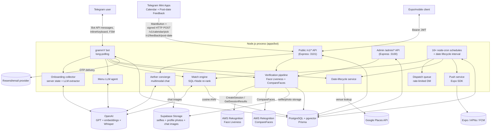

# Gennety Dating — Architecture

> Product logic and user flow are in [PRODUCT_SPEC.md](PRODUCT_SPEC.md).
> Tech stack and coding rules are in [AGENTS.md](AGENTS.md).
> Production deploy instructions are in [deploy.md](deploy.md).
> This file documents durable architecture boundaries. Code, Prisma schema,
> route files, and env loading remain the source of truth for implementation
> details.

## Production Endpoints

The DigitalOcean droplet (`167.172.178.229`) terminates TLS via **Caddy**
(auto-renewed Let's Encrypt). DNS for the `gennety.com` zone lives at Hostinger.

| Subdomain | Reverse-proxies to | Purpose |
|---|---|---|
| `api-admin.gennety.com` | `localhost:3100` | Admin analytics dashboard API (`ADMIN_API_KEY` Bearer auth, `helmet` + IP rate-limit + timing-safe key compare). |
| `dating-api.gennety.com` | `localhost:3101` | Public `/v1/*` API for the native iOS client and the Telegram Mini Apps. |

**Domain isolation:** `api.gennety.com` is owned by a sibling project — never
use it for Gennety Dating. Always pick names prefixed with `dating-` here.

The bot itself runs **long-polling** (grammY `bot.start`) on the same host;
it does not need an inbound subdomain. Telegram delivers updates to whichever
process is currently polling — so prod (`@gennetybot`) and local dev
(`@gennetytestbot`) MUST use different bot tokens.

**No identity-provider webhook.** The Persona era exposed
`/v1/webhooks/persona` here; AWS Face Liveness has no webhook at all — a
session's verdict is read server-to-server inside the client's own `/event`
request, within the session's 3-minute lifetime (PRODUCT_SPEC §1.4).

## Top-Level Topology

```
┌──────────────────┐   ┌──────────────────┐
│ Telegram client  │   │ Expo/mobile API  │
│ (bot + Mini App) │   │  (iOS / Android) │
└────────┬─────────┘   └────────┬─────────┘
         │ Bot API + WebApp     │ HTTPS  (Bearer JWT)
         │ + signed HTTP POST   │
         ▼                      ▼
┌─────────────────────────────────────────┐
│  Node.js process (apps/bot)             │
│  ─────────────────────────────────────  │
│  • grammY bot (long-polling)            │
│  • Express public  API  (:3101)         │
│  • Express admin   API  (:3100)         │
│  • cron workers + date lifecycle tick   │
└─────────────────────────────────────────┘
       │           │            │
       │ pgvector  │ OpenAI     │ External APIs
       ▼           ▼            ▼
┌───────────┐ ┌──────────┐ ┌──────────────────────────┐
│ Postgres  │ │ OpenAI / │ │ AWS Rekognition          │
│ + pgvector│ │ Whisper  │ │ AWS Rekognition (face)   │
│ (Supabase)│ │          │ │ Google Places (venue)    │
└───────────┘ └──────────┘ │ Supabase Storage (media) │
                           │ Resend/email provider    │
                           │ Expo / APNs / FCM (push) │
                           └──────────────────────────┘
```

## End-to-End Architecture Schema


```mermaid
graph TD
    %% ── Clients ────────────────────────────────────
    TG_User[Telegram user]
    Mini[Telegram Mini Apps<br/>Calendar + Post-date Feedback]
    Mobile[Expo/mobile client]

    %% ── Single Node.js process (apps/bot) ──────────
    subgraph Process["Node.js process (apps/bot)"]
      Bot[grammY bot<br/>long-polling]
      PublicAPI["Public /v1/* API<br/>(Express :3101)"]
      AdminAPI["Admin /admin/* API<br/>(Express :3100)"]
      Crons["16× node-cron schedules<br/>+ date lifecycle interval"]
      OnboAgent[Onboarding collector<br/>server state + LLM extractor]
      MenuAgent[Menu LLM agent]
      Aether[Aether concierge<br/>multimodal chat]
      Match[Match engine<br/>SQL+Node re-rank]
      DispatchQ[Dispatch queue<br/>rate-limited DM]
      Verify[Verification pipeline<br/>Face Liveness + CompareFaces]
      DateLC[Date-lifecycle service]
      Push[Push service<br/>Expo SDK]
    end

    %% ── External services ──────────────────────────
    OpenAI[(OpenAI<br/>GPT + embeddings + Whisper)]
    Liveness[(AWS Rekognition<br/>Face Liveness)]
    Rekog[(AWS Rekognition<br/>CompareFaces)]
    Places[(Google Places API)]
    Email[(Resend/email provider)]
    Supabase[(Supabase Storage<br/>selfies + profile photos + chat images)]
    PushSvc[(Expo / APNs / FCM)]

    %% ── Data layer ─────────────────────────────────
    PG[(PostgreSQL + pgvector<br/>Prisma)]

    %% ── Edges: clients ↔ process ───────────────────
    TG_User <-->|Bot API messages,<br/>InlineKeyboard, FSM| Bot
    Mini -->|MainButton +<br/>signed HTTP POST<br/>/v1/calendar/pick<br/>/v1/feedback/post-date| PublicAPI
    Mobile <-->|Bearer JWT| PublicAPI

    %% ── Edges inside process ───────────────────────
    Bot --> OnboAgent
    Bot --> MenuAgent
    Bot --> Match
    Bot --> Verify
    Bot --> DateLC
    Crons --> Match
    Crons --> DispatchQ
    Crons --> DateLC
    Crons --> Push
    PublicAPI --> Aether
    PublicAPI --> Verify
    AdminAPI --> Verify

    %% ── Edges: process → external ──────────────────
    OnboAgent <--> OpenAI
    MenuAgent <--> OpenAI
    Aether <--> OpenAI
    Match <--> OpenAI
    Verify -->|CreateSession / GetSessionResults| Liveness
    Verify -->|CompareFaces| Rekog
    Verify -->|selfie/photo storage| Supabase
    Aether -->|chat images| Supabase
    DateLC -->|venue lookup| Places
    Bot -->|OTP delivery| Email
    Push --> PushSvc

    %% ── Edges: process → DB ────────────────────────
    Bot <--> PG
    PublicAPI <--> PG
    AdminAPI <--> PG
    Crons <--> PG
    Match -->|cosine ANN| PG
    Verify --> PG

    %% ── Webhooks back into process ─────────────────
```

## Process Layout

A **single** Node.js process (`apps/bot`) hosts everything:

- **grammY bot** — long-polling Telegram updates; routes via Composer-based
  handlers (`handlers/router.ts`).
- **Public Express server** on `PUBLIC_PORT` (default `3101`). Mobile client
  consumer; also receives the signed Calendar
  Mini App POST. Refuses to start if `JWT_SECRET` is shorter than 32 bytes.
  Access JWTs are pinned to HS256, issuer `gennety-public-api`, audience
  `gennety-mobile`, and a UUID subject.
- **Admin Express server** on `ADMIN_PORT` (default `3100`). Started only
  when `ADMIN_API_KEY` is set. Bearer-auth + helmet + per-IP rate limit.
- **Background jobs** — 16 `node-cron` schedules (three — ticket-expiry,
  rematch-refund, venue-change-refund — are registered only when their feature
  flag is on) plus the date-lifecycle interval (see *Cron & Workers* below).

Importing `./config.js` is the very first thing `index.ts` does — this
ensures `.env.local` overrides `.env` *before* `@gennety/db` evaluates
`new PrismaClient()` and locks in `DATABASE_URL`.

## Data Models (PostgreSQL + Prisma)

Source of truth: [`packages/db/prisma/schema.prisma`](packages/db/prisma/schema.prisma).
This section is an architectural map, not a manually authoritative schema dump;
when columns diverge, Prisma wins.

### Enums

| Enum | Values |
|---|---|
| `UserStatus` | `onboarding`, `active`, `paused`, `frozen`, `suspended`, `pending_investigation`, `banned`. User-owned changes go only through `services/account-status-transitions.ts`: CAS `active ↔ paused`, transactional `active|paused → frozen`, and CAS `frozen → active`; moderation-owned states cannot be overwritten. Freeze commits match cancellations atomically before external partner effects. |
| `Language` | `en`, `ru`, `uk`, `de`, `pl` |
| `OnboardingStep` | `consent`, `language`, `conversational`, `completed` |
| `Theme` | `light`, `dark` (app-wide UI theme; `dark` is the brand default) |
| `Gender` | `male`, `female` |
| `GenderPreference` | `men`, `women`, `both` |
| `Platform` | `telegram`, `mobile`, `both` |
| `VerificationStatus` | `unverified`, `pending`, `pending_review`, `verified`, `rejected` |
| `MatchRadius` | `campus_only`, `citywide` |
| `MatchStatus` | `proposed`, `negotiating`, `negotiating_venue`, `scheduled`, `cancelled`, `completed`, `expired` |
| `MatchEventActionType` | `PROPOSAL_SHOWN`, `ACCEPTED`, `DECLINED`, `DATE_COMPLETED`, `CHEMISTRY_POSITIVE`, `CHEMISTRY_NEGATIVE`, `EXPIRED_SILENT`, `EXPIRED_PEER_IGNORED` |
| `MessageRole` | `user`, `assistant`, `system` |
| `AiMemoryExportPreference` | `undecided`, `accepted`, `declined` |
| `ProfilerPriority` | `high`, `medium`, `low` |

### `users`

Columns (≈ 35; grouped by purpose):

| Group | Columns |
|---|---|
| Identity | `id`, `telegramId` (unique BigInt — synthetic **negative** id for mobile-only users), `telegramUsername` (public `@handle`, captured opportunistically for `t.me/` coordination links), `email`, `universityDomain`, `firstName`, `surname`, `age`, `gender`, `preference`, `major`, `language`, `platform`. `id` is the only immutable identity: `telegramId` is **re-pointable** by the phone-based login (`services/account-linking.ts`) — a `User.phone` unique collision transfers the sharing Telegram account's id/username onto the row that owns the number, deletes the empty registration row it came from, promotes `platform` `mobile` → `both`, and clears the now-stale `statusMessageId`. Anything caching a `telegramId` must resolve through the DB rather than assume permanence. |
| Lifecycle | `status` (`UserStatus`), `onboardingStep`, `aiMemoryExportPreference`, `aiMemoryExportPreferenceAt`, `hasConsented`, `consentedAt`, `termsAccepted`, `termsAcceptedAt`, `researchOptIn`, `createdAt`, `updatedAt` |
| UI theme | `theme` (`Theme`, default `dark`) — the recipient's chosen app-wide light/dark theme, honored by every Mini App (via the shared `theme.css` tokens) and both server-rendered PNG cards; `themeChosenAt` marks the explicit pick so the onboarding theme step shows once. |
| Email OTP | `emailOtp`, `emailOtpExpiresAt`, `isEmailVerified` |
| Registration v2 | `phone` (unique E.164, written from a trusted Telegram `message.contact` or a verified native-app code), `phoneVerifiedAt` (the general-track contact gate), `registrationTrack` (`student`/`general`, null = pre-fork legacy). Matching admits the union of track-valid cohorts: `general + phoneVerifiedAt`, or `student`/legacy + `isEmailVerified` and a stored email. `phone` is also the **cross-rail login key**: both rails resolve an existing account through it — the mobile side in `findOrCreateMobileUserByPhone` (`public/mobile-user.ts`, which also promotes `telegram` → `both`), the Telegram side in `services/account-linking.ts` (PRODUCT_SPEC §1.1). A collision where both the sharing row and the owning row carry real data is the one case neither rail resolves automatically. |
| Conversational state | `messageHistory` (`Json[]`), `lastMessageAt`, `lastPreMatchAnnounceAt`. AI-memory response bodies are deliberately not retained here: a typed `context_dump` is replaced by a non-sensitive receipt marker after parsing, and on the legacy tool-loop path the advisory `raw_dump` tool argument is stripped from the persisted assistant turn for the same reason. |
| Re-engagement | `reEngagementStep` (0–5), `reEngagementNextAt` |
| Trust & safety | `strikes`, `suspendedUntil` |
| Telegram UI | `statusMessageId` (pinned banner) |
| Push (mobile) | `pushToken`, `pushPlatform` |
| Verification | `verificationStatus`, `personaInquiryId` (unique), `verifiedAt`, `verificationSkippedAt`, `verifiedSelfiePath`, `faceMatchScore`, `faceMatchedAt`, `selfiePath` (legacy). Matching admits only `verified` plus the persisted pre-flip cohort (`unverified` with non-null `verificationSkippedAt`). `personaInquiryId` keeps its historical name but now holds the AWS Face Liveness session id (the provider swap was deliberately schema-free); it stays the `(session, faceMatchedAt)` idempotency marker. `pendingLivenessSessionId` is deliberately a SEPARATE column: it holds the session currently in flight (written at `/init`, cleared at a terminal outcome) purely so `completeLivenessCheck` can refuse a client-supplied session id the user did not mint. It cannot be folded into `personaInquiryId`, which means "the session that produced the stored reference selfie" and is what `triggerVerificationRerun` reruns against — a not-yet-completed session must never land there. Production-like startup fails closed unless liveness is enabled and configured (AWS credentials + `LIVENESS_STS_ROLE_ARN`), verification is mandatory, and Rekognition/profile-media validation are enabled — there is no sandbox escape hatch any more. |
| Attribution | `referralSource` (`tg:start_param` / `mobile:utm=…` / `referral:USER_ID`) |
| Tickets (feature-flagged) | `ticketBalance` — materialized ticket-wallet balance; running sum of `TicketLedger.delta` (see `ticket_ledger`). `ticketDiscountPct` / `ticketDiscountGrantedAt` / `ticketDiscountExpiresAt` / `ticketDiscountConsumedAt` — one-time famine single-ticket discount (PRODUCT_SPEC §3.5b; active ⇔ `pct > 0 AND consumedAt IS NULL AND expiresAt > now`), owned by `services/ticket-discount.ts`. |
| Premium (feature-flagged) | `premiumUntil` / `premiumSince` / `premiumProvider` (`telegram_stars`\|`app_store`\|`referral`) / `premiumAutoRenew` / `premiumExternalId` — Gennety Premium subscription head (PRODUCT_SPEC §3.8 / §Premium). Materialized from the append-only `subscription_ledger`; active ⇔ `premiumUntil > now`. `premiumExternalId` is the recurring anchor (Stars charge id / App Store `originalTransactionId`) used to reconcile renewals + find the owner from a webhook. Owned by `services/premium.ts`; inert-to-write unless `PREMIUM_FEATURE_ENABLED`, but an existing entitlement is honored regardless of the flag. `provider: "referral"` marks a complimentary comp grant (`grantComplimentaryPremiumMonths`) that never sets an auto-renew anchor. |
| Referral (feature-flagged) | `referralVerifiedCount` (referrer's materialized tally of invited friends who cleared verification — the milestone-ladder progress), `referralCountedAt` (invitee-side once-marker: this user was already counted toward their referrer, CAS null→now), `referralInviteePremiumAt` (invitee-side once-marker for the welcome Premium month). Referral program (PRODUCT_SPEC §3.9 / `REFERRAL_PRODUCT_SPEC.md`), owned by `services/referral.ts`; rewards themselves live in `ticket_ledger` (`referral_milestone`) + `subscription_ledger` (`referral`). Inert unless `REFERRAL_FEATURE_ENABLED`. |
| Promo (feature-flagged) | `promoRedeemedAt` — once-marker for the promo welcome gift's wow screen + grant guard. Independent promo-code program (PRODUCT_SPEC §3.10 / `PROMO_CODES_PRODUCT_SPEC.md`), owned by `services/promo.ts`; attribution reuses `referralSource` as `promo:<CODE>` (mutually exclusive with `referral:*`); the reward lands exactly-once in `PromoRedemption` + `ticket_ledger` (`promo`) + `subscription_ledger` (`promo`). Inert unless `PROMO_FEATURE_ENABLED`. |

Indexes: `(status, reEngagementNextAt)`, `(status, suspendedUntil)`.

### `onboarding_progress` (1:1 with `users`)

Server-owned traversal metadata for incomplete onboarding:

| Column | Ownership |
|---|---|
| `completedFields`, `skippedFields`, `askedFields` | Collector state only; never copies personal answers |
| `currentQuestion` | Deterministic next-question key used by Telegram and public/mobile API |
| `collectorVersion`, `backfilledAt` | Rollout and lazy-backfill audit |
| `revision` | Optimistic concurrency guard so simultaneous answers do not lose facts |

Canonical answers remain in `users` and `profiles`. `messageHistory` is an
interface/audit log, not a profile database. Only `user_text` may enter fact
extraction; `resume`, `context_dump`, and `photos_updated` are typed synthetic
events. Backfill reads canonical columns and raw user-authored messages, never
AI summaries, assistant messages, or historical tool arguments.

### `onboarding_step_events`

Append-only onboarding funnel telemetry (one row per step transition), written
best-effort from the collector's post-commit path in
`services/onboarding-analytics.ts` — never inside the save transaction, so a
telemetry failure can't abort a user's onboarding. Columns: `userId`, `step`
(an `ONBOARDING_QUESTIONS` key or `verification`), `kind`
(`asked`/`answered`/`skipped`), `dwellMs` (hesitation on the step = the gap
since its latest `asked`; null on `asked` rows), `language`, `platform`,
`createdAt`. Stores **only** the step key, its outcome, and timing — never the
user's answer text. Drop-off is derived, not stored (a still-`onboarding` user
whose latest `asked` step has no matching resolution is stuck there). Indexed
`(userId, createdAt)` and `(step, kind, createdAt)`; `onDelete: Cascade` from
`users`. Powers `GET /admin/analytics/onboarding-funnel`.

### `profiles` (1:1 with `users`)

Columns (≈ 25):

| Group | Columns |
|---|---|
| Demographics | `userId` (unique), `ethnicity`, `height`, `hobbies` (`String[]`), `partnerPreferences`, `psychologicalSummary` (redacted signal-only AI-memory summary or onboarding fallback; never the raw pasted export), `negativeConstraints`, `ageRangeMin`, `ageRangeMax` (stated preferred-**partner** age band, user-editable post-onboarding; read by the match engine as the soft `V_agePref` multiplier — see [PRODUCT_SPEC.md](PRODUCT_SPEC.md) §3.2) |
| Vector | `embedding` (`vector(1536)`), `embeddingDirty`, `embeddingDirtyAt` |
| Elo | `eloScore` (default 500), seeded from the server-side mean of all per-photo vision scores; `eloMatchesPlayed`; `eloSeededAt`; auditable aggregate/per-photo output in `eloSeedDetails` |
| Photos | `photos` (`String[]` of static Telegram `file_id` or Supabase path), `profileMedia` (`Json[]` structured display media; empty legacy rows normalize from `photos[]`), `referenceFaceEmbedding` (`Json?` legacy self-photo identity-anchor metadata — retained, no longer written by the upload flow since identity moved to liveness-only, 2026-06-23), `uploadedPhotoHashes` (`String[]`, strictly 1:1 with `photos`; perceptual hash or `""` sentinel at every index), `pendingPhotoCandidates` (`Json[]` legacy consensus pool — retained, no longer written), `acceptedPhotoCount` (`Int`), `photoFaceScores` (`Float[]`, 1:1 with `photos`) |
| Geo / radius | `matchRadius` (`campus_only` / `citywide`), `homeCity`, `homeCountryCode`, `homeCityKey`, `homePlaceId`, `latitude`, `longitude`, `locationUpdatedAt`, `timeZone` (IANA, derived from the dating city; drives the Profiler's local-time batch windows). `homeCityKey` must be a **launched market** (`packages/shared/src/markets.ts`; PRODUCT_SPEC §1.3) — `validateHomeLocationPayload` (`public/home-location.ts`) is the single writer and canonicalizes name + coordinates from the market, so Telegram and the `/v1/*` API are gated by one check. Rows created before that gate keep their city and are offered a one-tap move (`handlers/menu/city-switch.ts`). |
| Match priority | `lastMatchedAt`, `missedWeeks`, `standbyCount`, `lastMissedAt`, `silentIgnoreCount`, `starvationPausedAt` (nullable; stamped only by the D10 pool-exhaustion auto-pause — `services/pool-exhaustion.ts` — never by an ordinary user-chosen menu pause, so `autoResumeStarvedUsers` only ever probes accounts it paused itself; see PRODUCT_SPEC.md §3.1b) |
| Profiler (Phase 1b) | `profilerStartedAt`, `profilerNextAt`, `profilerActiveQuestionId`, `profilerBatchRemaining`, `profilerAnswerWindowUntil`, `profilerQuestionMessageId` — scheduler + capture state for the post-onboarding Q&A batches that fuel icebreakers/hints (see [PRODUCT_SPEC.md](PRODUCT_SPEC.md) §Phase 1b). `profilerActiveQuestionId` is the concurrency token: every answer/skip claims it with a compare-and-set, so exactly one reply resolves a question. `profilerNextAt` is dual-purpose — the next batch window while idle, and the **stall deadline** of the question currently in flight (6 h), which is what lets the worker reclaim a question the user never answered. `profilerAnswerWindowUntil` is the much shorter (90 min) deadline for *implicitly* treating plain text as that question's answer; it is cleared the moment the user does anything else, so an active question can never swallow an unrelated message meant for the menu agent. `profilerQuestionMessageId` anchors the question message, so an explicit Telegram reply is still recognised after the window closed, a resolved question can have its Skip keyboard stripped, and a question reclaimed as an implicit skip can be **deleted** — otherwise a dead question keeps sitting in the chat inviting an answer nothing can route (PRODUCT_SPEC §Phase 1b). Indexed `@@index([profilerNextAt])` for the worker sweep. |
| Vibe (matching) | `fridayVibeText`, `vibeFocusText` (raw onboarding §1.3 answers), `energyAxis` / `orientationAxis` (`Float?` `[-1,1]`, scored by `V_research` quadrant proximity), `socialRole` (`String?` initiator/participant/observer — whitelist-validated in app code, **stored but not scored** in v1), `anchorTags` (`String[]`), `vibeExtractedAt`. Written at finalize by `services/vibe-axes.ts`; the raw Friday text is also folded into `psychologicalSummary`. See [PRODUCT_SPEC.md](PRODUCT_SPEC.md) §1.3 / §3.2. |
| Audit | `createdAt`, `updatedAt` |

### `matches`

Columns (≈ 40). Drives the entire matching → scheduling → date lifecycle. See
[PRODUCT_SPEC.md](PRODUCT_SPEC.md) §3–4 for the state machine.

Application invariant: a user occupies at most one live row across `proposed`,
`negotiating`, `negotiating_venue`, and `scheduled`. Eligibility queries exclude
both match relations, and `createProposedMatch` locks both user rows in sorted
order before re-checking and inserting. If legacy/corrupt data contains several
live rows, all current-match surfaces choose explicitly by product progression:
`scheduled` → `negotiating_venue` → `negotiating` → `proposed` (newest wins ties),
never by PostgreSQL enum declaration order.

| Group | Columns |
|---|---|
| Identity | `id`, `userAId`, `userBId`, `status` (`MatchStatus`), `createdAt`, `updatedAt` |
| Pitch & synergy | `pitchForA`, `pitchForB`, `synergyScore` (pair-level, clamped 70–99), `synergyReason` / `synergyReasonB` (the 1–2 sentence rationale, stored **per side in that side's own language** like the pitches — `synergyReason` is A's, kept under the original name for legacy rows + the founder report; a null `synergyReasonB` falls back to A's at render. See [PRODUCT_SPEC.md](PRODUCT_SPEC.md) §3.3) |
| Decision (blind invariant) | `acceptedByA`, `acceptedByB` (tri-state `null`/`true`/`false`), `rejectionReasonA`, `rejectionReasonB`, `dispatchedAt`, `pitchMessageIdA`, `pitchMessageIdB` |
| Peer-wait shimmer (§3.6b) | `peerWaitMessageIdA/B` + `peerWaitEditedAtA/B` — the FALLBACK line only, for clients that cannot render a `<tg-thinking>` draft. The rich path needs no column: the draft is ephemeral and simply stops being re-issued when the wait ends. The fallback is a real message that must be edited as the wording climbs and deleted when the wait ends, so its id has to survive a PM2 restart — an in-memory map would strand a permanent "waiting for them…" line in the chat after any deploy. `peerWaitStartedAtA/B` is the **per-side wait anchor** the five-tier wording ladder is measured from; nothing else in the row answers "how long has this side been waiting" (`acceptedByA/B` are booleans, `availableTimesA/B` carry no submission time, `updatedAt` moves for unrelated reasons). All four are written only by `workers/peer-wait-shimmer.ts` — single-writer on purpose, so the action handlers that kick off a shimmer cannot race it; they render tier 1 unconditionally, which is true by construction since they fire the instant the user commits. The anchor is RELEASED when a wait ends, so a later wait on the same match restarts at tier 1 instead of opening on the 24h deadline copy. |
| Calendar scheduling | `proposedTimes` (`DateTime[]`, server-side allowlist of valid slots: 6 dates × 14 slots/date, every 30 min from 13:00 to 19:30 — also the "is the calendar actually open?" signal the peer-wait predicate reads, since `ticketStatus` defaults to `pending` even with tickets off), `availableTimesA`/`availableTimesB` (`DateTime[]`, each side's marked availability), `agreedTime` (set after a single exact overlap is agreed; multi-overlap is confirmed in the Mini App), `calendarMessageIdA/B` (current Telegram post-accept CTA per side: accepted/waiting, Date Ticket, or Calendar; edited on status changes and cleared after agreement). `schedulingIteration` and `pickedTimeA/B` are deprecated — retained for backwards-compat with in-flight rows mid-deploy and will be dropped in a follow-up cleanup migration. |
| Concierge venue | `vibeTextA`, `vibeTextB`, `vibeLatA/LngA`, `vibeLatB/LngB`, `vibeAddressA/B` (Mini App map-picker label), `parsedCategoryA`, `parsedCategoryB`, `venueName`, `venueAddress`, `venueLat`, `venueLng`, `venueGoogleMapsUri`, `venuePhotoName` (the single venue-imagery source: a Google Places photo resource name, rebuilt to a media URL at date-card render with the server-side key, never persisting Google's bytes; curated venues get theirs resolved from their stored `placeId` at assignment via `fetchPlacePhotoName`), `venuePhotoUrl` (**retired 2026-07-25**, no longer read/written), `venuePromptAskedAt` |
| Date lifecycle | `icebreakersSentAt`, `iceBreakersA`/`B` (`String[]`), `safetyNoteSentAt`, `safetyAckA`/`B`, `wingmanHintA`/`B`, `wingmanSentAt`, `emergencyCancelledBy`, `emergencyReason`, `feedbackByA`/`B`, `feedbackPromptedAt`, `dateCardFileIdA`/`B` (Telegram `file_id` cached per side for My Date; that side is cleared transactionally on language/theme change, and cache writes compare the rendering language/theme against the current participant so a concurrent stale render cannot repopulate it) |
| Nudges | `nudge1SentAt`, `nudge2SentAt` (legacy), `proposalNudge1SentAt`, `proposalNudge2SentAt`, `schedNudge1SentAt`, `schedNudge2SentAt`, `proposalDeadlineNudgeSentAt` (idempotency for the single deadline-anchored "window closing" DM ~2h before the 24h TTL — see [PRODUCT_SPEC.md](PRODUCT_SPEC.md) §3.5), `venueNudge1SentAt`/`venueNudge2SentAt` (the same 6h/12h pair for the venue step, which had no reminder at all) |
| Planning stall (§3.5c) | `schedulingOpenedAt` — when `startScheduling` actually opened the Calendar, and the anchor every scheduling-phase reminder counts from (it replaced `dispatchedAt`, which also covers the up-to-24h decision window, so a late-accepting pair could get "pick a time" seconds after the Calendar card; null rows fall back to `dispatchedAt`). `stallCheckInSentAtA/B` + `stallConfirmedAtA/B` — the "still in?" question and its 🟢 answer, **per side** unlike every nudge column above, because both participants can independently go quiet and each needs their own question and answer. A confirmation is only eligible when it predates the question it answers, which is what makes each sent question confirmable exactly once (a stale green tap can't keep pushing the 48h deadline). Owned by `services/match-stall.ts`; driven by the existing hourly `match-nudge` cron. |
| Date Ticket (feature-flagged) | `ticketPriceCents`, `ticketPaidA/B`, `paidForPartnerByA/B`, `partnerPaidSeenAt` / `partnerPaidNudgedAt` (goodwill-cover read-receipt: first-seen stamp gating the payer's "she saw it ❤️" DM, and the completion-nudge guard — §3.5b), `ticketStatus` (`pending`/`partial`/`completed`/`refund_pending`/`refunded`/`expired` — string, not a Prisma enum), `ticketExpiresAt`. `refund_pending` is the durable retry boundary: scheduling opens only after the provider/wallet reversal succeeds. Monetization sub-state machine that runs while `status = negotiating`; inert when `TICKET_FEATURE_ENABLED` is off. See [PRODUCT_SPEC.md](PRODUCT_SPEC.md) §3.5b. |
| Pre-date coordination (feature-flagged) | `coordOfferSentAt`, `coordInitiatorId`, `coordMethod` (`share_self`/`request_partner`/`proxy` — string, not a Prisma enum), `coordChosenAt`, `coordPartnerConsent` (Variant B only), `coordResolvedAt`, `proxyOpenedAt`, `proxyClosesAt`, `proxyClosedAt`. Sub-state machine running on a `scheduled` match; inert when `COORDINATION_FEATURE_ENABLED` is off. See [PRODUCT_SPEC.md](PRODUCT_SPEC.md) §Phase 4. |
| Allocation source (feature-flagged) | `source` (`weekly`/`rematch` — string, not a Prisma enum; default `weekly`, stamped INSIDE the creating transaction by `createProposedMatch`), `rematchPaidById` (the buyer of a paid on-demand run; null for weekly pairs). Weekly-optimizer analytics filter to `source = 'weekly'` so on-demand runs never bias the scoring A/B. See [PRODUCT_SPEC.md](PRODUCT_SPEC.md) §3.11 / `REMATCH_PRODUCT_SPEC.md`. |
| Venue change v2 (feature-flagged) | `venueChangeStatus` (null/`liking`/`agreed`/`settled`/`lapsed` — string, not a Prisma enum), `venueChangeProposerId`/`ProposedAt` (session initiator — first like / express mint), `venueLikesA/B` (`Json[]` server-resolved like snapshots), `venueChangeName`/`Address`/`Lat`/`Lng`/`MapsUri`/`PlaceId`/`PhotoUrl`/`PhotoName` (agreed venue snapshot), `venueChangeExpiresAt` (payment deadline)/`ResolvedAt`, `venueChangePaidById`/`PaidAt` (settle stamp), `venueChangePayDeclinedAt` (vestigial v2 — his decline now ENDS the change/closes the session rather than stamping a lingering `agreed` state, so this is no longer written or read for a decision), `venueChangeOfferPaySentAt` (wish-card guard), `venueChangePingSentToA/BAt` (board-invite guards), `venueChangeExpressAt` (her hidden unilateral mint), `venueChangeTier` (`base`/`premium` of the agreed venue, stamped at agreement — drives the §Premium fee waiver: a premium venue, or a base venue settled by a premium user, is free), `venueChangeComment` (legacy v1, no longer written). Paid multiplayer venue-board sub-state on a `scheduled` match — a lapse never cancels the match; inert when `VENUE_CHANGE_FEATURE_ENABLED` is off. See [PRODUCT_SPEC.md](PRODUCT_SPEC.md) §3.7b / §3.8. |

Indexes: `(status, createdAt)`, `(userAId, userBId)`, `(ticketStatus, ticketExpiresAt)` (ticket-expiry cron sweep), `(status, coordOfferSentAt)` (coordination offer sweep), `(coordMethod, proxyClosedAt)` (proxy open/close sweeps), `(venueChangeStatus, venueChangeExpiresAt)` (venue-change expiry sweep), plus the functional
`matches_pair_canonical_idx` on `LEAST/GREATEST(user_a_id, user_b_id)` —
created out-of-band by `ensureMatchPairIndex()` at boot — that backs the
**lifetime ban** anti-join (a user never sees the same partner twice).

### `match_score_logs` (1:1 with `matches`)

Frozen score breakdown captured at match creation — `scoreExplicit`,
`scoreResearch`, `scoreLeague`, `scorePenalty`, **`scoreAgePref`** (stated
preferred-partner age-band multiplier; defaults to `1` so rows logged before the
factor existed read as neutral), `scoreTotal`,
`embeddingDistance`, `starvationBonus`. Powers
`/admin/analytics/algorithm` so component weights can be A/B-tuned without
scanning the hot `matches` table.

Embedding freshness is fail-closed. Embedding-feeding edits mark the profile
dirty and attempt a 30-second user-scoped refresh. `runWeeklyBatch()` first
processes a snapshot of the entire dirty backlog (independent of the periodic
worker's 20-row cap) through a bounded parallel pool, then eligibility requires
`embeddingDirty = false` in both Prisma and raw-vector paths. The vector update
compares `embeddingDirtyAt` *and* the captured embedding-source fields, so an
edit that lands in the same timestamp millisecond cannot be cleared by an older
generation. Preflight logging is aggregate-only (`scanned/refreshed/failed/
stillDirty`), and excluded dirty users never enter standby accounting.

### `match_events`

Append-only audit trail (`actionType` ∈ `MatchEventActionType`). Drives regular
Elo updates, expiry telemetry, and the dashboard's "ignored you" counter.
Emergency cancellation's small peer boost is applied directly by
`handlers/date/emergency.ts`, not through `match_events`. Indexed by
`(matchId, createdAt)`, `(actorId, createdAt)`, `(targetId, createdAt)`,
`(actionType, createdAt)`.

### `reports`

Post-match user-vs-user reports. LLM-triaged into `tier` 1/2/3
(`reasonSummary` is the distilled rationale). `adminReviewed` flips on the
manual-queue clear. Unique `(reporterId, matchId)` blocks duplicates. See
[PRODUCT_SPEC.md](PRODUCT_SPEC.md) §5 for tier policy. Tier 2/3 status changes
and cancellation of every in-flight match are committed in the same database
transaction; partner compensation and Telegram/Expo notifications run only
after commit and never weaken the cancellation safety gate.

### `email_otps`

Mobile-side OTP store. **Distinct from `users.emailOtp`**: keyed by `email`
(not `userId`) because mobile users start the funnel before a `User` row
exists. `code` is bcrypt-hashed; raw is only delivered via the email provider. Tracks
`attempts` and `consumedAt` for replay protection. Request creation takes a
transaction-scoped PostgreSQL advisory lock keyed by normalized email, so
concurrent requests across processes cannot bypass the resend cooldown or send
multiple competing codes.

### `live_activity_tokens`

APNs push tokens for the native app's Live Activities (ActivityKit). One row
per (user, `activityType` ∈ `match_decision`/`date_day`, `kind` ∈
`start`/`update`), unique composite — the single-live-match invariant means a
user never runs two activities of one type, so re-registration upserts in
place. A token APNs reports dead is deleted so the next activity re-registers
cleanly. `onDelete: Cascade` from `users`. Written by
`public/routes/live-activity.ts`; consumed by
`services/push.ts → sendLiveActivityUpdateToUser`.

### `phone_otps`

Native-app phone-code challenges (Registration v2 general track on iOS —
the Telegram one-tap `message.contact` rail doesn't exist there). Twin of
`email_otps`, keyed by E.164 `phone` (the funnel starts before a `User` row
exists). `provider` records the delivery rail: `telegram_gateway` stores our
own bcrypt `codeHash` (verified locally), `twilio_verify` delegates code
generation/checking to Twilio (`codeHash` null, `providerRequestId` = the
Verification SID). `attempts`/`consumedAt` mirror the email OTP state
machine; per-phone creation is serialized with a transaction-scoped advisory
lock, and a durable per-phone daily cap backs the in-memory rate limiter.
Indexed `(phone, createdAt)`. Written by
`services/phone-verification.ts`; consumed by `public/routes/phone-auth.ts`.

### `user_sessions`

Active mobile refresh tokens. Access JWTs are stateless; refresh tokens are
hashed here for server-controlled rotation/revocation.

### `bot_sessions`

grammY session adapter persistence (Prisma-backed). Keyed by Telegram chat id.

### `system_knowledge`

Curated knowledge entries surfaced to the menu/onboarding agents. Each row:
`key` (unique), `title`, `content`, `category`, `priority`, `active`.

### `messages`

Aether concierge multimodal chat history (one row per turn, with optional
`imageUrl` pointing at an opaque Supabase Storage path — renderers mint
short-lived signed URLs). Distinct from `users.messageHistory` which the
legacy onboarding/menu agents still use.

### `proxy_messages`

Append-only audit log of every text message relayed through a Variant C
pre-date **anonymous proxy chat** (`matchId`, `senderId`, `body`, `createdAt`;
`onDelete: Cascade` from `matches`). Backs the moderation trail that justifies
the time-boxed carve-out to the "NO IN-APP CHAT" invariant — relayed content is
fully logged and each relayed message carries an in-line Report button. Written
by `handlers/date/coordination.ts`; inert unless `COORDINATION_FEATURE_ENABLED`.

### `chat_events`

Append-only timeline of what actually happened in a user's Telegram chat: every
durable message the bot SENT (`direction = out`) and every action the user TOOK
(`direction = in`) — typed text, a voice note's transcript, a button tap, a Mini
App submission, a settled Stars payment. Columns: `userId` (cascade),
`direction`, `kind` (`text`/`photo`/`album`/`video`/`video_note`/`voice`/
`document`/`user_text`/`user_voice`/`user_media`/`user_contact`/`callback_tap`/
`mini_app_action`/`payment`), `surface` (coarse product area derived from
callback prefixes / Mini App page), `summary` (truncated to 300 chars),
`actions` (`Json?` — the buttons offered: `[{label, data?, webApp?}]`),
**`media`** (`Json?` — the attachments: `[{kind, ref}]`, where `ref` is a
Telegram `file_id` the admin media proxy can re-download; never the bytes),
`telegramMessageId`, `matchId` (free-form, no FK — mirrors `rematch_purchases`),
`createdAt`. Indexed `(userId, createdAt)` and `(telegramMessageId)`.

**`media` is read from the API RESULT, not the request payload** (added
2026-07-31). Much of the product's media goes out as raw bytes — a
satori-rendered date card, a bundled кружок, a generated voice note — so the
outgoing payload carries no `file_id` at all; Telegram assigns one on the way
back. Reading the result is therefore the only capture point that works for
every send, and it is what makes `GET /admin/media?type=telegram&ref=…` able to
show the image weeks later. Video, video note, animation and sticker store
their POSTER frame rather than the moving file, because that proxy streams
images; a voice note stores `{kind}` with no `ref`, which still tells the admin
transcript one was sent. Before this the table recorded only the sentence
("(photo card, no caption)", "sent a photo"), so the admin dialog reader could
say that something visual happened and never show it — every image in every
conversation was invisible.

It exists because the menu agent could not see its own product. Outbound
messages are written from ~276 scattered call sites while `User.messageHistory`
only ever held the agent's own turns, so a user answering "why?" directly under
a bot message was answered against conversation from days earlier (PRODUCT_SPEC
§2.1). Read back by `services/prompt-builder.ts` as the agent's "Recent chat
timeline" (last 12 events per turn).

**It is untrusted input to a tool-calling prompt, and treated as such.** The
rows are rendered inside an explicit data fence whose standing rule is that
nothing within it is an instruction; `renderChatTimeline` neutralises the fence
marker and markdown headings in every field it emits (summaries AND button
labels) so a row cannot close the block early and have the remainder read as
prompt. The bodies that a *different* user authored never reach the table at
all: `withRedactedSummary` (`services/outbound-recorder.ts`) makes the verbatim
emergency-cancellation relay and the proxy-chat relay store a neutral marker
instead of the text. Both matter because the reader's own menu agent holds
tools that write to the reader's profile.

**Written at three boundaries, not per call site:**

| Boundary | Module | Covers |
|---|---|---|
| grammY **API transformer** on `bot.api` | `services/outbound-recorder.ts` | Everything the bot sends — handlers, cron workers, the date lifecycle, Mini App routes — because they all share the one `Api` (`setMainBotApi(bot.api)`). |
| Inbound **middleware** (after `botRateLimit`) | `handlers/interaction-recorder.ts` | Typed text, media, contact share, and button taps — stored by the button's own visible label, resolved from the message's `reply_markup`. |
| Explicit calls in `/v1/*` initData routes | `recordMiniAppAction` | Mini App submissions (venue-change board, calendar picks, venue intent, ticket use, post-date feedback), which never touch the chat. |

Only `send*` methods are recorded: every `edit*` is skipped because the pinned
status banner and the pitch's reply-deadline button re-render **every minute per
user**. Ephemeral sends are excluded two ways — `withEphemeralSends` marks the
self-deleting "thinking" status beats (`services/ai-stream.ts`), and a
`deleteMessage` deletes the row it created, so an untagged path self-heals. A
stream that edits one message through several chunks marks its transient send
ephemeral and records the FINAL text once via `recordOutboundMessage`.

**Recording covers every real Telegram chat from `/start` onward** (founder
decision 2026-07-31, PRODUCT_SPEC §2.1). It used to begin only at
`onboardingStep = 'completed'`; the cost was that registration was the one
stretch of the conversation the admin dialog reader could not see. Two
consequences the code depends on:

- The `chatId → user` cache keeps a **hit** for 5 minutes but a **miss** for
  only 10 seconds. The first `/start` reaches the inbound recorder before the
  handler that creates the `User` row, so it resolves to "no such user";
  caching that for the full TTL would silently discard the next five minutes of
  that chat, i.e. most of registration.
- `resolveChatTarget` no longer reads `onboardingStep` at all — a row existing
  is the whole test. `invalidateChatTarget` survives as the seam for a chat
  that changes owner (the phone-based account adoption in
  `services/account-linking.ts` re-points a `telegramId` at a different row).

Every write is fire-and-forget and swallows its errors: the recorder sits in
the path of every outgoing Telegram call and must never fail a send. Swept
after 30 days by `workers/retention.ts`, which is also what bounds retention of
the onboarding-era content this scope now admits (a typed OTP code; a ≤300-char
excerpt of a pasted AI-memory export — the phone number itself is never stored
here, only the fact of the contact share).

### `media_validation_rejections`

Append-only audit of upload-time profile-media rejections. Stores only
`userId`, coarse `mediaType` (`photo`/`video`), `rejectionReason`, and
`createdAt`; raw media, hashes, provider payloads, face crops, and biometric
material are never persisted here. Written by the photo/video validation
wrappers before a rejected asset can be committed to `profiles`.

### `ticket_ledger` (feature-flagged)

Append-only audit of every ticket-wallet movement or payment/refund transition
(`userId`, `delta`, `reason` ∈ `photo_bonus`/`video_bonus`/`student_bonus`/
`referral_milestone`/`promo`/`welcome_gift`/`store_purchase`/`spend_match`/`refund`/`gate_payment`/
`gate_processing`/`gate_settled`/`gate_surplus_pending`/
`gate_refund_pending`/`gate_refunded`, plus the retired legacy
`verification_bonus` that survives only on historical rows and is never written
anymore, optional
`matchId`/`amountCents`/**`amountStars`**/`bundleSize`/`externalPaymentId`,
`createdAt`;
`onDelete: Cascade` from `users`). The running sum of `delta` equals
`User.ticketBalance`, which is materialized for fast reads; both are written in
the same transaction by `services/ticket-wallet.ts`. Photo/video onboarding
bonuses are idempotent via `Profile.photoBonusTicketAt` / `videoBonusTicketAt`;
the first-pitch welcome gift and the Registration v2
student bonus (+2 at university-email verification) use a serializable ledger
claim on `welcome_gift` / `student_bonus`.
**`externalPaymentId`** is either the unique provider charge id (Telegram Stars
`telegram_payment_charge_id`) for a paid store/date-gate purchase or a synthetic
id for an exactly-once wallet reversal. The synthetic forms in use are
`wallet-expiry-refund:<matchId>:<payerId>` (the §3.5b expiry rail) and
`refund:match:<matchId>:<userId>:<slot>` — the **dead-match refund**
(`services/ticket-refund.ts`, PRODUCT_SPEC §3.5b): when a live match dies before
the date, every paid slot returns to its payer as a wallet ticket, and the unique
index is what makes that exactly-once across the six paths that can trigger it
(freeze / hard delete / moderation via `cancel-in-flight-matches.ts`, emergency
cancellation, and both §3.5c stall endings). One row per slot, so a payer who
covered both sides gets two rows and a partial failure stays resumable. The
planner deliberately stands down on `ticketStatus ∈ {refunded, refund_pending,
expired}`, which the expiry rail owns. For the date gate, zero-delta
`gate_payment` rows retain the charge needed by `refundStarPayment`; their
settlement reason advances atomically with the match-slot CAS to `gate_settled`
or a durable refund/surplus state. The hourly worker retries pending provider
refunds and wallet credits; a `gate_payment` row still unprocessed after five
minutes is treated as an abandoned pre-transaction charge and safely refunded.
**`amountStars`** (added 2026-08-01) freezes the Stars actually charged on a
paid row, exactly as `rematch_purchases` / `venue_change_purchases` already do.
Star prices are env-tunable (`TICKET_BUNDLE_STARS`), so a reader must never
re-derive a historical price from `bundleSize`; before it, a Stars purchase
recorded no money figure at all and the admin revenue view had nothing to show.
Nullable — free grants, spends, and the App Store rail (which carries
`amountCents`) leave it null, and rows predating the column keep reading as
"price unknown" rather than as zero.
Indexed `(userId, createdAt)`.
Inert unless `TICKET_FEATURE_ENABLED`. See [PRODUCT_SPEC.md](PRODUCT_SPEC.md) §3.5b.

### `subscription_ledger` (feature-flagged)

Append-only audit of every Gennety Premium subscription movement (`userId`,
`provider` ∈ `telegram_stars`/`app_store`/`referral`/`promo` (the last two
complimentary comp grants — referral / promo-code rewards, no auto-renew anchor), `event` ∈
`started`/`renewed`/`cancelled`/`expired`/`refunded`, unique `externalPaymentId`,
`periodStart`/`periodEnd`, `amount`/`currency`, optional `note`, `createdAt`;
`onDelete: Cascade`
from `users`). Mirrors `ticket_ledger`: the unique `externalPaymentId` (the
Telegram Stars recurring charge id, or `appstore:<transactionId>`) makes provider
redelivery exactly-once, so a renewal is applied at most once. `User.premiumUntil`
/ `premiumSince` are the materialized head, written in the same transaction by
`services/premium.ts`. `note` is the free-text churn reason captured after an
in-chat cancellation (the menu agent's `offer_cancel_premium` flow →
`recordInChatCancellation` + `attachCancellationReason`, PRODUCT_SPEC §3.8); it
is only ever set on `cancelled` rows. The Stars rail settles through the
`sub:premium`
`successful_payment` path; the iOS rail through `services/appstore-premium.ts`
(`POST /v1/premium/appstore/transaction` + the App Store Server Notifications
webhook, owner found by the `originalTransactionId` anchor on
`User.premiumExternalId`). Indexed `(userId, createdAt)`. Inert unless
`PREMIUM_FEATURE_ENABLED`. See [PRODUCT_SPEC.md](PRODUCT_SPEC.md) §3.8 / §Premium.

### `promo_codes` / `promo_redemptions` (feature-flagged)

Independent promo-code program (PRODUCT_SPEC §3.10 / `PROMO_CODES_PRODUCT_SPEC.md`,
gated by `PROMO_FEATURE_ENABLED`; owned by `services/promo.ts`). `promo_codes` is
ONE reusable campaign code (`code` unique + uppercased, per-code `ticketReward` /
`premiumMonths`, nullable `maxRedemptions` cap, materialized `redeemedCount`,
`expiresAt`, `active`, `note`) shared in ad materials; managed out-of-band by
`scripts/promo-codes.mjs`. `promo_redemptions` is the exactly-once + cap-safe
audit/guard: a unique `userId` (one code per human, first-touch) and
`@@unique([promoCodeId, userId])`, created in the same transaction as the atomic
guarded `redeemedCount++`. Reward deltas live in the ledgers (`ticket_ledger`
`promo`, `subscription_ledger` `promo`) via unique `externalPaymentId`
`promo:<codeId>:<userId>`. Attribution reuses `User.referralSource` as
`promo:<CODE>` (mutually exclusive with `referral:*`); `User.promoRedeemedAt` is
the wow-screen once-marker. iOS deferred-deep-link attribution uses an in-memory
TTL fingerprint→code store (`services/promo-attribution.ts`, coarse IP+UA+lang
hash, one-shot match), matching the single-process `usage-limiter` pattern.
`onDelete: Cascade` from `promo_codes` / `users`. Inert unless
`PROMO_FEATURE_ENABLED`. See [PRODUCT_SPEC.md](PRODUCT_SPEC.md) §3.10.

### `rematch_purchases` (feature-flagged)

Append-only audit of every paid Rematch (PRODUCT_SPEC §3.11 /
`REMATCH_PRODUCT_SPEC.md`, gated by `REMATCH_FEATURE_ENABLED`; owned by
`services/rematch.ts` + `services/rematch-refund.ts`). Mirrors `ticket_ledger`:
the unique `externalPaymentId` (Telegram Stars `telegram_payment_charge_id`)
makes a redelivered `successful_payment` exactly-once **and** preserves the
charge key `refundStarPayment` needs later. Columns: `userId`, `status`
(`processing` → `settled` | `refunded_no_candidate` | `refunded_ineligible` |
`refund_failed` — string, not a Prisma enum), `amountStars`/`amountCents` (price
frozen at purchase), `resultMatchId` (free-form, no FK, so deleting a match never
breaks the payment trail), `framing` (which gift framing the partner's pitch
used), `resolvedAt`/`refundError`, `createdAt`. Rows are written ONLY from the
`successful_payment` trust boundary, and written **before** the engine runs, so a
crash mid-run still leaves a durable record that money moved; the hourly
`rematch-refund` sweep refunds rows stranded in `processing`. There is **no
materialized head on `User`** — the rate limits are derived from these rows, so
there is no counter that can drift out of sync with the money. Indexed
`(userId, createdAt)` (limit lookup) and `(status, createdAt)` (sweep).
`onDelete: Cascade` from `users`. Inert unless `REMATCH_FEATURE_ENABLED`.

### `venue_change_purchases` (feature-flagged)

Append-only audit of every paid venue change (PRODUCT_SPEC §3.7b, gated by
`VENUE_CHANGE_FEATURE_ENABLED`; owned by `handlers/matching/venue-change.ts` +
`services/venue-change-refund.ts`). Deliberately a table of its own rather than
`ticket_ledger` rows: a venue change is a one-off purchase, not a wallet
movement, so it follows `rematch_purchases` rather than the date gate.

Columns: `userId`, `matchId` (free-form, no FK, so deleting a match never breaks
the payment trail), `status` (`processing` → `settled` | `refunded_race` |
`refunded_stale` | `refund_failed` — string, not a Prisma enum), unique
`externalPaymentId` (the Telegram Stars `telegram_payment_charge_id`),
`amountStars` (frozen at purchase — `VENUE_CHANGE_STARS` is env-tunable),
`resolvedAt`/`refundError`, `createdAt`. Indexed `(userId, createdAt)` and
`(status, createdAt)` (sweep). `onDelete: Cascade` from `users`.

The row is written from the `successful_payment` trust boundary **before** the
`agreed → settled` CAS, so a crash mid-settle still leaves a durable record that
money moved, which the hourly `venue-change-refund` sweep refunds. The unique
charge id is also what distinguishes the two "the CAS claimed nothing" cases: a
`P2002` on insert is a redelivered payment (idempotent no-op), while a
successful insert is a genuinely second charge and must be refunded. Before this
table existed both looked identical and a second charge from the same payer was
silently kept, while a failed refund lost the Stars with no row to reconcile
from. Inert unless `VENUE_CHANGE_FEATURE_ENABLED`.

### `profiler_answers`

One row per (user, Profiler question) — `questionId`, `priority`
(`ProfilerPriority`), `answerText`, `skipped`, `skipReturned`, `cycleId`;
`@@unique([userId, questionId])`, `onDelete: Cascade` from `users`. `cycleId`
carries the drop cycle the row was last written in, which is also what makes a
**situational** question (`refresh: "cycle"` in the bank) eligible to be asked
again next cycle — its new answer overwrites the row, since only the current
snapshot is useful icebreaker fuel. Backs the
Phase 1b Profiler (see [PRODUCT_SPEC.md](PRODUCT_SPEC.md) §Phase 1b): timed
post-onboarding Q&A that is the **primary source** for icebreakers
(`date-lifecycle.ts`) and wingman hints (`wingman-hint.ts`).
Deliberately NOT read by the matching engine. Written by
`handlers/profiler/router.ts` + `services/profiler.ts`; scheduled by
`workers/profiler.ts`. The question bank is first-party data in
`packages/shared/profiler-questions.ts`.

### `no_match_notices`

Audit row for the empathetic "no match this week" DM. `tier` is the
consecutive-famine count; `dropDate` is truncated to the UTC day of the cron
firing, and `(userId, dropDate)` is unique — both an idempotency guard and
the data source for the dashboard's churn-warning trend.

### `founder_reports`

Snapshot of a weekly founder matches report (feature-flagged ops feed, gated by
`FOUNDER_NOTIFY_ENABLED`). Built after the Thursday batch by
`notifyFounderWeeklyMatches` (`services/founder-notify.ts`) and read by the
tokenized report page (`GET /v1/founder/report/:token`). Columns: `token`
(unique crypto-random URL token = the page's sole authorization, never logged),
`weekOf` (UTC day of the batch), `dataJson` (the assembled `WeeklyMatchesReport`
snapshot — pairs + user cards + photo refs; **never** `psychologicalSummary` /
AI-memory dumps), `expiresAt`, `createdAt`. Indexed `(createdAt)`.
`expiresAt` (added 2026-07-26) bounds how long a leaked link is worth anything:
the token is the sole authorization AND rides in the URL, so it also lands in
reverse-proxy access logs and browser history. New rows get 90 days; a **null**
means never-expires, so rows predating the column keep working. Both the page
and its media proxy check it. Standalone model (no user
relation); PII lives only in the snapshot. Because no foreign key can cascade
into JSON, the shared account-deletion service explicitly deletes every report
whose snapshot contains the departing `userId` before deleting the User row.

### `curated_venues`

First-party, hand-curated first-date venues currently scoped by
`universityDomain`. This is the **primary** source for the concierge venue picker
when a same-domain venue pool exists; Google Places is the fallback for
cross-domain city matches (see [PRODUCT_SPEC.md](PRODUCT_SPEC.md) §3.7). Standalone model (no user
relation) — the venue pool is now first-party data we own, not a per-request
Places lookup. Columns: `name`, `address`, `lat`, `lng`, `googleMapsUri`,
`category` (validated against the shared whitelist in app code, not a Prisma
enum), `priority` (1 best … 3 acceptable), `tier` (`base`/`premium`/
`alternative`, whitelist-validated in app code — a `premium` venue may exceed
the ≤ MODERATE price cap and is shown-but-locked in the venue-change board
unless a participant has Gennety Premium; an `alternative` venue is the
operator's heavier-cuisine pool (Georgian / Uzbek / Azerbaijani /
Middle-Eastern / Central-Asian), board-only but unlocked and ungated by
Premium — a cuisine classification, not a price tier; the auto-assign picker
reads only quality-qualified `base` rows with positive non-premium price
evidence for commercial/admission venues, so neither non-base tier is held to
the student price cap; PRODUCT_SPEC §3.7 / §3.7b / §3.8), `vibeTags`, `active`,
`lastVerifiedAt`, plus `placeId` (Places resource id for exact re-fetch),
`utcOffsetMinutes` + `openingHours` (Places `regularOpeningHours`, for the
open-at-slot check). Curated rows deliberately store **no imagery**: venue
photos come exclusively from Google Places, resolved from `placeId` when a venue
is actually assigned (`fetchPlacePhotoName`), so the pointer is always fresh and
only ever costs one request per scheduled date. The legacy operator-supplied
`photoUrl` column is **retired 2026-07-25** (never populated — 0/537 rows — so
every curated pick silently shipped a photo-less date card); it is no longer read
or written and the column is kept only so the change stays additive.
Indexed by `(universityDomain, category, active)`. Read by
`services/curated-venue.ts` (`resolveVenue`) and `services/venue-change.ts`
(the venue-change catalog); populated out-of-band by
`scripts/seed-venues.mjs` and kept fresh by the venue re-validation cron
(`services/venue-revalidation.ts`).

Operator-level brand exclusions are enforced in both curated ranking and the
Google Places gate, preventing a deleted brand from returning through fallback
search. Kyiv expansion data is maintained by stable Places ids in
`scripts/curated-venues.kyiv.expansion.json` and reconciled into the approved
catalog with `pnpm sync-venues:kyiv`.

## Cron & Workers (`apps/bot/src/index.ts`)

All schedules are env-overridable (the canonical names are listed below).

| Schedule (default) | TZ | Purpose | Module |
|---|---|---|---|
| `0 18 * * 4` (Thu 18:00, `CADENCE.cron`) | Europe/Kyiv | **Drop batch** (`runDropBatch`, internal name — was `runWeeklyBatch`, no schema/API rename per D11) — an `expireStaleMatches()` preflight, full dirty-embedding snapshot preflight, then same-city global greedy + single-live-match locked allocation + dispatch. Default sourced from the `weekly` `DropCadence` profile (`packages/shared/src/cadence.ts`); a `daily` profile exists (`"0 18 * * *"`) but is inert unless `DROP_CADENCE=daily`, which production does not set — see PRODUCT_SPEC §3.1 | `services/match-engine.ts` → `services/dispatch-queue.ts` |
| `15 18 * * 4` (Thu 18:15, `CADENCE.noMatchNoticeCron`) | Europe/Kyiv | "No match this drop" empathetic DM, tiered by `computeTier` (days elapsed ÷ `CADENCE.intervalMs`) — deliberately a **separate** schedule from the batch cron (D4), throttled to `CADENCE.famineNoticeIntervalMs` so it doesn't have to fire in lockstep with the batch. Same tick also runs `autoResumeStarvedUsers` (D10 pool-exhaustion auto-resume — PRODUCT_SPEC §3.1b) | `services/no-match-notifier.ts` + `services/pool-exhaustion.ts` |
| `*/15 * * * *` | UTC | Match expiry — filters `status: 'proposed'` in SQL, then checks `services/proposal-deadline.ts` `deadlineFor(dispatchedAt)` per candidate in memory (a flat 24h TTL under `weekly`; anchored to next-drop-minus-buffer under `daily`, so it can't be pushed into a single SQL range filter) | `services/match-expiry.ts` + `services/expiry-notify.ts` |
| `* * * * *` | UTC | Live reply-deadline countdown **button** re-render on the pitch keyboard (`editMessageReplyMarkup`, hours+minutes; per-minute since 2026-07-25 so the label moves on every pass — markup edits raise no notification) | `workers/proposal-countdown.ts` |
| `0 * * * *` | UTC | Match nudges — proposal, scheduling and venue, deadline; plus the **planning stall chain** — "still in?" check-in and cancellation, the only thing that ends an open-ended `negotiating`/`negotiating_venue` wait and frees both sides for the next batch (§3.5c). All offsets read from `CADENCE.*NudgeOffsetsMs`/`stallCheckInMs`/`stallTimeoutMs` (3h/10h proposal, 6h/12h scheduling+venue, ~2h deadline lead, 24h check-in, 48h cancel under `weekly`) | `workers/match-nudge.ts` + `services/match-stall.ts` |
| `*/5 * * * *` | UTC | Onboarding re-engagement (5-step decay) | `workers/re-engagement.ts` |
| `*/15 * * * *` | UTC | Profiler scheduler — lazy-seed, reclaim stalled (unanswered past their deadline) questions as implicit skips, then dispatch post-onboarding Q&A batches in local morning/evening windows | `workers/profiler.ts` → `services/profiler.ts` |
| `* * * * *` | UTC | Telegram-only pinned status banner: **stage-aware** blue countdown button — reply deadline / date / planning for a live match, canonical next-drop otherwise, waitlist copy for an unlaunched city (`resolveBannerStage`, PRODUCT_SPEC §2.1) — plus null/stale-message repair, non-active cleanup; hourly physical-pin reconciliation and 15-minute health heartbeat | `workers/status-timer.ts` |
| `*/5 * * * *` | UTC | Embedding refresh (dirty-flag scan, ≤20 rows/tick) | `workers/embedding-refresh.ts` |
| `0 * * * *` | UTC | Auto-unsuspend elapsed Tier-2 suspensions | `services/match-engine.ts` (`autoUnsuspendElapsed`) |
| `30 3 * * *` | Europe/Kyiv | GDPR Article 9 selfie scrub (90 d post-`verifiedAt`) | `services/selfie-retention.ts` |
| `45 3 * * *` | Europe/Kyiv | Data retention: OTP challenges (7 d), dead refresh sessions (30 d past unusable), proxy-chat messages (90 d), chat-timeline events (30 d). Batched ≤1000 rows/table/tick | `workers/retention.ts` (`retentionTick`) |
| `0 4 * * *` | Europe/Kyiv | Curated venue re-validation (closure/rating sweep + hours refresh, ≤30 rows/tick) | `services/venue-revalidation.ts` |
| `0 * * * *` (only when `TICKET_FEATURE_ENABLED`) | UTC | Date Ticket expiry: retry durable Stars refunds, reverse stalled `partial` payments, then open the Calendar for free | `workers/ticket-expiry.ts` → `handlers/matching/ticket-gate.ts` |
| `0 * * * *` (only when `REMATCH_FEATURE_ENABLED`) | UTC | Rematch refunds: retry `refund_failed` rows and refund purchases abandoned mid-run (`processing` past 5 min). What makes "never keep money without delivering a match" durable | `services/rematch-refund.ts` (`sweepRematchRefunds`) |
| `0 * * * *` (only when `VENUE_CHANGE_FEATURE_ENABLED`) | UTC | Venue-change refunds: retry `refund_failed` rows and refund purchases abandoned mid-settle (`processing` past 5 min). The twin of the rematch sweep for §3.7b | `services/venue-change-refund.ts` (`sweepVenueChangeRefunds`) |
| `0 10 * * 5` (only when `VENUE_CONCENTRATION_ALERT_ENABLED`) | Europe/Kyiv | Weekly venue-concentration alarm — DMs the founder ops feed when one venue took more than `VENUE_CONCENTRATION_ALERT_THRESHOLD_PCT` of a city's dates. Friday morning, so the window always contains a full Thursday drop. Deliberately **not** deduplicated by a marker table: a problem still there next week SHOULD be reported again, and the weekly cadence is the whole rate limit | `workers/venue-concentration-alert.ts` (`venueConcentrationAlertTick`) |
| `setInterval(20 s)` | — | **Peer-wait shimmer** — re-issues the ephemeral `<tg-thinking>` draft for every side currently waiting on its partner (pitch decision / calendar incl. the both-picked-no-overlap state / venue / the §3.7b venue-change board), so the shimmer survives the whole wait; owns the per-side wait anchor that drives the five-tier wording ladder, plus the plain-message fallback and its teardown. `PEER_WAIT_TICK_MS=0` disables. Interval rather than cron: the draft's ~30 s TTL is shorter than cron's one-minute floor | `workers/peer-wait-shimmer.ts` (`peerWaitShimmerTick`) + `workers/peer-wait-venue-change.ts` |
| `setInterval(2 min)` | — | Date lifecycle: **venue-change lapse sweep** (an unpaid `agreed` swap lapses — original venue stands, match untouched; an abandoned express mint quietly reverts — feature-flagged), ice-breakers (T-5 h), emergency window, T-1.5 h pre-date safety, T+24 h feedback, wingman; **pre-date coordination** (T-60 m offer, T-30 m proxy open, T+2 h proxy close — feature-flagged) | `services/date-lifecycle.ts` + `services/pre-date-safety.ts` + `services/coordination.ts` + `handlers/matching/venue-change.ts` |

Quiet hours **23:00–09:00 Europe/Kyiv** are enforced inside `re-engagement`
and `match-nudge` (not at the cron level — it would let scheduling drift),
so a touch landing in quiet hours is deferred to the next allowed window.

## Public `/v1/*` API Surface

Mounted by `apps/bot/src/public/server.ts`. JWT bearer auth on all routes
except `auth/*`, `calendar/*`, and `ping`.

**Machine-readable contract (mobile surface):** the JWT-authed subset consumed
by the native iOS client is specified in [`openapi/gennety-v1.yaml`](openapi/gennety-v1.yaml)
(OpenAPI 3.1; the Gennety-iOS repo generates its Swift client from it). Any
change to those route shapes MUST update the spec in the same commit —
validate with `pnpm openapi:lint`. Mini App-only routes (`tma <initData>`
auth) are deliberately outside the spec.

| Method | Path | Purpose |
|---|---|---|
| GET  | `/v1/ping` | Liveness probe |
| GET  | `/v1/app/config` | Pre-auth mobile bootstrap: `minSupportedIosVersion` (forced-update kill switch, env `IOS_MIN_SUPPORTED_APP_VERSION`, empty → null), `supportedCities` (the launched markets from `packages/shared/src/markets.ts` — the dating-city step must offer only these), and client feature flags (`phoneAuth`/`tickets`/`coordination`). Unauthenticated by design — the client must learn "update required" before it can log in. |
| GET | `/v1/maptiles/:z/:x/:y` | Public CARTO raster-tile proxy with strict coordinate validation, a dedicated per-IP limiter, 8-second upstream timeout, 1 MiB response ceiling, and immutable caching. |
| GET | `/v1/promo/:code` | Promo landing (§3.10, pre-install, no auth): stashes a coarse device fingerprint → code (iOS deferred attribution) and serves a self-contained page that copies `GENNETY:<CODE>` to the clipboard, then bounces to `PROMO_APP_STORE_URL`. 404 when `PROMO_FEATURE_ENABLED` off. |
| POST | `/v1/promo/attribution` | Record the same fingerprint→code for a landing hosted off-origin (`gennety.com/promo/:code`). No auth; 404 when off. |
| GET/POST | `/v1/telegram-onboarding/*` | Telegram full-screen Onboarding Mini App state/consent/language/**sign-up fork (`POST /track`, Registration v2)**/email OTP/**phone gate**/city/AI-memory choice/completion handoff. Authenticates with `Authorization: tma <initData>`; `/state` mirrors `phoneAuthEnabled` + `isPhoneVerified`/`phone`/`registrationTrack`, `POST /track` persists the re-choosable fork pick (404 while `PHONE_AUTH_ENABLED` is off), and `/complete` runs the track-aware contact gate (`email-required` \| `phone-required`) before city + AI-memory checks. `/state` also returns `theme` + `themeChosen`, and `POST /theme` records the light/dark pick (`theme` + `themeChosenAt`) — reused by the bot's Settings "Change theme" flow. `/state` also exposes the promo wow-screen fields (`invitedByPromo`/`promoGiftSeen`/`promoCode`/`promoTickets`/`promoMonths`, §3.10, precedence over referral), and `POST /promo-gift` grants the promo welcome gift (Date Ticket + Premium months). The city step is **launched-markets only** (PRODUCT_SPEC §1.3): `/state` carries `supportedCities`, `GET /city/search` filters the first-party market list (no Google Places — a global geocoder can only propose cities the server must refuse), `POST /city/resolve` answers `{supported, city}` from pure geometry against each market's centroid + radius (`city: null` outside every market, never a guess), and `POST /city/select` rejects anything else with `city-not-supported`. |
| POST | `/v1/auth/otp/request` | Send corp-email OTP (IP/email rate-limited; per-email creation serialized in PostgreSQL) |
| POST | `/v1/auth/otp/verify` | Verify OTP → mint access + refresh JWT |
| POST | `/v1/auth/phone/request` | Native-app phone rail (general track): send a code with a server-side provider fork — order is env-driven (`PHONE_CODE_PRIMARY_PROVIDER`, **default `twilio`** — founder decision 2026-07-18): **Twilio Verify SMS primary**, Telegram Gateway optional secondary (`checkSendAbility` → code as an official Telegram service message, our bcrypt-hashed code). Whichever is primary, the other configured rail auto-falls back; `channel: "sms"` always forces Twilio. Per-phone cooldown + daily cap serialized via advisory lock (`phone_otps`); 404 while `PHONE_AUTH_ENABLED` off. Response carries `deliveredVia: telegram\|sms`. |
| POST | `/v1/auth/phone/verify` | Verify the phone code (local hash for Gateway rows, Twilio `VerificationCheck` for SMS rows) → find-or-create the mobile general-track user by unique `phone` (stamps `phoneVerifiedAt`) → mint access + refresh JWT |
| POST | `/v1/auth/refresh` | Rotate refresh token |
| GET / PATCH / DELETE | `/v1/me` | Read / patch / delete current user. DELETE shares the Telegram GDPR workflow: strict owned-media cleanup + active-match partner notification + founder-report purge before relational cascade; returns 503 and preserves the account if storage erasure is unavailable. |
| POST | `/v1/me/home-location` | Persist canonical dating city (`homeCityKey`) + coordinates for match eligibility |
| GET | `/v1/me/referral` | Referral ladder state for the native app (§3.9): progress + per-rung $ value + invite link. JWT; 404 when `REFERRAL_FEATURE_ENABLED` off. Shares the `buildReferralStateView` assembler with the Mini App `/v1/referral/state`. |
| POST | `/v1/me/referral/claim` | Attribute this (mobile) user to a referrer by code (§3.9, iOS entry). First-touch + guarded (self-referral / unknown / already-attributed rejected). JWT. |
| POST | `/v1/me/promo/claim-deferred` | iOS deferred-deep-link promo attribution (§3.10): resolve the code from the clipboard value (`code`, optional `GENNETY:` prefix) OR a coarse fingerprint match against a recent landing touch, then first-touch attribute (`referralSource = promo:<CODE>`). JWT; 404 when `PROMO_FEATURE_ENABLED` off. |
| POST | `/v1/me/promo/claim` | Grant the promo welcome gift (Date Ticket + Premium months) at the native wow screen (§3.10). Idempotent; twin of the Telegram `/v1/telegram-onboarding/promo-gift`. JWT; 404 when off. |
| PATCH | `/v1/me/status` | Native-app pause/resume toggle: `active→paused`, `paused→active`, plus `frozen→active` (mobile twin of the /start silent reactivation). Idempotent same-state; 409 for states owned by other flows. |
| POST | `/v1/me/freeze` | Native-app freeze (Telegram Settings parity): cancel in-flight matches with partner comp, keep profile/verification intact, flip to `frozen`; idempotent. |
| POST | `/v1/me/location` | Persist raw home-base lat/lng for Meet-Halfway; does not by itself unlock matching |
| PATCH | `/v1/me/preferences` | `matchRadius`, gender preference |
| POST | `/v1/me/push-token` | Register the device push token (native iOS sends `platform: "apns"`; delivery is direct APNs) |
| POST | `/v1/me/live-activity-token` | Register an ActivityKit push token — `activityType ∈ {match_decision, date_day}`, `kind ∈ {start, update}`; upsert per (user, type, kind). `DELETE /:activityType/:kind` drops it when the activity ends locally. Backs `sendLiveActivityUpdateToUser` in `services/push.ts`. |
| GET  | `/v1/me/photos` / POST / DELETE | Photo CRUD with content-sniffed image types and face-match gate. Add/delete array mutations serialize on the user row; the database rechecks limit/duplicate state, and failed post-upload commits clean the new storage object. |
| GET  | `/v1/me/verification` | Read current verification state |
| GET  | `/v1/me/verification/native-init` | Mint an AWS Face Liveness session for the native iOS client: `{sessionId, region, credentials, language}`, flips status to `pending`. Credentials are STS-minted and clamped to `rekognition:StartFaceLivenessSession`. **The session expires 3 minutes later** — present the detector immediately. (JWT twin of the Mini App init. The Persona hosted-URL endpoint `/v1/me/verification/url` was removed with the provider.) |
| POST | `/v1/me/verification/native-event` | Terminal detector event. `complete` reads AWS's verdict IN-REQUEST (no webhook exists) and starts the face-match pipeline on a pass, answering `{ok, outcome: "processing" \| "retry"}`; `cancel`/`error` logged only. `retry` is not a rejection and writes no verification state. |
| GET  | `/v1/onboarding/interview` | Resume server-owned conversational onboarding |
| POST | `/v1/onboarding/interview/answer` | Send text to the shared onboarding collector; rejected until ToS acceptance and language selection are persisted. Ordinary answers allow 4,000 chars; while the server-owned question is `context_dump`, up to 32,000 chars are accepted and routed as a typed AI-memory payload (Telegram parity). |
| POST | `/v1/onboarding/interview/voice` | Transcribe voice and send it to the same collector; uses the same legal/language gate |
| POST | `/v1/onboarding/consent` | Record ToS + research-opt-in + `language` (native client sets it from the system locale — no picker). Advances `onboardingStep` to `conversational` once terms + language + a verified contact rail are all present, handing the interview to the server-owned fact collector (the native-client equivalent of Telegram's onboarding Mini App handoff). |
| POST | `/v1/assistant/ask` | The post-onboarding menu agent — the SAME `runMenuAgentTurn` and the same tool set the Telegram bot uses, not a lighter helper. Gated by `evaluateAgentAccess` (`services/agent-access.ts`), identical to the Telegram door: `403` for a moderated or still-verification-gated account, `409` before onboarding completes. The response carries `reply` plus `action` (a native affordance the agent asked for — a confirm card, or one button into an existing flow) and `receipts` (code-owned confirmations of writes that landed). `action` used to be dropped here while the Telegram router acted on it, so the agent's whole confirm class was silently inert on this surface. Deliberately outside `openapi/gennety-v1.yaml` — no shipped iOS client consumes it. |
| POST | `/v1/assistant/voice` | Whisper transcript → the same agent turn, same gate, same response shape. This is what makes every agent tool voice-reachable without a separate voice surface. |
| POST | `/v1/chat/upload` | Upload Aether chat image to private storage |
| POST | `/v1/chat/message` | Aether concierge turn (text + image) |
| GET  | `/v1/chat/history` | Aether chat history |
| GET  | `/v1/matches/current` | Current active match (explicit progression priority, with serializer gates) |
| POST | `/v1/matches/:id/decision` | Accept / decline (mirrors bot decision handler) |
| POST | `/v1/matches/:id/vibe-location` | Submit concierge vibe + location pin |
| POST | `/v1/matches/:id/safety-ack` | Acknowledge T-1.5 h safety brief |
| POST | `/v1/matches/:id/report` | File post-match report (LLM-triaged) |
| GET  | `/v1/matches/:id/ticket/state` | Date Ticket Mini App screen state (status/price/gender/partner-paid/expiry, plus `selfDiscountPct`/`selfPriceCents` for the famine single-ticket discount on the `self` scope, plus `starsEnabled` + per-scope `stars` when `TICKET_STARS_ENABLED`). **Telegram `initData` HMAC auth** (not JWT) — mounted before the JWT `matches` router. See [PRODUCT_SPEC.md](PRODUCT_SPEC.md) §3.5b. |
| POST | `/v1/matches/:id/ticket/stars-invoice` | Mint a Telegram Stars (XTR) `createInvoiceLink` for the date gate (`scope: self\|both\|partner`; payload `gate:<id>:<scope>`), opened via `WebApp.openInvoice`; settled by the `successful_payment` handler. 404 when `TICKET_STARS_ENABLED` is off. `initData` HMAC auth. |
| POST | `/v1/matches/:id/ticket/intent` | Create a (mock) payment intent for a ticket purchase (`scope: self\|both\|partner`; `both`/`partner` male-only). **404 (PAY-1) while `TICKET_STARS_ENABLED` is on** — Stars is the sole purchase rail. `initData` HMAC auth. |
| POST | `/v1/matches/:id/ticket/confirm` | Confirm "payment" → mark paid (atomic/idempotent); unlocks scheduling when both paid. **404 (PAY-1) while `TICKET_STARS_ENABLED` is on.** `initData` HMAC auth. |
| POST | `/v1/matches/:id/ticket/use` | Spend ticket(s) from `User.ticketBalance` to settle the gate (`scope: self\|both\|partner`) instead of paying — atomic, guarded; 409 on insufficient balance. `initData` HMAC auth. See [PRODUCT_SPEC.md](PRODUCT_SPEC.md) §3.5b. |
| GET  | `/v1/tickets/wallet` | Ticket store Mini App — current balance + per-ticket price + active famine discount (`discountPct`/`discountExpiresAt`, applies to the "1 ticket" bundle), plus `starsEnabled` + `bundleStars` when `TICKET_STARS_ENABLED`. `initData` HMAC auth; feature-flagged (`TICKET_FEATURE_ENABLED`, else 404). |
| POST | `/v1/tickets/store/stars-invoice` | Mint a Telegram Stars (XTR) `createInvoiceLink` for a store bundle (`count: 1\|3\|6`; payload `store:<count>`), opened via `WebApp.openInvoice`; wallet credited by the `successful_payment` handler (exactly-once via `externalPaymentId`). 404 when `TICKET_STARS_ENABLED` is off. `initData` HMAC auth. |
| POST | `/v1/tickets/store/intent` | Create a (mock) bundle payment intent (`count: 1\|3\|6`). **404 (PAY-1) while `TICKET_STARS_ENABLED` is on.** `initData` HMAC auth. |
| POST | `/v1/tickets/store/confirm` | Confirm bundle "payment" → credit `ticketBalance` (+`TicketLedger`). **404 (PAY-1) while `TICKET_STARS_ENABLED` is on.** `initData` HMAC auth. |
| GET  | `/v1/countdown` | Status banner / next-batch countdown |
| POST | `/v1/tickets/appstore/transaction` | Native-app StoreKit 2 purchase report (JWT — mounted before the initData `/v1/tickets` router): client JWS is decoded ONLY for the transactionId, the authoritative state comes from the App Store Server API; wallet credit exactly-once via `TicketLedger.externalPaymentId = appstore:<txId>`. 404 while `TICKET_FEATURE_ENABLED` off; 503 without `APPSTORE_*` config. |
| POST | `/v1/webhooks/appstore` | App Store Server Notifications V2. The signedPayload only names a transaction, consequences are applied after an authoritative API re-fetch (a forged webhook can at worst trigger a harmless lookup). REFUND/REVOKE claw back the store credit exactly-once (`appstore:<txId>:refund`, balance may go negative — honest accounting). 500 on lookup outage so Apple retries. |
| GET  | `/v1/calendar/state` | Calendar Mini App snapshot — slot allowlist, both sides' picks, agreed time (Telegram `initData` HMAC auth; polled by the Mini App for live peer visibility) |
| POST | `/v1/calendar/pick` | Calendar Mini App availability submission — accepts `pickedIsos: string[]` (legacy single `pickedIso` still tolerated). Response carries `agreedTime` (set on single-overlap auto-lock), `overlapCandidates: string[]` (set when intersection > 1, Mini App shows confirm card), `mySlots`, `peerSlots`, `bothPicked`. Telegram `initData` HMAC auth. |
| GET  | `/v1/location/search` | Location Mini App autocomplete — proxies to Google Places (New) `searchText` so the API key stays server-side. `q` query is debounced client-side at 350ms; min length 2 chars. Optional `lat`/`lng` for location-bias. Telegram `initData` HMAC auth. |
| POST | `/v1/location/select` | Location Mini App submission — body `{matchId, lat, lng, address?}`. Validates side + `negotiating_venue` state, writes `vibeLat/Lng/Address{A,B}`, then fires `tryFinalize` (fire-and-forget). Telegram `initData` HMAC auth. |
| POST | `/v1/feedback/post-date` | Post-date Feedback Mini App submission (Telegram `initData` HMAC auth) |
| GET  | `/v1/venue-change/state` | Venue board snapshot (v2) — open/closed + reason, original venue, both sides' like keys, agreed venue (hidden from the partner during an express mint), the caller's payment action (`pay`/`pay_or_decline`/`pay_or_offer`/`wait`), price (only for paying actions), offer/decline stamps, express availability, settled view. Polled ~4 s by the Mini App. Telegram `initData` HMAC auth. |
| GET  | `/v1/venue-change/catalog` | Venue alternatives within 3 km of the original venue (curated-first, Places fallback), with display fields — `photoRefs` (Google Places photo resource names; empty for curated rows, which show a category placeholder), `rating`/`userRatingCount`/`editorialSummary`. Both participants. Telegram `initData` HMAC auth. |
| GET  | `/v1/venue-change/photo` | Board/detail image proxy — streams a Google Places photo for `ref=<places/.../photos/...>` (validated shape) so `PLACES_API_KEY` stays server-side. `` can't send headers, so initData rides the `tma` query param (HMAC-verified, same as the header path). 404 when no `PLACES_API_KEY`. |
| POST | `/v1/venue-change/like` | Full like-set submission (calendar `pick` semantics) — body `{matchId, keys[]}`, every key server-resolved against the catalog. Response `{agreed, overlapCandidates}`; a single overlap auto-agrees, several ask the actor to confirm. First like claims the initiator + pings the partner once. Telegram `initData` HMAC auth. |
| POST | `/v1/venue-change/confirm` | Resolve a multi-overlap — body `{matchId, key}`; the key must be liked by BOTH sides. Telegram `initData` HMAC auth. |
| POST | `/v1/venue-change/offer-pay` | Her one-shot "ask him to lock it in" — sends the wish-card PNG (date-card layout, her polaroid; text fallback) to his chat with pay/decline buttons. Hetero female initiator only. Telegram `initData` HMAC auth. |
| POST | `/v1/venue-change/keep-original` | The way back — withdraw my marks and, if an agreement was reached, call it off so the originally assigned venue simply stands (neutral DM to the partner; silent for a hidden express mint). Retires the session entirely once neither side has marks. Telegram `initData` HMAC auth. |
| POST | `/v1/venue-change/pay-decline` | His single, final "not this time" from the Mini App fork (twin of the wish-card callback). **Ends the change**: closes the session back to the originally-assigned venue and DMs her a neutral `venueDeclinedKeepDm` (no price, no pay button — she is never pushed to pay). Telegram `initData` HMAC auth. |
| POST | `/v1/venue-change/stars-invoice` | Mint the `VENUE_CHANGE_STARS` (150⭐) invoice link — body `{matchId, mode: "agreed"}` (payer / her parallel pay-self) or `{matchId, mode: "express", key}` (stamps her hidden express mint first). Settled by the bot's `successful_payment` handler (payload `venue:<matchId>:<mode>`); `pre_checkout_query` declines stale links. Telegram `initData` HMAC auth. |
| GET  | `/v1/verification/mini-app/init` | Verification Mini App session mint — returns `{sessionId, region, credentials, language}` for Amplify's `FaceLivenessDetectorCore` and flips `verificationStatus` to `pending`. 503 if liveness is off/unconfigured or the provider is unavailable, 409 if already verified — **except** a verified user whose reference selfie the 90-day scrub removed, who is admitted precisely so the `reference_expired` instruction is followable, and whose status stays `verified` rather than flipping to `pending` (PRODUCT_SPEC §1.4 rule 5). Telegram `initData` HMAC auth. Shares `services/liveness-flow.ts` with the JWT twin. |
| POST | `/v1/verification/mini-app/event` | Verification Mini App terminal detector callback — body `{kind: "complete"\|"cancel"\|"error", sessionId?, message?}`. `complete` calls `GetFaceLivenessSessionResults` synchronously (the session dies 3 minutes after `/init`, so this is the only chance), then starts the face-match pipeline on a pass; `cancel`/`error` are logged only. The client only ever reports "I finished" — the verdict is AWS's, so a forged `complete` reads an unfinished session and changes nothing. The reported `sessionId` must also match the one this user minted at `/init` (`User.pendingLivenessSessionId`), else `409 session-mismatch` before AWS is called at all — the id is client-supplied, so without the binding a caller could name a session it does not own. Telegram `initData` HMAC auth. |
| GET  | `/v1/founder/report/:token` | Founder weekly-matches report page (feature-flagged ops feed). Tokenized, login-free — the unguessable `FounderReport.token` is the sole auth; renders a self-contained `noindex` HTML page of the week's pairs (both users + photos + attractiveness). Inert unless `FOUNDER_NOTIFY_ENABLED` (no report rows exist otherwise). |
| GET  | `/v1/founder/report/:token/media?ref=` | Scoped image proxy for the report page — streams a photo ref via the MAIN bot, but only refs present in THAT report's snapshot (not an arbitrary proxy). |
| GET  | `/v1/premium/state` | Gennety Premium Mini App state — `{active, premiumUntil, autoRenew, provider, priceStars, priceDisplay}`. Telegram `initData` HMAC auth; feature-flagged (`PREMIUM_FEATURE_ENABLED`, else 404). See [PRODUCT_SPEC.md](PRODUCT_SPEC.md) §3.8. |
| POST | `/v1/premium/stars-invoice` | Mint the recurring Telegram Stars subscription invoice link (`createInvoiceLink` + `subscription_period=2592000`, payload `sub:premium`), opened via `WebApp.openInvoice`; settled + auto-renewed by the `successful_payment` handler. `initData` HMAC auth; 404 when feature off. |
| GET | `/v1/referral/state` | Referral Mini App ladder (§3.9): progress + per-rung $ value + invite link. `initData` HMAC auth; feature-flagged (`REFERRAL_FEATURE_ENABLED`, else 404). |
| POST | `/v1/referral/share-message` | Mint a `savePreparedInlineMessage` (branded photo card via `GET /card`, or a text article fallback) for one-tap `WebApp.shareMessage` forwarding. `initData` HMAC auth. |
| GET | `/v1/referral/card` | **Public** HMAC-signed (`?u=&sig=`) invite-card PNG that Telegram fetches to render the shared photo (satori→resvg, `services/referral-card`). No initData — the signature ties it to a bot-minted share. |
| POST | `/v1/premium/appstore/transaction` | Native-app StoreKit 2 auto-renewable subscription report (JWT — mounted before the initData `/v1/premium` router): client JWS decoded ONLY for the transactionId, authoritative state re-fetched from the App Store Server API; activates/extends Premium to Apple's `expiresDate` exactly-once via `SubscriptionLedger.externalPaymentId = appstore:<txId>`. Renewals also arrive on `/v1/webhooks/appstore` (routed by product). 404 while `PREMIUM_FEATURE_ENABLED` off; 503 without `APPSTORE_*` config. |

## Admin `/admin/*` API Surface

Mounted by `apps/bot/src/admin/server.ts`. Bearer-auth via `ADMIN_API_KEY`
(timing-safe compare); IP rate-limited; `helmet` on. Used by the
internal analytics dashboard.

Top-level routers: `audience`, `algorithm`, `gender`, `retention`, `dates`,
`verification` (incl. a "rerun face-match pipeline" admin button), `cities`,
`onboarding-funnel`, `ops`.

**Cache freshness is part of the contract (added 2026-07-31).** The heavy
analytics endpoints are served from `getOrCompute` with TTLs of 10–60 minutes,
so a freshly loaded dashboard can be showing hour-old numbers. Every cached
route now hands the request/response pair to the cache helper, which answers
two things the caller cannot: `?fresh=1` bypasses the cached row entirely (the
dashboard's Refresh button — one that re-served the same payload would assert a
currency it did not deliver), and every response carries
`X-Data-Generated-At` + `X-Data-Cache: hit|miss` naming when the numbers were
actually computed. Both headers are listed in the CORS `exposedHeaders`,
without which a browser cannot read them at all.

`GET /admin/users/:id` is the single-user card and is deliberately fatter than
the paginated list: on top of the list fields it carries the wallet/entitlement
state, the contact rails, the `Profile` columns that decide eligibility
(`embeddingDirty`, `homeCityKey`, `standbyCount`, `silentIgnoreCount`,
`lastMatchedAt`), the attractiveness seed and its per-photo audit
(`eloScore`/`eloSeededAt`/`eloSeedDetails`/`photoFaceScores`), the vibe axes,
plus every `Match` this user has been in (both decisions inlined), their
Profiler answers, and (2026-08-01) their full `purchases[]` + `purchaseSummary`
— the same read model `/admin/purchases` uses, so the card and the list can
never disagree about a charge. The paginated `/admin/users` list carries the
matching `purchaseSummary` per row, batched server-side for the whole page
rather than N+1'd. The blind-decision invariant is a USER-facing rule, not an
admin one — "he accepted, she never answered" is the whole answer to most
support questions, so both sides' decisions are shown here.

The `ops` router (`routes/ops.ts`) carries the endpoints that are not
analytics tabs, added 2026-07-29 because every one of them was a 404 that
external callers kept reaching for:

| Method | Path | Purpose |
|---|---|---|
| GET | `/admin/health` | Liveness + readiness. Answers **503**, not 200, when the database is unreachable — a health check that reports healthy while Postgres is down silences the one alarm that matters. Carries `uptimeSeconds`, `nodeVersion`, and DB latency. |
| GET | `/admin/stats` | Headline counters in ONE call: users by status, onboarding by step, verification by status, matches by status (+ `live` = the single-live-match states), reports by tier. Every bucket is zero-filled, so a missing group reads as `0` rather than `undefined`. |
| GET | `/admin/dashboard` | The `/admin/stats` superset plus derived rates (`signupsLast7Days`, `activeRate`, `verifiedRate`, `matchAcceptanceRate`) and the 10 most recent matches. Shares `collectStats()` with `/admin/stats` so the two can never drift. |
| GET | `/admin/purchases` | The revenue ledger — every real money movement, newest first, with the payer inlined (`?kind=`, `?status=`, `?userId=`, `?since=`, `?until=`, paginated). Carries `totals` + `byKind` over the WHOLE filtered set, not just the page. Deliberately **uncached**, unlike the analytics tabs: a founder checking whether a payment landed must not be served a ten-minute-old answer. |
| GET | `/admin/matches` | The match **row** list — the pairs themselves, newest first, both participants inlined, `?status=` filtered and paginated. Distinct from `/admin/analytics/matches`, which is the aggregate funnel and cannot answer "which pairs exist right now". `telegramId` is serialized to a string (BigInt is not JSON-safe). |

Two paths are **aliases**, registered on the same handler as their canonical
route rather than reimplemented, so they cannot drift: `/admin/conversations`
(+ `/:id`) → the dialogs reader, and `/admin/analytics/founder-weekly` →
`/admin/analytics/weekly-matches`. They exist because a 404 on the name a
caller reaches for first is indistinguishable from "the feature does not
exist".

**Every `:id` on this surface is validated as a UUID before it reaches
Prisma** (`utils/uuid.ts`). A non-UUID id does not return "not found" — Prisma
throws `P2023` ("Error creating UUID"), which the routes reported as a 500 with
a stack trace. `/admin/users/:id`, `/admin/users/:id/conversation`, and
`/admin/dialogs/:id` now answer `400 {"error":"id must be a UUID"}`, so a caller
can tell a typo from an outage.

`GET /admin/analytics/weekly-matches?weekOf=YYYY-MM-DD` returns the full
per-pair report (both users' name/age/gender/city/verification/attractiveness +
photo refs + synergy) for the dashboard's **Weekly matches** view — sharing the
`buildWeeklyMatchesReport()` assembler with the founder report page
(`services/weekly-matches-report.ts`). Photos ride the existing `/admin/media`
proxy. `weekOf` selects that day's 7-day window; omitted → the last 7 days.

`GET /admin/analytics/onboarding-funnel` surfaces the onboarding drop-off /
hesitation funnel from `onboarding_step_events` (`routes/onboarding-funnel.ts`,
pure aggregation in `utils/onboarding-funnel.ts`, cached 15 min). Per canonical
step (`first_name_age → … → photos`, plus a `verification` tail derived from
`User.status`/`verificationStatus`): `reached`/`answered`/`skipped`/`advanced`
counts, `stuckHere` (still-onboarding users whose furthest step is this one =
the leak), `dropOffRate`, and `dwellMsMedian`/`dwellMsP90` (hesitation), with
`topDropOffSteps` / `slowestSteps` shortlists. `GET
/admin/analytics/founder-digest` returns this-week-vs-last-week headline KPIs
(new users + growth %, onboarding completions, match creation/acceptance,
**unattended matches** — TTL-expired + `EXPIRED_SILENT`/`EXPIRED_PEER_IGNORED`
event counts, **no-match this week by famine tier**, a **geography snapshot** of
active users per city with centroid `lat`/`lng`, and verification pass rate) for
the external **Hermes** weekly founder report (see `HERMES_AGENT_PROMPT.md`).
`GET /admin/analytics/venue-concentration?days=7`
(`routes/venue-concentration.ts`, pure aggregation in
`utils/venue-concentration.ts`, cached 15 min) answers whether the venue engine
is still spreading dates across the catalog: per city, the selection funnel
(median/p90 of each `poolSizes` stage), the top venues by share of that city's
assignments, a sum-of-squared-shares concentration index, distinct venues used,
and `failureReason` counts grouped by their actionable head (the raw value
carries a per-pair sides suffix that would explode the grouping). Failed runs
are excluded from the share denominator — they assigned nothing, so counting
them would understate how concentrated the real dates are.
`GET /admin/analytics/cities` (`routes/cities.ts`) carries the full per-city
male/female distribution and now also each city's centroid `lat`/`lng` so the
dashboard can plot the user-geography map. `GET /admin/analytics/growth`
(same router; pure aggregation in `utils/growth.ts`) is the growth-stage view:
acquisition **by channel** (`referralSource` normalized to
`tg:<campaign>`/`mobile`/`web:*`/`referral`/`organic`) with downstream
conversion (signups → completedOnboarding → active → matched and
completion/activation rates), an activation block (`signup→active` rate +
median days-to-verify), a health block (status counts + dormant-active share:
`active` users quiet ≥14 days), and an approximate referral K-factor.

`GET /admin/analytics/cities` returns the male/female split **per city**
(`routes/cities.ts`, cached 10 min). Per-user city attribution follows two
rules: a user who has been on a date is placed by the **departure point** they
marked heading out (`Match.vibeLat/Lng{A,B}`, newest pin), snapped to the
nearest known **city centroid**; everyone else is placed by their **matching
city** (`Profile.homeCityKey`). Centroids are derived from the user base itself
(one per `homeCityKey`, using `haversineDistanceKm` from `services/geo.ts`), so
there is no external geocoder call and no schema change. The pure
attribution/aggregation lives in the exported, unit-tested
`computeCityDistribution()`.

Conversation viewer (inline routes in `server.ts`, behind the global
`requireApiKey` gate):

| Method | Path | Purpose |
|---|---|---|
| GET | `/admin/users/:id/conversation` | Normalized, chronological transcript for one user, merging BOTH conversation stores — `User.messageHistory` (Telegram onboarding/menu agents, array order, no timestamps/images) then `Message` rows (Aether mobile concierge, real `createdAt` + `imageUrl`). `system`/`tool`/null-content turns are flagged `technical`; `tool_calls` are surfaced; `Profile.photos[]` ride along as a separate `photos[]` gallery (not interleaved). Image fields are refs streamed via `/admin/media`. Stringifies BigInt; 404 unknown user. |
| GET | `/admin/media` | Authenticated image proxy that streams private/Telegram image bytes (`type ∈ {telegram, photo, chat}` → `downloadTelegramFile` / `downloadProfileImage` / `downloadChatImage` from `services/storage.ts`). The Bearer key is never accepted via query string; the dashboard fetches with the header and converts to a blob URL. Supabase `ref` shape is validated against path traversal; `503` when `botApi` is null and Telegram is needed; `404` (never 500) on a missing/expired image. Exempted from the global 60/min `adminLimiter` and given its own higher-ceiling `mediaLimiter` so a gallery doesn't exhaust the admin budget. |

Dialog reader (`routes/dialogs.ts`, same `requireApiKey` gate) — the
conversation surface the external **Hermes** agent reads (see
`HERMES_AGENT_PROMPT.md`). Distinct from the single-user viewer above: it is
list-first, paginated, and merges a THIRD store (`chat_events`) so the reader
sees the messages the bot sends from its ~276 non-agent call sites, not just
agent turns.

| Method | Path | Purpose |
|---|---|---|
| GET | `/admin/dialogs` | Paginated dialog list, one row per user, newest-active first (`User.lastMessageAt`, then `createdAt`). Each row carries `participant` (identity + status + city, BigInt `telegramId` stringified), per-store `counts`, `lastMessageAt`, and `lastMessage` — an **object**
`{source, direction, text, createdAt}` whose `text` is the ≤200-char preview,
not a bare string (rendering the object as a value is a client-side crash). Filters: `status`, `platform`, `activeSince` (ISO), `search` (name/email/`telegramUsername`, plus exact `telegramId` when the term is all digits). `includeMessages=true` inlines the tail of each dialog (`messageLimit`, default 20, max 200). `limit`/`offset` are truncated and clamped, never passed through raw. |
| GET | `/admin/dialogs/:id` | One dialog's transcript; `:id` **is the user id**, since a dialog is user↔bot and has exactly one human participant. `limit` (default 200, max 1000), `order` (`asc`\|`desc`), `includeTechnical` (default false — `system`/`tool`/null-content turns are hidden). Returns `participant`, `counts`, `sources`, `messages`, and the `photos[]` gallery as refs for `/admin/media`. 404 on unknown id. |

Both return one **unified message shape** across the three stores:
`{id, source: "agent"|"aether"|"timeline", direction: "in"|"out", role, text,
createdAt, technical}` plus per-source extras (`toolCalls` for agent, `image`
for Aether, `kind`/`surface`/`actions`/`matchId` for the timeline).
`direction` is what identifies the speaker — `in` = the human, `out` = the bot.
`agent` rows carry **no timestamp** (`User.messageHistory` has none), so they
are emitted as a leading block rather than interleaved on a fabricated clock;
the two timestamped stores merge by `createdAt`.

Every `chat_events` read is guarded (`readTimeline`): a database predating that
table degrades to the two older stores with `sources.timeline = false` instead
of failing the request. The feature-flagged pre-date proxy chat
(`proxy_messages`) is deliberately **not** exposed here — it is match-scoped
moderation evidence, not a dialog.

## Rate Limiting & Token Budget

Two surfaces, one in-memory mechanism (`services/usage-limiter.ts`; single PM2
process, so plain in-memory sliding windows — a restart only resets counters):

- **Public `/v1/*` API** — `express-rate-limit` per-IP/per-user *request* caps
  (`public/rate-limit.ts`), plus `public/usage-middleware.ts` (`usageGuard`)
  mounted after `requireAuth` on the JWT LLM routers (`/v1/chat`,
  `/v1/assistant`, `/v1/onboarding`) for the per-user daily *token* budget
  (`429` over budget).
- **Telegram bot** — `bot-rate-limit.ts`, registered after `sessionMiddleware`
  in `bot.ts`. Meters only text/voice messages (inline-button callbacks are
  never throttled); a scripted flood or an over-budget user is dropped **before**
  any handler runs, so it protects both OpenAI spend and the
  `messageHistory`/`Message` write path.

Token accounting is attribution-by-context: entry points wrap downstream
handling in `runWithUsage(key, …)` (`services/usage-context.ts`,
`AsyncLocalStorage`; keys `tg:<id>` / `user:<id>`), and the `openaiFetch`
wrapper (`services/openai-fetch.ts`) — a `fetch` drop-in at the scattered OpenAI
call sites — reads the exact `usage.total_tokens` OpenAI returns and charges it
to the ambient key plus a process-wide hourly breaker. Whisper audio is priced
by duration (not tokens), so it stays under the per-request voice limiter only.
All knobs are env-flagged (see deploy.md), ship on with loose thresholds tuned
so normal fast use never trips them, and add no Prisma schema or dependency.

## Storage Buckets (Supabase)

- `SUPABASE_SELFIE_BUCKET` — the Face Liveness reference selfie, used as the
  face-match reference. This is the ONLY copy: the AWS session that produced it
  expires after 3 minutes, so nothing can re-issue it. Auto-deleted by
  `selfie-retention` 90 d after `verifiedAt`, after which a photo edit asks the
  user for a fresh liveness check (PRODUCT_SPEC §1.4).
- `SUPABASE_PHOTO_BUCKET` — mobile-uploaded profile photos. Telegram-uploaded
  profile photos remain Telegram `file_id`s.
- `SUPABASE_CHAT_BUCKET` — Aether chat images, stored as opaque object paths
  (`{userId}/{ts}.jpg`); rendered via short-lived signed URLs from
  `services/storage.ts`.

Telegram-uploaded profile photos are **not** stored in Supabase by the bot
— their static frames live as Telegram `file_id`s in `Profile.photos`.
Richer Telegram display media lives additively in `Profile.profileMedia[]`:
`{ type: "photo", photo }`, `{ type: "live_photo", photo, livePhoto, ...metadata }`,
or `{ type: "video", video, ...metadata }`. Static media admission stores
`uploadedPhotoHashes` for duplicate detection and `acceptedPhotoCount`.
Hashes are positional: every `photos[i]` has `uploadedPhotoHashes[i]` (a real
hash or the empty-string sentinel). Shared alignment helpers normalize legacy
length mismatches without guessing associations, and every Telegram/mobile/
Aether append or delete updates photos, media, face score, and hash together.
Telegram deletion uses the same per-user lock as Telegram/mobile/Aether append,
then replaces its session from the locked canonical state; a stale Telegram
album can therefore never erase a photo concurrently added on another surface.
**Identity is enforced only by liveness verification, not at upload time
(simplified 2026-06-23).** A static photo that passes per-photo safety,
usable-face (Rekognition confidence ≥ 0.55, area ≥ 0.8% — there is no
obstruction gate at all: the `face_obscured` reject was removed in two steps,
sunglasses 2026-07-26 and the remaining `FaceOccluded` mask/covering branch
2026-07-27, after a production audit showed it was ~82% of all upload
rejections while protecting neither safety nor identity. Its last
justification — that a covered face could hard-reject the whole account at
verification — was removed at the source when the §1.4 quorum began dropping
the offending photo instead; the `face_obscured` reason survives in
`MediaValidationRejectionReason` only for historical
`media_validation_rejections` rows and is never produced. See PRODUCT_SPEC
§1.3), and duplicate gates is accepted
and counted toward `MIN_PHOTOS` immediately. There is no pre-verification
cross-photo "same person" clustering and no self-photo identity anchor: the
former hidden `Profile.pendingPhotoCandidates[]` consensus pool (held the first
photos invisible until two clustered with `CompareFaces`) and the
`referenceFaceEmbedding` self-anchor were removed from the upload flow because
they stranded legitimate users whose genuine same-person photos scored just
below threshold. Those columns are retained (no longer written by uploads) and
no schema change is required. Once a user is liveness-verified, the upload gate
compares each new photo against `verifiedSelfiePath`, and the verification
pipeline re-runs on every photo edit — the real identity gate. Video remains
display-only and is excluded from `photos[]`; admission is validated for
**safety only** (no identity/face-presence gate): `ffprobe`/`ffmpeg` extract 12
temporary samples, AWS Rekognition + OpenAI moderate each frame, and OpenAI
moderates the Whisper audio transcript. Only validation version and
timestamp are retained; temporary video, frames, audio, and transcripts are
deleted. The `photos[i] ↔ photoFaceScores[i]` invariant still holds. When
`profileMedia[]` is empty, renderers normalize legacy `photos[]` into photo
items. Verification and face-match still read `photos[]` only, preserving the
`photos[i] ↔ photoFaceScores[i]` invariant. The mobile app mirrors static
photos through `/v1/me/photos`, which downloads from Telegram (or accepts
direct upload) and runs the face-match gate; Telegram Live Photo upload is
currently bot-side only.

## External Dependencies

| Service | Role |
|---|---|
| OpenAI | Onboarding / menu / Aether agents, embeddings, Whisper voice/video-audio transcription, image/text moderation, vision Elo seed |
| AWS Rekognition Face Liveness | Identity liveness: `CreateFaceLivenessSession` + `GetFaceLivenessSessionResults` server-side (`services/face-liveness.ts`); the device streams its selfie video straight to `StartFaceLivenessSession` using STS credentials minted per session by `services/liveness-credentials.ts`. Replaced Persona 2026-07-26. ~$0.015 per check with no monthly floor, so a paused ad campaign costs nothing. A session and its reference image expire 3 minutes after creation — see PRODUCT_SPEC §1.4. **Runs in `FACE_LIVENESS_REGION` = `eu-west-1`, NOT the `AWS_REGION` (eu-central-1) the rest of Rekognition uses** — Frankfurt does not serve Face Liveness, and answers with a message-less `AccessDeniedException` that mimics an IAM denial. `rekognition-client.ts` caches one client per region; the region is returned to the client verbatim because the detector must stream to the region its session was created in. |
| AWS Rekognition | `CompareFaces`, `DetectFaces`, and `DetectModerationLabels` for profile photo/video admission and the face-match decision; `DetectFaces` boxes also drive the date-card share-copy face blur (§3.7a) |
| Google Places (New) v1 | **Fallback** concierge venue search (primary is the first-party `curated_venues` base) at the great-circle midpoint via `places.googleapis.com/v1/places:searchNearby` (+ text fallback). Strict quality gate (operational + place-type deny-list + rating ≥ 4.0 + ≥ 30 reviews + student-friendly price tier for food) and weighted scoring on top of the raw API. Also used by `scripts/seed-venues.mjs` (via `searchVenueCandidates`) to source curated-base candidates under the same gate. The `places.photos` field + the Places **media** endpoint supply the date-card venue cover photo (fetched at render time, credited on the card, never persisted). |
| Open-Meteo | Hourly forecast for the venue-ranking season/weather multiplier (`services/weather.ts`, PRODUCT_SPEC §3.7 / VENUE_ENGINE_IMPROVEMENT_PLAN 5.3). **No API key, no account, no quota** — chosen for exactly that reason: the value it adds is a few positions of reordering among near-equal venues, which does not justify a credentialed dependency. One request per selection run (every candidate sits in one city at one hour), cached in-process by `cityKey` + hour. Every failure path — network, timeout, non-200, unparseable body, a date past the ~16-day horizon — returns `null`, which scores exactly like perfect weather, so an outage can never withhold the outdoor half of the catalog. Gated by `VENUE_SEASON_WEATHER_ENABLED`; off → no request is ever made. |
| satori + @resvg/resvg-js + @napi-rs/canvas | In-process date-card PNG rendering (§3.7a, feature-flagged): `satori` builds an SVG from a plain element tree, `@resvg/resvg-js` rasterizes it to PNG, and `@napi-rs/canvas` pixelates the partner's face for the share copy plus applies the venue-photo duotone and the film-grain tile. Pure Node (no headless browser); bundled Roboto + Archivo Black TTFs live in `apps/bot/src/assets/fonts/`. The same satori/resvg pair (no canvas) also renders the always-on **locked-time card** (`services/time-card.ts`, PRODUCT_SPEC §3.6) — text only, no photos or network, so it is fast enough to send inline — the **pre-date coordination card family** (`services/coordination-card`, PRODUCT_SPEC §Phase 4), five variants sharing one polaroid frame, each shipped as a photo whose caption is the flow's existing localized copy — and the always-on **expiry card** (`services/expiry-card.ts`, PRODUCT_SPEC §3.4), four variants distinguished by a vector motif rasterized ahead of satori (which supports almost none of the SVG it uses). NB: satori does **not** fall through *within* a font family, so the Unbounded latin/cyrillic subsets must be registered under distinct family names or mixed-script strings silently drop to Roboto. **Those subsets also do not cover Polish** — Ą Ł Ż Ś Ć Ź Ń Ę live in Google's separate `latin-ext` subset — and satori reports nothing when a glyph is missing, it just resolves it from another family mid-word. The expiry card therefore loads the FULL `unbounded-700.woff`, which removes the fallback-ordering hazard entirely. **The time and match cards were moved onto the same full file 2026-08-01** after an audit measured what each renderer actually resolved. Two distinct defects were confirmed by differential render, not one: the time card registered the two subsets under *distinct* family names (correct per the rule above) and so lost only Polish; the **match card registered BOTH subsets under the single name `"Unbounded"`** — the exact anti-pattern this note warns about — with the cyrillic subset first, so it owned the family outright and every **Latin** glyph, including the `Gennety` wordmark on every card and any Latin partner name, silently rendered in Roboto. That one was live under `MATCH_CARD_FEATURE_ENABLED`. The **referral and coordination cards are NOT affected** (an earlier revision of this note wrongly listed them): they switch family by script — `Headline Cyr` for `ru`/`uk`, Archivo Black otherwise — and Archivo Black covers Latin, Polish and German, so no locale falls back there. `services/expiry-card.test.ts` pins the expiry card by differential render (same string with Unbounded+Roboto vs Roboto alone), with a control case asserting the subset genuinely fails so the guard cannot pass for the wrong reason; `services/card-headline-fonts.test.ts` pins the time and match cards the same way, but against each module's **real exported `loadFonts()`** and with the control derived from that same array (a hand-rolled Roboto control let the match-card case pass for the wrong reason — the failed render fell back to Roboto *Bold 700* while the control used Roboto *Medium 500*, so the rasters differed without the headline face contributing anything). |
| Supabase | Postgres + pgvector primary store, Storage for selfies, mobile profile photos, and chat images |
| Resend/email provider | Corporate-email OTP delivery |
| Telegram Gateway | PRIMARY phone-code delivery for the native app (`gatewayapi.telegram.org` — `checkSendAbility` + `sendVerificationMessage` with our own code, ≈$0.01/code). Env `TELEGRAM_GATEWAY_TOKEN`. |
| Twilio Verify | SMS fallback for phone codes (numbers without Telegram / Gateway outages / explicit "send SMS"). REST via fetch — no SDK dependency, no Twilio phone number needed. Env `TWILIO_ACCOUNT_SID` / `TWILIO_AUTH_TOKEN` / `TWILIO_VERIFY_SERVICE_SID`. |
| App Store Server API | StoreKit 2 purchase verification + refund webhooks for the native app's ticket wallet (`services/appstore.ts` — ES256 provider JWT via `jsonwebtoken`, REST via fetch, no SDK). Env `APPSTORE_KEY_PATH/KEY_ID/ISSUER_ID/BUNDLE_ID/ENVIRONMENT/TICKET_PRODUCTS`. |
| APNs (direct) | Native-app push + Live Activity updates: token-based `.p8` auth (`jsonwebtoken` ES256 provider JWT, cached 50 min) over `node:http2` (APNs is HTTP/2-only; no SDK dependency). `services/apns.ts` transport + `services/push.ts` dispatcher; dead tokens (`Unregistered`/410) are auto-purged. Env `APNS_KEY_PATH/KEY_ID/TEAM_ID/BUNDLE_ID/ENVIRONMENT`. The Expo SDK rail was retired 2026-07-18 (no Expo client ever shipped). |
# Venue Intent V2 ownership

`packages/shared/src/venue-intent.ts` owns canonical IDs, normalization, bridge
compatibility, hard filtering and deterministic scoring. Both clients are thin:
they collect origin/text/chip confirmation and consume the generated OpenAPI
contract; interpretation, evidence checks and ranking remain server-only.

`Match.venueIntentA/B` are versioned JSON snapshots. Interpret writes a durable
draft; confirm writes the final structure plus origin. Finalisation reads only
confirmed snapshots. `venueMidpointLat/Lng` records route geometry while
`venueLat/Lng` records the real selected venue for V2; null
`venueSelectionVersion` preserves legacy midpoint semantics. Curated inventory
is city-scoped (`cityKey`) and university domain is affinity only. Runtime
deduplicates legacy domain copies by stable place ID.

The V2 selector gathers city-curated candidates and canonical Places lanes,
applies operational/hours/hard/commute gates, ranks top-1, and records a
raw-text-free `VenueSelectionLog`. Provider retry state is durable on `Match`.

**`VenueSelectionLog` is also the engine's only observability surface.** The
engine's failure mode is silent — dates keep being scheduled, nothing throws,
and one venue can quietly take the city (the `.slice(0, 20)` that left 20 of
661 eligible Kyiv venues in the running was found by a hand-written query
against production, not by anything the product could see). Two additions make
that visible without a second table:

- **`topCandidates.poolSizes`** — the selection funnel per run
  (`curatedInBox` → `curatedEligible` → `placesAdded` → `ranked`). The column
  was already `Json`, so this is a shape change, not a migration.
  `curatedEligible` is read BEFORE the Places fallback appends to the same
  array, so "the curated catalog is thin here" stays distinguishable from
  "Places carried the run" — two states with completely different fixes. A
  FAILED run writes the funnel too: that is the case where it matters most,
  separating an empty geo box from hard filters eating a full one.
- **`cityKey`** — the pair's matching city, frozen at selection time so
  concentration analytics group without joining `matches → users → profiles`
  on every dashboard request, the same reason `match_score_logs` freezes its
  breakdown. Nullable, so rows predating it read as `unknown` rather than
  breaking the aggregation.

**Season and weather are a soft ranking multiplier, never a filter.** After the
ranker scores and before the diversity layer picks,
`venueContextMultiplier(exposure, ambiences, month, weather)`
(`packages/shared/src/venue-intent.ts`, pure) multiplies each candidate's score
and the list is re-sorted once — so both the diversity path and its argmax
fallback read the same adjusted order, rather than the multiplier being silently
lost on the runs where diversity bailed. `pairFit` is deliberately NOT adjusted:
it gates the vibe floor, and weather has no bearing on whether a venue matches
what the pair asked for. Exposure comes from `facets.setting`, falling back to
category **only for parks** (a park is outdoor by definition; a null setting on a
restaurant genuinely means unknown, and guessing would be inventing evidence).
The combined multiplier is clamped to `[0.8, 1.1]` by a code constant, not an
env knob — that clamp is the guarantee that context can never outrank fit or
quality (founder requirement T4), and without it a cold severe winter day would
compound to ~0.69, enough to push a genuinely better venue below a worse one.

`admin/utils/venue-concentration.ts` is the pure aggregation over those rows,
shared by `GET /admin/analytics/venue-concentration` and
`workers/venue-concentration-alert.ts` so the dashboard and the alarm can never
disagree about what "concentrated" means. `parsePoolSizes` returns **null**,
never zeros, for the pre-funnel array shape — a zeroed funnel would drag the
median down and fake a pool collapse that never happened. Shadow-mode rows are
excluded by both readers: they assign nothing and reach no user, so counting
them would dilute every share with dates that never existed.
Before ranking, `services/initial-venue-policy.ts` applies the product-owned
initial-assignment gate equally to curated and Places candidates: base tier,
rating/review floor and a known `FREE`/`INEXPENSIVE`/`MODERATE` price for
commercial/admission categories. Provider price outranks an operator tag;
public parks are the only category allowed without a commercial price. The
deprecated `VenueHardConstraints.maxPrice` field remains in the additive API
shape but is normalized to null and is not a participant control.
Per-side `venueFitBy*` and `venueFitReasonsBy*` fields feed suggestion quality
without exposing one participant's feedback to the other.
JWT routes live under `/v1/matches/{id}/venue-intent`; Telegram Mini App routes
under `/v1/location/venue-intent/*` authenticate with signed initData and call
the same service.

# Launched-market ownership

`packages/shared/src/markets.ts` owns `SUPPORTED_MARKETS` — the cities Gennety
operates in (Kyiv only today) — plus `findMarketByCityKey` /
`isSupportedCityKey` / `searchMarkets` / `marketForCoordinates`. It is shared
data, not a per-surface list: the bot menu, the Telegram Onboarding Mini App
(via `/v1/telegram-onboarding/state.supportedCities`) and the native client
(via `GET /v1/app/config.supportedCities`) all read the same array, so a new
market goes live with the server rather than a bundle redeploy.

Enforcement has exactly one choke point. `validateHomeLocationPayload`
(`apps/bot/src/public/home-location.ts`) is the only writer of
`Profile.homeCityKey`, so the single market check covers both
`POST /v1/telegram-onboarding/city/select` and `POST /v1/me/home-location`; it
also canonicalizes the stored city name and coordinates from the market entry,
because the client's role is to pick WHICH market, not to supply a centroid.
`apps/bot/src/public/city-search.ts` is the read side (search + the geometric
geolocation resolve) and makes no network calls at all.

The match engine deliberately knows nothing about markets: it still joins on an
exact `Profile.homeCityKey` equality (PRODUCT_SPEC §3.2 filter 5), which is
precisely why registration has to be gated. Accounts created before the gate
keep their city and are offered a one-tap move to a launched market
(`apps/bot/src/handlers/menu/city-switch.ts`, reused by the weekly no-match DM
and reflected in the pinned status banner).

# Purchase ownership (revenue feed + admin ledger)

`apps/bot/src/services/purchases.ts` owns the **unified purchase read model**:
one `PurchaseRow` shape over the four tables that already record money
exactly-once — `ticket_ledger` (store top-ups + the `gate_*` date-gate rows),
`subscription_ledger` (Premium charges and renewals), `rematch_purchases`, and
`venue_change_purchases`.

There is deliberately **no `purchases` table**. A fifth table dual-written
alongside those four would be a second source of truth that can drift from the
one the refund rails actually read and mutate — and every refund path in the
product (the hourly rematch/venue sweeps, the gate expiry worker, the App Store
revoke webhook) writes to the originals. So the founder DM, the admin list, and
the per-user card are all readers of the same four tables and cannot disagree
about a charge's status.

Two consumers:

- **Founder feed** (`services/founder-notify.ts` → `notifyFounderPurchase` /
  `notifyFounderPurchaseRefunded`, gated by `FOUNDER_NOTIFY_ENABLED`). Fired
  from the settlement point of each rail — the SAME write whose unique provider
  charge id makes the purchase exactly-once — so a redelivered
  `successful_payment` or a re-submitted App Store transaction returns on the
  duplicate branch before ever reaching the notifier, and the sale is never
  announced twice without a dedicated idempotency column. Call sites:
  `handlers/payments.ts` (Stars store + Rematch), `handlers/matching/ticket-gate.ts`
  (date gate + its refunds), `handlers/matching/venue-change.ts`,
  `services/premium.ts` (`activateOrExtendPremium`, which covers BOTH the Stars
  and App Store rails in one place), `services/appstore-tickets.ts`,
  `services/rematch-refund.ts`, `services/venue-change-refund.ts`, and the mock
  store confirm in `public/routes/tickets.ts`. Refunds are announced as well as
  purchases: a Rematch refund can follow its own purchase within seconds, so a
  purchase-only feed would carry sales that no longer exist.
- **Admin surface** — `GET /admin/purchases` (`admin/routes/purchases.ts`),
  plus `purchaseSummary` on every `/admin/users` row and `purchases[]` +
  `purchaseSummary` on `/admin/users/:id`.

Two money rules the readers share. **Stars have no published USD rate**, so any
dollar figure derived from them is computed at the documented `STAR_USD_CENTS`
($0.02/⭐, the ticket rate) and is labelled an estimate everywhere it is shown;
App Store rows carry Apple's real price (`priceCents`, parsed defensively from
the transaction's milliunit `price`) and are never estimated. And **`refunded`
rows are excluded from revenue while `refund_failed` rows are counted** — that
state means a refund is owed and the provider call failed, so the money is
still with us, which is exactly what makes it an ops alarm rather than a
completed reversal.
