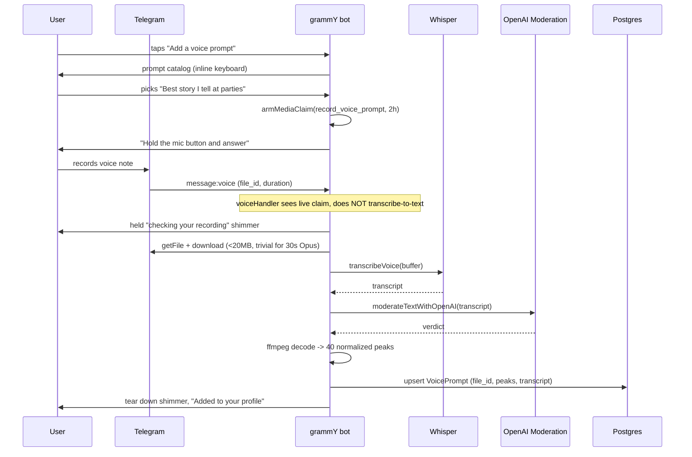

# Voice Prompts — Architecture & Implementation Plan

> **Status:** proposal, awaiting founder decisions (§0). No code written.
> Product invariants: [PRODUCT_SPEC.md](PRODUCT_SPEC.md). Agent rules:
> [AGENTS.md](AGENTS.md). Decision journal: [DECISIONS.md](DECISIONS.md).
>
> This document assumes the Hinge Voice Prompt as the reference model and
> reports, honestly, which parts of it this product can take and which parts it
> structurally cannot.

---

## 0. Blocking decisions (founder)

Three questions change what gets built. Everything else in this document is
settled by existing repo precedent.

1. **The like/comment interaction loop** — as specified it is not buildable
   here (§1.2). Pick A, B, or C from §7.
2. **Does the transcript feed matching?** (§5.4) — this is the same shape of
   decision as the 2026-08-01 `ethnicity` removal: content that influences
   `V_explicit` needs a stated legal basis and a privacy-policy line.
3. **Surface order** — Telegram-only v1, or Telegram + iOS together (§2).

---

## 1. Repository Fit Analysis

### 1.1 What fits, and fits well

| Hinge concept | Repo analog that already exists |
|---|---|
| Prompt catalog | `packages/shared/src/profiler-questions.ts` — stable ids, priority, 5 locales, gender-scoped |
| Display-only profile media | `services/profile-video.ts` — safety-only validation, never enters `photos[]` |
| Audio safety pipeline | `transcribeVideoAudio` → `moderateTextWithOpenAI` (already used for profile video audio) |
| Transcription | `services/whisper.ts` (`transcribeVoice`, 25 MB ceiling) |
| Native voice-note send | `handlers/onboarding/verification.ts` → `sendSkipNudge`, with `file_id` caching |
| Rejection audit | `media_validation_rejections` table |
| Feature gating | `VOICE_PROMPT_ENABLED`, default off — repo convention |

The strongest fit is philosophical rather than technical. This product's whole
thesis is *stop texting, go meet someone*. A voice prompt is the only profile
element that conveys tone, humour and cadence **without** opening a chat, so it
argues for the product rather than against it.

### 1.2 What does NOT fit — two structural blockers

**There is no feed.** This product has no browsable profile list and no swiping.
The matching engine pairs users on a drop cadence (`DROP_CADENCE=daily` in
production since 2026-08-10) and each side receives **one** pitch, answered
yes/no. Consequences for the brief as written:

- "Feed & Profile Playback" has no surface to exist on.
- "Only one audio track can play across the entire app" is a non-problem: the
  surface is a Telegram chat, and Telegram already enforces single-track
  playback natively. **No global audio coordinator is needed on Telegram.**
- Scroll-away-stops-playback likewise has no owner.

**The liking loop violates two invariants at once.**
"Like the Voice Prompt and attach an optional text or voice comment as an
icebreaker" is:

1. **User-to-user messaging before a match** — PRODUCT_SPEC Core Principles:
   *"NO IN-APP CHAT — Users NEVER message each other through our platform."*
   The single carve-out (Variant C proxy chat) is post-match, post-schedule,
   time-boxed, text-only and logged. A pre-match comment is none of those.
2. **A blind-decision leak** — §3.4: *"A user MUST NOT learn what their partner
   picked until they themselves have committed."* A like-with-comment tells the
   recipient the sender said yes before the recipient has answered. That is the
   exact failure the invariant exists to prevent, and the product goes to real
   lengths to protect it (the peer nudge is byte-identical for accept and
   decline).

Per AGENTS.md this needs an explicit founder decision, not an assumption. Three
buildable alternatives are in §7.

### 1.3 Telegram gives away most of the requested media stack

`sendVoice` with OGG/Opus renders a **native waveform, scrubber, play/pause,
elapsed time and playback-speed control**, and Telegram stores the media as a
`file_id`. The repo already documents this at `handlers/onboarding/verification.ts:171`.

So for the Telegram surface these requested components are **not needed**:

- ~~Presigned S3/R2 upload~~ → Telegram stores it; we hold a `file_id`.
- ~~Client-side Web Audio API recorder + live visualiser~~ → Telegram's own
  recorder handles mic permission, live waveform, preview, re-record, cancel.
- ~~Custom waveform scrubber / player widget~~ → native.
- ~~Global playback coordinator~~ → native.
- ~~Audio caching layer~~ → native.

That is roughly 60% of the requested frontend scope, deleted by choosing the
right surface. The full custom stack is required **only for the native iOS
client**, which today has no audio code at all (verified: zero `AVAudio*`
references in `Gennety-iOS`).

### 1.4 Critical integration collision — `voiceHandler`

`apps/bot/src/handlers/voice.ts` is mounted in `bot.ts` at line 118, **before**
`matchingRouter`, `dateRouter`, `profilerRouter` and the menu `router`. It
intercepts *every* inbound voice note, transcribes it via Whisper, and mutates
`ctx.message.text` so downstream routers see typed text.

A voice-prompt recording sent by a user would therefore be swallowed and handed
to the concierge agent as a sentence. This is not a subtle race — it is the
default path.

**Fix:** claim the chat with the existing pattern
(`services/menu-text-claim.ts`): add `record_voice_prompt` to `MEDIA_CLAIMABLE`,
arm it with `armMediaClaim` (2 h TTL, re-armed on interaction), and have
`voiceHandler` return early when the claim is live. This mirrors how
`edit_photos` / `edit_video` already hold media without the text pipeline
stealing it.

### 1.5 Invariants the implementation must not break

- **Never add the voice prompt to `Profile.photos[]`.** The
  `photos[i] ↔ photoFaceScores[i]` 1:1 alignment is load-bearing for
  verification. Video is excluded for exactly this reason; audio follows.
- **No identity gate on the audio.** Display-only media carries no identity
  check (simplified 2026-06-23), and a voice cannot be face-matched. Safety
  validation only.
- **`protect_content`** — partner media is forward/save-protected wherever it
  shows a person. Route the send through `PROTECT_PARTNER_MEDIA`
  (`demo/config.ts`) rather than a hardcoded `true`, per the 2026-08-12 rule.
- **Demo mode** — AGENTS.md mandates the check. See §8.
- **iOS parity** — any `/v1/*` shape change updates `openapi/gennety-v1.yaml`
  in the same commit and is additive.

---

## 2. Recommended architecture: one data model, two renderings

| | Telegram (v1) | iOS (v2) |
|---|---|---|
| Record | Native Telegram voice note | `AVAudioRecorder` + custom live visualiser |
| Store | Telegram `file_id` | Same row; bytes served by signed URL |
| Play | Native `sendVoice` player | Custom waveform scrubber |
| Waveform | Free, client-rendered | Needs precomputed peaks |
| Concurrency | Native | `AudioPlaybackCoordinator` singleton |
| Build cost | Low | High |

**Store the amplitude peaks anyway, from day one, even though Telegram never
reads them.** The marginal cost at ingest is ~zero — we already have the decoded
buffer in hand for moderation, and `ffmpeg` is already a required production
dependency. The retrofit cost is high: backfilling means re-downloading every
voice prompt through the Bot API. Pay the free version now.

---

## 3. Database Schema

### 3.1 Prompt catalog lives in code, not the database

The brief asks for a `PromptQuestion` table. Repo precedent says otherwise, and
the precedent is explicit:

- `profiler-questions.ts` keeps stable ids, priority, refresh policy and all
  five translations together in one first-party TS module.
- ARCHITECTURE.md → `system_knowledge` states the rule directly: *"Product rules
  do NOT live here. They live in `services/product-playbook.ts` — code-owned,
  flag-aware and unit-tested."* Five legacy rule rows drifted from the product
  and were retired for this reason.
- A DB catalog implies an admin CRUD surface nobody is going to build.

Also: the `type: text vs audio` split models a feature this product does not
have. There are no Hinge-style text prompts on the profile — the profile is a
generated bio plus photos. A shared abstraction over one real variant is
speculative.

**Recommendation:** `packages/shared/src/voice-prompts.ts`, shaped like
`profiler-questions.ts`.

```ts
export interface VoicePromptQuestion {
  /** Stable id persisted on VoicePrompt.promptId. Never reused or renamed. */
  id: string;                    // "party_story", "name_pronunciation"
  /** Optional gender scope; omitted = offered to everyone. */
  gender?: Gender;
  /** Ordering weight when offering the catalog. */
  priority: "high" | "medium" | "low";
  /** Localized prompt text, all five languages. */
  text: Record<Language, string>;
}
```

### 3.2 `voice_prompts` table

One active prompt per user, enforced in the database.

```prisma
model VoicePrompt {
  id        String @id @default(uuid()) @db.Uuid
  userId    String @unique @map("user_id") @db.Uuid

  /// Stable id from packages/shared/src/voice-prompts.ts. Not an FK —
  /// the catalog is code, exactly like ProfilerAnswer.questionId.
  promptId  String @map("prompt_id")

  /// Telegram file_id of the accepted voice note. The ONLY copy on the
  /// Telegram rail — Telegram is the store, we hold the pointer.
  telegramFileId String? @map("telegram_file_id")
  /// Supabase object path, written only when an iOS client uploaded bytes
  /// directly. Null on Telegram-originated prompts.
  storagePath    String? @map("storage_path")

  durationSec Int @map("duration_sec")
  mimeType    String? @map("mime_type")
  fileSize    Int?    @map("file_size")

  /// Normalized 0..100 amplitude peaks, VOICE_PROMPT_WAVEFORM_BUCKETS long.
  /// Computed server-side at ingest from the buffer already downloaded for
  /// moderation. Telegram renders its own waveform and ignores this; it
  /// exists so the native iOS player never needs a backfill.
  waveform Int[] @default([]) @map("waveform")

  /// Whisper transcript. Retained because it is the moderation evidence and
  /// (pending the §0.2 decision) the matching signal. Never shown to the
  /// partner — the product ships audio, not a transcript of a stranger.
  transcript String? @map("transcript")

  validationVersion Int?      @map("validation_version")
  validatedAt       DateTime? @map("validated_at")

  createdAt DateTime @default(now()) @map("created_at")
  updatedAt DateTime @updatedAt @map("updated_at")

  user User @relation(fields: [userId], references: [id], onDelete: Cascade)

  @@index([promptId])
  @@map("voice_prompts")
}
```

**Why a table rather than columns on `Profile` or an item in `profileMedia`:**

- `@@unique([userId])` enforces "0 or 1 active" in the database rather than in
  application code.
- The transcript needs a durable, re-processable home if it feeds matching.
- Analytics wants adoption rate per `promptId`; a JSON blob cannot answer that.

**Why it is NOT added to the `ProfileMedia` union:** a Telegram voice note
cannot be grouped into a media group with photos, so it is a separate
`sendVoice` call regardless. Keeping it out of `profileMedia` means zero change
to `parseProfileMediaItem`, `sendProfileMediaCard`, or the photo/video
invariants. Strictly more additive.

**Re-record replaces in place.** No history table — that matches how the profile
video behaves, and `media_validation_rejections` already carries the audit trail
for anything refused.

### 3.3 Migration

Additive: one `CREATE TABLE` plus one index, zero `DROP`. Verify before running,
per deploy.md:

```sh
pnpm --filter @gennety/db exec prisma migrate diff \
  --from-schema-datasource prisma/schema.prisma \
  --to-schema-datamodel prisma/schema.prisma --script
pnpm --filter @gennety/db db:push
pnpm db:drift-check   # must exit 0 before pm2 restart
```

One new `MediaValidationReason` value set: `audio_too_short`, `audio_too_long`,
`audio_contact_info` (§5.3). These are a TS union, not a Prisma enum — no
migration.

**GDPR:** `onDelete: Cascade` covers the row. `collectOwnedPaths` already scans
Supabase paths; add `voicePrompt.storagePath` to it so an iOS-uploaded object is
erased. Telegram-hosted `file_id`s are not deletable by a bot — the same
accepted limitation that already applies to every profile photo.

---

## 4. API Contracts

### 4.1 Telegram rail (no new HTTP surface)

Recording happens in the chat. The catalog is offered as an inline keyboard, the
user replies with a native voice note, the claim routes it to the ingest
service. No Mini App, no upload endpoint, no presigned URL.



### 4.2 `/v1/*` additions (iOS)

All additive. Same commit updates `openapi/gennety-v1.yaml`.

| Method | Path | Purpose |
|---|---|---|
| `GET` | `/v1/voice-prompts/catalog` | Active prompt questions in the caller's language |
| `POST` | `/v1/me/voice-prompt/upload-url` | Presigned Supabase PUT (iOS only) |
| `POST` | `/v1/me/voice-prompt` | Commit `{promptId, storagePath, durationSec}` → validate → persist |
| `DELETE` | `/v1/me/voice-prompt` | Remove the active prompt |
| `GET` | `/v1/matches/{id}/partner-voice-prompt` | Signed, short-TTL audio URL + peaks + prompt title |

`SerializedMatch` gains an optional `voicePrompt` object (`promptId`,
`promptText`, `durationSec`, `waveform`) so the card can render the bars before
any audio is fetched — which is the entire point of precomputing peaks.

**Contract trap to avoid:** declare nullable object properties as a bare
optional `$ref`, never `oneOf: [$ref, "null"]`. That shape is silently dropped
by swift-openapi-generator and has already cost this repo three separate
incidents (`SerializedUser.gender`, `VenueIntentState.market`,
`PendingFeedback`). `./scripts/generate-api.sh` must emit zero
`Schema "null" is not supported … skipping` lines.

**Direct-to-Supabase upload, not a backend proxy.** A 30s Opus file is ~120 KB,
so the proxy would be affordable — but the presigned path keeps audio bytes off
the single Node process that also runs the bot, every cron and both APIs. The
existing `SUPABASE_PHOTO_BUCKET` pattern already does this.

---

## 5. Media Strategy

### 5.1 Codec and bitrate

**Telegram rail:** whatever Telegram produces — OGG/Opus, mono, ~16–32 kbps.
We do not re-encode. A 30s note is ~60–120 KB. `sendVoice` accepts
`.ogg`/`.mp3`/`.m4a`, and OGG/Opus is what renders as a true voice message.

**iOS rail:** AAC-LC in `.m4a`, mono, 32 kbps, 24 kHz. Chosen over Opus/WebM
because `AVAudioRecorder` produces it natively with no third-party encoder, and
because `.m4a` is directly re-sendable through `sendVoice` if a Telegram user
ever needs to hear an app-recorded prompt.

### 5.2 Duration and size bounds

```ts
VOICE_PROMPT_MIN_DURATION_SEC = 3    // below this it is a misfire, not an answer
VOICE_PROMPT_MAX_DURATION_SEC = 30   // Hinge parity
VOICE_PROMPT_MAX_BYTES = 2 * 1024 * 1024
VOICE_PROMPT_WAVEFORM_BUCKETS = 40
```

Bounds live in `packages/shared/src/constants.ts` and are served to clients via
`/state`-style config rather than duplicated in the bundle — the rule
`profileLimits` already follows, because a bound in two places eventually
disagrees with itself.

40 buckets: at ~2px bar + 2px gap, a 320pt card holds 40–80 bars. A client can
always render fewer bars than it has, never more, so 40 is a safe floor.

### 5.3 Moderation — reuse the chain, add one new rule

Existing, verbatim from the profile-video path minus frame sampling:

```
downloadTelegramFile → transcribeVoice → moderateTextWithOpenAI
```

Failure semantics follow the video precedent: a provider outage returns
`processing_unavailable` and is **retryable**, never a rejection. We do not
penalise a user for our own outage.

**One genuinely new rule, not present anywhere in the codebase:** a voice prompt
can carry contact details out loud — *"my Instagram is @…"*, *"text me at +380…"*.
That is a direct bypass of NO IN-APP CHAT and a safety concern (it routes a
stranger to an unmoderated channel before any verification of intent). The
transcript check must reject contact-info solicitation
(`audio_contact_info`). Photos cannot leak this way, so no existing rule covers
it.

### 5.4 Transcript as a matching signal — **decision required**

The transcript can fold into `Profile.psychologicalSummary`, which is the
dominant embedding input (`V_explicit`, weight 0.65). That would make this
product's voice prompt strictly more than Hinge's: not only a human vibe check
but real matching signal.

Two things make it a decision rather than an implementation detail:

1. **Mechanical.** Any write to `psychologicalSummary` sets
   `embeddingDirty = true`, which **withholds the user from matching until the
   embedding is rebuilt**. It must therefore attempt the immediate 30-second
   user-scoped refresh. The `appendNegativeConstraint` bug (DECISIONS 2026-08-08)
   is exactly this mistake: it marked dirty and walked away, silently removing
   users from the pool for up to five minutes and causing paid Rematch runs to
   refund with "nobody found".

2. **Legal.** This is the same shape as the 2026-08-01 `ethnicity` removal —
   content feeding an Art. 22 automated decision needs a stated basis. Voice
   *content* is ordinary personal data; a voice *print* used for identification
   would be Art. 9 biometric. We transcribe and discard the acoustic model, so
   the honest position is "we do not voice-print" — but it needs to be written
   into `legal/privacy-policy.md`, carried by `LEGAL_DOCS_VERSION`, and recorded
   in `legal/dpia.md`.

**Recommendation:** ship v1 with the transcript stored for moderation only, and
gate the matching contribution behind its own decision plus a policy version
bump. Storing it now costs nothing and keeps the option open.

---

## 6. Component Hierarchy

### 6.1 Telegram — handlers, not components

```
handlers/menu/voice-prompt.ts        catalog keyboard, record/replace/delete
  └── armMediaClaim("record_voice_prompt")
handlers/voice.ts                    MODIFIED: early-return on a live claim
services/voice-prompt.ts             ingest: validate → transcribe → moderate
                                     → peaks → persist  (mirrors profile-video.ts)
services/profile-media-validation/
  voice-prompt-validation.ts         safety-only verdict
  audio-waveform.ts                  ffmpeg → s16le → RMS buckets → 0..100
handlers/matching/pitch.ts           MODIFIED: one sendVoice after the photo card
```

The ingest service returns a verdict and persists nothing itself — the
onboarding surface (session-backed) and the menu surface (DB-backed) own their
own persistence, exactly as `prepareProfileVideo` already splits it.

### 6.2 iOS — the real component work

```
VoicePromptRecorderView
  ├── MicPermissionGate            AVAudioSession.requestRecordPermission
  ├── LiveWaveformView             AVAudioRecorder.averagePower polling
  ├── RecordingTimer               3s floor, 30s hard stop
  └── PreviewPlayer                re-record / keep / delete

VoicePromptPlayerView              partner-facing, in the match card
  ├── WaveformBarsView             renders precomputed peaks instantly
  ├── ScrubberGesture              seek by drag
  └── AudioPlaybackCoordinator     @Observable singleton, one track app-wide
```

`AudioPlaybackCoordinator` is the only piece with global state: it holds the
active player id, stops the previous one on play, and pauses on scroll-away and
on app background. It exists because iOS, unlike Telegram, gives us nothing.

**Error boundaries:** permission denied → inline explainer plus a deep link to
Settings, never a dead button; upload failure → keep the local recording and
offer retry (never silently discard something the user just performed);
playback failure → fall back to the transcript-free static bars and a retry tap.

---

## 7. The interaction loop — three buildable options

**Option A — Ship it one-way (recommended for v1).**
The voice prompt improves the accept/decline decision and nothing else. Zero new
mechanics, zero invariant risk. AGENTS.md: *"the smallest change that fits
existing boundaries."*

**Option B — Post-decision reaction.**
The listener may react to the voice prompt, but the reaction is withheld until
**both** sides have committed and the match is mutual, surfacing in the "It's
mutual 🤍" moment. Blind decision is preserved by construction: nothing is
revealed before both answers exist. Small build, reuses the §3.4 reveal path.

**Option C — Voice reply as icebreaker fuel, never relayed.**
The listener records a reply. It is transcribed, fed to the §Phase 4 icebreaker
and wingman-hint generator, and **never delivered to the partner**. The gesture
gets a home, the AI gets better material for the T-5h icebreakers, and no
user-to-user channel opens. Maps onto machinery that already exists.

B and C compose. Neither is Hinge's loop — Hinge's loop requires a chat inbox,
which this product deliberately does not have.

---

## 8. Demo mode impact check (AGENTS.md, mandatory)

- **A gate?** No.
- **A paid step?** No.
- **A two-sided negotiation?** No — `demo/decide.ts` needs no branch.
- **How a match is created/advanced?** Only in that the pitch carries one more
  message. The driver's state table is unaffected.

**One real deliverable:** the demo puppet needs a seeded voice prompt, or every
demo pitch will visibly differ from production. Telegram `file_id`s are
per-bot, so the OGG must be minted **through the demo bot** — the same trap the
photo seeder hit (`scripts/seed-demo-partners.mjs` resolves an upload chat for
exactly this reason). Add an `--audio=<dir>` arm to that script.

---

## 9. Implementation Roadmap

### M0 — Foundation
- [ ] `packages/shared/src/voice-prompts.ts` — catalog, 8–10 prompts × 5 locales
- [ ] Constants: duration/size/bucket bounds
- [ ] `VoicePrompt` Prisma model + additive `db:push` + `db:drift-check`
- [ ] `VOICE_PROMPT_ENABLED=false` in `.env.example` **and** `.env.local.example`
- [ ] Unit tests: catalog id stability, locale completeness

### M1 — Ingest & moderation (Telegram)
- [ ] `services/profile-media-validation/audio-waveform.ts` (ffmpeg → peaks)
- [ ] `voice-prompt-validation.ts` — transcript → moderation → contact-info rule
- [ ] `services/voice-prompt.ts` ingest orchestration + held status shimmer
- [ ] **`voiceHandler` claim check** — the collision in §1.4; regression test
      confirmed red before green
- [ ] Rejection reasons + localized copy ×5
- [ ] Re-record rate limit (audio costs a Whisper + moderation call per attempt)

### M2 — Surfaces (Telegram)
- [ ] `handlers/menu/voice-prompt.ts` — add / replace / delete
- [ ] Optional onboarding step, after photos, skippable
- [ ] Pitch render: `sendVoice` after the photo card, via `PROTECT_PARTNER_MEDIA`
- [ ] My Profile shows the active prompt
- [ ] Demo seeder `--audio` arm (§8)

### M3 — Transcript → matching *(gated on §0.2)*
- [ ] Fold transcript into `psychologicalSummary`
- [ ] **Immediate embedding refresh** — not just `embeddingDirty = true`
- [ ] `legal/privacy-policy.md` + `dpia.md` + `LEGAL_DOCS_VERSION` bump

### M4 — iOS parity
- [ ] `/v1/*` endpoints + `openapi/gennety-v1.yaml` in the same commit
- [ ] `./scripts/generate-api.sh` emits zero `skipping` lines (§4.2)
- [ ] Native recorder, player, `AudioPlaybackCoordinator`
- [ ] Task recorded in `Gennety-iOS/IMPLEMENTATION_PLAN.md`

### M5 — Interaction loop *(gated on §0.1)*

### M6 — QA & docs
- [ ] E2E on `@gennetytestbot`: record → moderate → pitch → play
- [ ] Rejection paths: too short, too long, unsafe, contact-info, provider down
- [ ] Adoption + completion analytics per `promptId`
- [ ] PRODUCT_SPEC §1.3/§3.3 + ARCHITECTURE + DECISIONS entries, same commit
- [ ] deploy.md PENDING block: flag, schema step, demo redeploy

---

## 10. Open risks

| Risk | Mitigation |
|---|---|
| Voice reveals identity before verification is meaningful | Prompt is offered only post-verification, like every other partner-facing surface |
| Accent/language bias in the pool | Transcript-to-matching is behind its own decision (§5.4); the audio itself is human-judged |
| Whisper cost per re-record | Per-day re-record cap; 30s audio is a cheap Whisper call but not free |
| Voice used to bypass no-chat | `audio_contact_info` rejection rule (§5.3) |
| iOS ships without audio and the surfaces diverge | Additive contract; `SerializedMatch.voicePrompt` optional — an old client ignores it |
