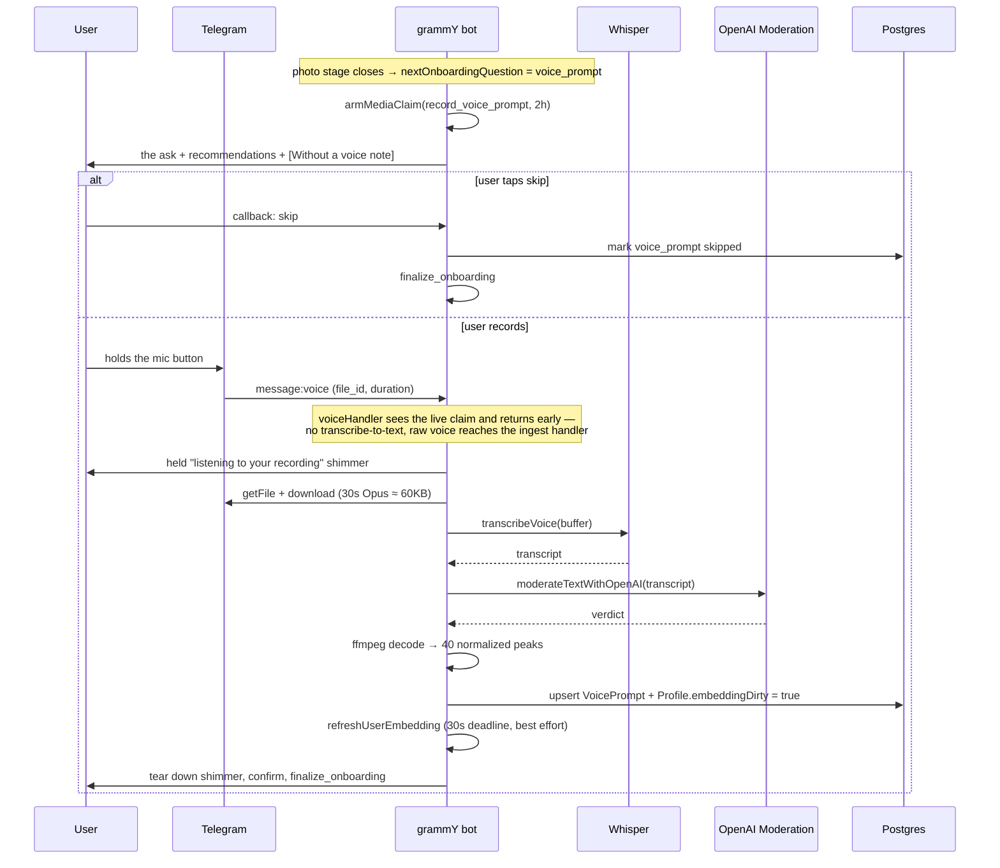

# Voice Prompts — Architecture & Implementation Plan

> **Status:** design settled, implementation in progress. Product invariants:
> [PRODUCT_SPEC.md](PRODUCT_SPEC.md). Agent rules: [AGENTS.md](AGENTS.md).
> Decision journal: [DECISIONS.md](DECISIONS.md).
>
> This document took the Hinge Voice Prompt as its reference model and reports,
> honestly, which parts of it this product can take and which parts it
> structurally cannot. Two rounds of founder decisions (§0) removed roughly half
> the reference design; what remains is smaller than the brief and is the part
> that actually fits.

---

## 0. Decisions taken (founder, 2026-08-21)

**Round 1 — scope.**

| # | Question | Decision |
|---|---|---|
| 1 | The Hinge like/comment loop | **A — one-way only.** No like, no comment, no reaction. The voice prompt improves the accept/decline decision and does nothing else. |
| 2 | Does the transcript feed matching? | **Yes.** It reaches the embedding (`V_explicit`, 0.65). In v1 scope, with the legal work that implies. |
| 3 | Surfaces | **Telegram + iOS together.** One release, full parity, the whole native audio stack up front. |

**Round 2 — how it actually works.**

| # | Question | Decision |
|---|---|---|
| 4 | Ask in a Mini App screen, like the AI-memory gate? | **No — in the chat**, as the last onboarding question. One message with recommendations plus one quiet skip button; the recording IS the acceptance. |
| 5 | A curated prompt catalog, like Hinge? | **No — free-form.** The message carries recommendations instead. This reverses §3.1 of the first draft; the reasoning is below. |
| 6 | Where does the transcript live? | **In its own column**, composed into the embedding input at refresh time. It is NOT folded into `psychologicalSummary`. Reverses §5.5 of the first draft; see §5.5 for why the repo already settles this. |
| 7 | Does the demo puppet have one? | **No.** The demo shows the recording step and not the playback. |
| 8 | Are the 8 already-registered accounts asked retroactively? | **No.** They never see the step. |

Consequences, so they are not rediscovered later:

- Decision 1 **deletes** the interaction milestone. §7 records what was
  rejected and why, so a future session does not rebuild it.
- Decision 2 **promotes** the transcript work to the critical path and brings a
  privacy-policy version bump with it (§5.4).
- Decision 3 **promotes** the iOS milestone into v1: presigned upload, signed
  playback, native recorder, waveform renderer and a global playback
  coordinator (§6.2). It also puts audio bytes at rest in our own bucket,
  which Telegram-only would not have done (§5.6).
- Decision 4 **deletes** the Mini App work for this feature entirely. The
  reason is not taste: a WebView screen structurally *cannot take the
  recording* — that needs `getUserMedia`, a recorder, a player and an upload,
  i.e. exactly the native stack Telegram makes unnecessary (§1.3). A screen
  that can only *ask* costs one extra tap and then hands the user back to the
  chat anyway. §4.1 carries the resulting flow.
- Decision 5 **deletes** the prompt catalog, `promptId`, and its index. See
  §3.1 for why a catalog earns its keep in a feed and not here.
- Decision 6 **removes the most delicate part of the build.** There is no
  second writer on `psychologicalSummary`, so the About-me editor cannot wipe
  the voice block, and there is no idempotency trap on re-record.
- Decisions 7 and 8 are the Demo Mode Impact Check and the migration answer;
  both are recorded in §8.

---

## 1. Repository Fit Analysis

### 1.1 What fits, and fits well

| Hinge concept | Repo analog that already exists |
|---|---|
| An optional profile step, asked once | The `ai_memory` slot in `ONBOARDING_QUESTIONS` — a skippable question the collector owns |
| Display-only profile media | `services/profile-video.ts` — safety-only validation, never enters `photos[]` |
| Audio safety pipeline | `transcribeVideoAudio` → `moderateTextWithOpenAI` (already used for profile video audio) |
| Transcription | `services/whisper.ts` (`transcribeVoice`, 25 MB ceiling) |
| Native voice-note send | `handlers/onboarding/verification.ts` → `sendSkipNudge`, with `file_id` caching |
| Rejection audit | `media_validation_rejections` table |
| Feature gating | `VOICE_PROMPT_ENABLED`, default off — repo convention |

The strongest fit is philosophical rather than technical. This product's whole
thesis is *stop texting, go meet someone*. A voice prompt is the only profile
element that conveys tone, humour and cadence **without** opening a chat, so it
argues for the product rather than against it.

### 1.2 What does NOT fit — two structural blockers

**There is no feed.** This product has no browsable profile list and no swiping.
The matching engine pairs users on a drop cadence (`DROP_CADENCE=daily` in
production since 2026-08-10) and each side receives **one** pitch, answered
yes/no. Consequences for the brief as written:

- "Feed & Profile Playback" has no surface to exist on.
- "Only one audio track can play across the entire app" is a non-problem: the
  surface is a Telegram chat, and Telegram already enforces single-track
  playback natively. **No global audio coordinator is needed on Telegram.**
- Scroll-away-stops-playback likewise has no owner.

**The liking loop violates two invariants at once.**
"Like the Voice Prompt and attach an optional text or voice comment as an
icebreaker" is:

1. **User-to-user messaging before a match** — PRODUCT_SPEC Core Principles:
   *"NO IN-APP CHAT — Users NEVER message each other through our platform."*
   The single carve-out (Variant C proxy chat) is post-match, post-schedule,
   time-boxed, text-only and logged. A pre-match comment is none of those.
2. **A blind-decision leak** — §3.4: *"A user MUST NOT learn what their partner
   picked until they themselves have committed."* A like-with-comment tells the
   recipient the sender said yes before the recipient has answered. That is the
   exact failure the invariant exists to prevent, and the product goes to real
   lengths to protect it (the peer nudge is byte-identical for accept and
   decline).

Per AGENTS.md this needs an explicit founder decision, not an assumption. Three
buildable alternatives are in §7.

### 1.3 Telegram gives away most of the requested media stack

`sendVoice` with OGG/Opus renders a **native waveform, scrubber, play/pause,
elapsed time and playback-speed control**, and Telegram stores the media as a
`file_id`. The repo already documents this at `handlers/onboarding/verification.ts:171`.

So for the Telegram surface these requested components are **not needed**:

- ~~Presigned S3/R2 upload~~ → Telegram stores it; we hold a `file_id`.
- ~~Client-side Web Audio API recorder + live visualiser~~ → Telegram's own
  recorder handles mic permission, live waveform, preview, re-record, cancel.
- ~~Custom waveform scrubber / player widget~~ → native.
- ~~Global playback coordinator~~ → native.
- ~~Audio caching layer~~ → native.

That is roughly 60% of the requested frontend scope, deleted by choosing the
right surface. The full custom stack is required **only for the native iOS
client**, which today has no audio code at all (verified: zero `AVAudio*`
references in `Gennety-iOS`).

### 1.4 Critical integration collision — `voiceHandler`

`apps/bot/src/handlers/voice.ts` is mounted in `bot.ts` at line 118, **before**
`matchingRouter`, `dateRouter`, `profilerRouter` and the menu `router`. It
intercepts *every* inbound voice note, transcribes it via Whisper, and mutates
`ctx.message.text` so downstream routers see typed text.

A voice-prompt recording sent by a user would therefore be swallowed and handed
to the concierge agent as a sentence. This is not a subtle race — it is the
default path.

**Fix:** claim the chat with the existing pattern
(`services/menu-text-claim.ts`): add `record_voice_prompt` to `MEDIA_CLAIMABLE`,
arm it with `armMediaClaim` (2 h TTL, re-armed on interaction), and have
`voiceHandler` return early when the claim is live. This mirrors how
`edit_photos` / `edit_video` already hold media without the text pipeline
stealing it.

### 1.5 Invariants the implementation must not break

- **Never add the voice prompt to `Profile.photos[]`.** The
  `photos[i] ↔ photoFaceScores[i]` 1:1 alignment is load-bearing for
  verification. Video is excluded for exactly this reason; audio follows.
- **No identity gate on the audio.** Display-only media carries no identity
  check (simplified 2026-06-23), and a voice cannot be face-matched. Safety
  validation only.
- **`protect_content`** — partner media is forward/save-protected wherever it
  shows a person. Route the send through `PROTECT_PARTNER_MEDIA`
  (`demo/config.ts`) rather than a hardcoded `true`, per the 2026-08-12 rule.
- **Demo mode** — AGENTS.md mandates the check. See §8.
- **iOS parity** — any `/v1/*` shape change updates `openapi/gennety-v1.yaml`
  in the same commit and is additive.

---

## 2. Recommended architecture: one data model, two renderings

| | Telegram | iOS |
|---|---|---|
| Record | Native Telegram voice note | `AVAudioRecorder` + custom live visualiser |
| Store | Telegram `file_id` | Same row; bytes served by signed URL |
| Play | Native `sendVoice` player | Custom waveform scrubber |
| Waveform | Free, client-rendered | Needs precomputed peaks |
| Concurrency | Native | `AudioPlaybackCoordinator` singleton |
| Build cost | Low | High |

Both ship in v1 (decision 3). The peaks are computed once at ingest, from the
buffer already downloaded for moderation, and serve iOS only — Telegram renders
its own waveform and ignores them. `ffmpeg` is already a required production
dependency, so this costs nothing beyond the code that reads its output.

**The two rails converge on one row.** A Telegram-recorded prompt has a
`telegramFileId` and no `storagePath`; an iOS-recorded one has the reverse. The
render path picks whichever it has, so a user who records on one surface is
audible on the other only if the bytes exist in a form that surface can play —
see §5.6 for the one case where they do not.

---

## 3. Database Schema

### 3.1 There is no prompt catalog (decision 5)

The brief asks for a `PromptQuestion` table: a curated list the user picks from,
with a `type: text | audio` split. Neither half survived.

**The catalog itself.** A Hinge prompt is a *frame* — it tells a stranger
scrolling a feed how to hear ten seconds of a voice they have no context for.
This product has no feed. It delivers **one person per day**, inside a pitch
that already argues at length who that person is, so the frame is redundant:
the listener is not choosing which of forty voices to attend to, they are
deciding about the only one they were shown.

Two more things fall out of the surrounding decisions. A catalog needs a picker
— an inline keyboard of five or six options — which is exactly the extra screen
decision 4 removed. And because the transcript reaches the embedding
(decision 2), **the pitch generator can see what was said and reference it**, so
the frame the catalog would have supplied arrives anyway, written per side, in
the pitch's own voice.

What replaces it is the ask itself: one message carrying concrete
recommendations (§4.1). The single instruction that matters is a *negative* one
— do not read your bio aloud — because that is the default failure and the bio
is already on the partner's screen.

**The `type: text | audio` split** models a feature that does not exist. There
are no Hinge-style text prompts on the profile; the profile is a generated bio
plus photos. A shared abstraction over one real variant is speculative.

**What this deletes from the first draft:** `packages/shared/src/voice-prompts.ts`
keeps only bounds and the feature flag — no `VoicePromptQuestion`, no five-language
prompt table. `VoicePrompt.promptId` and `@@index([promptId])` are gone.

**If a catalog is ever wanted back**, the honest trigger is a surface that shows
more than one voice at a time. `profiler-questions.ts` is the shape to copy —
code-owned, stable ids, all five languages — and ARCHITECTURE.md →
`system_knowledge` states why it must not be a table: *"Product rules do NOT
live here… code-owned, flag-aware and unit-tested."* Five legacy rule rows
drifted from the product and were retired for exactly that reason.

### 3.2 `voice_prompts` table

One active prompt per user, enforced in the database.

```prisma
model VoicePrompt {
  id        String @id @default(uuid()) @db.Uuid
  userId    String @unique @map("user_id") @db.Uuid

  /// Telegram file_id of the accepted voice note. The ONLY copy on the
  /// Telegram rail — Telegram is the store, we hold the pointer.
  telegramFileId String? @map("telegram_file_id")
  /// Supabase object path, written only when an iOS client uploaded bytes
  /// directly. Null on Telegram-originated prompts.
  storagePath    String? @map("storage_path")

  durationSec Int @map("duration_sec")
  mimeType    String? @map("mime_type")
  fileSize    Int?    @map("file_size")

  /// Normalized 0..100 amplitude peaks, VOICE_PROMPT_WAVEFORM_BUCKETS long.
  /// Telegram renders its own waveform and ignores this; it exists so the
  /// native iOS player never needs a backfill.
  waveform Int[] @default([]) @map("waveform")

  /// Whisper transcript. Two jobs: moderation evidence, and (decision 2) the
  /// matching signal — composed into the embedding input at refresh time
  /// straight from this column (§5.5). Never shown to the partner: the
  /// product ships audio, not a transcript of a stranger.
  transcript String? @map("transcript")

  validationVersion Int?      @map("validation_version")
  validatedAt       DateTime? @map("validated_at")

  createdAt DateTime @default(now()) @map("created_at")
  updatedAt DateTime @updatedAt @map("updated_at")

  user User @relation(fields: [userId], references: [id], onDelete: Cascade)

  @@map("voice_prompts")
}
```

**Why a table rather than columns on `Profile` or an item in `profileMedia`:**

- `@@unique([userId])` enforces "0 or 1 active" in the database rather than in
  application code.
- The transcript needs a durable home, and decision 6 makes that home
  load-bearing: it is the *only* copy, read on every embedding refresh.
- It keeps six nullable audio columns off the hottest row in the product.

**Why it is NOT added to the `ProfileMedia` union:** a Telegram voice note
cannot be grouped into a media group with photos, so it is a separate
`sendVoice` call regardless. Keeping it out of `profileMedia` means zero change
to `parseProfileMediaItem`, `sendProfileMediaCard`, or the photo/video
invariants. Strictly more additive.

**Re-record replaces in place.** No history table — that matches how the profile
video behaves, and `media_validation_rejections` already carries the audit trail
for anything refused. With decision 6 a re-record needs no reconciliation at
all: overwrite the row, mark the profile dirty, refresh.

### 3.3 Migration

Additive: one `CREATE TABLE` plus one index, zero `DROP`. Verify before running,
per deploy.md:

```sh
pnpm --filter @gennety/db exec prisma migrate diff \
  --from-schema-datasource prisma/schema.prisma \
  --to-schema-datamodel prisma/schema.prisma --script
pnpm --filter @gennety/db db:push
pnpm db:drift-check   # must exit 0 before pm2 restart
```

One new `MediaValidationReason` value set: `audio_too_short`, `audio_too_long`,
`audio_contact_info` (§5.3). These are a TS union, not a Prisma enum — no
migration.

**GDPR:** `onDelete: Cascade` covers the row. `collectOwnedPaths` already scans
Supabase paths; add `voicePrompt.storagePath` to it so an iOS-uploaded object is
erased. Telegram-hosted `file_id`s are not deletable by a bot — the same
accepted limitation that already applies to every profile photo.

---

## 4. API Contracts

### 4.1 Telegram rail (no new HTTP surface)

Everything happens in the chat: no Mini App, no upload endpoint, no presigned
URL, no picker.

**Where the ask sits — after photos, still inside onboarding.** This is a
constraint, not a preference. Past `finalize_onboarding` the §1.4 verification
gate locks every surface except verification and photo re-upload, so a question
asked after finalization never reaches the user. The last available slot is the
end of the collector's own order
([`ONBOARDING_QUESTIONS`](apps/bot/src/services/onboarding-collector.ts)):

```
… friday_vibe → vibe_focus → ai_memory → context_dump → photos → voice_prompt → complete
```

`ai_memory`/`context_dump` are skipped in production (`AI_MEMORY_EXPORT_ENABLED=false`),
so in practice it reads `vibe_focus → photos → voice_prompt → complete`. Two
things fall out for free: the photo stage's **Continue** button already resolves
through `nextOnboardingQuestion`, so "done with photos" leads into the ask
without a new mechanism; and the persistent "🗂 My photos" reply keyboard is
already removed by the first message the bot sends after the stage ends, which
is now this one.

**One message, one quiet button, no accept button.** Recording IS the
acceptance — an explicit "yes" button would cost a tap and still leave the
recording to ask for. The skip button is the default gray style the repo uses
for every secondary action.

**What the message has to do.** The default failure is predictable: people read
their bio aloud ("hi, I'm Maksim, 24, I like sport and travel"), which is worth
nothing because the bio is already on the partner's screen. So the central
instruction is a prohibition, and the hook is the stake — *the person I find for
you hears this before they decide*. Recommendations are concrete and few; the
closing line ("don't rehearse, the first take is the liveliest") exists to stop
the re-record spiral that turns an optional step into a funnel leak.

**Two rules the first version broke (2026-08-22).** A recommendation must FIT
the duration the same message names — it said 15 seconds and suggested telling a
story, which is two incompatible asks in adjacent sentences. And "optional" is
only true if the message says where the exit is: the skip button was under it
and never named, so the claim read as a dead end. Both are pinned by
`voice-prompt-ask.test.ts` as far as they can be — the label must appear in the
Telegram ask, and the five languages must name one number between them.

**The pointer at the button is Telegram's, not the shared copy's.** The question
text is what `runAgentTurn` returns, and §5 serves that same string to the
native rail, where this keyboard does not exist. So the shared copy says the
step can be skipped and `sendVoicePromptAsk` appends the line naming the button,
interpolated from `voicePromptSkipButton` so the two cannot drift.

Copy lives in the collector's own question table
([`onboarding-collector.ts`](apps/bot/src/services/onboarding-collector.ts)) in
all five languages — deterministic template like the rest of onboarding, not
model output. Only the surrounding strings (skip label and hint, the
confirmation, the rejections, the pitch caption) are in
`packages/shared/src/i18n.ts`; an earlier revision of this line said the ask
itself lived there, and it never did.



**Re-recording before the step ends** simply overwrites the row — the claim is
re-armed on every interaction, matching `MEDIA_CLAIM_TTL_MS`. After the step
ends there is no re-record surface in v1 (§8).

### 4.2 `/v1/*` additions (iOS)

All additive. Same commit updates `openapi/gennety-v1.yaml`.

| Method | Path | Purpose |
|---|---|---|
| `POST` | `/v1/me/voice-prompt/upload-url` | Presigned Supabase PUT (iOS only) |
| `POST` | `/v1/me/voice-prompt` | Commit `{storagePath, durationSec}` → validate → persist |
| `DELETE` | `/v1/me/voice-prompt` | Remove the active prompt |
| `GET` | `/v1/matches/{id}/partner-voice-prompt` | Signed, short-TTL audio URL + peaks |

There is no catalog endpoint (decision 5) — the recommendations are copy on the
recording screen, not data the client fetches.

`SerializedMatch` gains an optional `voicePrompt` object (`durationSec`,
`waveform`) so the card can render the bars before any audio is fetched — which
is the entire point of precomputing peaks. It deliberately carries **no
transcript**: the product ships the partner's voice, not a machine reading of
it.

**Contract trap to avoid:** declare nullable object properties as a bare
optional `$ref`, never `oneOf: [$ref, "null"]`. That shape is silently dropped
by swift-openapi-generator and has already cost this repo three separate
incidents (`SerializedUser.gender`, `VenueIntentState.market`,
`PendingFeedback`). `./scripts/generate-api.sh` must emit zero
`Schema "null" is not supported … skipping` lines.

**Direct-to-Supabase upload, not a backend proxy.** A 30s Opus file is ~120 KB,
so the proxy would be affordable — but the presigned path keeps audio bytes off
the single Node process that also runs the bot, every cron and both APIs. The
existing `SUPABASE_PHOTO_BUCKET` pattern already does this.

---

## 5. Media Strategy

### 5.1 Codec and bitrate

**Telegram rail:** whatever Telegram produces — OGG/Opus, mono, ~16–32 kbps.
We do not re-encode. A 30s note is ~60–120 KB. `sendVoice` accepts
`.ogg`/`.mp3`/`.m4a`, and OGG/Opus is what renders as a true voice message.

**iOS rail:** AAC-LC in `.m4a`, mono, 32 kbps, 24 kHz. Chosen over Opus/WebM
because `AVAudioRecorder` produces it natively with no third-party encoder, and
because `.m4a` is directly re-sendable through `sendVoice` if a Telegram user
ever needs to hear an app-recorded prompt.

### 5.2 Duration and size bounds

```ts
VOICE_PROMPT_MIN_DURATION_SEC = 3    // below this it is a misfire, not an answer
VOICE_PROMPT_MAX_DURATION_SEC = 30   // Hinge parity
VOICE_PROMPT_MAX_BYTES = 2 * 1024 * 1024
VOICE_PROMPT_WAVEFORM_BUCKETS = 40
```

Bounds live in `packages/shared/src/constants.ts` and are served to clients via
`/state`-style config rather than duplicated in the bundle — the rule
`profileLimits` already follows, because a bound in two places eventually
disagrees with itself.

40 buckets: at ~2px bar + 2px gap, a 320pt card holds 40–80 bars. A client can
always render fewer bars than it has, never more, so 40 is a safe floor.

### 5.3 Moderation — reuse the chain, add one new rule

Existing, verbatim from the profile-video path minus frame sampling:

```
downloadTelegramFile → transcribeVoice → moderateTextWithOpenAI
```

Failure semantics follow the video precedent: a provider outage returns
`processing_unavailable` and is **retryable**, never a rejection. We do not
penalise a user for our own outage.

**One genuinely new rule, not present anywhere in the codebase:** a voice prompt
can carry contact details out loud — *"my Instagram is @…"*, *"text me at +380…"*.
That is a direct bypass of NO IN-APP CHAT and a safety concern (it routes a
stranger to an unmoderated channel before any verification of intent). The
transcript check must reject contact-info solicitation
(`audio_contact_info`). Photos cannot leak this way, so no existing rule covers
it.

### 5.4 Transcript feeds matching — **decision 2, in scope**

The transcript reaches the embedding (`V_explicit`, weight 0.65). This makes our
voice prompt strictly more than Hinge's: not only a human vibe check, but real
matching signal.

Raw transcript, not an LLM distillation — that is the established treatment for
short first-person answers (`appendVibeToSummary` folds the raw Friday-night
text). A 30-second transcript is ~75–90 words, a proportionate addition beside a
summary that often runs to thousands of characters.

**Where it lives is the whole design, and decision 6 settles it: its own
column.** See §5.5 — the repo already does exactly this for two other fields,
and doing it any other way is what created the delicate part of the first draft.

**Two rules the write path must satisfy.**

1. **Every write attempts the immediate refresh.** `embeddingDirty = true` is
   not a scheduling hint — `findCandidatesFor` fail-closes on the seeker's own
   dirty flag, so marking dirty and walking away **withholds the user from
   matching** until the 5-minute cron catches up. That is precisely the
   `appendNegativeConstraint` bug (DECISIONS 2026-08-08): a user who explained a
   decline and then bought a paid Rematch was told nobody was found, and
   refunded, when the engine had refused to look. Call
   `refreshUserEmbedding(userId)` (`workers/embedding-refresh.ts`) on the same
   path, best-effort, exactly as `negative-constraints.ts:129` now does.

2. **Deleting the prompt re-dirties and refreshes too.** A deleted voice prompt
   that keeps influencing matching is a ghost the user cannot see or clear.
   With decision 6 the removal is implicit — the row is gone, so the composed
   input no longer contains it — but the dirty flag and the refresh are still
   owed.

**Legal.** This is a new processing purpose for biometric-adjacent data (a voice
recording used to influence an automated decision), so it carries a Privacy
Policy version bump and a `LEGAL_DOCS_VERSION` change with it, not merely a new
sentence.

### 5.5 Where the transcript lives — the repo already answered this

The first draft folded the transcript into `Profile.psychologicalSummary`,
copying `appendVibeToSummary`, and then spent a section on the damage that does.
Decision 6 reverses it, and the evidence is in the refresh worker itself.

**`refreshDirtyEmbeddings` already composes the embedding input from several
columns at refresh time** ([`workers/embedding-refresh.ts`](apps/bot/src/workers/embedding-refresh.ts)):

```ts
let text = buildEmbeddingInput(baseSummary, row.psychologicalSummary ?? "");
if (row.partnerPreferences)  text += `\nPartner preferences: ${row.partnerPreferences}`;
if (row.negativeConstraints) text += `\nDealbreakers: ${row.negativeConstraints}`;
```

`partnerPreferences` and `negativeConstraints` are embedding inputs that are
**not** folded into the bio — they keep their own columns and are appended when
the vector is built. The voice transcript is the same kind of thing, so it takes
the same treatment: one more read, one more line.

```ts
if (row.user.voicePrompt?.transcript) {
  text += `\nVoice prompt: ${row.user.voicePrompt.transcript}`;
}
```

**What that removes, all of it real:**

- **No second writer on `psychologicalSummary`.**
  `handlers/menu/edit-profile.ts:192` writes `psychologicalSummary: text` — a
  full replacement. Under the first draft, opening the About-me editor silently
  wiped the voice block; the fix was a re-apply on the save path plus the
  awkward behaviour of putting a block back that the user had just deleted by
  hand. None of that exists now.
- **No idempotency trap.** `appendVibeToSummary` guards with
  `summary.includes(block)`, which holds only because vibe answers never change.
  A transcript changes on every re-record, so that guard structurally fails and
  three re-records would triple the voice text's weight in the vector. With the
  transcript in a column, a re-record is an overwrite and the weight is
  constant by construction.
- **No delimiters, no parser, no migration** if the block format ever changes.
- **The bio stays purely the user's.** What they see in the editor is what they
  wrote.

**The one cost**, stated so it is not a surprise: the transcript no longer
appears in `psychologicalSummary`, so any surface that reads that field to
*describe* a person — the pitch generator, the founder feed — does not see the
voice content unless it is given the relation. The pitch generator is the one
that matters (§4.1 relies on it to frame the voice note), so it selects
`voicePrompt.transcript` explicitly.

### 5.6 What decision 3 adds that Telegram-only would not have

Shipping iOS in v1 puts **audio bytes at rest in our own Supabase bucket**. On
the Telegram rail we hold a `file_id` and Telegram is the store; on the iOS rail
we are the store. Three duties follow:

- `collectOwnedPaths` (`services/account-deletion.ts`) must scan
  `voicePrompt.storagePath`, or GDPR erasure leaves the audio behind. It already
  scans `photos`, `profileMedia` and `pendingPhotoCandidates`; this is one more
  source, and missing it is silent.
- A new bucket, `SUPABASE_VOICE_BUCKET` (private), following the existing
  three. **It must be set explicitly in `.env.demo`** — the demo env is
  generated as production's `.env` plus that file, so any key it does not name
  inherits production's value. That is exactly how the demo pointed at the
  production Supabase project for a day (deploy.md, 2026-08-06).
- **One cross-rail gap, stated rather than hidden:** an iOS-recorded `.m4a` in
  our bucket is not a Telegram `file_id`. To play it to a Telegram user we must
  upload it once through `sendVoice` and cache the returned `file_id` on the
  row — the same mint-once-and-cache pattern `sendSkipNudge` already uses. Until
  that upload happens the prompt is iOS-only. Do this lazily at first pitch, not
  at record time, so we never pay for a prompt nobody is shown.

## 6. Component Hierarchy

### 6.1 Telegram — handlers, not components

```
services/voice-prompt.ts             ingest: validate → transcribe → moderate
                                     → peaks → persist  (mirrors profile-video.ts)
services/profile-media-validation/
  audio-waveform.ts                  ffmpeg → s16le → RMS buckets → 0..100
handlers/onboarding/voice-prompt.ts  the ask, the skip button, the ingest reply
handlers/voice.ts                    MODIFIED: early-return on a live claim
services/onboarding-collector.ts     MODIFIED: `voice_prompt` question after `photos`
services/menu-text-claim.ts          MODIFIED: `record_voice_prompt` claim state
handlers/matching/pitch.ts           MODIFIED: one sendVoice before the decision question
workers/embedding-refresh.ts         MODIFIED: compose the transcript into the input
services/account-deletion.ts         MODIFIED: collectOwnedPaths covers the audio bucket
```

**Where the voice note lands in the pitch.** The per-side sequence today
([`pitch.ts`](apps/bot/src/handlers/matching/pitch.ts)) is: welcome-gift pre-roll →
match cards or photo album → motion media → the streamed pitch → the verified
trust card → the decision question. The voice note goes **between the trust card
and the decision question**.

That displaces the trust card as the closer, which its own comment claims
("last argument the user reads before tapping Accept/Decline") — deliberately.
The trust card is a fact about safety; the voice is the person, and the last
thing before *yes or no* should be the person. Both are conditional (the trust
card only for a verified partner, the voice only if one was recorded), so the
ordering matters only when both exist.

It is a separate `sendVoice` — a voice note cannot join a media group — carrying
a one-line caption naming the partner, and `protect_content: PROTECT_PARTNER_MEDIA`,
the same shared constant the photos use, so demo mode drops the protection
automatically and a filmed walkthrough is not silently muted (DEMO_MODE.md).

Failure is fail-open by rule: a missing or unplayable `file_id` skips the message.
The pitch must never fail for want of an optional audio clip.

The ingest service returns a verdict and persists nothing itself — the
onboarding surface (session-backed) and the `/v1/*` surface (JWT-backed) own
their own persistence, exactly as `prepareProfileVideo` already splits it.

### 6.2 iOS — the real component work

```
VoicePromptRecorderView
  ├── MicPermissionGate            AVAudioSession.requestRecordPermission
  ├── LiveWaveformView             AVAudioRecorder.averagePower polling
  ├── RecordingTimer               3s floor, 30s hard stop
  └── PreviewPlayer                re-record / keep / delete

VoicePromptPlayerView              partner-facing, in the match card
  ├── WaveformBarsView             renders precomputed peaks instantly
  ├── ScrubberGesture              seek by drag
  └── AudioPlaybackCoordinator     @Observable singleton, one track app-wide
```

`AudioPlaybackCoordinator` is the only piece with global state: it holds the
active player id, stops the previous one on play, and pauses on scroll-away and
on app background. It exists because iOS, unlike Telegram, gives us nothing.

**Error boundaries:** permission denied → inline explainer plus a deep link to
Settings, never a dead button; upload failure → keep the local recording and
offer retry (never silently discard something the user just performed);
playback failure → fall back to the transcript-free static bars and a retry tap.

---

## 7. The interaction loop — rejected (decision 1)

**Decision: A — one-way only.** The voice prompt improves the accept/decline
decision and does nothing else. No like, no comment, no reaction, no relay.

Recorded here so it is not rebuilt: two alternatives were designed and turned
down, and both remain buildable if the question is ever reopened.

- **B — reaction revealed post-decision.** Withhold the listener's reaction
  until both sides have committed and the match is mutual, surfacing it in the
  "It's mutual 🤍" moment. Blind-decision safe by construction, because nothing
  is revealed before both answers exist.
- **C — voice reply as icebreaker fuel.** The listener records a reply; it is
  transcribed, fed to the §Phase 4 icebreaker and wingman generator, and never
  delivered to the partner. No user-to-user channel opens.

Hinge's actual loop needs a chat inbox, which this product deliberately does not
have. Neither B nor C is that loop; do not read either as a route back to it.

## 8. Demo mode impact check (AGENTS.md, mandatory)

- **A gate?** No.
- **A paid step?** No.
- **A two-sided negotiation?** No — `demo/decide.ts` needs no branch.
- **How a match is created/advanced?** Only in that the pitch may carry one more
  message. The driver's state table is unaffected.

**The puppet gets no voice prompt (decision 7).** So a demo visitor sees the
*recording* step in full — the ask, the recommendations, the skip button, the
ingest — and never sees the playback, because the puppet's pitch simply omits a
message it has nothing to fill. That is the fail-open path from §6.1 exercised
on every demo run rather than never, which is a small bonus.

Stated plainly so it is not read as an oversight: **the demo cannot show what
the feature looks like to the person receiving it.** Closing that gap means one
OGG per puppet, minted *through the demo bot* (Telegram `file_id`s are per-bot —
the same trap `scripts/seed-demo-partners.mjs` already resolves an upload chat
for), and it is not being done.

**Already-registered accounts are never asked (decision 8).** The step lives
inside the collector's question order, so it is reachable only by an account
still in onboarding. The 8 production accounts past that point will not see it
and get no retro-ask surface. Nothing is broken by their absence: the pitch's
voice message is conditional, so a partner without one simply produces the flow
that exists today.

---

## 9. Implementation Roadmap

All six milestones are v1 (decisions 2 and 3). M0–M2 and M4 parallelise across
the backend and the iOS client. Decisions 4–6 removed roughly a third of what
the first draft listed here — no catalog, no Mini App screen, no About-me
re-apply.

### M0 — Foundation
- [ ] `packages/shared/src/voice-prompts.ts` — bounds + flag only (**no catalog**)
- [ ] `VoicePrompt` Prisma model + additive `db:push` + `db:drift-check`
- [ ] `SUPABASE_VOICE_BUCKET` (private) — and **in `.env.demo` explicitly** (§5.6)
- [ ] `VOICE_PROMPT_ENABLED=false` in `.env.example` **and** `.env.local.example`

### M1 — Ingest & moderation
- [ ] `profile-media-validation/audio-waveform.ts` (ffmpeg → 40 peaks)
- [ ] `services/voice-prompt.ts` — validate → transcribe → moderate → peaks
- [ ] **`voiceHandler` claim check** (§1.4) — regression test confirmed red first
- [ ] `audio_contact_info` rejection rule + localized copy ×5
- [ ] Re-record cap — every attempt costs a Whisper + a moderation call

### M2 — Telegram surfaces
- [ ] `voice_prompt` question after `photos` in `ONBOARDING_QUESTIONS` (§4.1)
- [ ] The ask + recommendations + skip button, ×5 locales
- [ ] `handlers/onboarding/voice-prompt.ts` — ingest reply, held shimmer
- [ ] Pitch: `sendVoice` before the decision question, via `PROTECT_PARTNER_MEDIA`
- [ ] Lazy `file_id` mint for iOS-recorded prompts (§5.6), cached on the row

### M3 — Transcript → matching
- [ ] `refreshDirtyEmbeddings` selects and appends `voicePrompt.transcript` (§5.5)
- [ ] `refreshUserEmbedding` on every write path (§5.4 rule 1)
- [ ] Delete-prompt re-dirties and refreshes (§5.4 rule 2)
- [ ] Pitch generator selects the transcript so it can frame the clip (§5.5)
- [ ] `legal/privacy-policy.md` + `dpia.md` + `LEGAL_DOCS_VERSION` bump
- [ ] State plainly that we transcribe and do **not** voice-print

### M4 — iOS (parallel with M1–M2)
- [ ] `/v1/*` endpoints + `openapi/gennety-v1.yaml` in the **same commit**
- [ ] `./scripts/generate-api.sh` emits zero `skipping` lines (§4.2)
- [ ] `collectOwnedPaths` covers `storagePath` (§5.6) — silent if missed
- [ ] Recorder: permission gate, live visualiser, 3s floor / 30s stop, preview
- [ ] Player: precomputed bars, scrubber, `AudioPlaybackCoordinator`
- [ ] Task recorded in `Gennety-iOS/IMPLEMENTATION_PLAN.md`

### M5 — QA, demo & docs
- [ ] E2E on `@gennetytestbot`: record → moderate → pitch → play, both rails
- [ ] Rejection paths: too short, too long, unsafe, contact-info, provider down
- [ ] **Embedding regression**: record → re-record ×3 → confirm the vector
      reflects the LATEST transcript once, not three times
- [ ] Adoption + skip rate on the onboarding funnel (a new step in a live funnel)
- [ ] PRODUCT_SPEC + ARCHITECTURE + DEMO_MODE + DECISIONS entries, same commit
- [ ] deploy.md PENDING block: flag, schema step, new bucket, demo redeploy

## 10. Open risks

| Risk | Mitigation |
|---|---|
| Voice reveals identity before verification is meaningful | The prompt only ever plays inside a pitch, which is already gated on a verified partner |
| Accent/language bias in the pool | The transcript is text like any other; the audio itself is human-judged |
| Whisper cost per re-record | Per-day re-record cap; 30s audio is a cheap Whisper call but not free |
| Voice used to bypass no-chat | `audio_contact_info` rejection rule (§5.3) |
| iOS ships without audio and the surfaces diverge | Additive contract; `SerializedMatch.voicePrompt` optional — an old client ignores it |
| A user is withheld from matching after recording | `refreshUserEmbedding` on every write path (§5.4 rule 1) |
| A new onboarding step costs completion | It is the LAST question, one tap to skip, and the funnel already reports per-step drop-off |
| GDPR erasure leaves audio in the bucket | `collectOwnedPaths` covers `storagePath` (§5.6) |
| Demo inherits the production voice bucket | `SUPABASE_VOICE_BUCKET` named explicitly in `.env.demo` (§5.6) |