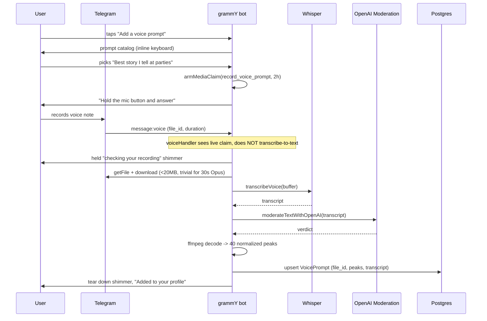

# Voice Prompts — Architecture & Implementation Plan

> **Status:** plan approved (§0, founder 2026-08-21). No code written yet —
> M3 carries one open sub-decision (§5.5) that should be settled before it starts.
> Product invariants: [PRODUCT_SPEC.md](PRODUCT_SPEC.md). Agent rules:
> [AGENTS.md](AGENTS.md). Decision journal: [DECISIONS.md](DECISIONS.md).
>
> This document assumes the Hinge Voice Prompt as the reference model and
> reports, honestly, which parts of it this product can take and which parts it
> structurally cannot.

---

## 0. Decisions taken (founder, 2026-08-21)

| # | Question | Decision |
|---|---|---|
| 1 | The Hinge like/comment loop | **A — one-way only.** No like, no comment, no reaction. The voice prompt improves the accept/decline decision and does nothing else. |
| 2 | Does the transcript feed matching? | **Yes.** Folded into `psychologicalSummary` → the embedding (`V_explicit`, 0.65). In v1 scope, with the legal work that implies. |
| 3 | Surfaces | **Telegram + iOS together.** One release, full parity, the whole native audio stack up front. |

Consequences, so they are not rediscovered later:

- Decision 1 **deletes** the interaction milestone. §7 records what was
  rejected and why, so a future session does not rebuild it.
- Decision 2 **promotes** the transcript work from "gated" to critical path and
  brings a privacy-policy version bump with it (§5.4). It also makes
  `psychologicalSummary` a field with two writers, which is the single most
  delicate part of this build (§5.5).
- Decision 3 **promotes** the iOS milestone into v1: presigned upload, signed
  playback, native recorder, waveform renderer and a global playback
  coordinator (§6.2). It also puts audio bytes at rest in our own bucket,
  which Telegram-only would not have done (§5.6).

---

## 1. Repository Fit Analysis

### 1.1 What fits, and fits well

| Hinge concept | Repo analog that already exists |
|---|---|
| Prompt catalog | `packages/shared/src/profiler-questions.ts` — stable ids, priority, 5 locales, gender-scoped |
| Display-only profile media | `services/profile-video.ts` — safety-only validation, never enters `photos[]` |
| Audio safety pipeline | `transcribeVideoAudio` → `moderateTextWithOpenAI` (already used for profile video audio) |
| Transcription | `services/whisper.ts` (`transcribeVoice`, 25 MB ceiling) |
| Native voice-note send | `handlers/onboarding/verification.ts` → `sendSkipNudge`, with `file_id` caching |
| Rejection audit | `media_validation_rejections` table |
| Feature gating | `VOICE_PROMPT_ENABLED`, default off — repo convention |

The strongest fit is philosophical rather than technical. This product's whole
thesis is *stop texting, go meet someone*. A voice prompt is the only profile
element that conveys tone, humour and cadence **without** opening a chat, so it
argues for the product rather than against it.

### 1.2 What does NOT fit — two structural blockers

**There is no feed.** This product has no browsable profile list and no swiping.
The matching engine pairs users on a drop cadence (`DROP_CADENCE=daily` in
production since 2026-08-10) and each side receives **one** pitch, answered
yes/no. Consequences for the brief as written:

- "Feed & Profile Playback" has no surface to exist on.
- "Only one audio track can play across the entire app" is a non-problem: the
  surface is a Telegram chat, and Telegram already enforces single-track
  playback natively. **No global audio coordinator is needed on Telegram.**
- Scroll-away-stops-playback likewise has no owner.

**The liking loop violates two invariants at once.**
"Like the Voice Prompt and attach an optional text or voice comment as an
icebreaker" is:

1. **User-to-user messaging before a match** — PRODUCT_SPEC Core Principles:
   *"NO IN-APP CHAT — Users NEVER message each other through our platform."*
   The single carve-out (Variant C proxy chat) is post-match, post-schedule,
   time-boxed, text-only and logged. A pre-match comment is none of those.
2. **A blind-decision leak** — §3.4: *"A user MUST NOT learn what their partner
   picked until they themselves have committed."* A like-with-comment tells the
   recipient the sender said yes before the recipient has answered. That is the
   exact failure the invariant exists to prevent, and the product goes to real
   lengths to protect it (the peer nudge is byte-identical for accept and
   decline).

Per AGENTS.md this needs an explicit founder decision, not an assumption. Three
buildable alternatives are in §7.

### 1.3 Telegram gives away most of the requested media stack

`sendVoice` with OGG/Opus renders a **native waveform, scrubber, play/pause,
elapsed time and playback-speed control**, and Telegram stores the media as a
`file_id`. The repo already documents this at `handlers/onboarding/verification.ts:171`.

So for the Telegram surface these requested components are **not needed**:

- ~~Presigned S3/R2 upload~~ → Telegram stores it; we hold a `file_id`.
- ~~Client-side Web Audio API recorder + live visualiser~~ → Telegram's own
  recorder handles mic permission, live waveform, preview, re-record, cancel.
- ~~Custom waveform scrubber / player widget~~ → native.
- ~~Global playback coordinator~~ → native.
- ~~Audio caching layer~~ → native.

That is roughly 60% of the requested frontend scope, deleted by choosing the
right surface. The full custom stack is required **only for the native iOS
client**, which today has no audio code at all (verified: zero `AVAudio*`
references in `Gennety-iOS`).

### 1.4 Critical integration collision — `voiceHandler`

`apps/bot/src/handlers/voice.ts` is mounted in `bot.ts` at line 118, **before**
`matchingRouter`, `dateRouter`, `profilerRouter` and the menu `router`. It
intercepts *every* inbound voice note, transcribes it via Whisper, and mutates
`ctx.message.text` so downstream routers see typed text.

A voice-prompt recording sent by a user would therefore be swallowed and handed
to the concierge agent as a sentence. This is not a subtle race — it is the
default path.

**Fix:** claim the chat with the existing pattern
(`services/menu-text-claim.ts`): add `record_voice_prompt` to `MEDIA_CLAIMABLE`,
arm it with `armMediaClaim` (2 h TTL, re-armed on interaction), and have
`voiceHandler` return early when the claim is live. This mirrors how
`edit_photos` / `edit_video` already hold media without the text pipeline
stealing it.

### 1.5 Invariants the implementation must not break

- **Never add the voice prompt to `Profile.photos[]`.** The
  `photos[i] ↔ photoFaceScores[i]` 1:1 alignment is load-bearing for
  verification. Video is excluded for exactly this reason; audio follows.
- **No identity gate on the audio.** Display-only media carries no identity
  check (simplified 2026-06-23), and a voice cannot be face-matched. Safety
  validation only.
- **`protect_content`** — partner media is forward/save-protected wherever it
  shows a person. Route the send through `PROTECT_PARTNER_MEDIA`
  (`demo/config.ts`) rather than a hardcoded `true`, per the 2026-08-12 rule.
- **Demo mode** — AGENTS.md mandates the check. See §8.
- **iOS parity** — any `/v1/*` shape change updates `openapi/gennety-v1.yaml`
  in the same commit and is additive.

---

## 2. Recommended architecture: one data model, two renderings

| | Telegram | iOS |
|---|---|---|
| Record | Native Telegram voice note | `AVAudioRecorder` + custom live visualiser |
| Store | Telegram `file_id` | Same row; bytes served by signed URL |
| Play | Native `sendVoice` player | Custom waveform scrubber |
| Waveform | Free, client-rendered | Needs precomputed peaks |
| Concurrency | Native | `AudioPlaybackCoordinator` singleton |
| Build cost | Low | High |

Both ship in v1 (decision 3). The peaks are computed once at ingest, from the
buffer already downloaded for moderation, and serve iOS only — Telegram renders
its own waveform and ignores them. `ffmpeg` is already a required production
dependency, so this costs nothing beyond the code that reads its output.

**The two rails converge on one row.** A Telegram-recorded prompt has a
`telegramFileId` and no `storagePath`; an iOS-recorded one has the reverse. The
render path picks whichever it has, so a user who records on one surface is
audible on the other only if the bytes exist in a form that surface can play —
see §5.6 for the one case where they do not.

---

## 3. Database Schema

### 3.1 Prompt catalog lives in code, not the database

The brief asks for a `PromptQuestion` table. Repo precedent says otherwise, and
the precedent is explicit:

- `profiler-questions.ts` keeps stable ids, priority, refresh policy and all
  five translations together in one first-party TS module.
- ARCHITECTURE.md → `system_knowledge` states the rule directly: *"Product rules
  do NOT live here. They live in `services/product-playbook.ts` — code-owned,
  flag-aware and unit-tested."* Five legacy rule rows drifted from the product
  and were retired for this reason.
- A DB catalog implies an admin CRUD surface nobody is going to build.

Also: the `type: text vs audio` split models a feature this product does not
have. There are no Hinge-style text prompts on the profile — the profile is a
generated bio plus photos. A shared abstraction over one real variant is
speculative.

**Recommendation:** `packages/shared/src/voice-prompts.ts`, shaped like
`profiler-questions.ts`.

```ts
export interface VoicePromptQuestion {
  /** Stable id persisted on VoicePrompt.promptId. Never reused or renamed. */
  id: string;                    // "party_story", "name_pronunciation"
  /** Optional gender scope; omitted = offered to everyone. */
  gender?: Gender;
  /** Ordering weight when offering the catalog. */
  priority: "high" | "medium" | "low";
  /** Localized prompt text, all five languages. */
  text: Record<Language, string>;
}
```

### 3.2 `voice_prompts` table

One active prompt per user, enforced in the database.

```prisma
model VoicePrompt {
  id        String @id @default(uuid()) @db.Uuid
  userId    String @unique @map("user_id") @db.Uuid

  /// Stable id from packages/shared/src/voice-prompts.ts. Not an FK —
  /// the catalog is code, exactly like ProfilerAnswer.questionId.
  promptId  String @map("prompt_id")

  /// Telegram file_id of the accepted voice note. The ONLY copy on the
  /// Telegram rail — Telegram is the store, we hold the pointer.
  telegramFileId String? @map("telegram_file_id")
  /// Supabase object path, written only when an iOS client uploaded bytes
  /// directly. Null on Telegram-originated prompts.
  storagePath    String? @map("storage_path")

  durationSec Int @map("duration_sec")
  mimeType    String? @map("mime_type")
  fileSize    Int?    @map("file_size")

  /// Normalized 0..100 amplitude peaks, VOICE_PROMPT_WAVEFORM_BUCKETS long.
  /// Computed server-side at ingest from the buffer already downloaded for
  /// moderation. Telegram renders its own waveform and ignores this; it
  /// exists so the native iOS player never needs a backfill.
  waveform Int[] @default([]) @map("waveform")

  /// Whisper transcript. Two jobs: moderation evidence, and (decision 2) the
  /// matching signal folded into psychologicalSummary. Durable here precisely
  /// so that fold is DERIVED and can be re-applied after an About-me edit
  /// replaces the bio wholesale (§5.5). Never shown to the partner — the
  /// product ships audio, not a transcript of a stranger.
  transcript String? @map("transcript")

  validationVersion Int?      @map("validation_version")
  validatedAt       DateTime? @map("validated_at")

  createdAt DateTime @default(now()) @map("created_at")
  updatedAt DateTime @updatedAt @map("updated_at")

  user User @relation(fields: [userId], references: [id], onDelete: Cascade)

  @@index([promptId])
  @@map("voice_prompts")
}
```

**Why a table rather than columns on `Profile` or an item in `profileMedia`:**

- `@@unique([userId])` enforces "0 or 1 active" in the database rather than in
  application code.
- The transcript needs a durable, re-processable home if it feeds matching.
- Analytics wants adoption rate per `promptId`; a JSON blob cannot answer that.

**Why it is NOT added to the `ProfileMedia` union:** a Telegram voice note
cannot be grouped into a media group with photos, so it is a separate
`sendVoice` call regardless. Keeping it out of `profileMedia` means zero change
to `parseProfileMediaItem`, `sendProfileMediaCard`, or the photo/video
invariants. Strictly more additive.

**Re-record replaces in place.** No history table — that matches how the profile
video behaves, and `media_validation_rejections` already carries the audit trail
for anything refused.

### 3.3 Migration

Additive: one `CREATE TABLE` plus one index, zero `DROP`. Verify before running,
per deploy.md:

```sh
pnpm --filter @gennety/db exec prisma migrate diff \
  --from-schema-datasource prisma/schema.prisma \
  --to-schema-datamodel prisma/schema.prisma --script
pnpm --filter @gennety/db db:push
pnpm db:drift-check   # must exit 0 before pm2 restart
```

One new `MediaValidationReason` value set: `audio_too_short`, `audio_too_long`,
`audio_contact_info` (§5.3). These are a TS union, not a Prisma enum — no
migration.

**GDPR:** `onDelete: Cascade` covers the row. `collectOwnedPaths` already scans
Supabase paths; add `voicePrompt.storagePath` to it so an iOS-uploaded object is
erased. Telegram-hosted `file_id`s are not deletable by a bot — the same
accepted limitation that already applies to every profile photo.

---

## 4. API Contracts

### 4.1 Telegram rail (no new HTTP surface)

Recording happens in the chat. The catalog is offered as an inline keyboard, the
user replies with a native voice note, the claim routes it to the ingest
service. No Mini App, no upload endpoint, no presigned URL.



### 4.2 `/v1/*` additions (iOS)

All additive. Same commit updates `openapi/gennety-v1.yaml`.

| Method | Path | Purpose |
|---|---|---|
| `GET` | `/v1/voice-prompts/catalog` | Active prompt questions in the caller's language |
| `POST` | `/v1/me/voice-prompt/upload-url` | Presigned Supabase PUT (iOS only) |
| `POST` | `/v1/me/voice-prompt` | Commit `{promptId, storagePath, durationSec}` → validate → persist |
| `DELETE` | `/v1/me/voice-prompt` | Remove the active prompt |
| `GET` | `/v1/matches/{id}/partner-voice-prompt` | Signed, short-TTL audio URL + peaks + prompt title |

`SerializedMatch` gains an optional `voicePrompt` object (`promptId`,
`promptText`, `durationSec`, `waveform`) so the card can render the bars before
any audio is fetched — which is the entire point of precomputing peaks.

**Contract trap to avoid:** declare nullable object properties as a bare
optional `$ref`, never `oneOf: [$ref, "null"]`. That shape is silently dropped
by swift-openapi-generator and has already cost this repo three separate
incidents (`SerializedUser.gender`, `VenueIntentState.market`,
`PendingFeedback`). `./scripts/generate-api.sh` must emit zero
`Schema "null" is not supported … skipping` lines.

**Direct-to-Supabase upload, not a backend proxy.** A 30s Opus file is ~120 KB,
so the proxy would be affordable — but the presigned path keeps audio bytes off
the single Node process that also runs the bot, every cron and both APIs. The
existing `SUPABASE_PHOTO_BUCKET` pattern already does this.

---

## 5. Media Strategy

### 5.1 Codec and bitrate

**Telegram rail:** whatever Telegram produces — OGG/Opus, mono, ~16–32 kbps.
We do not re-encode. A 30s note is ~60–120 KB. `sendVoice` accepts
`.ogg`/`.mp3`/`.m4a`, and OGG/Opus is what renders as a true voice message.

**iOS rail:** AAC-LC in `.m4a`, mono, 32 kbps, 24 kHz. Chosen over Opus/WebM
because `AVAudioRecorder` produces it natively with no third-party encoder, and
because `.m4a` is directly re-sendable through `sendVoice` if a Telegram user
ever needs to hear an app-recorded prompt.

### 5.2 Duration and size bounds

```ts
VOICE_PROMPT_MIN_DURATION_SEC = 3    // below this it is a misfire, not an answer
VOICE_PROMPT_MAX_DURATION_SEC = 30   // Hinge parity
VOICE_PROMPT_MAX_BYTES = 2 * 1024 * 1024
VOICE_PROMPT_WAVEFORM_BUCKETS = 40
```

Bounds live in `packages/shared/src/constants.ts` and are served to clients via
`/state`-style config rather than duplicated in the bundle — the rule
`profileLimits` already follows, because a bound in two places eventually
disagrees with itself.

40 buckets: at ~2px bar + 2px gap, a 320pt card holds 40–80 bars. A client can
always render fewer bars than it has, never more, so 40 is a safe floor.

### 5.3 Moderation — reuse the chain, add one new rule

Existing, verbatim from the profile-video path minus frame sampling:

```
downloadTelegramFile → transcribeVoice → moderateTextWithOpenAI
```

Failure semantics follow the video precedent: a provider outage returns
`processing_unavailable` and is **retryable**, never a rejection. We do not
penalise a user for our own outage.

**One genuinely new rule, not present anywhere in the codebase:** a voice prompt
can carry contact details out loud — *"my Instagram is @…"*, *"text me at +380…"*.
That is a direct bypass of NO IN-APP CHAT and a safety concern (it routes a
stranger to an unmoderated channel before any verification of intent). The
transcript check must reject contact-info solicitation
(`audio_contact_info`). Photos cannot leak this way, so no existing rule covers
it.

### 5.4 Transcript feeds matching — **decision 2, in scope**

The transcript folds into `Profile.psychologicalSummary`, the dominant embedding
input (`V_explicit`, weight 0.65). This makes our voice prompt strictly more
than Hinge's: not only a human vibe check, but real matching signal.

Precedent to copy: `appendVibeToSummary` (`services/profile-analysis.ts`) already
folds the raw Friday-night answer into the summary and re-marks the embedding
dirty. Raw text, not an LLM distillation — that is the established treatment for
short first-person answers, and a 30-second transcript is ~75–90 words, a
proportionate addition to a summary that often runs to thousands of characters.

**Three writes must be correct, and each has already burned this repo once.**

1. **Record / re-record → replace the block, never append.**
   `appendVibeToSummary` achieves idempotency with `summary.includes(block)`,
   which works only because the vibe answers never change after finalize. A
   voice transcript changes on **every re-record**, so exact-match idempotency
   fails and a second block is appended instead of the first being replaced.
   Three re-records would triple the voice text's weight in the embedding.
   The voice block therefore needs **explicit delimiters** and a find-and-
   replace, not an append:

   ```
   <!--voice-prompt-->
   Asked "Best story I tell at parties": <transcript>
   <!--/voice-prompt-->
   ```

2. **Every write attempts the immediate refresh.** `embeddingDirty = true`
   is not a scheduling hint — `findCandidatesFor` fail-closes on the seeker's
   own dirty flag, so marking dirty and walking away **withholds the user from
   matching** until the 5-minute cron catches up. That is precisely the
   `appendNegativeConstraint` bug (DECISIONS 2026-08-08): a user who explained a
   decline and then bought a paid Rematch was told nobody was found, and
   refunded, when the engine had refused to look. Call
   `refreshUserEmbedding(userId)` (`workers/embedding-refresh.ts`) on the same
   path, best-effort, exactly as `negative-constraints.ts:129` now does.

3. **Deleting the prompt removes the block**, re-dirties, and refreshes. A
   deleted voice prompt that keeps influencing matching is a ghost the user
   cannot see or clear.

### 5.5 The `psychologicalSummary` collision — the delicate part of this build

`handlers/menu/edit-profile.ts:192` writes `psychologicalSummary: text` — a
**full replacement** of whatever the user typed into the "About me" editor. So
the moment decision 2 lands, that field has two writers, and the user's editor
silently wipes the voice block.

This is survivable only because the transcript is durable in
`voice_prompts.transcript`: the block is **derived**, so it can be re-applied.
The About-me save path must re-append it after replacing the body.

**The judgment call inside that**, which is worth stating rather than burying:
if a user deliberately deletes the voice block out of their bio text, we put it
back. That is defensible — the voice prompt is still on their profile, and an
embedding that stops reflecting a live profile element is stale in a way nobody
asked for. Their lever for removing it is deleting the voice prompt, which
removes the block properly (§5.4 rule 3). But it is a real behaviour, and the
editor preview shows the block, so a user WILL see it and may try to edit it.

If that reads as too surprising, the alternative is to stop folding into
`psychologicalSummary` and instead compose the embedding input at refresh time
from `summary + voiceTranscript` — one more read in `refreshUserEmbedding`, no
second writer, no collision, and the bio stays purely the user's. That is the
cleaner architecture and the reason it is not the default recommendation is only
that it diverges from the `appendVibeToSummary` precedent. **Worth deciding
before M3 starts.**

### 5.6 What decision 3 adds that Telegram-only would not have

Shipping iOS in v1 puts **audio bytes at rest in our own Supabase bucket**. On
the Telegram rail we hold a `file_id` and Telegram is the store; on the iOS rail
we are the store. Three duties follow:

- `collectOwnedPaths` (`services/account-deletion.ts`) must scan
  `voicePrompt.storagePath`, or GDPR erasure leaves the audio behind. It already
  scans `photos`, `profileMedia` and `pendingPhotoCandidates`; this is one more
  source, and missing it is silent.
- A new bucket, `SUPABASE_VOICE_BUCKET` (private), following the existing
  three. **It must be set explicitly in `.env.demo`** — the demo env is
  generated as production's `.env` plus that file, so any key it does not name
  inherits production's value. That is exactly how the demo pointed at the
  production Supabase project for a day (deploy.md, 2026-08-06).
- **One cross-rail gap, stated rather than hidden:** an iOS-recorded `.m4a` in
  our bucket is not a Telegram `file_id`. To play it to a Telegram user we must
  upload it once through `sendVoice` and cache the returned `file_id` on the
  row — the same mint-once-and-cache pattern `sendSkipNudge` already uses. Until
  that upload happens the prompt is iOS-only. Do this lazily at first pitch, not
  at record time, so we never pay for a prompt nobody is shown.

## 6. Component Hierarchy

### 6.1 Telegram — handlers, not components

```
handlers/menu/voice-prompt.ts        catalog keyboard, record/replace/delete
  └── armMediaClaim("record_voice_prompt")
handlers/voice.ts                    MODIFIED: early-return on a live claim
services/voice-prompt.ts             ingest: validate → transcribe → moderate
                                     → peaks → persist  (mirrors profile-video.ts)
services/profile-media-validation/
  voice-prompt-validation.ts         safety-only verdict
  audio-waveform.ts                  ffmpeg → s16le → RMS buckets → 0..100
handlers/matching/pitch.ts           MODIFIED: one sendVoice after the photo card
```

The ingest service returns a verdict and persists nothing itself — the
onboarding surface (session-backed) and the menu surface (DB-backed) own their
own persistence, exactly as `prepareProfileVideo` already splits it.

### 6.2 iOS — the real component work

```
VoicePromptRecorderView
  ├── MicPermissionGate            AVAudioSession.requestRecordPermission
  ├── LiveWaveformView             AVAudioRecorder.averagePower polling
  ├── RecordingTimer               3s floor, 30s hard stop
  └── PreviewPlayer                re-record / keep / delete

VoicePromptPlayerView              partner-facing, in the match card
  ├── WaveformBarsView             renders precomputed peaks instantly
  ├── ScrubberGesture              seek by drag
  └── AudioPlaybackCoordinator     @Observable singleton, one track app-wide
```

`AudioPlaybackCoordinator` is the only piece with global state: it holds the
active player id, stops the previous one on play, and pauses on scroll-away and
on app background. It exists because iOS, unlike Telegram, gives us nothing.

**Error boundaries:** permission denied → inline explainer plus a deep link to
Settings, never a dead button; upload failure → keep the local recording and
offer retry (never silently discard something the user just performed);
playback failure → fall back to the transcript-free static bars and a retry tap.

---

## 7. The interaction loop — rejected (decision 1)

**Decision: A — one-way only.** The voice prompt improves the accept/decline
decision and does nothing else. No like, no comment, no reaction, no relay.

Recorded here so it is not rebuilt: two alternatives were designed and turned
down, and both remain buildable if the question is ever reopened.

- **B — reaction revealed post-decision.** Withhold the listener's reaction
  until both sides have committed and the match is mutual, surfacing it in the
  "It's mutual 🤍" moment. Blind-decision safe by construction, because nothing
  is revealed before both answers exist.
- **C — voice reply as icebreaker fuel.** The listener records a reply; it is
  transcribed, fed to the §Phase 4 icebreaker and wingman generator, and never
  delivered to the partner. No user-to-user channel opens.

Hinge's actual loop needs a chat inbox, which this product deliberately does not
have. Neither B nor C is that loop; do not read either as a route back to it.

## 8. Demo mode impact check (AGENTS.md, mandatory)

- **A gate?** No.
- **A paid step?** No.
- **A two-sided negotiation?** No — `demo/decide.ts` needs no branch.
- **How a match is created/advanced?** Only in that the pitch carries one more
  message. The driver's state table is unaffected.

**One real deliverable:** the demo puppet needs a seeded voice prompt, or every
demo pitch will visibly differ from production. Telegram `file_id`s are
per-bot, so the OGG must be minted **through the demo bot** — the same trap the
photo seeder hit (`scripts/seed-demo-partners.mjs` resolves an upload chat for
exactly this reason). Add an `--audio=<dir>` arm to that script.

---

## 9. Implementation Roadmap

All six milestones are v1 (decisions 2 and 3). M0–M2 and M4 parallelise across
the backend and the iOS client; M3 is the one that must not be rushed.

### M0 — Foundation
- [ ] `packages/shared/src/voice-prompts.ts` — catalog, 8–10 prompts × 5 locales
- [ ] Constants: duration / size / bucket bounds, served via config not inlined
- [ ] `VoicePrompt` Prisma model + additive `db:push` + `db:drift-check`
- [ ] `SUPABASE_VOICE_BUCKET` (private) — and **in `.env.demo` explicitly** (§5.6)
- [ ] `VOICE_PROMPT_ENABLED=false` in `.env.example` **and** `.env.local.example`
- [ ] Tests: catalog id stability, locale completeness

### M1 — Ingest & moderation
- [ ] `profile-media-validation/audio-waveform.ts` (ffmpeg → 40 peaks)
- [ ] `voice-prompt-validation.ts` — transcript → moderation → contact-info rule
- [ ] `services/voice-prompt.ts` — ingest orchestration + held status shimmer
- [ ] **`voiceHandler` claim check** (§1.4) — regression test confirmed red first
- [ ] Rejection reasons + localized copy ×5
- [ ] Re-record rate limit — every attempt costs a Whisper + a moderation call

### M2 — Telegram surfaces
- [ ] `handlers/menu/voice-prompt.ts` — add / replace / delete
- [ ] Optional onboarding step after photos, skippable
- [ ] Pitch: `sendVoice` after the photo card, via `PROTECT_PARTNER_MEDIA`
- [ ] Lazy `file_id` mint for iOS-recorded prompts (§5.6), cached on the row
- [ ] My Profile shows the active prompt
- [ ] Demo seeder `--audio` arm (§8)

### M3 — Transcript → matching  ⚠️ the delicate one
- [ ] **Settle §5.5 first**: fold into `psychologicalSummary`, or compose at
      refresh time. This decides whether the field gets a second writer.
- [ ] Delimited, find-and-replace block — **not** an append (§5.4 rule 1)
- [ ] `refreshUserEmbedding` on every write path (§5.4 rule 2)
- [ ] Delete-prompt removes the block and refreshes (§5.4 rule 3)
- [ ] About-me editor re-applies the block after replacement (§5.5)
- [ ] `legal/privacy-policy.md` + `dpia.md` + `LEGAL_DOCS_VERSION` bump
- [ ] State plainly that we transcribe and do **not** voice-print

### M4 — iOS (parallel with M1–M2)
- [ ] `/v1/*` endpoints + `openapi/gennety-v1.yaml` in the **same commit**
- [ ] `./scripts/generate-api.sh` emits zero `skipping` lines (§4.2)
- [ ] `collectOwnedPaths` covers `storagePath` (§5.6) — silent if missed
- [ ] Recorder: permission gate, live visualiser, 3s floor / 30s stop, preview
- [ ] Player: precomputed bars, scrubber, `AudioPlaybackCoordinator`
- [ ] Task recorded in `Gennety-iOS/IMPLEMENTATION_PLAN.md`

### M5 — QA, demo & docs
- [ ] E2E on `@gennetytestbot`: record → moderate → pitch → play, both rails
- [ ] Rejection paths: too short, too long, unsafe, contact-info, provider down
- [ ] **Embedding regression**: record → re-record ×3 → confirm ONE block and a
      refreshed vector, not three blocks and a stale one
- [ ] Adoption + completion analytics per `promptId`
- [ ] PRODUCT_SPEC + ARCHITECTURE + DECISIONS entries, same commit
- [ ] deploy.md PENDING block: flag, schema step, new bucket, demo redeploy

## 10. Open risks

| Risk | Mitigation |
|---|---|
| Voice reveals identity before verification is meaningful | Prompt is offered only post-verification, like every other partner-facing surface |
| Accent/language bias in the pool | Transcript-to-matching is behind its own decision (§5.4); the audio itself is human-judged |
| Whisper cost per re-record | Per-day re-record cap; 30s audio is a cheap Whisper call but not free |
| Voice used to bypass no-chat | `audio_contact_info` rejection rule (§5.3) |
| iOS ships without audio and the surfaces diverge | Additive contract; `SerializedMatch.voicePrompt` optional — an old client ignores it |
| Re-record multiplies the voice text's weight in the embedding | Delimited find-and-replace block, never an append (§5.4) — covered by an explicit M5 regression test |
| A user is withheld from matching after recording | `refreshUserEmbedding` on every write path (§5.4 rule 2) |
| About-me edit silently wipes the voice signal | Block is derived from a durable transcript and re-applied (§5.5) |
| GDPR erasure leaves audio in the bucket | `collectOwnedPaths` covers `storagePath` (§5.6) |
| Demo inherits the production voice bucket | `SUPABASE_VOICE_BUCKET` named explicitly in `.env.demo` (§5.6) |
