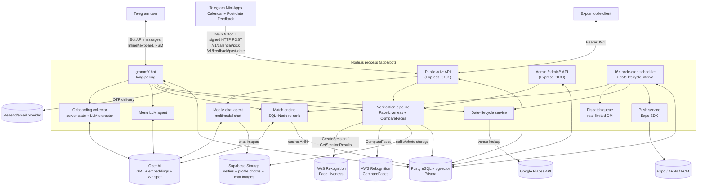

<!-- WHEN_TO_READ: You need the system shape: production endpoints, top-level topology, the end-to-end request schema, or how the bot/webapp/worker processes are laid out. START HERE for any architecture question, then follow the pointers below. -->
<!-- SOURCE: ARCHITECTURE.md (lines 1-164) — migrated 2026-09-01 -->

# Gennety Dating — Architecture

> Product logic and user flow are in [PRODUCT_SPEC.md](../product/product-spec.md).
> Tech stack and coding rules are in [AGENTS.md](../operations/agent-operating-manual.md).
> Production deploy instructions are in [deploy.md](../operations/deployment-runbook.md).
> This file documents durable architecture boundaries. Code, Prisma schema,
> route files, and env loading remain the source of truth for implementation
> details.

## Production Endpoints

The DigitalOcean droplet (`167.172.178.229`) terminates TLS via **Caddy**
(auto-renewed Let's Encrypt). DNS for the `gennety.com` zone lives at Hostinger.

| Subdomain | Reverse-proxies to | Purpose |
|---|---|---|
| `api-admin.gennety.com` | `localhost:3100` | Admin analytics dashboard API (`ADMIN_API_KEY` Bearer auth, `helmet` + IP rate-limit + timing-safe key compare). |
| `dating-api.gennety.com` | `localhost:3101` | Public `/v1/*` API for the native iOS client and the Telegram Mini Apps. |

**Domain isolation:** `api.gennety.com` is owned by a sibling project — never
use it for Gennety Dating. Always pick names prefixed with `dating-` here.

The bot itself runs **long-polling** (grammY `bot.start`) on the same host;
it does not need an inbound subdomain. Telegram delivers updates to whichever
process is currently polling — so prod (`@gennetybot`) and local dev
(`@gennetytestbot`) MUST use different bot tokens.

**No identity-provider webhook.** The Persona era exposed
`/v1/webhooks/persona` here; AWS Face Liveness has no webhook at all — a
session's verdict is read server-to-server inside the client's own `/event`
request, within the session's 3-minute lifetime (PRODUCT_SPEC §1.4).

## Top-Level Topology

```
┌──────────────────┐   ┌──────────────────┐
│ Telegram client  │   │ Expo/mobile API  │
│ (bot + Mini App) │   │  (iOS / Android) │
└────────┬─────────┘   └────────┬─────────┘
         │ Bot API + WebApp     │ HTTPS  (Bearer JWT)
         │ + signed HTTP POST   │
         ▼                      ▼
┌─────────────────────────────────────────┐
│  Node.js process (apps/bot)             │
│  ─────────────────────────────────────  │
│  • grammY bot (long-polling)            │
│  • Express public  API  (:3101)         │
│  • Express admin   API  (:3100)         │
│  • cron workers + date lifecycle tick   │
└─────────────────────────────────────────┘
       │           │            │
       │ pgvector  │ OpenAI     │ External APIs
       ▼           ▼            ▼
┌───────────┐ ┌──────────┐ ┌──────────────────────────┐
│ Postgres  │ │ OpenAI / │ │ AWS Rekognition          │
│ + pgvector│ │ Whisper  │ │ AWS Rekognition (face)   │
│ (Supabase)│ │          │ │ Google Places (venue)    │
└───────────┘ └──────────┘ │ Supabase Storage (media) │
                           │ Resend/email provider    │
                           │ Expo / APNs / FCM (push) │
                           └──────────────────────────┘
```

## End-to-End Architecture Schema



## Process Layout

A **single** Node.js process (`apps/bot`) hosts everything:

- **grammY bot** — long-polling Telegram updates; routes via Composer-based
  handlers (`handlers/router.ts`).
- **Public Express server** on `PUBLIC_PORT` (default `3101`). Mobile client
  consumer; also receives the signed Calendar
  Mini App POST. Refuses to start if `JWT_SECRET` is shorter than 32 bytes.
  Access JWTs are pinned to HS256, issuer `gennety-public-api`, audience
  `gennety-mobile`, and a UUID subject.
- **Admin Express server** on `ADMIN_PORT` (default `3100`). Started only
  when `ADMIN_API_KEY` is set. Bearer-auth + helmet + per-IP rate limit.
- **Background jobs** — 16 `node-cron` schedules (three — ticket-expiry,
  rematch-refund, venue-change-refund — are registered only when their feature
  flag is on) plus the date-lifecycle interval (see *Cron & Workers* below).

Importing `./config.js` is the very first thing `index.ts` does — this
ensures `.env.local` overrides `.env` *before* `@gennety/db` evaluates
`new PrismaClient()` and locks in `DATABASE_URL`.
